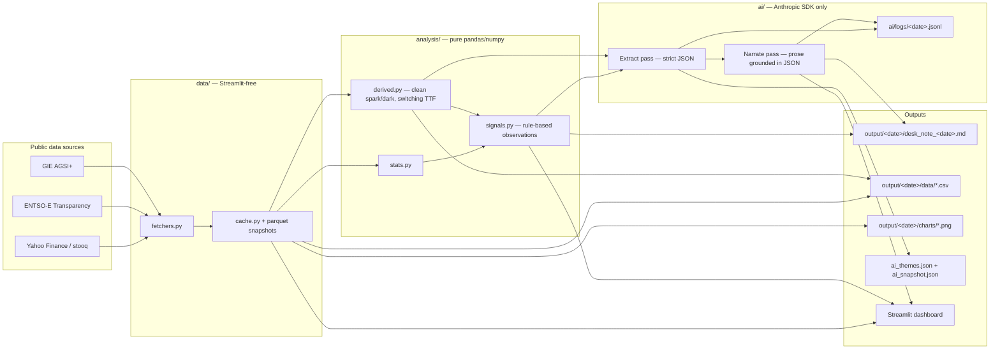

# European Cross-Commodity Risk Pack

**Gas + Carbon → Power Curve Implications**

Author: **Sumer Sener** · sumerberksener@gmail.com
Submission for: Cobblestone Energy case study
Repository: this folder

> An automated cross-commodity monitor that converts public EU gas and carbon fundamentals into a repeatable, AI-narrated daily desk note for European power. Designed to be desk-usable on day one and a foundation the trader can extend.

## Architecture at a glance



---

## How this maps to the brief

| Brief deliverable | Where it lives in this repo |
|---|---|
| **Fundamentals view** — 1–3 page desk note covering gas tightness, carbon signal, and power-curve implications, with numbers + ≥2 charts | `output/<date>/desk_note_<date>.md` (auto-generated). Sample committed in `output/`. |
| **Monitor metrics** — 5–8 daily metrics tied to gas, carbon, and power-curve risk | `config.py` defines the 8-metric set. Live view: top row of `app.py`. Tabular form: `output/<date>/data/snapshot.csv`. |
| **Automation** — runnable Python script that pulls public data, cleans it, generates charts, writes a daily brief | `scripts/generate_brief.py` — single-command CLI (no Streamlit dependency). Cron-scheduled in `.github/workflows/daily.yml`. |
| **AI/LLM integration** — code-integrated AI workflow with logged prompts and outputs that structures inputs and/or produces a metrics-grounded narrative | `ai/` module: `client.py` wraps Anthropic SDK with append-only JSONL logging; `narrative.py` runs a **two-pass extract → narrate** workflow against Claude Haiku 4.5 — pass 1 returns strict JSON (themes, risk flags, watchlist, top takeaway), pass 2 writes prose grounded *only* in pass-1 JSON. Versioned prompts in `ai/prompts/`. Round-trip logs in `ai/logs/<date>.jsonl`. Graceful rule-based fallback when no API key. |

## The eight metrics

The set is anchored to the brief's thesis — **four price benchmarks, one fundamental, three derived metrics** that bridge gas + carbon → power.

| # | Metric | Unit | Source (free) | Why it matters |
|---|---|---|---|---|
| 1 | **TTF Front-Month Gas** | EUR/MWh | Yahoo Finance · stooq | The European wholesale gas benchmark; dominant input to power-generation cost. |
| 2 | **EU Aggregate Gas Storage** | % full | GIE AGSI+ | Daily fundamentals balance signal — storage trajectory vs the 5-yr seasonal average is the most-cited gas balance indicator. |
| 3 | **API2 / Newcastle Coal (proxy)** | USD/t | ICE Newcastle (Yahoo) | Thermal coal benchmark used in clean dark spread. Newcastle is the cleanest free proxy for API2 (~0.85 historical correlation; documented limitation). |
| 4 | **EUA December Carbon** | EUR/tCO₂ | stooq · KRBN proxy | EU ETS carbon price — direct input to power generation marginal cost; drives coal-vs-gas fuel switching. |
| 5 | **German Day-Ahead Baseload Power** | EUR/MWh | ENTSO-E Transparency Platform | Europe's largest power market — the de-facto continental front-curve benchmark. |
| 6 | **Clean Spark Spread (CCGT, day-ahead)** | EUR/MWh | _Derived_ | Gas-fired margin: P − G/η_gas − C × EF_gas. The bridge from TTF + EUA to gas-plant economics. |
| 7 | **Clean Dark Spread (hard coal, day-ahead)** | EUR/MWh | _Derived_ | Coal-fired margin: P − Coal/η_coal − C × EF_coal. The dark/spark differential is the single best fuel-switching indicator. |
| 8 | **Switching TTF** | EUR/MWh | _Derived_ | The TTF gas price at which a CCGT exactly matches a hard-coal plant in the merit order, given current coal + EUA. The TTF − Switching-TTF gap is a single number every European gas/power desk watches for fuel-switch headroom. |

Plant assumptions (η_gas=0.50, η_coal=0.40, EF_gas=0.184, EF_coal=0.34 t/MWh_th) live in `config.py` and are auditable at a glance.

## Repository structure

```
energy-dashboard/
├── app.py                          # Streamlit interactive dashboard
├── config.py                       # 7-metric registry, signal thresholds, plant assumptions
├── data/
│   ├── fetchers.py                 # 5 primary fetchers + EUR/USD helper (no Streamlit dep)
│   ├── cache.py                    # @st.cache_data + parquet snapshots + derived assembly
│   └── store/                      # parquet snapshots (gitignored)
├── analysis/
│   ├── stats.py                    # rolling MA, percentile rank, z-score, seasonal deviation
│   ├── derived.py                  # clean spark / clean dark spread formulas
│   └── signals.py                  # rule-based observations + aggregate morning brief
├── ai/
│   ├── client.py                   # Anthropic SDK wrapper + JSONL prompt/response logging
│   ├── narrative.py                # structured-snapshot builder + Claude call + fallback
│   ├── prompts/desk_note_v1.md     # versioned system prompt
│   └── logs/                       # append-only JSONL request logs (committed by CI)
├── ui/                             # Streamlit components: cards, charts, sidebar brief
├── scripts/
│   └── generate_brief.py           # 🔑 the headless automation — runs the full pipeline
├── tests/test_fetchers.py          # live-API smoke tests
├── output/<YYYY-MM-DD>/
│   ├── desk_note_<date>.md         # 🔑 the daily deliverable
│   ├── data/snapshot.csv           # pivot of latest values across metrics
│   ├── data/ai_snapshot.json       # exact JSON payload sent to Claude
│   ├── data/<metric>.csv           # full 5-yr history per metric
│   └── charts/*.png                # 3 generated charts referenced by the note
├── .github/workflows/daily.yml     # cron-scheduled generation + commit
├── .streamlit/                     # theme + secrets template
└── requirements.txt
```

The codebase splits cleanly into four layers — `data/` knows nothing about Streamlit, `analysis/` is pure pandas/numpy, `ai/` is pure Anthropic SDK, `ui/` and `app.py` are the only Streamlit-aware code. This separation is what lets the same fetchers + analysis power both the interactive dashboard and the headless CLI.

## Run it

You'll need three free credentials (each takes ~2 minutes to set up):

| What | Where to get it |
|---|---|
| ENTSO-E token | <https://transparency.entsoe.eu> → My Account Settings → Generate token |
| GIE AGSI+ token | <https://agsi.gie.eu/account> |
| Anthropic API key | <https://console.anthropic.com> · the daily run uses Claude Haiku 4.5 (~$0.001 per call) |

```bash
git clone <your-repo-url>
cd energy-dashboard
python -m venv .venv && source .venv/bin/activate
pip install -r requirements.txt

# Set credentials (or put them in .streamlit/secrets.toml for the dashboard)
export ENTSOE_TOKEN=...
export AGSI_TOKEN=...
export ANTHROPIC_API_KEY=...
```

### Generate today's desk note (CLI)

```bash
python scripts/generate_brief.py
```

Writes everything under `output/<today>/` — the markdown desk note, three chart PNGs, per-metric CSVs, the JSON payload sent to the AI, and (if `ANTHROPIC_API_KEY` is set) a log entry in `ai/logs/<today>.jsonl`. Designed to be cron-scheduled — the GitHub Actions workflow at `.github/workflows/daily.yml` runs it weekday mornings and commits the artifacts.

### Open the interactive dashboard

```bash
streamlit run app.py
```

Same data, interactive view: 7 metric cards across the top, a tab per metric with 5-year Plotly charts and stats, and an "AI Desk Note" pane that re-runs the Claude narrative on demand.

### Run the tests

```bash
pytest -q tests/test_fetchers.py
```

Live-API smoke tests; skip gracefully when offline or when tokens aren't set.

## AI workflow

The AI integration is intentionally narrow — Claude generates the executive-summary paragraph, grounded in a structured numeric snapshot the code produces. This minimises hallucination risk while delivering a measurable productivity gain for the analyst.

```
fetchers + derived ──▶ structured snapshot (JSON) ──▶ Claude (Haiku 4.5)
                                  │                          │
                                  └─→ committed as           └─→ paragraph,
                                      ai_snapshot.json            logged to JSONL
                                      (auditable input)            (auditable I/O)
```

- **Versioned prompt**: `ai/prompts/desk_note_v1.md`. Hard rules: cite only numbers from input, no forecasts, 3–5 sentences ending on power-curve implication.
- **Logged**: every call appends a record to `ai/logs/<date>.jsonl` with timestamp, model, prompt SHA-256, full prompt + response text, token usage, latency, and any errors. The log is the auditable record of what the AI said and why.
- **Graceful fallback**: when `ANTHROPIC_API_KEY` is missing or the API call fails, a deterministic rule-based narrative is emitted from the same snapshot. The pipeline always produces output.
- **Cost**: with Haiku 4.5 input/output pricing, a daily call is fractions of a cent. Prompt caching is _not_ used because the system prompt sits below Haiku's 4096-token cacheable prefix; documented in `ai/client.py` for future scaling.

## Automation

`scripts/generate_brief.py` is the unattended workflow. It:

1. Fetches all 5 primaries + EUR/USD (parallel-safe — each fetcher has a documented fallback chain)
2. Computes the clean spark / clean dark spreads from primaries
3. Writes per-metric CSVs and a snapshot pivot
4. Generates three Matplotlib charts (headless `Agg` backend)
5. Builds the JSON snapshot, calls Claude, logs the round trip
6. Composes the Markdown desk note, embedding the charts and the AI narrative

`.github/workflows/daily.yml` runs the script at 07:30 UTC on weekdays via GitHub Actions, then commits the new artifacts back to the repo with `[skip ci]`. Configure repo secrets `ENTSOE_TOKEN`, `AGSI_TOKEN`, `ANTHROPIC_API_KEY` to enable the live run.

## Evaluation crosswalk

| Brief criterion | Evidence in this repo |
|---|---|
| Fundamental reasoning & market intuition | The 7-metric set is curated for the gas+carbon→power thesis (not a generic dashboard). Clean spark/dark spreads are first-class metrics, not afterthoughts. The desk note explicitly synthesises gas + carbon + spreads → curve implication in section 5. |
| Desk relevance & clarity of metrics | Each metric has a 1–2 sentence trader-facing definition in `config.py`. Headlines use trading-desk vocabulary ("tight", "in-the-money", "extended"). Cross-market regime tag fires when TTF + storage co-move. |
| Automation robustness & reproducibility | Single-command CLI · headless (no Streamlit dep) · graceful fallback per fetcher · parquet snapshot fallback · GitHub Actions cron · pinned dependencies · committed sample output. |
| Communication quality | Markdown desk note: TL;DR → metrics table → 3 themed sections (gas, carbon, power-curve) → methodology → disclaimer. Embedded charts. Numbers always paired with "what it means". |
| AI/LLM leverage as measurable productivity gain | The AI replaces the analyst's daily 5-minute paragraph-writing task. Prompts are versioned and logged so the workflow is auditable, not magic. Fallback ensures continuity when the API is unavailable. Cost is measurable per call (~ fractions of a cent on Haiku 4.5). |

## Honest limitations

- **API2 coal**: no reliable free daily feed exists. ICE Newcastle is used as a proxy (~0.85 correlation). A paid feed (Argus, Refinitiv) would resolve this. Documented in `data/fetchers.py` and the markdown methodology.
- **EUA**: free EUA front-Dec data is brittle. Stooq's `co2.f` is the cleanest path; KraneShares KRBN ETF is a blended fallback (EUA + RGGI + CCA). Direction-correct but not a clean EUA print.
- **Power curve**: ENTSO-E exposes day-ahead, not Cal+1 forwards. The day-ahead is treated as the front of the curve; Cal+1 implications are inferred qualitatively from the spread regime. A paid EEX feed would unlock proper curve work.
- **Phase 1 = rule-based + AI narrative.** No forecasting model yet. The architecture is built so v0.2 (next-day directional model on technical features) and v0.3 (RSS news ingestion + sentiment) drop in cleanly without rewrites.

## What I'd do with another week

Honest gap list — visible because hiding them would be worse than the gaps themselves.

- **Paid API2 coal feed.** The Newcastle proxy lags badly (the freshness flag surfaces this); a proper Argus or Refinitiv feed for API2 (Rotterdam) would unlock a clean dark spread and a clean switching-TTF print. Currently the dark spread is indicative not bankable when Newcastle goes stale.
- **Cal+1 power.** ENTSO-E gives day-ahead. The "Day-Ahead → curve" wording in the brief is currently inferred qualitatively from spread regime; a free EEX scrape (or a paid EEX feed) would let me plot DA−Cal+1 explicitly and quantify the curve shape.
- **News & policy ingestion.** A small RSS pull from Reuters / Argus / ICIS plus a Claude theme-extraction pass would close the "structure unstructured inputs" half of the AI requirement (the current implementation only does the structured-numbers half). Architectural slot for it already exists in `ai/`.
- **Directional forecasting.** Phase 1 is descriptive (rule-based + LLM narrative). v0.4 should add a logistic-regression / gradient-boost model on technical features for next-day direction with calibrated confidence — the data layer is already there, only the model/UI integration is missing.
- **Backtesting harness.** The cross-market regime tag ("tight market" / "well-supplied") fires without historical validation. A `scripts/backtest_regime.py` that replays the tag against next-N-day DE power returns would let me ship signals with measured accuracy rather than asserted intuition.
- **Renewable-share fundamentals.** ENTSO-E exposes wind+solar generation forecasts. Adding a `renewable_share` row would make "what moved DE power today" quantitative and sharply improve the section-5 narrative.

## Longer-horizon roadmap

| Version | Theme | Ships |
|---|---|---|
| v0.2 | News awareness | RSS ingestion + Claude theme extraction surfaced as a "today's themes" section. |
| v0.3 | Forecasting | Directional next-day model on technical features (logistic regression → gradient boosting). |
| v0.4 | Backtesting | Replay signals against historical PnL on a simple long/short rule. |
| v0.5 | NLP trade ideas | Fine-tune a small LM on energy news; surface candidate ideas with rationale + cited sources. |

## License & disclaimer

Code: MIT-style open source.
Observations and the AI-generated narrative are informational and **not investment advice**. Always do your own analysis.
