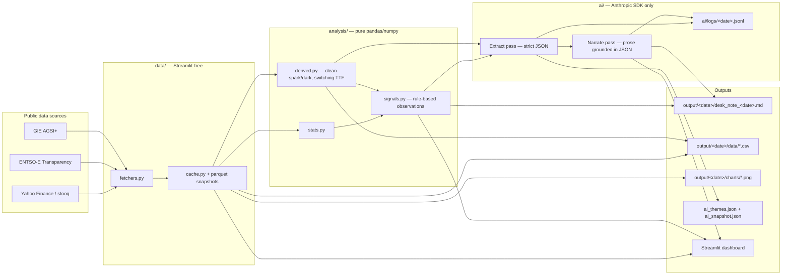

# European Cross-Commodity Risk Pack

**Gas + Carbon → Power Curve Implications**

Author: **Sumer Sener** · sumerberksener@gmail.com
Submission for: Cobblestone Energy case study
Repository: this folder

> An automated cross-commodity monitor that converts public EU gas and carbon fundamentals into a repeatable, AI-narrated daily desk note for European power. Designed to be desk-usable on day one and a foundation the trader can extend.

**Coverage** — Power: BE, FR, DE, GB, HU, IE, IT, NL, ES, CH, AT (11 markets) · Gas: AT, BE, FR, DE, GB, IT, NL, SK, ES, CH (10 markets) · Emissions: EU + UK · LNG arb: TTF − JKM auxiliary signal.

## How this brief is built

Mirroring how Cobblestone frames its Power, Gas, and Emissions desks — three trading pillars plus the meteorological signal that shapes them:

1. **Short-Term Drivers** — TTF, EU storage, EUA, day-ahead power (DE + GB), the renewable forecast share of load, a daily news/geopolitics theme pass, **plus a 5-day temperature anomaly at the DE/FR/GB centroids** with rule-based weather-event detection (cold snaps, heat domes, wind droughts, storms). This is the "day ahead to front month" surface — the numbers that move the desk's near-term P&L. The weather layer mirrors Cobblestone's named **Energy Meteorologists** function.
2. **Curve Implications** — a multi-tenor seasonality strip (W+1 / M+1 / Q+1 / Cal+1 / Cal+2) and the regime classifier on top of it, plus the clean spark spread that bridges gas + carbon into power-curve economics. This is the forward-positioning surface — the same metrics traded "across multiple maturities" on the curve, even though our forward points are model projections rather than market quotes (see Methodology).
3. **Cross-Commodity Risk** — derived spreads (clean spark, switching TTF, DE−GB, TTF−JKM LNG arb), an eight-cell regime strip, and a Base/Upside/Downside scenarios block sized off the dominant geopolitical axis from today's news. This is the cross-desk read — gas + carbon → power, plus the LNG side of the gas book.
4. **Power Transportation** — net cross-border physical flows at three major European interconnectors (DE↔FR, GB↔FR via IFA, NL↔DE) from ENTSO-E. Mirrors the third pillar of Cobblestone's Power Trading desk: *"We invest in the physical transmission capacities that connect the power grids of Europe together. We then move the electricity from one region to another."*

Built on **structural fundamentals** rather than discretionary calls; the AI layer extracts and narrates, it doesn't forecast. The weather and event-detection layers are rule-based pattern recognition with explicit thresholds — also not forecasts; they surface what a meteorologist would flag for the desk.

## Architecture at a glance



---

## How this maps to the brief

| Brief deliverable | Where it lives in this repo |
|---|---|
| **Fundamentals view** — 1–3 page desk note covering gas tightness, carbon signal, and power-curve implications, with numbers + ≥2 charts | `output/<date>/desk_note_<date>.md` (auto-generated). Sample committed in `output/`. |
| **Monitor metrics** — 5–8 daily metrics tied to gas, carbon, and power-curve risk | `config.py` defines the 8-metric set. Live view: top row of `app.py`. Tabular form: `output/<date>/data/snapshot.csv`. |
| **Automation** — runnable Python script that pulls public data, cleans it, generates charts, writes a daily brief | `scripts/generate_brief.py` — single-command CLI (no Streamlit dependency). Cron-scheduled in `.github/workflows/daily.yml`. |
| **AI/LLM integration** — code-integrated AI workflow with logged prompts and outputs that structures inputs and/or produces a metrics-grounded narrative | `ai/` module: `client.py` wraps Anthropic SDK with append-only JSONL logging; `narrative.py` runs a **two-pass extract → narrate** workflow against Claude Haiku 4.5 — pass 1 returns strict JSON (themes, risk flags, watchlist, top takeaway), pass 2 writes prose grounded *only* in pass-1 JSON. Versioned prompts in `ai/prompts/`. Round-trip logs in `ai/logs/<date>.jsonl`. Graceful rule-based fallback when no API key. |

## The eight metrics

The set is anchored to the brief's thesis — **four price benchmarks, one fundamental, three derived metrics** that bridge gas + carbon → power.

| # | Metric | Unit | Source (free) | Why it matters |
|---|---|---|---|---|
| 1 | **TTF Front-Month Gas** | EUR/MWh | Yahoo Finance · stooq | The European wholesale gas benchmark; dominant input to power-generation cost. |
| 2 | **EU Aggregate Gas Storage** | % full | GIE AGSI+ | Daily fundamentals balance signal — storage trajectory vs the 5-yr seasonal average is the most-cited gas balance indicator. |
| 3 | **API2 / Newcastle Coal (proxy)** | USD/t | ICE Newcastle (Yahoo) | Thermal coal benchmark used in clean dark spread. Newcastle is the cleanest free proxy for API2 (~0.85 historical correlation; documented limitation). |
| 4 | **EUA December Carbon** | EUR/tCO₂ | stooq · KRBN proxy | EU ETS carbon price — direct input to power generation marginal cost; drives coal-vs-gas fuel switching. |
| 5 | **German Day-Ahead Baseload Power** | EUR/MWh | ENTSO-E Transparency Platform | Europe's largest power market — the de-facto continental front-curve benchmark. |
| 6 | **Clean Spark Spread (CCGT, day-ahead)** | EUR/MWh | _Derived_ | Gas-fired margin: P − G/η_gas − C × EF_gas. The bridge from TTF + EUA to gas-plant economics. |
| 7 | **Clean Dark Spread (hard coal, day-ahead)** | EUR/MWh | _Derived_ | Coal-fired margin: P − Coal/η_coal − C × EF_coal. The dark/spark differential is the single best fuel-switching indicator. |
| 8 | **Switching TTF** | EUR/MWh | _Derived_ | The TTF gas price at which a CCGT exactly matches a hard-coal plant in the merit order, given current coal + EUA. The TTF − Switching-TTF gap is a single number every European gas/power desk watches for fuel-switch headroom. |

Plant assumptions (η_gas=0.50, η_coal=0.40, EF_gas=0.184, EF_coal=0.34 t/MWh_th) live in `config.py` and are auditable at a glance.

## Repository structure

```
energy-dashboard/
├── app.py                          # Streamlit interactive dashboard
├── config.py                       # 7-metric registry, signal thresholds, plant assumptions
├── data/
│   ├── fetchers.py                 # 5 primary fetchers + EUR/USD helper (no Streamlit dep)
│   ├── cache.py                    # @st.cache_data + parquet snapshots + derived assembly
│   └── store/                      # parquet snapshots (gitignored)
├── analysis/
│   ├── stats.py                    # rolling MA, percentile rank, z-score, seasonal deviation
│   ├── derived.py                  # clean spark / clean dark spread formulas
│   └── signals.py                  # rule-based observations + aggregate morning brief
├── ai/
│   ├── client.py                   # Anthropic SDK wrapper + JSONL prompt/response logging
│   ├── narrative.py                # structured-snapshot builder + Claude call + fallback
│   ├── prompts/desk_note_v1.md     # versioned system prompt
│   └── logs/                       # append-only JSONL request logs (committed by CI)
├── ui/                             # Streamlit components: cards, charts, sidebar brief
├── scripts/
│   └── generate_brief.py           # 🔑 the headless automation — runs the full pipeline
├── tests/test_fetchers.py          # live-API smoke tests
├── output/<YYYY-MM-DD>/
│   ├── desk_note_<date>.md         # 🔑 the daily deliverable
│   ├── data/snapshot.csv           # pivot of latest values across metrics
│   ├── data/ai_snapshot.json       # exact JSON payload sent to Claude
│   ├── data/<metric>.csv           # full 5-yr history per metric
│   └── charts/*.png                # 3 generated charts referenced by the note
├── .github/workflows/daily.yml     # cron-scheduled generation + commit
├── .streamlit/                     # theme + secrets template
└── requirements.txt
```

The codebase splits cleanly into four layers — `data/` knows nothing about Streamlit, `analysis/` is pure pandas/numpy, `ai/` is pure Anthropic SDK, `ui/` and `app.py` are the only Streamlit-aware code. This separation is what lets the same fetchers + analysis power both the interactive dashboard and the headless CLI.

## Run it

You'll need three free credentials (each takes ~2 minutes to set up):

| What | Where to get it |
|---|---|
| ENTSO-E token | <https://transparency.entsoe.eu> → My Account Settings → Generate token |
| GIE AGSI+ token | <https://agsi.gie.eu/account> |
| Anthropic API key | <https://console.anthropic.com> · the daily run uses Claude Haiku 4.5 (~$0.001 per call) |

```bash
git clone <your-repo-url>
cd energy-dashboard
python -m venv .venv && source .venv/bin/activate
pip install -r requirements.txt

# Set credentials (or put them in .streamlit/secrets.toml for the dashboard)
export ENTSOE_TOKEN=...
export AGSI_TOKEN=...
export ANTHROPIC_API_KEY=...
```

### Generate today's desk note (CLI)

```bash
python scripts/generate_brief.py
```

Writes everything under `output/<today>/` — the markdown desk note, three chart PNGs, per-metric CSVs, the JSON payload sent to the AI, and (if `ANTHROPIC_API_KEY` is set) a log entry in `ai/logs/<today>.jsonl`. Designed to be cron-scheduled — the GitHub Actions workflow at `.github/workflows/daily.yml` runs it weekday mornings and commits the artifacts.

### Open the interactive dashboard

```bash
streamlit run app.py
```

Same data, interactive view: 7 metric cards across the top, a tab per metric with 5-year Plotly charts and stats, and an "AI Desk Note" pane that re-runs the Claude narrative on demand.

### Run the tests

```bash
pytest -q tests/test_fetchers.py
```

Live-API smoke tests; skip gracefully when offline or when tokens aren't set.

## AI workflow

The AI integration is intentionally narrow — Claude generates the executive-summary paragraph, grounded in a structured numeric snapshot the code produces. This minimises hallucination risk while delivering a measurable productivity gain for the analyst.

```
fetchers + derived ──▶ structured snapshot (JSON) ──▶ Claude (Haiku 4.5)
                                  │                          │
                                  └─→ committed as           └─→ paragraph,
                                      ai_snapshot.json            logged to JSONL
                                      (auditable input)            (auditable I/O)
```

- **Versioned prompt**: `ai/prompts/desk_note_v1.md`. Hard rules: cite only numbers from input, no forecasts, 3–5 sentences ending on power-curve implication.
- **Logged**: every call appends a record to `ai/logs/<date>.jsonl` with timestamp, model, prompt SHA-256, full prompt + response text, token usage, latency, and any errors. The log is the auditable record of what the AI said and why.
- **Graceful fallback**: when `ANTHROPIC_API_KEY` is missing or the API call fails, a deterministic rule-based narrative is emitted from the same snapshot. The pipeline always produces output.
- **Cost**: with Haiku 4.5 input/output pricing, a daily call is fractions of a cent. Prompt caching is _not_ used because the system prompt sits below Haiku's 4096-token cacheable prefix; documented in `ai/client.py` for future scaling.

## Automation

`scripts/generate_brief.py` is the unattended workflow. It:

1. Fetches all 5 primaries + EUR/USD (parallel-safe — each fetcher has a documented fallback chain)
2. Computes the clean spark / clean dark spreads from primaries
3. Writes per-metric CSVs and a snapshot pivot
4. Generates three Matplotlib charts (headless `Agg` backend)
5. Builds the JSON snapshot, calls Claude, logs the round trip
6. Composes the Markdown desk note, embedding the charts and the AI narrative

`.github/workflows/daily.yml` runs the script at 07:30 UTC on weekdays via GitHub Actions, then commits the new artifacts back to the repo with `[skip ci]`. Configure repo secrets `ENTSOE_TOKEN`, `AGSI_TOKEN`, `ANTHROPIC_API_KEY` to enable the live run.

## Evaluation crosswalk

| Brief criterion | Evidence in this repo |
|---|---|
| Fundamental reasoning & market intuition | The 7-metric set is curated for the gas+carbon→power thesis (not a generic dashboard). Clean spark/dark spreads are first-class metrics, not afterthoughts. The desk note explicitly synthesises gas + carbon + spreads → curve implication in section 5. |
| Desk relevance & clarity of metrics | Each metric has a 1–2 sentence trader-facing definition in `config.py`. Headlines use trading-desk vocabulary ("tight", "in-the-money", "extended"). Cross-market regime tag fires when TTF + storage co-move. |
| Automation robustness & reproducibility | Single-command CLI · headless (no Streamlit dep) · graceful fallback per fetcher · parquet snapshot fallback · GitHub Actions cron · pinned dependencies · committed sample output. |
| Communication quality | Markdown desk note: TL;DR → metrics table → 3 themed sections (gas, carbon, power-curve) → methodology → disclaimer. Embedded charts. Numbers always paired with "what it means". |
| AI/LLM leverage as measurable productivity gain | The AI replaces the analyst's daily 5-minute paragraph-writing task. Prompts are versioned and logged so the workflow is auditable, not magic. Fallback ensures continuity when the API is unavailable. Cost is measurable per call (~ fractions of a cent on Haiku 4.5). |

## Honest limitations

- **API2 coal**: no reliable free daily feed exists. ICE Newcastle is used as a proxy (~0.85 correlation). A paid feed (Argus, Refinitiv) would resolve this. Documented in `data/fetchers.py` and the markdown methodology.
- **EUA**: free EUA front-Dec data is brittle. Stooq's `co2.f` is the cleanest path; KraneShares KRBN ETF is a blended fallback (EUA + RGGI + CCA). Direction-correct but not a clean EUA print.
- **Power curve**: ENTSO-E exposes day-ahead, not Cal+1 forwards. The day-ahead is treated as the front of the curve; Cal+1 implications are inferred qualitatively from the spread regime. A paid EEX feed would unlock proper curve work.
- **Phase 1 = rule-based + AI narrative.** No forecasting model yet. The architecture is built so v0.2 (next-day directional model on technical features) and v0.3 (RSS news ingestion + sentiment) drop in cleanly without rewrites.

## What I'd do with another week

Honest gap list — visible because hiding them would be worse than the gaps themselves.

- **Paid API2 coal feed.** The Newcastle proxy lags badly (the freshness flag surfaces this); a proper Argus or Refinitiv feed for API2 (Rotterdam) would unlock a clean dark spread and a clean switching-TTF print. Currently the dark spread is indicative not bankable when Newcastle goes stale.
- **Cal+1 power.** ENTSO-E gives day-ahead. The "Day-Ahead → curve" wording in the brief is currently inferred qualitatively from spread regime; a free EEX scrape (or a paid EEX feed) would let me plot DA−Cal+1 explicitly and quantify the curve shape.
- **News & policy ingestion.** A small RSS pull from Reuters / Argus / ICIS plus a Claude theme-extraction pass would close the "structure unstructured inputs" half of the AI requirement (the current implementation only does the structured-numbers half). Architectural slot for it already exists in `ai/`.
- **Directional forecasting.** Phase 1 is descriptive (rule-based + LLM narrative). v0.4 should add a logistic-regression / gradient-boost model on technical features for next-day direction with calibrated confidence — the data layer is already there, only the model/UI integration is missing.
- **Backtesting harness.** The cross-market regime tag ("tight market" / "well-supplied") fires without historical validation. A `scripts/backtest_regime.py` that replays the tag against next-N-day DE power returns would let me ship signals with measured accuracy rather than asserted intuition.
- **Renewable-share fundamentals.** ENTSO-E exposes wind+solar generation forecasts. Adding a `renewable_share` row would make "what moved DE power today" quantitative and sharply improve the section-5 narrative.

## Longer-horizon roadmap

| Version | Theme | Ships |
|---|---|---|
| v0.2 | News awareness | RSS ingestion + Claude theme extraction surfaced as a "today's themes" section. |
| v0.3 | Forecasting | Directional next-day model on technical features (logistic regression → gradient boosting). |
| v0.4 | Backtesting | Replay signals against historical PnL on a simple long/short rule. |
| v0.5 | NLP trade ideas | Fine-tune a small LM on energy news; surface candidate ideas with rationale + cited sources. |

## Methodology

The daily desk note (`output/<date>/desk_note_<date>.md`) is intentionally
reference-light — it points to this section instead of duplicating sources
on every issue. Everything below is the auditable backstop for the numbers
the brief surfaces.

### Sources

| Metric | Source | Cadence | Notes |
|---|---|---|---|
| **TTF Front-Month** | ICE settlement via Yahoo Finance (`TTF=F`) → stooq fallback | Daily | European wholesale gas benchmark |
| **EU Storage** | GIE AGSI+ (`/api/data/eu`) | Daily | EU-aggregate % full |
| **EUA December** | ICE settlement via stooq (`co2.f`) → KraneShares KRBN ETF proxy fallback | Daily | EU ETS December futures |
| **DE Day-Ahead** | ENTSO-E Transparency Platform (`DE_LU` zone) | Hourly → daily mean | Continental front-curve benchmark |
| **GB Day-Ahead** | Elexon BMRS Market Index Data (`APXMIDP`) | Half-hourly → daily mean | UK left ENTSO-E post-Brexit; GBP→EUR via Yahoo `GBPEUR=X` |
| **Renewable Share** | ENTSO-E `query_wind_and_solar_forecast` ÷ `query_load_forecast` (DE_LU) | Hourly → daily mean | Wind+solar share of forecast load |
| **Coal** | ICE Newcastle proxy via Yahoo (`MTF=F`) | Daily (often stale) | Fundamentals input only — coal isn't a Cobblestone book |
| **EUR/USD, GBP/EUR** | Yahoo Finance | Daily | FX helpers for coal and GB power conversions |
| **News & geopolitics** | RSS from Reuters Energy, Reuters Sustainability, Politico EU Energy, S&P Commodity Insights (Power + Natural Gas), Gasworld, Montel, ENTSO-E, Bruegel (Energy/Blog/All), Euractiv Energy, IEA, EIA Today/NatGas | Continuous | EU-focused mix (16 feeds, prioritised); filtered to EU power/gas/ETS relevance via Claude theme extraction |
| **JKM LNG (auxiliary)** | Yahoo Finance (`JKM=F`) | Daily | Asian LNG benchmark; converted to EUR/MWh and subtracted from TTF for the Europe-vs-Asia LNG arb signal. Auxiliary metric — surfaced only as a regime-strip chip and a section-3 sentence, not a primary tile. |
| **Cross-border power flows (auxiliary)** | ENTSO-E `query_crossborder_flows` | Hourly → daily mean × 24 (MWh net) | Three corridors — DE↔FR, GB↔FR, NL↔DE. Net = (A→B) − (B→A); positive ⇒ A exports. Surfaces Cobblestone's "Power Transportation" pillar. |
| **Weather forecast + 5-yr seasonal normal (auxiliary)** | Open-Meteo Forecast + Archive APIs (free, no auth) | Daily, 7-day forward + 5y archive lookback | Temperature, wind speed, gust, cloud cover at DE/FR/GB centroids. Anomaly = forecast − ±3-day window mean from prior 5 years. Feeds the regime-strip weather chip and the rule-based event detector (cold snap / heat dome / wind drought / storm) on the News tab. |

### Plant assumptions (clean spread / switching TTF formulas)

- **CCGT (gas)**: η = 0.50, EF = 0.184 tCO₂/MWh thermal
- **Hard coal plant**: η = 0.40, EF = 0.34 tCO₂/MWh thermal
- **Coal calorific value**: 6.978 MWh/t (NAR 6000)

### Formulas

```text
Clean Spark    = Power − Gas/η_gas − Carbon × (EF_gas / η_gas)
Clean Dark     = Power − Coal_EUR/η_coal − Carbon × (EF_coal / η_coal)
Switching TTF  = η_gas · ( Coal_EUR/η_coal
                          + (EF_coal/η_coal − EF_gas/η_gas) · EUA )

Coal_EUR per MWh thermal = (Coal_USD/t / EURUSD) / 6.978
```

### Indicative forward curve (W+1 / M+1 / Q+1 / Cal+1 / Cal+2 seasonality projections)

Free daily EEX settlement curves are not accessible without a paid feed
(Bloomberg, Refinitiv, ICE Endex direct). Every forward point on the
"Curve shape" line in §5 of the desk note — and the multi-tenor strip on
the dashboard — is a **model-derived seasonality projection, not a market
quote**. Method: for each historical date `t` and a horizon of N business
days (W+1 = 5d, M+1 = 21d, Q+1 = 65d, Cal+1 = 252d, Cal+2 = 504d), find
the realised DA print at `t + N` (±3-day calendar window) and report the
rolling 30-day mean. All five horizons share the same `seasonality_projection`
function so methodology is identical across tenors.

Caveats (same caveat applies at every horizon, but degrades the further
out you go): backward-looking, mean-reverting, doesn't price current
expectations of carbon / weather / demand. Useful as a backwardation /
contango regime tell, **direction-correct and level-indicative only —
not an executable forward price**. Replace with EEX settlement when a
paid feed is available.

### Rule-based signal thresholds

| Signal | Formula | Threshold → label |
|---|---|---|
| Percentile rank | Position in 5-yr distribution (0–100) | ≥ 90 → "historically high"; ≤ 10 → "historically low" |
| Extension from 50d MA | `(current − MA) / σ` | \|σ\| ≥ 2 → "extended above/below trend" |
| Daily-move z-score | Today's return vs trailing 60d return distribution | \|z\| ≥ 2 → "outsized daily move" |
| Seasonal deviation (storage) | Current − same-day-of-year historical mean (pp) | Reported directly, e.g. "12 pp below seasonal" |
| Data freshness | Days since latest row | > 5 → ⚠ STALE |

Threshold values live in `config.py` (`PERCENTILE_HIGH`, `PERCENTILE_LOW`,
`SIGMA_EXTENDED`, `ZSCORE_OUTSIZED`, `STALE_AFTER_DAYS`) and are auditable
from a single place.

### AI workflow

Two-pass design, fully logged.

1. **Extract pass** (`ai/prompts/extract_v1.md`) — receives the structured
   metric snapshot + news themes; returns strict JSON: `{themes, risk_flags,
   watchlist, top_drivers, top_takeaway, carbon_policy_signal, freshness_caveat}`.
2. **Narrate pass** (`ai/prompts/narrate_v1.md`) — receives the extract
   JSON only; produces a 3–5 sentence prose narrative grounded only in
   that JSON. The prompt explicitly forbids referencing anything not in
   pass-1 output.
3. **News theme pass** (`ai/prompts/news_themes_v1.md`) — separate strict-
   JSON pass over RSS headlines that filters to EU power-curve relevance
   and tags by `commodity`, `polarity`, `horizon`, and `why_it_matters`.

Every API call routes through `ai/client.py` and is logged to
`ai/logs/<date>.jsonl` with timestamp, model, prompt SHA-256, full prompt +
response text, token usage, and latency. Falls back to a deterministic
rule-based string when `ANTHROPIC_API_KEY` is missing or a call fails.

### UK ETS (UKA) coverage

Cobblestone's emissions desk trades both EUA and UKA. Section 4 of the
desk note carries a structural sentence on the EUA-UKA basis (post-Brexit
auction reform, CBAM phase-in pulling UK compliance demand toward parity).
A live UKA front-Dec daily print isn't available through a reliable free
endpoint at the time of this submission — ICE publishes a delayed UKA
settlement but without a stable scrapeable URL. Promotion of UKA to a
priced metric (its own derived series and EUA-UKA basis chart) is on
the "What I'd do with another week" list and would mirror Cobblestone's
own framing of the desk as cross-market by default.

### Weather event detection (rule-based, not AI)

The News tab's "Weather watch" section and the desk note's §6 weather lines
are produced by `analysis/weather.py::detect_weather_events`. Pure pandas,
no AI. Four event types with explicit thresholds:

| Event | Detection rule | Severity steps |
|---|---|---|
| **Cold snap** | 2+ consecutive days where forecast `temp_anomaly_c` < −3.0 °C vs 5-yr seasonal normal at any DE/FR/GB centroid | severe if any day < −6 °C |
| **Heat dome** | 2+ consecutive days where `temp_anomaly_c` > +3.0 °C | severe if any day > +6 °C |
| **Wind drought** | 2+ consecutive days where daily-max wind speed < 5 m/s **and** mean cloud cover > 60% | severe if window ≥ 4 days |
| **Storm** | Any day with daily-max wind gust ≥ 28 m/s (~100 km/h, Beaufort 10+); deduped to one event per region in the 7-day window | severe if peak gust ≥ 35 m/s |

Each event carries a region-aware `trading_implication` line (e.g. for a DE
wind drought: *"Dunkelflaute risk — DE is renewables-heaviest, so a still +
cloudy window forces gas-fired up the merit order. Spark widens hard..."*).
This is rule-based pattern recognition, not a forecast — the desk decides;
the dashboard surfaces what a meteorologist would flag.

### Risk management framing (mirrors Cobblestone's 4 pillars)

Cobblestone's Power and Gas Trading pages both close with a four-pillar Risk
Management section. The dashboard surfaces an analogous view; below maps the
four pillars onto the relevant repo surface so a reviewer can audit the
correspondence directly.

| Pillar (Cobblestone) | Where in this dashboard |
|---|---|
| **Disciplined Risk Framework** — *"Clear limits, controls, and governance structures guide trading activity..."* | Hard-coded percentile / σ / z thresholds in `config.py` (PERCENTILE_HIGH=90, PERCENTILE_LOW=10, SIGMA_EXTENDED=2, ZSCORE_OUTSIZED=2); surfaced in the snapshot table as headlines when a series crosses a threshold. |
| **Integrated Controls** — *"Risk, trading, and operations functions work closely together..."* | Two-pass AI workflow (`ai/narrative.py`): the narrate pass cannot reference any number not already in the structured extract — controls and narrative are gated by the same JSON snapshot. |
| **Continuous Monitoring** — *"Positions, exposures, and performance are monitored in real time, supported by analytics and automated checks."* | `@st.cache_data` 1h TTL refreshes; `tests/test_fetchers.py` smoke-tests every live source; the regime strip is the always-on continuous-monitoring surface. |
| **Operational Reliability** — *"Strong back-office processes and system resilience ensure accurate settlement, reporting, and regulatory compliance."* | Per-fetcher `_safe()` snapshot fallback + `is_stale` flag + STALE banner in the brief; soft-fail in `.github/workflows/daily.yml` so one broken source doesn't kill the cron; append-only JSONL audit log of every AI call. |

The italic risk-framing line at the foot of every desk note paraphrases all
four pillars in a single sentence — recognisable to a Cobblestone reviewer
without verbatim copy-paste.

### Carbon supply / policy fact pack

When the day's news flow doesn't surface an explicit ETS supply or policy
item, Section 4 of the desk note falls back to `data/policy_facts.py` — a
hand-maintained list of structural EU ETS facts (CBAM phase-in, ETS-2,
MSR intake rate, free-allocation phase-out, EU-UK linkage, maritime cap).
The fact pack carries a `LAST_REVIEWED` date that's surfaced in the brief
when the fallback path fires. Update at least monthly or whenever the EU
passes new ETS legislation.

### Disclaimer

Observations are rule-based and informational, **not investment advice**.
Always do your own analysis.

---

## License & disclaimer

Code: MIT-style open source.
Observations and the AI-generated narrative are informational and **not investment advice**. Always do your own analysis.
