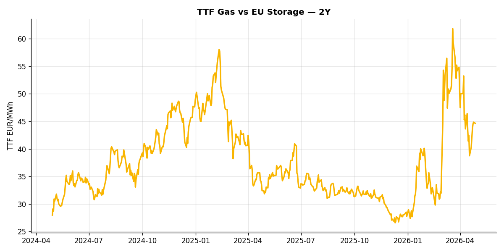
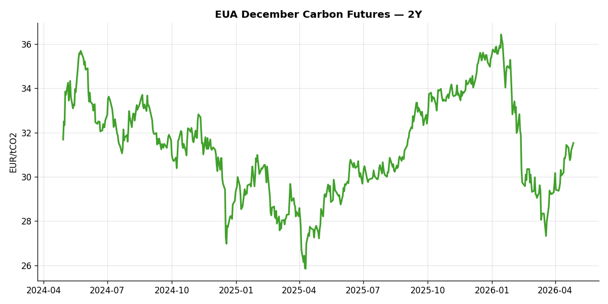

# European Cross-Commodity Risk Pack: Gas + Carbon → Power Curve Implications

**Daily desk brief — 2026-04-28**  
_Author: Sumer Sener · sumerberksener@gmail.com_  
_Generated by `scripts/generate_brief.py`. AI narrative via Anthropic Claude._

## 1 · Executive summary

TTF prints at 44.65 EUR/MWh (59th-pctile of 5y). EUA at 31.53 EUR/t (26th-pctile). Power-curve implication: regime is set by the prevailing fuel-switch and storage stance above.

_Rule-based fallback (ANTHROPIC_API_KEY not set; using rule-based fallback). Set `ANTHROPIC_API_KEY` to enable Claude-generated narratives._

## 2 · Monitor metrics

| Metric | Latest | Unit | 1d Δ | 1w Δ | 5y pctile | Headline |
|---|---:|---|---:|---:|---:|---|
| TTF Gas | 44.65 | EUR/MWh | -0.48% | +10.81% | 59 | Within typical range |
| EU Storage | — | % full | — | — | — | (no data) |
| Coal | 96.00 | USD/t | -0.57% | -1.03% | 9 | 9th-percentile of 5-yr range — historically low |
| EUA Carbon | 31.53 | EUR/tCO2 | +1.06% | +0.67% | 26 | Within typical range |
| DE Power | — | EUR/MWh | — | — | — | (no data) |
| Clean Spark | — | EUR/MWh | — | — | — | (no data) |
| Clean Dark | — | EUR/MWh | — | — | — | (no data) |

_Full 5-year history per metric in `data/<metric>.csv`. Today's pivot in `data/snapshot.csv`._

## 3 · Gas tightness

**TTF front-month** prints at 44.65 EUR/MWh — _Within typical range_.  
TTF Gas prints at 44.65 EUR/MWh (59th-pctile of 5y).

> _EU Storage requires the free GIE AGSI+ API token. Set `AGSI_TOKEN` in the environment to populate the storage view._

## 4 · Carbon supply / policy signal

**EUA December** prints at 31.53 EUR/tCO2 — _Within typical range_.  
EUA Carbon prints at 31.53 EUR/tCO2 (26th-pctile of 5y).

Carbon is the marginal-cost lever: a euro of EUA adds ~0.37 EUR/MWh to gas-fired and ~0.85 EUR/MWh to coal-fired generation cost. Strength here compresses the dark spread faster than the spark, accelerating fuel switching toward gas.

## 5 · Power-curve implications

> _DE Power and the derived clean spark/dark spreads require the free ENTSO-E API token. This section will populate once `ENTSOE_TOKEN` is set in the environment._

## 6 · Methodology & sources

- TTF, EUA: ICE settlements via Yahoo Finance / stooq
- DE Day-Ahead Power: ENTSO-E Transparency Platform (DE_LU bidding zone, hourly resampled to daily mean)
- EU Gas Storage: GIE AGSI+ (% full, country = EU aggregate)
- Coal: ICE Newcastle (proxy for API2 — best free daily source; ~0.85 historical correlation)
- Clean spark: P − G/η_gas − C × EF_gas/η_gas, η_gas = 0.50, EF_gas = 0.184 t/MWh_th
- Clean dark: P − Coal_EUR/η_coal − C × EF_coal/η_coal, η_coal = 0.40, EF_coal = 0.34 t/MWh_th, with API2/Newcastle USD/t converted via EUR/USD and a 6.978 MWh_th/t calorific value
- AI narrative: prompt at `ai/prompts/desk_note_v1.md`, full request/response logs in `ai/logs/<date>.jsonl`

_Observations are rule-based and informational, not investment advice._
