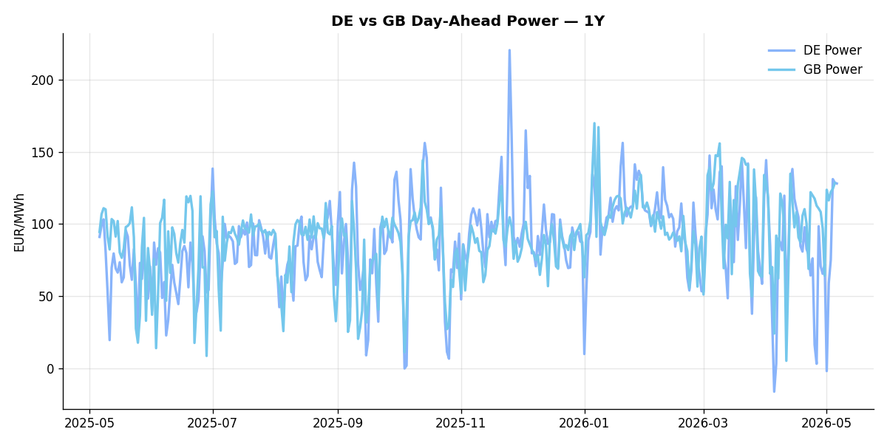
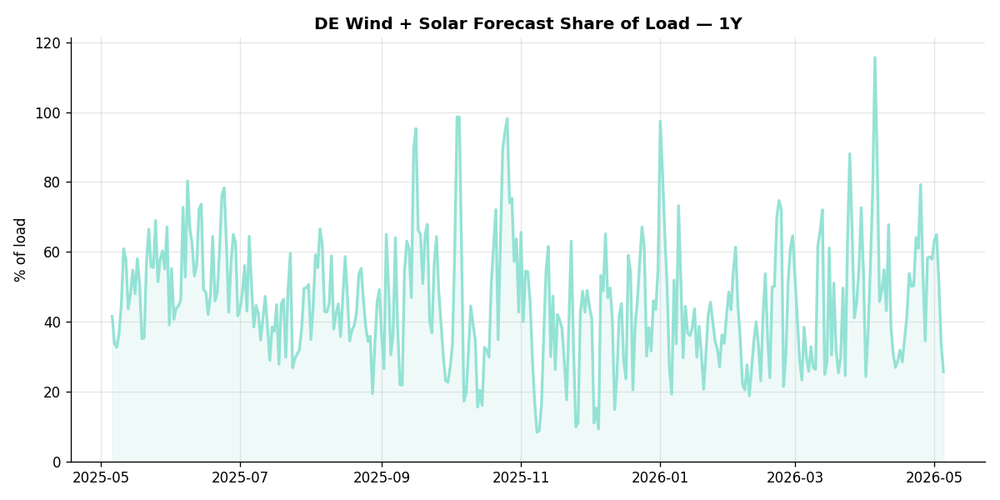

# European Cross-Commodity Risk Pack: Gas + Carbon → Power Curve Implications

**Daily desk brief — 2026-05-05**  
_Author: Sumer Sener · sumerberksener@gmail.com_  
_Generated by `scripts/generate_brief.py`. AI narrative + news themes via Anthropic Claude._

> ⚠ **Data-freshness caveat**: Clean Dark (last 2025-12-31, 125d old); Coal (last 2025-12-26, 130d old). Numbers below should be read with this in mind.

## 1 · Executive summary

**TL;DR — GB Power at 94th percentile (128.31 EUR/MWh) with renewables collapsing to 15th percentile; tight storage (12.1 pp below seasonal) and Hormuz closure supporting TTF at 65th percentile — thermal regime firmly in place.**

GB Power has spiked to the 94th percentile at 128.31 EUR/MWh as renewable generation collapsed to the 15th percentile with a -24.05% daily fall, locking in a tight thermal regime. Storage across the EU sits 12.1 percentage points below seasonal norm at 34.33% full, while the Strait of Hormuz blockade since late February sustains a global LNG premium that has anchored TTF at 48.14 EUR/MWh on a +5.19% daily gain and 65th percentile ranking. Coal data stale as of 26 December (130 days old) and Clean Dark spreads stale as of 31 December (125 days old) mean merit-order and fuel-switch signals are not current, though the 9th percentile coal signal suggests asset remains deeply out-of-the-money despite the thermal call. Refill pace through May–June is critical; without storage recovery and renewed renewable supply, duration risk extends into summer. The combination of acute gas tightness anchored by geopolitical supply loss, elevated carbon pricing embedded in the power stack, and compressed front-month spreads indicates a prolonged thermal-driven curve regime until storage or generation rebalance.

_Generated by **claude-haiku-4-5** via Anthropic API (two-pass extract→narrate). Prompts/responses logged to `ai/logs/`._

## 2 · Monitor metrics

**Primary (cross-commodity headline tiles)**

| Metric | As of | Latest | Unit | 1d Δ | 1w Δ | 5y pctile | Headline |
|---|---|---:|---|---:|---:|---:|---|
| TTF Gas | 2026-05-04 | 48.14 | EUR/MWh | +5.19% | +4.95% | 65 | Within typical range |
| EU Storage | 2026-05-05 | 34.33 | % full | +0.76% | +4.67% | 11 | 12.1 pp below the 5-yr seasonal average |
| EUA Carbon | 2026-05-04 | 31.87 | EUR/tCO2 | +0.82% | +1.22% | 29 | Within typical range |
| DE Power | 2026-05-06 | 128.01 | EUR/MWh | -0.44% | +71.34% | 73 | Within typical range |
| GB Power | 2026-05-05 | 128.31 | EUR/MWh | +3.29% | +24.80% | 94 | 94th-percentile of 5-yr range — historically high |
| Renewables | 2026-05-05 | 25.62 | % of load | -24.05% | -9.39% | 15 | Within typical range |
| Clean Spark | 2026-05-06 | 20.00 | EUR/MWh | -0.57 | +39.64 | 79 | Within typical range |
| Clean Dark | 2025-12-31 ⚠ STALE | 27.95 | EUR/MWh | -0.56 | +11.63 | 50 | Within typical range |

**Fundamentals inputs** _(feed derived metrics; not separately traded)_

| Metric | As of | Latest | Unit | 1d Δ | 1w Δ | 5y pctile | Headline |
|---|---|---:|---|---:|---:|---:|---|
| Coal | 2025-12-26 ⚠ STALE | 96.00 | USD/t | -0.57% | +0.08% | 9 | 9th-percentile of 5-yr range — historically low |

_Spreads (Clean Spark, Clean Dark) report absolute change in EUR/MWh; pct-change is meaningless across zero. Other metrics report pct change. Weekly Δ uses a 5-day trailing-mean comparison to dampen holiday spikes. Full history per metric in `data/<metric>.csv`._

## 3 · Gas + LNG arb

**TTF front-month** prints at 48.14 EUR/MWh — _Within typical range_.  
TTF Gas prints at 48.14 EUR/MWh (65th-pctile of 5y).

**EU storage** at 34.3% full (-12.1 pp vs 5-yr seasonal avg) — _12.1 pp below the 5-yr seasonal average_.  
EU Storage prints at 34.33 % full (11th-pctile of 5y). Value is extended 2.4σ above the 50d trend. Storage runs 12.1 pp below the 5-yr seasonal average.

## 4 · Carbon (EU ETS)

**EUA December** prints at 31.87 EUR/tCO2 — _Within typical range_.  
EUA Carbon prints at 31.87 EUR/tCO2 (29th-pctile of 5y).

Carbon is the marginal-cost lever for fossil generation: a euro of EUA adds ~0.37 EUR/MWh to gas-fired and ~0.85 EUR/MWh to coal-fired generation cost. Strength compresses the dark spread faster than the spark, accelerating fuel switching toward gas.

## 5 · Power — Day-Ahead & curve

**DE day-ahead baseload** at 128.01 EUR/MWh — _Within typical range_.
**GB day-ahead baseload** at 128.31 EUR/MWh — _94th-percentile of 5-yr range — historically high_.
**DE − GB spread** at -0.30 EUR/MWh (GB premium) — drives interconnector flow direction.

Clean spark **+20.00** · clean dark **+27.95** EUR/MWh. **Coal is firmly in-the-money vs gas** — coal-fired plants set the marginal cost.

**Forward curve note**: this brief uses ENTSO-E day-ahead as the front of the curve. EEX Cal+1 / Cal+2 settlement indications are listed in the roadmap (README → "What I'd do with another week") — adding them quantifies backwardation/contango directly rather than inferring from spark/dark regime.

## 6 · Short-term drivers

**DE wind + solar forecast** at 25.6% of load — _Within typical range_.  
Renewables prints at 25.62 % of load (15th-pctile of 5y).

Renewables are the largest day-ahead price driver after gas: a high share compresses the residual-load curve and pushes prices down (or negative); a low share lifts gas-fired plants into the merit order, making TTF + EUA the binding constraint.

## 7 · Today's themes (news + geopolitics)

**Backdrop**: Strait of Hormuz closure since late February elevates global LNG prices; EU gas supply risk via reduced Middle Eastern LNG arbitrage flows.

| # | Headline | Source | Tag | Commodity | Polarity (power) | Why it matters |
|---|---|---|---|---|---|---|
| 1 | International LNG prices surge following Strait of Hormuz closure | EIA Today in Energy | geopolitics | gas | bullish-power | Hormuz blockade reduces Middle Eastern LNG supply to global market, tightening arbitrage between US, Asian, and European LNG, lifting TTF via scarcity premium and reducing US-EU price differential incentive for US LNG exports. |
| 2 | DOE releases 17.5M barrels from Strategic Petroleum Reserve | EIA Today in Energy | macro | crude | bearish-power | SPR release increases global crude supply, moderating oil price risk; lower Brent reduces marginal fuel-switching cost from gas to fuel oil, pressuring European power and TTF via reduced heating oil demand competition. |

**Watchlist (1–4 weeks)**
- Strait of Hormuz blockade status — monitor for supply disruption escalation or resolution.
- US SPR release cadence — continued drawdowns may sustain crude price pressure through May–June.

_News themes generated by **claude-haiku-4-5** from 6 recent headlines across IEA, EIA, Bruegel, ENTSO-E, Euractiv. Log: `/Users/sumersener/Desktop/energy-dashboard/ai/logs/2026-05-05.jsonl`._

## 8 · Methodology & sources

- **TTF, EUA**: ICE settlements via Yahoo Finance / stooq
- **DE Day-Ahead Power**: ENTSO-E Transparency Platform (DE_LU bidding zone, hourly resampled to daily mean)
- **GB Day-Ahead Power**: ENTSO-E (GB bidding zone), GBP→EUR converted via Yahoo `GBPEUR=X`
- **EU Gas Storage**: GIE AGSI+ (% full, country = EU aggregate)
- **Wind + Solar forecast share**: ENTSO-E `query_wind_and_solar_forecast` ÷ `query_load_forecast` (DE_LU)
- **Coal**: ICE Newcastle proxy via Yahoo (fundamentals input only). **Known limitation**: Newcastle ticker has gone stale on the free Yahoo feed. Resolved by a paid feed (Argus, Refinitiv) for production use.
- **Clean spark**: P − G/η_gas − C × EF_gas/η_gas, η_gas = 0.50, EF_gas = 0.184 t/MWh_th
- **Clean dark**: P − Coal_EUR/η_coal − C × EF_coal/η_coal, η_coal = 0.40, EF_coal = 0.34 t/MWh_th, with API2/Newcastle USD/t converted via EUR/USD and a 6.978 MWh_th/t calorific value
- **News + geopolitics**: RSS pull from IEA, EIA, Bruegel, ENTSO-E, Euractiv → Claude theme extraction (`ai/prompts/news_themes_v1.md`) → structured output filtered to EU power-curve relevance
- **AI narrative**: two-pass extract→narrate. Prompt sources at `ai/prompts/`; full request/response logs in `ai/logs/<date>.jsonl`; structured extracts at `data/ai_themes.json` and `data/ai_news_themes.json`

_Observations are rule-based and informational, not investment advice._
