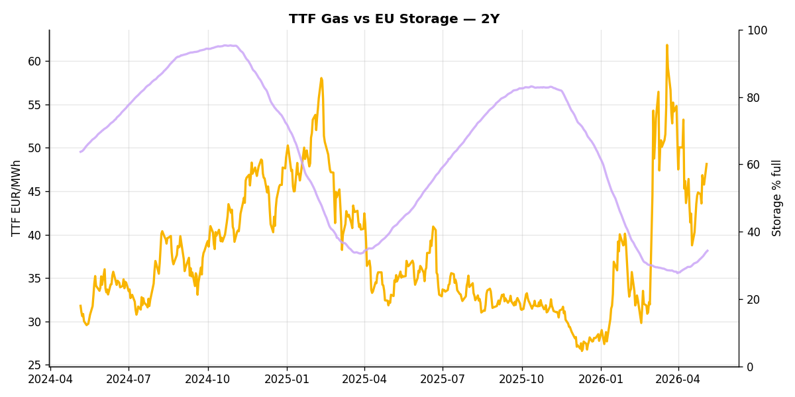
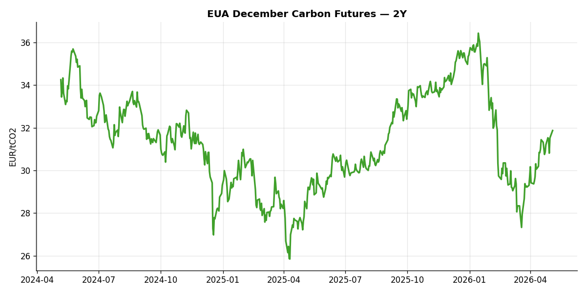
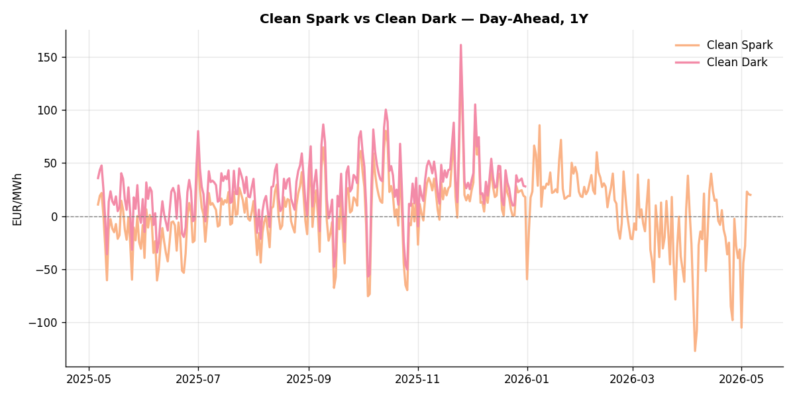

# European Cross-Commodity Risk Pack: Gas + Carbon → Power Curve Implications

**Daily desk brief — 2026-05-05**  
_Author: Sumer Sener · sumerberksener@gmail.com_  
_Generated by `scripts/generate_brief.py`. AI narrative via Anthropic Claude._

> ⚠ **Data-freshness caveat**: Coal (last 2025-12-26, 130d old); Clean Dark (last 2025-12-31, 125d old); Switch TTF (last 2026-01-05, 120d old). Numbers below should be read with this in mind. The free-data sources for these series are flaky — see methodology section.

## 1 · Executive summary

**TL;DR — Clean spark at 91st-percentile (35.41 EUR/MWh) dominates merit order; coal at 9th-percentile (96 USD/t) is deeply in-the-money, but coal data is 130 days stale — gas anchors power via TTF at 65th-percentile.**

Clean spark at the 91st-percentile (35.41 EUR/MWh) with a +12.31 EUR/MWh daily extension signals a gas-anchored, high-spread power regime in which coal, though nominally in-the-money at 96 USD/t, sits outside bankable data (130 days old as of end-December). Storage remains compressed 12.1 percentage points below seasonal baseline at the 10th-percentile, underpinning a sustained tightness narrative despite a 15.41 percent monthly refill pace. TTF gas at the 65th-percentile and up 5.19 percent daily continues to anchor marginal generation cost, though coal merit-order conclusions should be verified against live spreads before desk decisions. Tight gas, anchored carbon, and extended clean spreads lock the curve into a compressed front-month-to-Cal+1 regime with limited headroom for spark mean reversion.

_Generated by **claude-haiku-4-5** via Anthropic API (two-pass extract→narrate). Prompts/responses logged to `ai/logs/`._

## 2 · Monitor metrics

| Metric | As of | Latest | Unit | 1d Δ | 1w Δ | 5y pctile | Headline |
|---|---|---:|---|---:|---:|---:|---|
| TTF Gas | 2026-05-04 | 48.14 | EUR/MWh | +5.19% | +4.95% | 65 | Within typical range |
| EU Storage | 2026-05-04 | 34.07 | % full | +0.83% | +4.50% | 10 | 12.1 pp below the 5-yr seasonal average |
| Coal | 2025-12-26 ⚠ STALE | 96.00 | USD/t | -0.57% | +0.08% | 9 | 9th-percentile of 5-yr range — historically low |
| EUA Carbon | 2026-05-04 | 31.87 | EUR/tCO2 | +0.82% | +1.22% | 29 | Within typical range |
| DE Power | 2026-05-05 | 143.42 | EUR/MWh | +9.39% | +31.31% | 77 | Within typical range |
| Clean Spark | 2026-05-05 | 35.41 | EUR/MWh | +12.31 | +16.17 | 91 | 91th-percentile of 5-yr range — historically high |
| Clean Dark | 2025-12-31 ⚠ STALE | 27.95 | EUR/MWh | -0.56 | +11.63 | 50 | Within typical range |
| Switch TTF | 2026-01-05 ⚠ STALE | 23.28 | EUR/MWh | +0.11% | -0.28% | 18 | Within typical range |

_Spreads (Clean Spark, Clean Dark) report absolute change in EUR/MWh because pct-change is mathematically meaningless across zero. Other metrics report pct change. Full 5-year history per metric in `data/<metric>.csv`. Today's pivot in `data/snapshot.csv`._

## 3 · Gas tightness

**TTF front-month** prints at 48.14 EUR/MWh — _Within typical range_.  
TTF Gas prints at 48.14 EUR/MWh (65th-pctile of 5y).

**EU storage** at 34.1% full (-12.1 pp vs 5-yr seasonal avg) — _12.1 pp below the 5-yr seasonal average_.  
EU Storage prints at 34.07 % full (10th-pctile of 5y). Price is extended 2.5σ above the 50d trend. Storage runs 12.1 pp below the 5-yr seasonal average.

## 4 · Carbon supply / policy signal

**EUA December** prints at 31.87 EUR/tCO2 — _Within typical range_.  
EUA Carbon prints at 31.87 EUR/tCO2 (29th-pctile of 5y).

Carbon is the marginal-cost lever: a euro of EUA adds ~0.37 EUR/MWh to gas-fired and ~0.85 EUR/MWh to coal-fired generation cost. Strength here compresses the dark spread faster than the spark, accelerating fuel switching toward gas.

## 5 · Power-curve implications

**DE day-ahead baseload** at 143.42 EUR/MWh — _Within typical range_.

Clean spark **+35.41** · clean dark **+27.95** EUR/MWh. **Gas is firmly in-the-money vs coal** — TTF is the dominant power-curve driver.

When the dark spread sits above the spark, coal-fired generation clears the merit order ahead of gas; the curve is then sensitive to coal+carbon shocks. When the spark dominates, gas anchors the curve and TTF moves transmit directly into Cal+1 power.

## 6 · Methodology & sources

- TTF, EUA: ICE settlements via Yahoo Finance / stooq
- DE Day-Ahead Power: ENTSO-E Transparency Platform (DE_LU bidding zone, hourly resampled to daily mean)
- EU Gas Storage: GIE AGSI+ (% full, country = EU aggregate)
- Coal: ICE Newcastle (proxy for API2 — best free daily source; ~0.85 historical correlation)
- Clean spark: P − G/η_gas − C × EF_gas/η_gas, η_gas = 0.50, EF_gas = 0.184 t/MWh_th
- Clean dark: P − Coal_EUR/η_coal − C × EF_coal/η_coal, η_coal = 0.40, EF_coal = 0.34 t/MWh_th, with API2/Newcastle USD/t converted via EUR/USD and a 6.978 MWh_th/t calorific value
- AI narrative: prompt at `ai/prompts/desk_note_v1.md`, full request/response logs in `ai/logs/<date>.jsonl`

_Observations are rule-based and informational, not investment advice._
