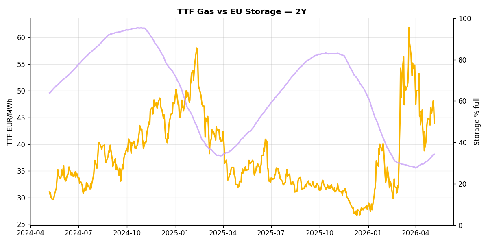
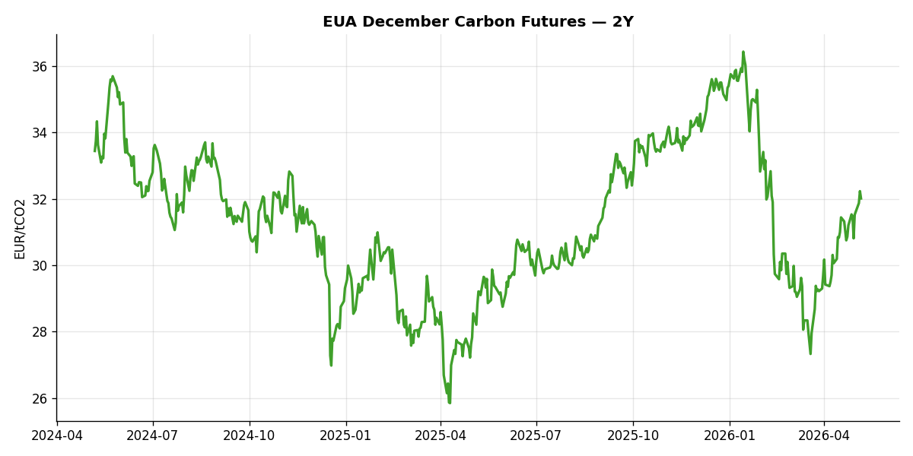
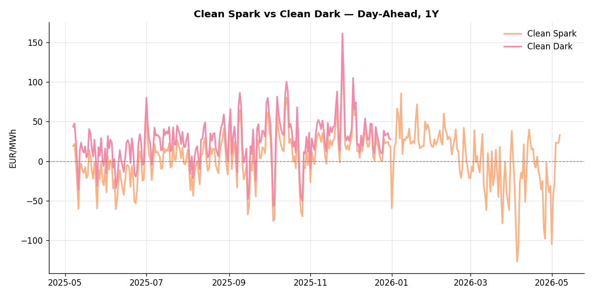
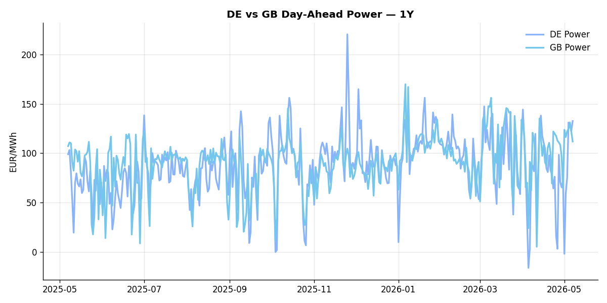
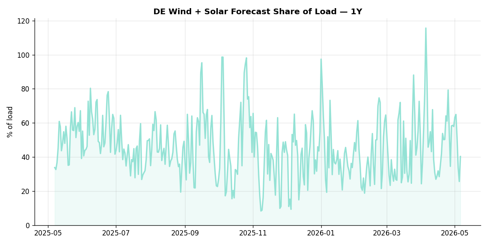

# European Cross-Commodity Risk Pack: Gas + Carbon → Power Curve Implications

**Daily desk brief — 2026-05-07**  
_Author: Sumer Sener · sumerberksener@gmail.com_  
_Generated by `scripts/generate_brief.py`. AI narrative + news themes via Anthropic Claude._

> ⚠ **Data-freshness caveat**: Clean Dark (last 2025-12-31, 127d old); Coal (last 2025-12-26, 132d old). Numbers below should be read with this in mind.

## 1 · Executive summary

**TL;DR — Clean Spark at 90th percentile amid Hormuz-driven LNG premium; EU storage 12.4 pp below seasonal average sets tight H2 refill risk.**

Clean Spark's 90th-percentile level of 32.99 EUR/MWh reflects sustained gas-in-the-money bias, anchored by Hormuz-route LNG disruption since late February that has lifted the gas-to-EU risk premium despite TTF sitting only at the 57th percentile. Coal has collapsed to the 8th percentile at 96 USD/t, leaving merit-order heavily skewed toward gas-fired generation with no upside buffer from fuel switching. More acutely, EU storage at 34.26 percent sits 12.4 percentage points below seasonal, compressing the refill window precisely as injection season begins—any LNG supply shock directly threatens H2 adequacy and prolongs winter deficit. With coal and clean-dark data 127–132 days old, merit-order curves and thermal dispatch assumptions may have shifted materially; the spark signal therefore anchors the regime but not bankable stack valuations. The combination of gas tightness via geopolitical blockade, structurally compressed coal space, and storage injecting below trend sets a tight H2 curve with front-month premiums sustained until Hormuz restoration or SPR program completion rebalances the LNG arbitrage—short of those catalysts, the curve remains extended on gas risk and fuel-switch margin compressed.

_Generated by **claude-haiku-4-5** via Anthropic API (two-pass extract→narrate). Prompts/responses logged to `ai/logs/`._

## 2 · Monitor metrics

**Primary (cross-commodity headline tiles)**

| Metric | As of | Latest | Unit | 1d Δ | 1w Δ | 5y pctile | Headline |
|---|---|---:|---|---:|---:|---:|---|
| TTF Gas | 2026-05-06 | 43.90 | EUR/MWh | -6.44% | +2.80% | 57 | Within typical range |
| EU Storage | 2026-05-06 | 34.26 | % full | +0.03% | +4.50% | 11 | 12.4 pp below the 5-yr seasonal average |
| EUA Carbon | 2026-05-06 | 32.01 | EUR/tCO2 | -0.68% | +2.17% | 29 | Within typical range |
| DE Power | 2026-05-07 | 132.57 | EUR/MWh | +8.32% | +122.67% | 74 | Within typical range |
| GB Power | 2026-05-07 | 111.78 | EUR/MWh | -8.29% | +20.13% | 84 | Within typical range |
| Renewables | 2026-05-06 | 40.30 | % of load | +57.32% | -20.77% | 48 | Within typical range |
| Clean Spark | 2026-05-07 | 32.99 | EUR/MWh | +10.18 | +64.51 | 90 | 90th-percentile of 5-yr range — historically high |
| Clean Dark | 2025-12-31 ⚠ STALE | 27.95 | EUR/MWh | -0.56 | +11.63 | 50 | Within typical range |

**Fundamentals inputs** _(feed derived metrics; not separately traded)_

| Metric | As of | Latest | Unit | 1d Δ | 1w Δ | 5y pctile | Headline |
|---|---|---:|---|---:|---:|---:|---|
| Coal | 2025-12-26 ⚠ STALE | 96.00 | USD/t | -0.57% | +0.08% | 8 | 8th-percentile of 5-yr range — historically low |

_Spreads (Clean Spark, Clean Dark) report absolute change in EUR/MWh; pct-change is meaningless across zero. Other metrics report pct change. Weekly Δ uses a 5-day trailing-mean comparison to dampen holiday spikes. Full history per metric in `data/<metric>.csv`._

## 3 · Gas + LNG arb

**TTF front-month** prints at 43.90 EUR/MWh — _Within typical range_.  
TTF Gas prints at 43.90 EUR/MWh (57th-pctile of 5y).

**EU storage** at 34.3% full (-12.4 pp vs 5-yr seasonal avg) — _12.4 pp below the 5-yr seasonal average_.  
EU Storage prints at 34.26 % full (11th-pctile of 5y). Value is extended 2.2σ above the 50d trend. Storage runs 12.4 pp below the 5-yr seasonal average.

## 4 · Carbon (EU ETS)

**EUA December** prints at 32.01 EUR/tCO2 — _Within typical range_.  
EUA Carbon prints at 32.01 EUR/tCO2 (29th-pctile of 5y).

Carbon is the marginal-cost lever for fossil generation: a euro of EUA adds ~0.37 EUR/MWh to gas-fired and ~0.85 EUR/MWh to coal-fired generation cost. Strength compresses the dark spread faster than the spark, accelerating fuel switching toward gas.

_No EU ETS supply or policy item surfaced in today's news flow. When present (issuance / MSR adjustments / CBAM / ETS-2 / EU-UK linkage / sectoral allocations), the AI extract pass tags it here with side, polarity, and transmission mechanism._

## 5 · Power — Day-Ahead & curve

**DE day-ahead baseload** at 132.57 EUR/MWh — _Within typical range_.
**GB day-ahead baseload** at 111.78 EUR/MWh — _Within typical range_.
**DE − GB spread** at +20.79 EUR/MWh (DE premium) — drives interconnector flow direction.

Clean spark **+32.99** · clean dark **+27.95** EUR/MWh. **Gas is firmly in-the-money vs coal** — TTF is the dominant power-curve driver.

**Forward curve note**: this brief uses ENTSO-E day-ahead as the front of the curve. EEX Cal+1 / Cal+2 settlement indications are listed in the roadmap (README → "What I'd do with another week") — adding them quantifies backwardation/contango directly rather than inferring from spark/dark regime.

## 6 · Short-term drivers

**DE wind + solar forecast** at 40.3% of load — _Within typical range_.  
Renewables prints at 40.30 % of load (48th-pctile of 5y).

Renewables are the largest day-ahead price driver after gas: a high share compresses the residual-load curve and pushes prices down (or negative); a low share lifts gas-fired plants into the merit order, making TTF + EUA the binding constraint.

## 7 · Today's themes (news + geopolitics)

**Backdrop**: Strait of Hormuz closure since late February pressuring global LNG prices; EU gas imports face elevated risk.

| # | Headline | Source | Tag | Commodity | Polarity (power) | Why it matters |
|---|---|---|---|---|---|---|
| 1 | International LNG prices rise amid Strait of Hormuz closure | EIA Today in Energy | geopolitics | gas | bullish-power | Hormuz blockade disrupts Middle East LNG exports to EU; TTF spreads vs. Asian LNG widen, tightening EU supply and raising gas cost of power. Direct transmission to DA power prices via fuel-mix switching. |
| 2 | DOE releases 17.5M barrels from Strategic Petroleum Reserve since March | EIA Today in Energy | macro | crude | bearish-power | SPR releases suppress Brent; lower oil indirectly eases EU gas prices via LNG arbitrage feedback (weaker oil anchor reduces LNG cost to Europe). Modest downward pressure on power via fuel-cost relief. |
| 3 | US renewable diesel and SAF exports reach 50k b/d in 2H25 | EIA Today in Energy | supply | mixed | neutral | US biofuel export surge diverts feedstock from potential EU renewable fuel blending, indirectly pressuring EU decarbonisation cost curves. Limited direct power impact; marginal carbon policy signal. |

**Watchlist (1–4 weeks)**
- Strait of Hormuz status updates; assess LNG supply route restoration timeline.
- SPR release schedule completion; rebound in Brent could shift LNG arb and TTF.
- EU LNG contract renegotiations and spot import flows; monitor 2W forward curve.

_News themes generated by **claude-haiku-4-5** from 6 recent headlines across IEA, EIA, Bruegel, ENTSO-E, Euractiv. Log: `/Users/sumersener/Desktop/energy-dashboard/ai/logs/2026-05-07.jsonl`._

## 8 · Methodology & sources

- **TTF, EUA**: ICE settlements via Yahoo Finance / stooq
- **DE Day-Ahead Power**: ENTSO-E Transparency Platform (DE_LU bidding zone, hourly resampled to daily mean)
- **GB Day-Ahead Power**: ENTSO-E (GB bidding zone), GBP→EUR converted via Yahoo `GBPEUR=X`
- **EU Gas Storage**: GIE AGSI+ (% full, country = EU aggregate)
- **Wind + Solar forecast share**: ENTSO-E `query_wind_and_solar_forecast` ÷ `query_load_forecast` (DE_LU)
- **Coal**: ICE Newcastle proxy via Yahoo (fundamentals input only). **Known limitation**: Newcastle ticker has gone stale on the free Yahoo feed. Resolved by a paid feed (Argus, Refinitiv) for production use.
- **Clean spark**: P − G/η_gas − C × EF_gas/η_gas, η_gas = 0.50, EF_gas = 0.184 t/MWh_th
- **Clean dark**: P − Coal_EUR/η_coal − C × EF_coal/η_coal, η_coal = 0.40, EF_coal = 0.34 t/MWh_th, with API2/Newcastle USD/t converted via EUR/USD and a 6.978 MWh_th/t calorific value
- **News + geopolitics**: RSS pull from IEA, EIA, Bruegel, ENTSO-E, Euractiv → Claude theme extraction (`ai/prompts/news_themes_v1.md`) → structured output filtered to EU power-curve relevance
- **AI narrative**: two-pass extract→narrate. Prompt sources at `ai/prompts/`; full request/response logs in `ai/logs/<date>.jsonl`; structured extracts at `data/ai_themes.json` and `data/ai_news_themes.json`

_Observations are rule-based and informational, not investment advice._
