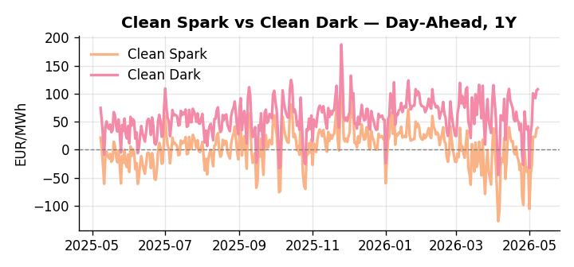
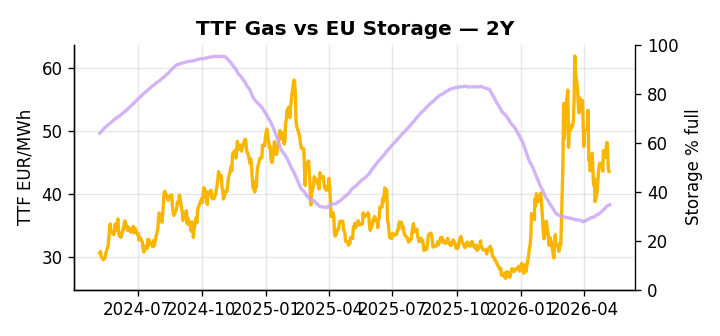

# European Cross-Commodity Risk Pack: Gas + Carbon → Power Curve Implications

**Daily desk brief — 2026-05-08**  
_Author: Sumer Sener · sumerberksener@gmail.com_  
_Generated by `scripts/generate_brief.py`. AI narrative + news themes via Anthropic Claude._

## 1 · Executive summary

**TL;DR — GB and DE power at multi-year highs (93rd/76th pctile) amid storage 12.5pp below seasonal; Iran war geopolitics underpin LNG/Hormuz premium, but US naval intervention signals crude relief and downside power risk.**

GB and DE power are printing at the 93rd and 76th percentiles respectively, with EU storage sitting at just 34.63% — 12.5 percentage points below the five-year seasonal norm and at the 11th percentile — locking in an elevated thermal premium across the front curve. The Iran war and active US naval operation over Hormuz represent the dominant geopolitical binary: a successful clearance opens ±5–8% TTF downside and relief in power, while escalation reasserts an LNG premium of +8–12% and extends the storage-squeeze narrative into H2. On the carbon side, EUA sits in mid-range as the EU moves to weaken methane enforcement rules under US pressure and floats energy-security exemptions from compliance — a supply-side bearish signal that reduces marginal gas import costs, compresses fuel-switch incentive, and softens EUA burn at the margin. The Clean Spark at 39.27 EUR/MWh (92nd percentile, +23.73 EUR YTD) confirms CCGTs as dispatch-dominant, with coal at only the 36th percentile and well out of the running absent a sharp gas reprice. With Hormuz tail-risk keeping front-curve risk wide, gas tightness AND bearish carbon policy easing AND a Clean Spark deep in-the-money keep the curve regime firmly CCGT-led, with Cal+1 headroom contingent entirely on whether the US naval operation compresses the LNG geopolitical premium before storage refill season is lost.

_Generated by **claude-sonnet-4-6** via Anthropic API (two-pass extract→narrate). Prompts/responses logged to `ai/logs/`._
_Next-5d temperature anomaly — DE -2.1°C / FR -0.6°C / GB -1.3°C vs 5-yr seasonal normal (Open-Meteo)._

## 2 · Monitor metrics

**Primary (cross-commodity headline tiles)**

| Metric | As of | Latest | Unit | 1d Δ | 1w Δ | 5y pctile | Headline |
|---|---|---:|---|---:|---:|---:|---|
| TTF Gas | 2026-05-07 | 43.56 | EUR/MWh | -0.78% | +1.04% | 56 | Within typical range |
| EU Storage | 2026-05-08 | 34.63 | % full | +0.35% | +3.75% | 11 | 12.5 pp below the 5-yr seasonal average |
| EUA Carbon | 2026-05-07 | 31.54 | EUR/tCO2 | -1.47% | +1.75% | 26 | Within typical range |
| DE Power | 2026-05-08 | 138.00 | EUR/MWh | +1.42% | +93.57% | 76 | Within typical range |
| GB Power | 2026-05-08 | 126.73 | EUR/MWh | -7.99% | +22.64% | 93 | 93th-percentile of 5-yr range — historically high |
| Renewables | 2026-05-08 | 37.18 | % of load | +37.34% | -44.65% | 40 | Within typical range |
| Clean Spark | 2026-05-08 | 39.27 | EUR/MWh | +1.94 | +78.90 | 92 | 92th-percentile of 5-yr range — historically high |
| Clean Dark | 2026-05-08 | 107.85 | EUR/MWh | +1.93 | +77.08 | 78 | Within typical range |

**Fundamentals inputs** _(feed derived metrics; not separately traded)_

| Metric | As of | Latest | Unit | 1d Δ | 1w Δ | 5y pctile | Headline |
|---|---|---:|---|---:|---:|---:|---|
| Coal | 2026-05-07 | 10.94 | USD/t | -0.07% | -0.26% | 36 | Within typical range |

_Spreads → abs EUR/MWh deltas; others → pct. Weekly Δ uses 5d trailing means. Full history in `data/<metric>.csv`._

## 3 · Gas + LNG arb

**TTF front-month** prints at 43.56 EUR/MWh — _Within typical range_.
**EU storage** at 34.6% full (-12.5 pp vs 5-yr seasonal avg) — _12.5 pp below the 5-yr seasonal average_.
**TTF − JKM (LNG arb)** at -5.42 EUR/MWh (JKM 16.84 USD/MMBtu) — JKM richer than TTF — Asia pulls cargoes, marginal European tightening risk.

## 4 · Carbon (EU ETS)

**EUA December** prints at 31.54 EUR/tCO2 — _Within typical range_. A euro of EUA adds ~0.37 EUR/MWh to gas-fired and ~0.85 EUR/MWh to coal-fired generation cost; strength compresses the dark spread faster than the spark.

**EU vs UK ETS** — Cobblestone's emissions desk trades EUA and UKA. Post-Brexit auction reform narrowed the UKA discount to EUA from £20+/t to single-digit £/t; CBAM phase-in pulls UK compliance demand toward parity. EUA−UKA basis remains a tradable cross-market signal.

**Supply / policy signal** — _EU weakens methane enforcement rules under US pressure and floats energy-security exemptions from methane compliance; reduces supply-side cost burden on gas importers and producers._  
Side: `supply` · Polarity: `bearish EUA` · Source: Politico EU Energy

Looser methane enforcement lowers marginal gas import cost; cheaper gas input weakens power-generation fuel-switch incentive to coal/nuclear, compressing merit-order margins and EUA burn.

_Surfaced from today's news flow by the AI extract pass (`ai/prompts/extract_v1.md` → `carbon_policy_signal`)._

## 5 · Power — Day-Ahead & curve

**DE day-ahead baseload** at 138.00 EUR/MWh — _Within typical range_.
**GB day-ahead baseload** at 126.73 EUR/MWh — _93th-percentile of 5-yr range — historically high_.
**DE − GB spread** at +11.27 EUR/MWh (DE premium) — drives interconnector flow direction.
**Cross-border net flows (Power Transportation):** DE↔FR -44.0 GWh (FR export); GB↔FR -73.5 GWh (FR export); NL↔DE +5.0 GWh (NL export).

**Clean spark spread** at +39.27 EUR/MWh — _92th-percentile of 5-yr range — historically high_. Bridge from gas + carbon fundamentals to gas-fired economics; sustained positive spark = TTF moves transmit directly into the power curve.

**Curve shape:** DA → W+1 → M+1 → Q+1 → Cal+1 → Cal+2 = 138 / 91 / 91 / 91 / 91 / 91 EUR/MWh — **Backwardation** (DA −Cal+1 spread +47 EUR/MWh). Forwards are seasonality projections — see Methodology.

{width=49%} {width=49%}

**This week ahead**

- **Fri** 14:30 UTC — EIA weekly natural gas storage report: US storage trajectory anchors LNG export pricing into NW Europe — direct TTF transmission.
- **Fri** — ENTSO-E weekly day-ahead volumes / system-balance summary: Reads the European generation mix in last 7d — confirms or breaks the Cal+1 thesis.
- **Tue** 08:00 UTC — AGSI+ daily storage print: First read on the week's gas injection / withdrawal pace; sets the tone for TTF curve shape.
- **Mon** — US Hormuz naval operation status update: Geopolitical binary on crude/LNG premium; direct transmission to TTF and DE/GB power via fuel-switch arb. _(news-extracted)_

**Scenarios (24-72h horizon)**

| | Summary | TTF | DE Power |
|---|---|---:|---:|
| **Base** | Storage squeeze persists; US clears Hormuz partially; gas stable, power premium holds. | ±1–2% | ±2–3% |
| **Upside** | Iran war escalates, Hormuz closes; LNG premium re-asserts; storage refill stalls further. | +8–12% | +10–15% |
| **Downside** | US naval operation succeeds, Hormuz reopens; crude rallies reverse; methane rules soften supply costs. | −5–8% | −6–10% |

_Illustrative, not forecasts. Magnitudes sized off historical sensitivity; AI-generated from today's extract pass._

## 6 · Today's themes

**Weather watch (next 7d)**
- **Storm · GB · Fri 08 – Thu 14 May** — peak gust 48 m/s (~172 km/h) on Sun 10 May. GB wind capacity is large — DA likely soft. Cut-off risk if gusts exceed safety thresholds; opposite tail (sudden tightening) possible.
- **Storm · FR · Sat 09 – Fri 15 May** — peak gust 50 m/s (~179 km/h) on Mon 11 May. Strong wind boost to French generation; FR may export to neighbours. DA print likely below seasonal norm; watch FR-GB IFA flow toward GB.

**Watchlist (1–4 weeks)**
- Hormuz naval operation success/failure—confirms or denies crude supply re-opening (days).
- EU methane rules finalization & exemption scope (weeks).

_Risk framing — built within a discipline of clear limits and continuous monitoring; observations here are framed as risk inputs, not directional calls. Positioning decisions remain with the desk._
_Methodology + sources: **README §Methodology**. Numbers auditable via the snapshot JSONs. Rule-based / informational — not investment advice._