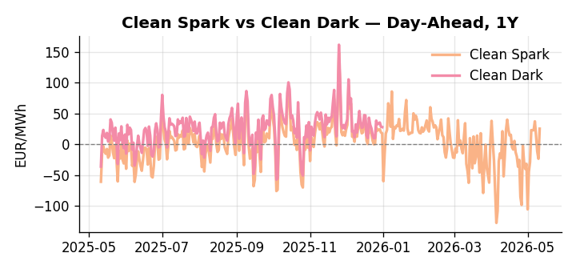
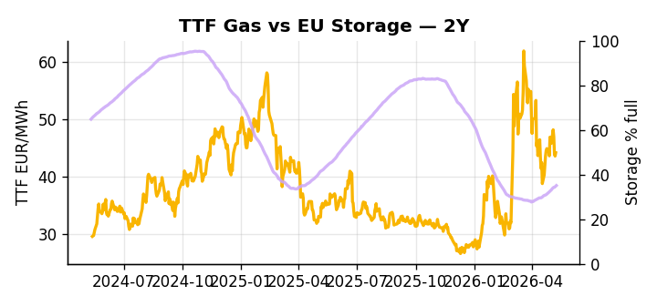

# European Cross-Commodity Risk Pack: Gas + Carbon → Power Curve Implications

**Daily desk brief — 2026-05-11**  
_Author: Sumer Sener · sumerberksener@gmail.com_  
_Generated by `scripts/generate_brief.py`. AI narrative + news themes via Anthropic Claude._

> **Data-freshness caveat:** Clean Dark (last 2025-12-31, 131d old); Coal (last 2025-12-26, 136d old). Numbers below should be read with this in mind.

## 1 · Executive summary

**TL;DR — Iran war tightens gas supply via Libya pivot and shadow-fleet sanctions; EU storage 12pp below seasonal average amplifies near-term Cal+1 power risk.**

Iran war tightness — compounded by Libya capacity constraints and Russia shadow-fleet sanctions — is the dominant signal, with EU storage sitting at just 35% full, 12.4 percentage points below the five-year seasonal average, making the refill pace the critical variable for H2 power curve stability. EUA supply headroom is being quietly eroded from the policy side: as the EU Commission weakens methane enforcement rules under US pressure and drafts energy-security exemptions for gas operators, regulatory relief lowers operator abatement cost and caps EUA upside from tightened scope — a slow-motion bearish-supply signal that bears watching alongside spot carbon levels. Coal at the 8th percentile (96 USD/t) remains structurally sidelined with renewables carrying 49% of load, compressing thermal dispatch and leaving clean-dark spreads indicative rather than bankable — with coal and clean-dark data 131–136 days stale, those rankings should not be treated as current intraday signals. Gas tightness extended by Iran-Hormuz escalation risk AND carbon headroom capped by methane policy relief AND clean-spark spreads in-the-money against a compressed thermal stack keep the front-curve risk wide and the Cal+1 regime anchored to storage refill trajectory, with Hormuz tail-risk the single event most capable of pulling front-curve risk sharply wider should Libya ramp disappoint.

_Generated by **claude-sonnet-4-6** via Anthropic API (two-pass extract→narrate). Prompts/responses logged to `ai/logs/`._
_Next-5d temperature anomaly — DE -4.3°C / FR -4.0°C vs 5-yr seasonal normal (Open-Meteo)._

## 2 · Monitor metrics

**Primary (cross-commodity headline tiles)**

| Metric | As of | Latest | Unit | 1d Δ | 1w Δ | 5y pctile | Headline |
|---|---|---:|---|---:|---:|---:|---|
| TTF Gas | 2026-05-08 | 44.14 | EUR/MWh | +1.34% | -0.08% | 57 | Within typical range |
| EU Storage | 2026-05-09 | 35.05 | % full | +0.89% | +3.42% | 12 | 12.4 pp below the 5-yr seasonal average |
| EUA Carbon | 2026-05-08 | 31.26 | EUR/tCO2 | -0.89% | +1.26% | 23 | Within typical range |
| DE Power | 2026-05-11 | 125.16 | EUR/MWh | +63.61% | +4.61% | 71 | Within typical range |
| GB Power | 2026-05-11 | 103.90 | EUR/MWh | +30.44% | -9.80% | 73 | Within typical range |
| Renewables | 2026-05-10 | 48.77 | % of load | +5.43% | -16.49% | 66 | Within typical range |
| Clean Spark | 2026-05-11 | 25.37 | EUR/MWh | +48.66 | +9.10 | 85 | Within typical range |
| Clean Dark | 2025-12-31 (STALE) | 27.95 | EUR/MWh | -0.56 | +11.63 | 50 | Within typical range |

**Fundamentals inputs** _(feed derived metrics; not separately traded)_

| Metric | As of | Latest | Unit | 1d Δ | 1w Δ | 5y pctile | Headline |
|---|---|---:|---|---:|---:|---:|---|
| Coal | 2025-12-26 (STALE) | 96.00 | USD/t | -0.57% | +0.08% | 8 | 8th-percentile of 5-yr range — historically low |

_Spreads → abs EUR/MWh deltas; others → pct. Weekly Δ uses 5d trailing means. Full history in `data/<metric>.csv`._

## 3 · Gas + LNG arb

**TTF front-month** prints at 44.14 EUR/MWh — _Within typical range_.
**EU storage** at 35.0% full (-12.4 pp vs 5-yr seasonal avg) — _12.4 pp below the 5-yr seasonal average_.
**TTF − JKM (LNG arb)** at -4.92 EUR/MWh (JKM 16.87 USD/MMBtu) — JKM richer than TTF — Asia pulls cargoes, marginal European tightening risk.

## 4 · Carbon (EU ETS)

**EUA December** prints at 31.26 EUR/tCO2 — _Within typical range_. A euro of EUA adds ~0.37 EUR/MWh to gas-fired and ~0.85 EUR/MWh to coal-fired generation cost; strength compresses the dark spread faster than the spark.

**EU vs UK ETS** — Cobblestone's emissions desk trades EUA and UKA. Post-Brexit auction reform narrowed the UKA discount to EUA from £20+/t to single-digit £/t; CBAM phase-in pulls UK compliance demand toward parity. EUA−UKA basis remains a tradable cross-market signal.

**Supply / policy signal** — _EU Commission weakens methane enforcement rules under US pressure; energy-security exemptions drafted for gas operators._  
Side: `supply` · Polarity: `bearish EUA` · Source: Politico EU Energy

Regulatory relief lowers operator abatement cost and marginal gas supply cost; reduces TTF floor and caps upside on EUA from tightened scope.

_Surfaced from today's news flow by the AI extract pass (`ai/prompts/extract_v1.md` → `carbon_policy_signal`)._

## 5 · Power — Day-Ahead & curve

**DE day-ahead baseload** at 125.16 EUR/MWh — _Within typical range_.
**GB day-ahead baseload** at 103.90 EUR/MWh — _Within typical range_.
**DE − GB spread** at +21.26 EUR/MWh (DE premium) — drives interconnector flow direction.
**Cross-border net flows (Power Transportation):** DE↔FR -39.7 GWh (FR export); GB↔FR -61.2 GWh (FR export); NL↔DE +17.7 GWh (NL export).

**Clean spark spread** at +25.37 EUR/MWh — _Within typical range_. Bridge from gas + carbon fundamentals to gas-fired economics; sustained positive spark = TTF moves transmit directly into the power curve.

**Curve shape:** DA → W+1 → M+1 → Q+1 → Cal+1 → Cal+2 = 125 / 87 / 87 / 87 / 87 / 87 EUR/MWh — **Backwardation** (DA −Cal+1 spread +38 EUR/MWh). Forwards are seasonality projections — see Methodology.

{width=49%} {width=49%}

**This week ahead**

- **Tue** 08:00 UTC — AGSI+ daily storage print: First read on the week's gas injection / withdrawal pace; sets the tone for TTF curve shape.
- **Wed** 09:00 UTC — EEX EUA primary auction (Mon–Thu daily; Wed is largest volume): Supply-side EUA signal; auction clearing relative to spot reads as ETS demand strength.
- **Wed** — ENTSO-E DE_LU + GB next-week wind/solar forecast refresh: Sets the residual-load curve a week out; outsized prints move power Cal+1 directionally.
- **TBD** — EU methane rule exemptions finalization: Energy-security carve-out completion drives gas supply and TTF floor signal _(news-extracted)_

**Scenarios (1w horizon)**

| | Summary | TTF | DE Power |
|---|---|---:|---:|
| **Base** | Gas supply tightens on Iran disruption and Libya ramp constraints; storage refill steady; renewables 50% load. | +2-5% | +1-3% |
| **Upside** | Libya pipeline outage or Iran Hormuz escalation; storage refill stalls; thermal call extends sharply into summer. | +12-18% | +8-12% |
| **Downside** | Libya gas ramp accelerates; Russia methane exemptions unlock supply; mild weather and high renewables soften demand. | -6-10% | -4-8% |

_Illustrative, not forecasts. Magnitudes sized off historical sensitivity; AI-generated from today's extract pass._

## 6 · Today's themes

**Weather watch (next 7d)**
- **Storm · DE · Mon 11 – Thu 14 May** — peak gust 47 m/s (~170 km/h) on Thu 14 May. Wind generation likely surges Day 1, then risk of turbine cut-off if gusts exceed 25 m/s. Bearish DA early, sharp reversal possible. Watch DE-FR flow swings.
- **Cold snap · DE · Tue 12 – Fri 15 May** — peak -6.6°C vs normal. Bullish DE power and TTF — heating demand pulls thermal plant up the merit order. Spark spread expands; watch DE−GB spread widen on the DE side.

**Watchlist (1–4 weeks)**
- Libyan gas production ramp timeline and pipeline integrity to Italy—critical for TTF curve May–Jun.
- EU methane rule exemptions finalization (energy security carve-out)—may unlock marginal gas supply.

_Risk framing — built within a discipline of clear limits and continuous monitoring; observations here are framed as risk inputs, not directional calls. Positioning decisions remain with the desk._
_Methodology + sources: **README §Methodology**. Numbers auditable via the snapshot JSONs. Rule-based / informational — not investment advice._