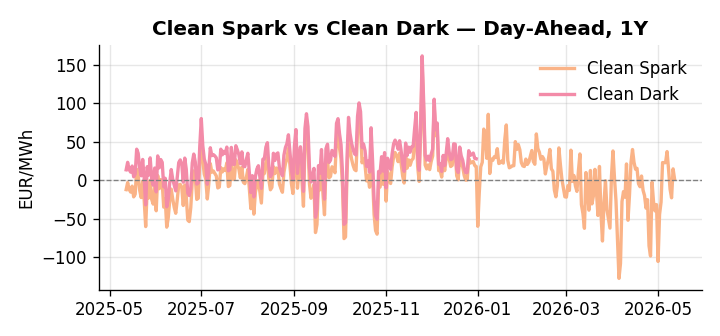
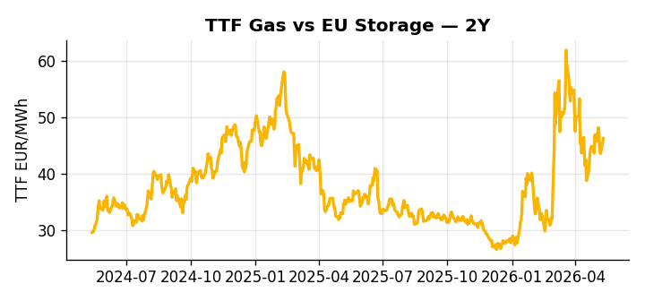

# European Cross-Commodity Risk Pack: Gas + Carbon → Power Curve Implications

**Daily desk brief — 2026-05-12**  
_Author: Sumer Sener · sumerberksener@gmail.com_  
_Generated by `scripts/generate_brief.py`. AI narrative + news themes via Anthropic Claude._

> **Data-freshness caveat:** Clean Dark (last 2025-12-31, 132d old); Coal (last 2025-12-26, 137d old). Numbers below should be read with this in mind.

## 1 · Executive summary

**TL;DR — Iran war supply disruption and Russia sanctions escalation support TTF (61st pctile, +4.73% daily), while coal at 8th pctile signals fuel-switch headroom; GB power at 89th pctile reflects supply premium.**

Iran-war supply disruption and Russia sanctions escalation are the dominant signals this morning, with TTF at the 61st percentile and printing +4.73% on the day, sustaining a clear geopolitical premium in the front-month. Coal sits at just the 8th percentile — though with data 137 days old, the clean-dark spread is indicative not bankable — yet even on stale figures the fuel-switch calculus leaves gas firmly in-the-money over coal, with renewable share down 21.57% monthly adding further headroom for fossil dispatch. EUA sits in mid-range as EU methane enforcement rules are loosened to grant oil-company exemptions, a bearish-EUA policy shift that reduces abatement compliance cost, lowers the sectoral decarbonisation hurdle, and softens the EUA floor via fewer offset incentives. GB power at the 89th percentile against DE at the 58th flags a cross-border arb opportunity, though the 11.15% daily and 13.5% weekly decline in GB suggests supply relief that could compress that spread if sustained into the week. With Russia shadow-fleet sanctions escalation the dominant geopolitical driver, gas tightness at the 61st percentile AND EUA mid-range under bearish policy pressure AND clean-dark spreads anchored but indicative pull front-curve risk wider, while fuel-switch headroom and compressed coal economics keep the Cal+1 fossil-dispatch regime intact.

_Generated by **claude-sonnet-4-6** via Anthropic API (two-pass extract→narrate). Prompts/responses logged to `ai/logs/`._
_Next-5d temperature anomaly — DE -4.4°C / FR -4.7°C vs 5-yr seasonal normal (Open-Meteo)._

## 2 · Monitor metrics

**Primary (cross-commodity headline tiles)**

| Metric | As of | Latest | Unit | 1d Δ | 1w Δ | 5y pctile | Headline |
|---|---|---:|---|---:|---:|---:|---|
| TTF Gas | 2026-05-11 | 46.23 | EUR/MWh | +4.73% | -2.42% | 61 | Within typical range |
| EU Storage | — | — | % full | — | — | — | (no data) |
| EUA Carbon | 2026-05-11 | 32.14 | EUR/tCO2 | +2.82% | +1.21% | 31 | Within typical range |
| DE Power | 2026-05-12 | 105.91 | EUR/MWh | -11.15% | -14.98% | 58 | Within typical range |
| GB Power | 2026-05-12 | 119.38 | EUR/MWh | +0.31% | -13.54% | 89 | Within typical range |
| Renewables | 2026-05-11 | 42.21 | % of load | -13.45% | -6.70% | 52 | Within typical range |
| Clean Spark | 2026-05-12 | 1.62 | EUR/MWh | -13.28 | -16.33 | 53 | Within typical range |
| Clean Dark | 2025-12-31 (STALE) | 27.95 | EUR/MWh | -0.56 | +11.63 | 50 | Within typical range |

**Fundamentals inputs** _(feed derived metrics; not separately traded)_

| Metric | As of | Latest | Unit | 1d Δ | 1w Δ | 5y pctile | Headline |
|---|---|---:|---|---:|---:|---:|---|
| Coal | 2025-12-26 (STALE) | 96.00 | USD/t | -0.57% | +0.08% | 8 | 8th-percentile of 5-yr range — historically low |

_Spreads → abs EUR/MWh deltas; others → pct. Weekly Δ uses 5d trailing means. Full history in `data/<metric>.csv`._

## 3 · Gas + LNG arb

**TTF front-month** prints at 46.23 EUR/MWh — _Within typical range_.
**TTF − JKM (LNG arb)** at -2.90 EUR/MWh (JKM 16.94 USD/MMBtu) — JKM richer than TTF — Asia pulls cargoes, marginal European tightening risk.

## 4 · Carbon (EU ETS)

**EUA December** prints at 32.14 EUR/tCO2 — _Within typical range_. A euro of EUA adds ~0.37 EUR/MWh to gas-fired and ~0.85 EUR/MWh to coal-fired generation cost; strength compresses the dark spread faster than the spark.

**EU vs UK ETS** — Cobblestone's emissions desk trades EUA and UKA. Post-Brexit auction reform narrowed the UKA discount to EUA from £20+/t to single-digit £/t; CBAM phase-in pulls UK compliance demand toward parity. EUA−UKA basis remains a tradable cross-market signal.

**Supply / policy signal** — _EU methane enforcement rules loosened; oil companies gain exemption scope, reducing compliance cost and abatement incentive for gas producers._  
Side: `policy` · Polarity: `bearish EUA` · Source: Politico EU Energy

Lower abatement compliance cost reduces investment in methane-mitigation projects; fewer EUA offsets issued; EUA floor pressure via lower sectoral decarbonization hurdle.

_Surfaced from today's news flow by the AI extract pass (`ai/prompts/extract_v1.md` → `carbon_policy_signal`)._

## 5 · Power — Day-Ahead & curve

**DE day-ahead baseload** at 105.91 EUR/MWh — _Within typical range_.
**GB day-ahead baseload** at 119.38 EUR/MWh — _Within typical range_.
**DE − GB spread** at -13.47 EUR/MWh (GB premium) — drives interconnector flow direction.
**Cross-border net flows (Power Transportation):** DE↔FR -41.3 GWh (FR export); GB↔FR -65.2 GWh (FR export); NL↔DE +11.6 GWh (NL export).

**Clean spark spread** at +1.62 EUR/MWh — _Within typical range_. Bridge from gas + carbon fundamentals to gas-fired economics; sustained positive spark = TTF moves transmit directly into the power curve.

**Curve shape:** DA → W+1 → M+1 → Q+1 → Cal+1 → Cal+2 = 106 / 86 / 86 / 86 / 86 / 86 EUR/MWh — **Backwardation** (DA −Cal+1 spread +19 EUR/MWh). Forwards are seasonality projections — see Methodology.

{width=49%} {width=49%}

**This week ahead**

- **Tue** 08:00 UTC — AGSI+ daily storage print: First read on the week's gas injection / withdrawal pace; sets the tone for TTF curve shape.
- **Wed** 09:00 UTC — EEX EUA primary auction (Mon–Thu daily; Wed is largest volume): Supply-side EUA signal; auction clearing relative to spot reads as ETS demand strength.
- **Wed** — ENTSO-E DE_LU + GB next-week wind/solar forecast refresh: Sets the residual-load curve a week out; outsized prints move power Cal+1 directionally.
- **TBD** — EU methane enforcement final implementation: Exemption scope clarification will signal gas supply cost trajectory and EUA abatement incentive strength. _(news-extracted)_
- **TBD** — Further Russia sanctions announcement (shadow fleet/banking): Each round tightens LNG routing; TTF scarcity premium at risk if announcements confirm multi-month channel closures. _(news-extracted)_

**Scenarios (1w horizon)**

| | Summary | TTF | DE Power |
|---|---|---:|---:|
| **Base** | TTF consolidates 61st pctile; GB-DE spread moderates; coal dispatch supportive but not urgent. | ±1-3% | ±2-4% |
| **Upside** | Russia shadow-fleet sanctions escalation closes LNG routing; Libya ramp delayed; TTF scarcity premium widens. | +8-12% | +6-10% |
| **Downside** | Libya gas ramp succeeds; EU methane rules loosen supply costs; Iran war de-escalates; TTF gives back geopolitical premium. | -6-10% | -5-8% |

_Illustrative, not forecasts. Magnitudes sized off historical sensitivity; AI-generated from today's extract pass._

## 6 · Today's themes

**Weather watch (next 7d)**
- **Cold snap · DE · Tue 12 – Thu 14 May** — peak -6.5°C vs normal. Bullish DE power and TTF — heating demand pulls thermal plant up the merit order. Spark spread expands; watch DE−GB spread widen on the DE side.
- **Storm · DE · Tue 12 – Thu 14 May** — peak gust 52 m/s (~186 km/h) on Tue 12 May. Wind generation likely surges Day 1, then risk of turbine cut-off if gusts exceed 25 m/s. Bearish DA early, sharp reversal possible. Watch DE-FR flow swings.

**Watchlist (1–4 weeks)**
- EU methane enforcement guidelines final implementation date & exemption scope clarification.
- Libya gas production ramp-up timeline vs. Italy import target (supply/demand mismatch risk).

_Risk framing — built within a discipline of clear limits and continuous monitoring; observations here are framed as risk inputs, not directional calls. Positioning decisions remain with the desk._
_Methodology + sources: **README §Methodology**. Numbers auditable via the snapshot JSONs. Rule-based / informational — not investment advice._