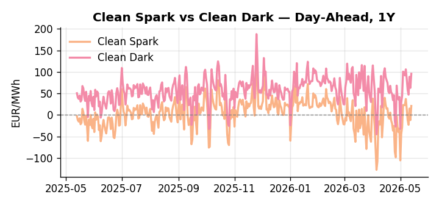
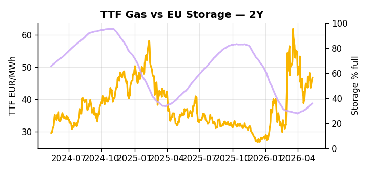

# European Cross-Commodity Risk Pack: Gas + Carbon → Power Curve Implications

**Daily desk brief — 2026-05-13**  
_Author: Sumer Sener · sumerberksener@gmail.com_  
_Generated by `scripts/generate_brief.py`. AI narrative + news themes via Anthropic Claude._

## 1 · Executive summary

**TL;DR — GB Power at 96th percentile amid 90th-percentile renewables; storage 12.5pp below seasonal average creates summer thermal call asymmetry despite Iran-war geopolitical risk.**

GB Power at the 96th percentile is the dominant signal, driven by tight interconnector capacity and Irish wind tail-risk even as European renewables running at the 90th percentile suppress the broader day-ahead merit order. The structural tension beneath this is storage sitting at 35.57% — 12.5 percentage points below seasonal average at the 12th percentile — creating an asymmetric summer thermal call that is currently masked by renewable output but will reassert sharply if refill pace falters into H2. TTF front-month anchored at 46.68 EUR/MWh (62nd percentile) reflects a market holding a floor on the storage deficit while EU methane enforcement softening, under active US pressure with a Wednesday clarification event on the watchlist, caps the scarcity premium and compresses coal-to-gas switching incentive. On the carbon side, EUA-equivalent mechanisms are in active policy expansion as the EU doubles down on aviation carbon taxation, raising the embedded carbon cost floor across the merit order and providing an indirect structural signal that clean spreads are unlikely to de-rate as quickly as gas alone would suggest. With Iran-war tail-risk and shadow fleet sanctions reasserting Brent and LNG arb tightness, gas tightness AND an aviation-sector-broadened carbon cost floor AND in-the-money clean spreads keep front-curve risk extended, while the storage deficit-to-refill pivot remains the decisive variable setting the Cal+1 regime.

_Generated by **claude-sonnet-4-6** via Anthropic API (two-pass extract→narrate). Prompts/responses logged to `ai/logs/`._
_Next-5d temperature anomaly — DE -3.7°C / FR -3.2°C / GB -3.4°C vs 5-yr seasonal normal (Open-Meteo)._

## 2 · Monitor metrics

**Primary (cross-commodity headline tiles)**

| Metric | As of | Latest | Unit | 1d Δ | 1w Δ | 5y pctile | Headline |
|---|---|---:|---|---:|---:|---:|---|
| TTF Gas | 2026-05-12 | 46.68 | EUR/MWh | +0.98% | -3.92% | 62 | Within typical range |
| EU Storage | 2026-05-11 | 35.57 | % full | +0.59% | +3.11% | 12 | 12.5 pp below the 5-yr seasonal average |
| EUA Carbon | 2026-05-12 | 31.76 | EUR/tCO2 | -1.18% | +0.42% | 28 | Within typical range |
| DE Power | 2026-05-13 | 126.05 | EUR/MWh | +35.29% | -20.28% | 72 | Within typical range |
| GB Power | 2026-05-13 | 134.29 | EUR/MWh | +15.07% | -13.65% | 96 | 96th-percentile of 5-yr range — historically high |
| Renewables | 2026-05-12 | 65.16 | % of load | +54.35% | +34.54% | 90 | 90th-percentile of 5-yr range — historically high |
| Clean Spark | 2026-05-13 | 20.99 | EUR/MWh | +32.88 | -26.07 | 80 | Within typical range |
| Clean Dark | 2026-05-13 | 95.77 | EUR/MWh | +32.88 | -25.48 | 73 | Within typical range |

**Fundamentals inputs** _(feed derived metrics; not separately traded)_

| Metric | As of | Latest | Unit | 1d Δ | 1w Δ | 5y pctile | Headline |
|---|---|---:|---|---:|---:|---:|---|
| Coal | 2026-05-12 | 10.81 | USD/t | -0.32% | -0.06% | 34 | Within typical range |

_Spreads → abs EUR/MWh deltas; others → pct. Weekly Δ uses 5d trailing means. Full history in `data/<metric>.csv`._

## 3 · Gas + LNG arb

**TTF front-month** prints at 46.68 EUR/MWh — _Within typical range_.
**EU storage** at 35.6% full (-12.5 pp vs 5-yr seasonal avg) — _12.5 pp below the 5-yr seasonal average_.
**TTF − JKM (LNG arb)** at -2.51 EUR/MWh (JKM 16.99 USD/MMBtu) — JKM richer than TTF — Asia pulls cargoes, marginal European tightening risk.

## 4 · Carbon (EU ETS)

**EUA December** prints at 31.76 EUR/tCO2 — _Within typical range_. A euro of EUA adds ~0.37 EUR/MWh to gas-fired and ~0.85 EUR/MWh to coal-fired generation cost; strength compresses the dark spread faster than the spark.

**EU vs UK ETS** — Cobblestone's emissions desk trades EUA and UKA. Post-Brexit auction reform narrowed the UKA discount to EUA from £20+/t to single-digit £/t; CBAM phase-in pulls UK compliance demand toward parity. EUA−UKA basis remains a tradable cross-market signal.

**Supply / policy signal** — _EU doubles down on carbon tax for international flights; expands EUA-like mechanisms to aviation sector._  
Side: `policy` · Polarity: `bullish EUA` · Source: Politico EU Energy

Aviation carbon tax expansion raises EU carbon cost floor and signals sectoral broadening; indirect boost to power merit-order switching away from coal/gas via embedded carbon cost pass-through.

_Surfaced from today's news flow by the AI extract pass (`ai/prompts/extract_v1.md` → `carbon_policy_signal`)._

## 5 · Power — Day-Ahead & curve

**DE day-ahead baseload** at 126.05 EUR/MWh — _Within typical range_.
**GB day-ahead baseload** at 134.29 EUR/MWh — _96th-percentile of 5-yr range — historically high_.
**DE − GB spread** at -8.24 EUR/MWh (GB premium) — drives interconnector flow direction.
**Cross-border net flows (Power Transportation):** DE↔FR -36.9 GWh (FR export); GB↔FR -75.0 GWh (FR export); NL↔DE -28.3 GWh (DE export).

**Clean spark spread** at +20.99 EUR/MWh — _Within typical range_. Bridge from gas + carbon fundamentals to gas-fired economics; sustained positive spark = TTF moves transmit directly into the power curve.

**Curve shape:** DA → W+1 → M+1 → Q+1 → Cal+1 → Cal+2 = 126 / 87 / 87 / 87 / 87 / 87 EUR/MWh — **Backwardation** (DA −Cal+1 spread +39 EUR/MWh). Forwards are seasonality projections — see Methodology.

{width=49%} {width=49%}

**This week ahead**

- **Wed** 09:00 UTC — EEX EUA primary auction (Mon–Thu daily; Wed is largest volume): Supply-side EUA signal; auction clearing relative to spot reads as ETS demand strength.
- **Wed** — ENTSO-E DE_LU + GB next-week wind/solar forecast refresh: Sets the residual-load curve a week out; outsized prints move power Cal+1 directionally.
- **Fri** 14:30 UTC — EIA weekly natural gas storage report: US storage trajectory anchors LNG export pricing into NW Europe — direct TTF transmission.
- **Wed** — EU methane rule enforcement coordination: US pressure ongoing; clarification on timeline and tariff escalation risk will reset gas supply scarcity premium. _(news-extracted)_

**Scenarios (1w horizon)**

| | Summary | TTF | DE Power |
|---|---|---:|---:|
| **Base** | Renewables ease off 90th percentile; storage refill continues gradual pace; GB-DE spread normalizes slightly as interconnector headroom returns. | -1% to +2% | -3% to +2% |
| **Upside** | Shadow fleet sanctions broaden or Iran conflict escalates; LNG arb widens, Brent rallies. Storage refill slows; summer thermal call reasserts despite renewables. | +4% to +8% | +6% to +12% |
| **Downside** | Renewables sustain 90th percentile; Portugal-style demand destruction accelerates across EU; storage refill accelerates. Thermal margin compresses. | -3% to -7% | -8% to -15% |

_Illustrative, not forecasts. Magnitudes sized off historical sensitivity; AI-generated from today's extract pass._

## 6 · Today's themes

**Weather watch (next 7d)**
- **Storm · DE · Wed 13 – Thu 14 May** — peak gust 45 m/s (~161 km/h) on Thu 14 May. Wind generation likely surges Day 1, then risk of turbine cut-off if gusts exceed 25 m/s. Bearish DA early, sharp reversal possible. Watch DE-FR flow swings.
- **Storm · FR · Wed 13 – Tue 19 May** — peak gust 68 m/s (~246 km/h) on Thu 14 May. Strong wind boost to French generation; FR may export to neighbours. DA print likely below seasonal norm; watch FR-GB IFA flow toward GB.

**Watchlist (1–4 weeks)**
- EU shadow fleet sanctions implementation timeline and scope expansion.
- Portugal renewables capex announcements; wind/solar auction calendars.

_Risk framing — built within a discipline of clear limits and continuous monitoring; observations here are framed as risk inputs, not directional calls. Positioning decisions remain with the desk._
_Methodology + sources: **README §Methodology**. Numbers auditable via the snapshot JSONs. Rule-based / informational — not investment advice._