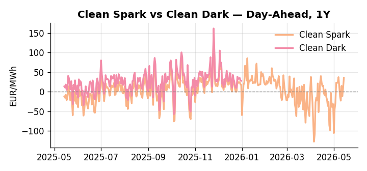
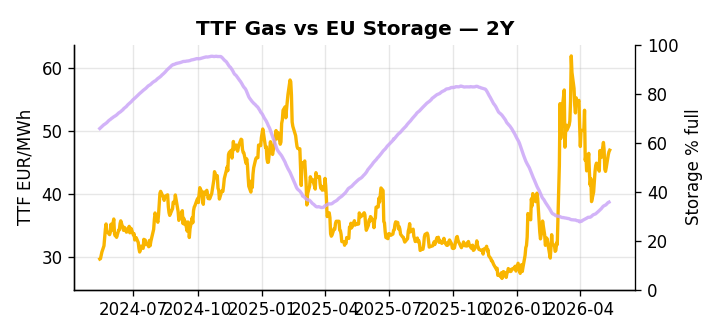

# European Cross-Commodity Risk Pack: Gas + Carbon → Power Curve Implications

**Daily desk brief — 2026-05-14**  
_Author: Sumer Sener · sumerberksener@gmail.com_  
_Generated by `scripts/generate_brief.py`. AI narrative + news themes via Anthropic Claude._

> **Data-freshness caveat:** Clean Dark (last 2025-12-31, 134d old); Coal (last 2025-12-26, 139d old). Numbers below should be read with this in mind.

## 1 · Executive summary

**TL;DR — Clean Spark at 91st-percentile (35.69 EUR/MWh) + storage 12.7pp below seasonal drives tight thermal regime; Iran war & sanctions accelerate EU decarbonisation demand but policy softening on methane weakens scarcity signals.**

Clean Spark at the 91st percentile (35.69 EUR/MWh) is the dominant regime signal this morning, with storage 12.7 percentage points below the five-year seasonal norm at 35.72% full, leaving the thermal call extended and headroom for gas-to-power displacement compressed. EUA trades at 31.68 EUR/t (27th percentile), holding in the lower tercile as the EU doubles down on aviation carbon taxation and signals ETS scarcity resolve, even as methane enforcement softening under US trade pressure sends a contradictory floor signal — net policy momentum is mixed, keeping EUA anchored but vulnerable to further compression if the rollback accelerates. With coal data 139 days old and the clean dark stale at 134 days, the dark spread is indicative not bankable, and the desk should treat the clean spark and storage deficit as the primary regime anchors rather than the coal-side economics. GB Power logged a 24.49% daily spike against DE Power at 141.19 EUR/MWh (77th percentile), widening the cross-market premium and flagging potential wind or constraint contagion into continental pricing. With Iran war sanctions tightening the shadow-fleet LNG arb into Europe, gas tightness AND a low-range carbon price AND extended clean sparks keep the front-curve risk wide, with the Cal+1 regime hostage to summer injection velocity and the Iran supply premium holding.

_Generated by **claude-sonnet-4-6** via Anthropic API (two-pass extract→narrate). Prompts/responses logged to `ai/logs/`._
_Next-5d temperature anomaly — DE -2.9°C / FR -3.0°C vs 5-yr seasonal normal (Open-Meteo)._

## 2 · Monitor metrics

**Primary (cross-commodity headline tiles)**

| Metric | As of | Latest | Unit | 1d Δ | 1w Δ | 5y pctile | Headline |
|---|---|---:|---|---:|---:|---:|---|
| TTF Gas | 2026-05-13 | 46.92 | EUR/MWh | +0.51% | -1.38% | 62 | Within typical range |
| EU Storage | 2026-05-12 | 35.72 | % full | +0.42% | +3.18% | 12 | 12.7 pp below the 5-yr seasonal average |
| EUA Carbon | 2026-05-13 | 31.68 | EUR/tCO2 | -0.25% | -0.54% | 27 | Within typical range |
| DE Power | 2026-05-14 | 141.19 | EUR/MWh | +24.49% | -7.65% | 77 | Within typical range |
| GB Power | 2026-05-14 | 112.75 | EUR/MWh | -19.10% | -9.29% | 83 | Within typical range |
| Renewables | 2026-05-13 | 50.75 | % of load | -22.11% | +54.45% | 70 | Within typical range |
| Clean Spark | 2026-05-14 | 35.69 | EUR/MWh | +27.78 | -12.32 | 91 | 91th-percentile of 5-yr range — historically high |
| Clean Dark | 2025-12-31 (STALE) | 27.95 | EUR/MWh | -0.56 | +11.63 | 50 | Within typical range |

**Fundamentals inputs** _(feed derived metrics; not separately traded)_

| Metric | As of | Latest | Unit | 1d Δ | 1w Δ | 5y pctile | Headline |
|---|---|---:|---|---:|---:|---:|---|
| Coal | 2025-12-26 (STALE) | 96.00 | USD/t | -0.57% | +0.08% | 8 | 8th-percentile of 5-yr range — historically low |

_Spreads → abs EUR/MWh deltas; others → pct. Weekly Δ uses 5d trailing means. Full history in `data/<metric>.csv`._

## 3 · Gas + LNG arb

**TTF front-month** prints at 46.92 EUR/MWh — _Within typical range_.
**EU storage** at 35.7% full (-12.7 pp vs 5-yr seasonal avg) — _12.7 pp below the 5-yr seasonal average_.
**TTF − JKM (LNG arb)** at -2.57 EUR/MWh (JKM 17.02 USD/MMBtu) — JKM richer than TTF — Asia pulls cargoes, marginal European tightening risk.

## 4 · Carbon (EU ETS)

**EUA December** prints at 31.68 EUR/tCO2 — _Within typical range_. A euro of EUA adds ~0.37 EUR/MWh to gas-fired and ~0.85 EUR/MWh to coal-fired generation cost; strength compresses the dark spread faster than the spark.

**EU vs UK ETS** — Cobblestone's emissions desk trades EUA and UKA. Post-Brexit auction reform narrowed the UKA discount to EUA from £20+/t to single-digit £/t; CBAM phase-in pulls UK compliance demand toward parity. EUA−UKA basis remains a tradable cross-market signal.

**Supply / policy signal** — _EU doubles down on carbon tax for international flights; signals ETS scarcity resolve despite Trump pressure; methane enforcement rollback under US trade pressure weakens upstream emissions controls._  
Side: `policy` · Polarity: `neutral` · Source: Politico EU Energy

Aviation carbon tax tightens EUA floor; methane rollback eases upstream scarcity signal. Net effect: regulatory momentum mixed; EUA (31.68 EUR/t, 27th-percentile) vulnerable to policy regime shifts.

_Surfaced from today's news flow by the AI extract pass (`ai/prompts/extract_v1.md` → `carbon_policy_signal`)._

## 5 · Power — Day-Ahead & curve

**DE day-ahead baseload** at 141.19 EUR/MWh — _Within typical range_.
**GB day-ahead baseload** at 112.75 EUR/MWh — _Within typical range_.
**DE − GB spread** at +28.44 EUR/MWh (DE premium) — drives interconnector flow direction.
**Cross-border net flows (Power Transportation):** DE↔FR -48.2 GWh (FR export); GB↔FR -85.4 GWh (FR export); NL↔DE -50.3 GWh (DE export).

**Clean spark spread** at +35.69 EUR/MWh — _91th-percentile of 5-yr range — historically high_. Bridge from gas + carbon fundamentals to gas-fired economics; sustained positive spark = TTF moves transmit directly into the power curve.

**Curve shape:** DA → W+1 → M+1 → Q+1 → Cal+1 → Cal+2 = 141 / 89 / 89 / 89 / 89 / 89 EUR/MWh — **Backwardation** (DA −Cal+1 spread +52 EUR/MWh). Forwards are seasonality projections — see Methodology.

{width=49%} {width=49%}

**This week ahead**

- **Fri** 14:30 UTC — EIA weekly natural gas storage report: US storage trajectory anchors LNG export pricing into NW Europe — direct TTF transmission.
- **Thu** 14:30 UTC — US EIA weekly crude inventories: Crude — and via crack spreads, refined-products — feed back into LNG arb economics.
- **Fri** — ENTSO-E weekly day-ahead volumes / system-balance summary: Reads the European generation mix in last 7d — confirms or breaks the Cal+1 thesis.

**Scenarios (1w horizon)**

| | Summary | TTF | DE Power |
|---|---|---:|---:|
| **Base** | Storage refill continues; Iran premium holds; methane rollback debate unresolved; clean spark extended. | +2–5% | tracks |
| **Upside** | Iran conflict escalates or shadow-fleet sanctions tighten LNG supply; EU storage refill stalls; clean spark extends 95th-percentile. | +8–15% | +12–18% |
| **Downside** | Iran tensions ease, oil/LNG premia collapse; EU renewable output surges; methane rollback widens gas supply; storage refill accelerates. | -6–12% | -8–14% |

_Illustrative, not forecasts. Magnitudes sized off historical sensitivity; AI-generated from today's extract pass._

## 6 · Today's themes

**Weather watch (next 7d)**
- **Storm · DE · Thu 14 – Sat 16 May** — peak gust 45 m/s (~162 km/h) on Thu 14 May. Wind generation likely surges Day 1, then risk of turbine cut-off if gusts exceed 25 m/s. Bearish DA early, sharp reversal possible. Watch DE-FR flow swings.
- **Storm · FR · Thu 14 – Sun 17 May** — peak gust 50 m/s (~179 km/h) on Thu 14 May. Strong wind boost to French generation; FR may export to neighbours. DA print likely below seasonal norm; watch FR-GB IFA flow toward GB.

**Watchlist (1–4 weeks)**
- EU methane enforcement rollback timeline and scope — desk-relevant for gas supply cost-floor.
- Iran war oil/LNG price persistence — direct TTF arb & power spark spread trigger.

_Risk framing — built within a discipline of clear limits and continuous monitoring; observations here are framed as risk inputs, not directional calls. Positioning decisions remain with the desk._
_Methodology + sources: **README §Methodology**. Numbers auditable via the snapshot JSONs. Rule-based / informational — not investment advice._