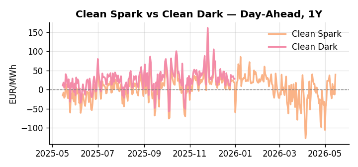
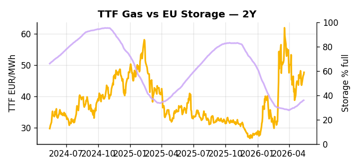

# European Cross-Commodity Risk Pack: Gas + Carbon → Power Curve Implications

**Daily desk brief — 2026-05-15**  
_Author: Sumer Sener · sumerberksener@gmail.com_  
_Generated by `scripts/generate_brief.py`. AI narrative + news themes via Anthropic Claude._

> **Data-freshness caveat:** Clean Dark (last 2025-12-31, 135d old); Coal (last 2025-12-26, 140d old). Numbers below should be read with this in mind.

## 1 · Executive summary

**TL;DR — GB Power at 93rd-percentile and Clean Spark at 92nd-percentile signal fuel-switch regime; storage 13 pp below seasonal average underpins thermal call despite Iran-war policy acceleration toward renewables.**

GB Power at the 93rd percentile (127.17 EUR/MWh) and Clean Spark at the 92nd percentile (39.29 EUR/MWh) confirm a fuel-switch regime in full effect, with the storage deficit — sitting 13 percentage points below seasonal norms at 35.85% — sustaining the thermal call and compressing any downside headroom on the front curve. EUA at 31.98 EUR/t (30th percentile) holds in the lower mid-range as the EU doubles down on aviation carbon taxation and ETS scope expansion, a slow-motion supply tightening that keeps the carbon floor anchored even as near-term price sits unextended. Shadow-fleet sanctions and Ukraine sea-drone escalation have embedded a Brent upside tail, with Russian Urals flow disruption capable of tightening the LNG arb and lifting fuel-oil substitution costs into Q3. With coal data 140 days old and clean dark spreads 135 days stale, merit-order transparency is degraded and dark spread readings are indicative not bankable — the clean spark and storage deficit remain the bankable regime signals. Gas tightness anchored by a 13 pp storage deficit AND EUA mid-range held up by aviation ETS expansion AND clean spark deep in-the-money keep the front curve in a supply-constrained thermal regime, with Hormuz tail-risk from Iranian escalation the single factor most capable of pulling front-curve risk wider before Cal+1 pricing can stabilise.

_Generated by **claude-sonnet-4-6** via Anthropic API (two-pass extract→narrate). Prompts/responses logged to `ai/logs/`._
_Next-5d temperature anomaly — DE -1.7°C / FR -2.9°C / GB -2.8°C vs 5-yr seasonal normal (Open-Meteo)._

## 2 · Monitor metrics

**Primary (cross-commodity headline tiles)**

| Metric | As of | Latest | Unit | 1d Δ | 1w Δ | 5y pctile | Headline |
|---|---|---:|---|---:|---:|---:|---|
| TTF Gas | 2026-05-14 | 47.65 | EUR/MWh | +1.57% | +1.46% | 64 | Within typical range |
| EU Storage | 2026-05-13 | 35.85 | % full | +0.36% | +3.24% | 13 | 12.9 pp below the 5-yr seasonal average |
| EUA Carbon | 2026-05-14 | 31.98 | EUR/tCO2 | +0.95% | -0.28% | 30 | Within typical range |
| DE Power | 2026-05-15 | 146.37 | EUR/MWh | +55.11% | +5.42% | 78 | Within typical range |
| GB Power | 2026-05-15 | 127.17 | EUR/MWh | +9.41% | +8.08% | 93 | 93th-percentile of 5-yr range — historically high |
| Renewables | 2026-05-14 | 49.33 | % of load | -2.81% | +45.22% | 68 | Within typical range |
| Clean Spark | 2026-05-15 | 39.29 | EUR/MWh | +52.01 | -0.44 | 92 | 92th-percentile of 5-yr range — historically high |
| Clean Dark | 2025-12-31 (STALE) | 27.95 | EUR/MWh | -0.56 | +11.63 | 50 | Within typical range |

**Fundamentals inputs** _(feed derived metrics; not separately traded)_

| Metric | As of | Latest | Unit | 1d Δ | 1w Δ | 5y pctile | Headline |
|---|---|---:|---|---:|---:|---:|---|
| Coal | 2025-12-26 (STALE) | 96.00 | USD/t | -0.57% | +0.08% | 8 | 8th-percentile of 5-yr range — historically low |

_Spreads → abs EUR/MWh deltas; others → pct. Weekly Δ uses 5d trailing means. Full history in `data/<metric>.csv`._

## 3 · Gas + LNG arb

**TTF front-month** prints at 47.65 EUR/MWh — _Within typical range_.
**EU storage** at 35.9% full (-12.9 pp vs 5-yr seasonal avg) — _12.9 pp below the 5-yr seasonal average_.
**TTF − JKM (LNG arb)** at -2.04 EUR/MWh (JKM 17.07 USD/MMBtu) — JKM richer than TTF — Asia pulls cargoes, marginal European tightening risk.

## 4 · Carbon (EU ETS)

**EUA December** prints at 31.98 EUR/tCO2 — _Within typical range_. A euro of EUA adds ~0.37 EUR/MWh to gas-fired and ~0.85 EUR/MWh to coal-fired generation cost; strength compresses the dark spread faster than the spark.

**EU vs UK ETS** — Cobblestone's emissions desk trades EUA and UKA. Post-Brexit auction reform narrowed the UKA discount to EUA from £20+/t to single-digit £/t; CBAM phase-in pulls UK compliance demand toward parity. EUA−UKA basis remains a tradable cross-market signal.

**Supply / policy signal** — _EU doubles down on carbon tax for international flights; extends ETS scope and signals tightening carbon pricing ambition._  
Side: `policy` · Polarity: `bullish EUA` · Source: Politico EU Energy

Aviation carbon-tax expansion broadens ETS footprint; signals EU commitment to carbon pricing depth; modest uplift to power via extended fuel-switch logic if aviation fuel constraints ripple into crude-to-power fuel arb.

_Surfaced from today's news flow by the AI extract pass (`ai/prompts/extract_v1.md` → `carbon_policy_signal`)._

## 5 · Power — Day-Ahead & curve

**DE day-ahead baseload** at 146.37 EUR/MWh — _Within typical range_.
**GB day-ahead baseload** at 127.17 EUR/MWh — _93th-percentile of 5-yr range — historically high_.
**DE − GB spread** at +19.20 EUR/MWh (DE premium) — drives interconnector flow direction.
**Cross-border net flows (Power Transportation):** DE↔FR -50.9 GWh (FR export); GB↔FR -85.6 GWh (FR export); NL↔DE -41.7 GWh (DE export).

**Clean spark spread** at +39.29 EUR/MWh — _92th-percentile of 5-yr range — historically high_. Bridge from gas + carbon fundamentals to gas-fired economics; sustained positive spark = TTF moves transmit directly into the power curve.

**Curve shape:** DA → W+1 → M+1 → Q+1 → Cal+1 → Cal+2 = 146 / 89 / 89 / 89 / 89 / 89 EUR/MWh — **Backwardation** (DA −Cal+1 spread +57 EUR/MWh). Forwards are seasonality projections — see Methodology.

{width=49%} {width=49%}

**This week ahead**

- **Fri** 14:30 UTC — EIA weekly natural gas storage report: US storage trajectory anchors LNG export pricing into NW Europe — direct TTF transmission.
- **Fri** — ENTSO-E weekly day-ahead volumes / system-balance summary: Reads the European generation mix in last 7d — confirms or breaks the Cal+1 thesis.
- **Tue** 08:00 UTC — AGSI+ daily storage print: First read on the week's gas injection / withdrawal pace; sets the tone for TTF curve shape.
- **Thu** — Iran escalation updates / Hormuz transit risk: Geopolitical flashpoint; direct LNG route constraint could spike Brent and TTF arb, forcing EU thermal premium higher. _(news-extracted)_

**Scenarios (24-72h | 1w horizon)**

| | Summary | TTF | DE Power |
|---|---|---:|---:|
| **Base** | Storage deficit sustains thermal dispatch; renewable policy acceleration gradual; Brent stable near $80–82/bbl. | +1-3% | ±1-2% |
| **Upside** | Shadow-fleet sanctions impact Russian Urals flows; Brent spikes to $85+, tightening LNG arb and fuel-oil substitution. | +5-8% | +8-12% |
| **Downside** | Storage refill accelerates; Portugal policy enacted early, renewables oversupply grid; demand destruction offsets geopolitical premium. | -4-6% | -6-10% |

_Illustrative, not forecasts. Magnitudes sized off historical sensitivity; AI-generated from today's extract pass._

## 6 · Today's themes

**Weather watch (next 7d)**
- **Storm · DE · Fri 15 – Sat 16 May** — peak gust 39 m/s (~141 km/h) on Sat 16 May. Wind generation likely surges Day 1, then risk of turbine cut-off if gusts exceed 25 m/s. Bearish DA early, sharp reversal possible. Watch DE-FR flow swings.
- **Storm · FR · Fri 15 – Wed 20 May** — peak gust 52 m/s (~185 km/h) on Wed 20 May. Strong wind boost to French generation; FR may export to neighbours. DA print likely below seasonal norm; watch FR-GB IFA flow toward GB.

**Watchlist (1–4 weeks)**
- EU shadow-fleet sanctions enforcement timeline and impact on Russian Urals export volumes.
- Portugal fossil-fuel reduction legislative timetable; renewable auction schedule impact.

_Risk framing — built within a discipline of clear limits and continuous monitoring; observations here are framed as risk inputs, not directional calls. Positioning decisions remain with the desk._
_Methodology + sources: **README §Methodology**. Numbers auditable via the snapshot JSONs. Rule-based / informational — not investment advice._