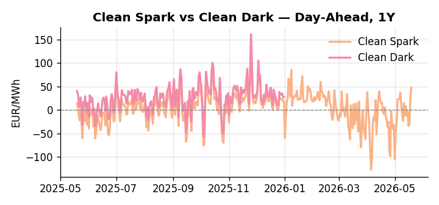
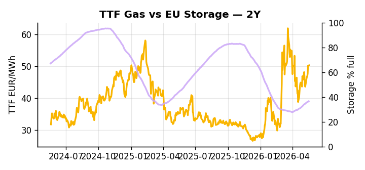

# European Cross-Commodity Risk Pack: Gas + Carbon → Power Curve Implications

**Daily desk brief — 2026-05-19**  
_Author: Sumer Sener · sumerberksener@gmail.com_  
_Generated by `scripts/generate_brief.py`. AI narrative + news themes via Anthropic Claude._

> **Data-freshness caveat:** Clean Dark (last 2025-12-31, 139d old); Coal (last 2025-12-26, 144d old). Numbers below should be read with this in mind.

## 1 · Executive summary

**TL;DR — Clean Spark at 95th percentile on gas-to-coal inversion; EU storage 13.5 pp below seasonal average tightens H2 power risk despite stale coal data and geopolitical overhang on LNG.**

Clean Spark at the 95th percentile is the dominant signal: gas-to-coal inversion is extreme, thermal merit is heavily compressed, and the dispatch stack is biased toward gas-fired generation with little headroom for marginal fuel-switch relief. EU storage sitting 13.5 percentage points below its five-year seasonal average — with only two days of data freshness on that reading — tightens H2 power fundamentals materially and is widening the Cal+1 curve into a steeper contango as the refill pace into summer disappoints. With coal data 144 days old and clean dark 139 days old, the dark spread is indicative not bankable, though the directional read — thermal margins anchored at elevated levels — is consistent with the gas-side evidence. LNG arb support to TTF is capped by record US industrial gas demand absorbing export pool capacity, while the June deadline on the Russian oil sanctions waiver keeps the Brent-to-TTF crude-gas linkage in play and front-month risk elevated. Gas tightness at the 95th-percentile spark level AND carbon mid-range AND clean-dark spreads in-the-money sustain an extended thermal-dispatch regime, but with Hormuz escalation risk reasserting via the sanctions waiver horizon, front-curve risk remains wide while renewable permitting delays keep the Cal+1 regime structurally tight.

_Generated by **claude-sonnet-4-6** via Anthropic API (two-pass extract→narrate). Prompts/responses logged to `ai/logs/`._
_Next-5d temperature anomaly — DE +2.4°C / FR +3.5°C / GB +4.2°C vs 5-yr seasonal normal (Open-Meteo)._

## 2 · Monitor metrics

**Primary (cross-commodity headline tiles)**

| Metric | As of | Latest | Unit | 1d Δ | 1w Δ | 5y pctile | Headline |
|---|---|---:|---|---:|---:|---:|---|
| TTF Gas | 2026-05-18 | 50.25 | EUR/MWh | +0.17% | +7.52% | 67 | Within typical range |
| EU Storage | 2026-05-17 | 36.56 | % full | +0.61% | +2.53% | 13 | 13.5 pp below the 5-yr seasonal average |
| EUA Carbon | 2026-05-18 | 31.95 | EUR/tCO2 | -0.29% | +0.15% | 30 | Within typical range |
| DE Power | 2026-05-19 | 159.63 | EUR/MWh | +14.95% | +14.37% | 82 | Within typical range |
| GB Power | 2026-05-19 | 107.82 | EUR/MWh | -20.18% | +6.99% | 76 | Within typical range |
| Renewables | 2026-05-18 | 33.00 | % of load | -30.84% | -9.61% | 31 | Within typical range |
| Clean Spark | 2026-05-19 | 47.37 | EUR/MWh | +20.76 | +6.48 | 95 | 95th-percentile of 5-yr range — historically high |
| Clean Dark | 2025-12-31 (STALE) | 27.95 | EUR/MWh | -0.56 | +11.63 | 50 | Within typical range |

**Fundamentals inputs** _(feed derived metrics; not separately traded)_

| Metric | As of | Latest | Unit | 1d Δ | 1w Δ | 5y pctile | Headline |
|---|---|---:|---|---:|---:|---:|---|
| Coal | 2025-12-26 (STALE) | 96.00 | USD/t | -0.57% | +0.08% | 8 | 8th-percentile of 5-yr range — historically low |

_Spreads → abs EUR/MWh deltas; others → pct. Weekly Δ uses 5d trailing means. Full history in `data/<metric>.csv`._

## 3 · Gas + LNG arb

**TTF front-month** prints at 50.25 EUR/MWh — _Within typical range_.
**EU storage** at 36.6% full (-13.5 pp vs 5-yr seasonal avg) — _13.5 pp below the 5-yr seasonal average_.
**TTF − JKM (LNG arb)** at -5.45 EUR/MWh (JKM 18.96 USD/MMBtu) — JKM richer than TTF — Asia pulls cargoes, marginal European tightening risk.

## 4 · Carbon (EU ETS)

**EUA December** prints at 31.95 EUR/tCO2 — _Within typical range_. A euro of EUA adds ~0.37 EUR/MWh to gas-fired and ~0.85 EUR/MWh to coal-fired generation cost; strength compresses the dark spread faster than the spark.

**EU vs UK ETS** — Cobblestone's emissions desk trades EUA and UKA. Post-Brexit auction reform narrowed the UKA discount to EUA from £20+/t to single-digit £/t; CBAM phase-in pulls UK compliance demand toward parity. EUA−UKA basis remains a tradable cross-market signal.

**Supply / policy signal** — _CBAM full operational phase live since 1 Jan 2026 — importers paying for embedded emissions_  
Side: `policy` · Polarity: `bullish EUA` · Source: EU Regulation 2023/956 (CBAM)

Domestic carbon-cost burden gradually levelled with imports; supports EUA demand floor as carbon leakage protection tightens through 2034.

_No ETS-relevant news surfaced today — falling back to `data/policy_facts.py` (hand-maintained structural fact pack). Fact pack last reviewed 2026-05-08 (11d ago)._

## 5 · Power — Day-Ahead & curve

**DE day-ahead baseload** at 159.63 EUR/MWh — _Within typical range_.
**GB day-ahead baseload** at 107.82 EUR/MWh — _Within typical range_.
**DE − GB spread** at +51.81 EUR/MWh (DE premium) — drives interconnector flow direction.
**Cross-border net flows (Power Transportation):** DE↔FR -48.9 GWh (FR export); GB↔FR -84.7 GWh (FR export); NL↔DE -35.3 GWh (DE export).

**Clean spark spread** at +47.37 EUR/MWh — _95th-percentile of 5-yr range — historically high_. Bridge from gas + carbon fundamentals to gas-fired economics; sustained positive spark = TTF moves transmit directly into the power curve.

**Curve shape:** DA → W+1 → M+1 → Q+1 → Cal+1 → Cal+2 = 160 / 94 / 94 / 94 / 94 / 94 EUR/MWh — **Backwardation** (DA −Cal+1 spread +66 EUR/MWh). Forwards are seasonality projections — see Methodology.

{width=49%} {width=49%}

**This week ahead**

- **Tue** 08:00 UTC — AGSI+ daily storage print: First read on the week's gas injection / withdrawal pace; sets the tone for TTF curve shape.
- **Wed** 09:00 UTC — EEX EUA primary auction (Mon–Thu daily; Wed is largest volume): Supply-side EUA signal; auction clearing relative to spot reads as ETS demand strength.
- **Wed** — ENTSO-E DE_LU + GB next-week wind/solar forecast refresh: Sets the residual-load curve a week out; outsized prints move power Cal+1 directionally.
- **Jun** — US Russian oil sanctions waiver renewal: Determines Brent-to-TTF crude pass-through and LNG netback arbitrage floor for NW Europe through H2. _(news-extracted)_

**Scenarios (1w horizon)**

| | Summary | TTF | DE Power |
|---|---|---:|---:|
| **Base** | Gas-to-coal inversion persists; storage deficit sustains elevated thermal merit; LNG arb muted by US demand and sanctions. | +2-5% | tracks |
| **Upside** | Hormuz escalation or Strait closure risk spikes; Brent rallies, lifting TTF netback and gas-to-coal spread wider; storage refill pace disappoints. | +8-12% | +5-8% |
| **Downside** | US sanctions waiver extended and Hormuz tensions ease; crude-gas linkage weakens; EU storage refill accelerates; thermal call retreats. | -5-8% | -3-6% |

_Illustrative, not forecasts. Magnitudes sized off historical sensitivity; AI-generated from today's extract pass._

## 6 · Today's themes

**Weather watch (next 7d)**
- **Storm · FR · Tue 19 – Wed 20 May** — peak gust 41 m/s (~148 km/h) on Tue 19 May. Strong wind boost to French generation; FR may export to neighbours. DA print likely below seasonal norm; watch FR-GB IFA flow toward GB.
- **Storm · GB · Tue 19 – Fri 22 May** — peak gust 53 m/s (~190 km/h) on Tue 19 May. GB wind capacity is large — DA likely soft. Cut-off risk if gusts exceed safety thresholds; opposite tail (sudden tightening) possible.

**Watchlist (1–4 weeks)**
- US Russian oil sanctions waiver renewal decision (June deadline); Strait of Hormuz escalation risk.
- EU–Italy fiscal rule carveout negotiation outcome; energy capex impact.

_Risk framing — built within a discipline of clear limits and continuous monitoring; observations here are framed as risk inputs, not directional calls. Positioning decisions remain with the desk._
_Methodology + sources: **README §Methodology**. Numbers auditable via the snapshot JSONs. Rule-based / informational — not investment advice._