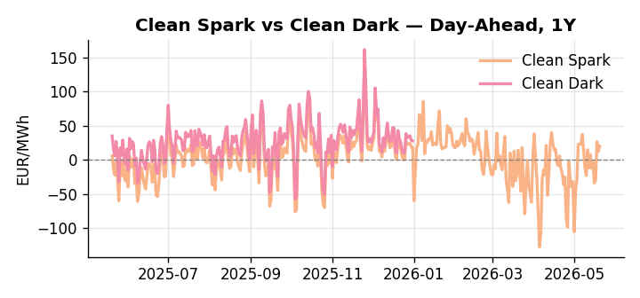
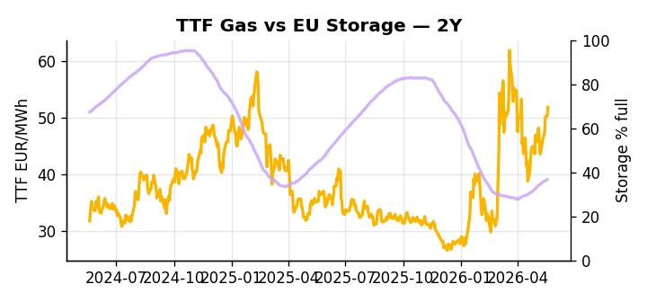

# European Cross-Commodity Risk Pack: Gas + Carbon → Power Curve Implications

**Daily desk brief — 2026-05-20**  
_Author: Sumer Sener · sumerberksener@gmail.com_  
_Generated by `scripts/generate_brief.py`. AI narrative + news themes via Anthropic Claude._

> **Data-freshness caveat:** Clean Dark (last 2025-12-31, 140d old); Coal (last 2025-12-26, 145d old). Numbers below should be read with this in mind.

## 1 · Executive summary

**TL;DR — GB power at 90th-percentile, EU storage 13.7pp below seasonal norm, and crude/LNG tightness from US sanctions extension and record US gas demand support thermal generation; coal historically cheap but stale data limits conviction.**

GB power printing at the 90th percentile and EU storage sitting 13.7 percentage points below seasonal norm — with TTF already up 28.6% on the month — define a structurally tight gas regime where the thermal baseload call is being pulled forward into summer refill season. The US sanctions waiver extension and record US industrial gas demand are compressing NW Europe's LNG import arbitrage, reinforcing the TTF floor and keeping fuel-switch economics extended across the front of the curve. EUA compliance demand is further underpinned as EU renewable permitting liberalisation stalls under the far-right–green coalition deadlock, extending gas-dependency and thermal dispatch liability through 2026–27 and acting as a slow-motion tightening of carbon supply. With coal data 145 days old at a historically cheap 8th-percentile 96 USD/t and the clean-dark spread stale by 140 days, the dark spread is indicative not bankable, and fuel-switch conviction remains limited until a data refresh. Gas tightness at the 14th-percentile storage fill AND carbon floor support from extended thermal dispatch AND compressed clean-spark headroom keep the curve in a premium thermal regime — with Hormuz escalation tail-risk the dominant geopolitical driver that, if realised, would pull front-curve risk sharply wider while leaving the Cal+1 regime anchored to structural storage and permitting constraints.

_Generated by **claude-sonnet-4-6** via Anthropic API (two-pass extract→narrate). Prompts/responses logged to `ai/logs/`._
_Next-5d temperature anomaly — DE +4.5°C / FR +6.0°C vs 5-yr seasonal normal (Open-Meteo)._

## 2 · Monitor metrics

**Primary (cross-commodity headline tiles)**

| Metric | As of | Latest | Unit | 1d Δ | 1w Δ | 5y pctile | Headline |
|---|---|---:|---|---:|---:|---:|---|
| TTF Gas | 2026-05-19 | 51.82 | EUR/MWh | +3.12% | +9.93% | 69 | Within typical range |
| EU Storage | 2026-05-18 | 36.67 | % full | +0.30% | +2.37% | 14 | 13.7 pp below the 5-yr seasonal average |
| EUA Carbon | 2026-05-19 | 31.75 | EUR/tCO2 | -0.62% | +0.44% | 28 | Within typical range |
| DE Power | 2026-05-20 | 135.39 | EUR/MWh | +5.95% | +6.15% | 75 | Within typical range |
| GB Power | 2026-05-20 | 122.71 | EUR/MWh | +10.71% | -1.56% | 90 | 90th-percentile of 5-yr range — historically high |
| Renewables | 2026-05-19 | 32.57 | % of load | -1.29% | -17.23% | 30 | Within typical range |
| Clean Spark | 2026-05-20 | 20.07 | EUR/MWh | +7.60 | -0.50 | 79 | Within typical range |
| Clean Dark | 2025-12-31 (STALE) | 27.95 | EUR/MWh | -0.56 | +11.63 | 50 | Within typical range |

**Fundamentals inputs** _(feed derived metrics; not separately traded)_

| Metric | As of | Latest | Unit | 1d Δ | 1w Δ | 5y pctile | Headline |
|---|---|---:|---|---:|---:|---:|---|
| Coal | 2025-12-26 (STALE) | 96.00 | USD/t | -0.57% | +0.08% | 8 | 8th-percentile of 5-yr range — historically low |

_Spreads → abs EUR/MWh deltas; others → pct. Weekly Δ uses 5d trailing means. Full history in `data/<metric>.csv`._

## 3 · Gas + LNG arb

**TTF front-month** prints at 51.82 EUR/MWh — _Within typical range_.
**EU storage** at 36.7% full (-13.7 pp vs 5-yr seasonal avg) — _13.7 pp below the 5-yr seasonal average_.
**TTF − JKM (LNG arb)** at -5.61 EUR/MWh (JKM 19.61 USD/MMBtu) — JKM richer than TTF — Asia pulls cargoes, marginal European tightening risk.

## 4 · Carbon (EU ETS)

**EUA December** prints at 31.75 EUR/tCO2 — _Within typical range_. A euro of EUA adds ~0.37 EUR/MWh to gas-fired and ~0.85 EUR/MWh to coal-fired generation cost; strength compresses the dark spread faster than the spark.

**EU vs UK ETS** — Cobblestone's emissions desk trades EUA and UKA. Post-Brexit auction reform narrowed the UKA discount to EUA from £20+/t to single-digit £/t; CBAM phase-in pulls UK compliance demand toward parity. EUA−UKA basis remains a tradable cross-market signal.

**Supply / policy signal** — _EU renewable permitting liberalisation stalled by far-right–green coalition; delays extend gas-dependency and lift ETS compliance demand through 2026–27._  
Side: `supply` · Polarity: `bullish EUA` · Source: Politico EU Energy

Slower renewable build extends thermal generation and gas dispatch; higher gas burn and coal avoidance increase EU power-sector ETS liability, supporting carbon price floor.

_Surfaced from today's news flow by the AI extract pass (`ai/prompts/extract_v1.md` → `carbon_policy_signal`)._

## 5 · Power — Day-Ahead & curve

**DE day-ahead baseload** at 135.39 EUR/MWh — _Within typical range_.
**GB day-ahead baseload** at 122.71 EUR/MWh — _90th-percentile of 5-yr range — historically high_.
**DE − GB spread** at +12.68 EUR/MWh (DE premium) — drives interconnector flow direction.
**Cross-border net flows (Power Transportation):** DE↔FR -53.1 GWh (FR export); GB↔FR -83.5 GWh (FR export); NL↔DE +8.6 GWh (NL export).

**Clean spark spread** at +20.07 EUR/MWh — _Within typical range_. Bridge from gas + carbon fundamentals to gas-fired economics; sustained positive spark = TTF moves transmit directly into the power curve.

**Curve shape:** DA → W+1 → M+1 → Q+1 → Cal+1 → Cal+2 = 135 / 95 / 95 / 95 / 95 / 95 EUR/MWh — **Backwardation** (DA −Cal+1 spread +41 EUR/MWh). Forwards are seasonality projections — see Methodology.

{width=49%} {width=49%}

**This week ahead**

- **Wed** 09:00 UTC — EEX EUA primary auction (Mon–Thu daily; Wed is largest volume): Supply-side EUA signal; auction clearing relative to spot reads as ETS demand strength.
- **Wed** — ENTSO-E DE_LU + GB next-week wind/solar forecast refresh: Sets the residual-load curve a week out; outsized prints move power Cal+1 directionally.
- **Fri** 14:30 UTC — EIA weekly natural gas storage report: US storage trajectory anchors LNG export pricing into NW Europe — direct TTF transmission.
- **TBD** — US sanctions policy or Hormuz closure update: Crude supply signal cascades into LNG arb and EU fuel-switch economics within 24–48h. _(news-extracted)_
- **TBD** — EU trade deal finalization vote: EUR weakness / growth signal transmits to industrial demand and power/gas curves across summer. _(news-extracted)_

**Scenarios (1w horizon)**

| | Summary | TTF | DE Power |
|---|---|---:|---:|
| **Base** | Storage deficit and LNG tightness persist; thermal margin underpins 130–140 EUR/MWh DE power; TTF 50–55 EUR/MWh. | +2-5% | +1-3% |
| **Upside** | Hormuz escalation or Suez disruption tightens crude and LNG spot pricing; US sanctions waiver expires; record US gas demand accelerates NW Europe LNG squeeze. | +8-15% | +8-12% |
| **Downside** | EU–US trade deal reduces euro and industrial demand; renewables permitting surprise acceleration cuts gas call; mild weather slows storage draw. | -5-8% | -6-10% |

_Illustrative, not forecasts. Magnitudes sized off historical sensitivity; AI-generated from today's extract pass._

## 6 · Today's themes

**Weather watch (next 7d)**
- **Storm · DE · Wed 20 – Fri 22 May** — peak gust 39 m/s (~141 km/h) on Wed 20 May. Wind generation likely surges Day 1, then risk of turbine cut-off if gusts exceed 25 m/s. Bearish DA early, sharp reversal possible. Watch DE-FR flow swings.
- **Storm · FR · Wed 20 May** — peak gust 38 m/s (~136 km/h) on Wed 20 May. Strong wind boost to French generation; FR may export to neighbours. DA print likely below seasonal norm; watch FR-GB IFA flow toward GB.

**Watchlist (1–4 weeks)**
- G7 energy ministers' next meeting; further US sanctions policy announcements on Russian oil.
- EU trade deal finalization vote; Trump auto tariff decision deadline.

_Risk framing — built within a discipline of clear limits and continuous monitoring; observations here are framed as risk inputs, not directional calls. Positioning decisions remain with the desk._
_Methodology + sources: **README §Methodology**. Numbers auditable via the snapshot JSONs. Rule-based / informational — not investment advice._