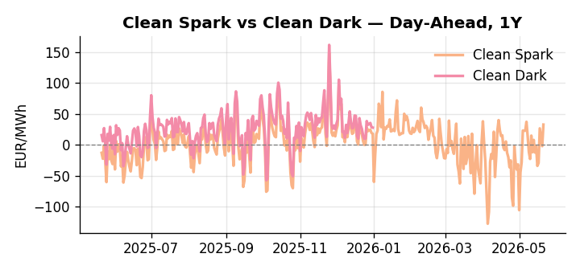
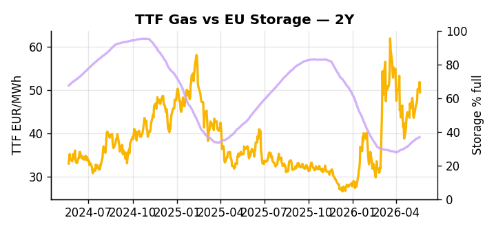

# European Cross-Commodity Risk Pack: Gas + Carbon → Power Curve Implications

**Daily desk brief — 2026-05-21**  
_Author: Sumer Sener · sumerberksener@gmail.com_  
_Generated by `scripts/generate_brief.py`. AI narrative + news themes via Anthropic Claude._

> **Data-freshness caveat:** Clean Dark (last 2025-12-31, 141d old); Coal (last 2025-12-26, 146d old). Numbers below should be read with this in mind.

## 1 · Executive summary

**TL;DR — Clean Spark at 90th-percentile driving 32% DA power rally; storage 13.8pp below seasonal raises refill risk; Hormuz/sanctions backdrop sustains geopolitical risk premium on gas-power curve.**

Clean Spark has surged to 32.78 EUR/MWh — the 90th percentile, up 64.3% on the month — making gas-fired generation the dominant marginal technology and pushing DA power some 32% higher, with the fuel-switch regime firmly locked in favour of gas over coal. EU storage at 36.82% sits 13.8 percentage points below seasonal norms at the 14th percentile, and the current +2.21% weekly refill pace is insufficient to close that gap, embedding a structural adequacy premium across the summer curve. With coal data 146 days old and clean dark spread figures 141 days stale, the dark spread reads as indicative not bankable — merit-order dispatch assumptions carry unverifiable skew and must be stress-tested against fresh ICE ARA and API2 benchmarks before layering any cross-commodity position. TTF holds the 66th percentile after a 17.87% monthly move, anchored by competing LNG demand as US industrial gas consumption approaches record highs through 2026–27, tightening seaborne availability and compressing the EU import headroom. With Hormuz tail-risk sustaining the geopolitical LNG premium, gas tightness and EUA levels leaving clean spark extended at the 90th percentile while clean dark remains unverifiable pull front-curve risk wider, and any Strait reopening that liquidates the embedded premium would be the primary threat to the current Cal+1 regime.

_Generated by **claude-sonnet-4-6** via Anthropic API (two-pass extract→narrate). Prompts/responses logged to `ai/logs/`._
_Next-5d temperature anomaly — DE +4.6°C / FR +8.3°C vs 5-yr seasonal normal (Open-Meteo)._

## 2 · Monitor metrics

**Primary (cross-commodity headline tiles)**

| Metric | As of | Latest | Unit | 1d Δ | 1w Δ | 5y pctile | Headline |
|---|---|---:|---|---:|---:|---:|---|
| TTF Gas | 2026-05-20 | 49.42 | EUR/MWh | -4.61% | +9.57% | 66 | Within typical range |
| EU Storage | 2026-05-19 | 36.82 | % full | +0.41% | +2.21% | 14 | 13.8 pp below the 5-yr seasonal average |
| EUA Carbon | 2026-05-20 | 32.00 | EUR/tCO2 | +0.78% | +0.85% | 30 | Within typical range |
| DE Power | 2026-05-21 | 143.41 | EUR/MWh | +32.03% | +22.92% | 77 | Within typical range |
| GB Power | 2026-05-21 | 112.97 | EUR/MWh | -12.60% | -3.48% | 81 | Within typical range |
| Renewables | 2026-05-20 | 44.45 | % of load | +36.46% | -11.59% | 57 | Within typical range |
| Clean Spark | 2026-05-21 | 32.78 | EUR/MWh | +34.79 | +20.67 | 90 | 90th-percentile of 5-yr range — historically high |
| Clean Dark | 2025-12-31 (STALE) | 27.95 | EUR/MWh | -0.56 | +11.63 | 50 | Within typical range |

**Fundamentals inputs** _(feed derived metrics; not separately traded)_

| Metric | As of | Latest | Unit | 1d Δ | 1w Δ | 5y pctile | Headline |
|---|---|---:|---|---:|---:|---:|---|
| Coal | 2025-12-26 (STALE) | 96.00 | USD/t | -0.57% | +0.08% | 8 | 8th-percentile of 5-yr range — historically low |

_Spreads → abs EUR/MWh deltas; others → pct. Weekly Δ uses 5d trailing means. Full history in `data/<metric>.csv`._

## 3 · Gas + LNG arb

**TTF front-month** prints at 49.42 EUR/MWh — _Within typical range_.
**EU storage** at 36.8% full (-13.8 pp vs 5-yr seasonal avg) — _13.8 pp below the 5-yr seasonal average_.
**TTF − JKM (LNG arb)** at -6.15 EUR/MWh (JKM 18.91 USD/MMBtu) — JKM richer than TTF — Asia pulls cargoes, marginal European tightening risk.

## 4 · Carbon (EU ETS)

**EUA December** prints at 32.00 EUR/tCO2 — _Within typical range_. A euro of EUA adds ~0.37 EUR/MWh to gas-fired and ~0.85 EUR/MWh to coal-fired generation cost; strength compresses the dark spread faster than the spark.

**EU vs UK ETS** — Cobblestone's emissions desk trades EUA and UKA. Post-Brexit auction reform narrowed the UKA discount to EUA from £20+/t to single-digit £/t; CBAM phase-in pulls UK compliance demand toward parity. EUA−UKA basis remains a tradable cross-market signal.

**Supply / policy signal** — _CBAM full operational phase live since 1 Jan 2026 — importers paying for embedded emissions_  
Side: `policy` · Polarity: `bullish EUA` · Source: EU Regulation 2023/956 (CBAM)

Domestic carbon-cost burden gradually levelled with imports; supports EUA demand floor as carbon leakage protection tightens through 2034.

_No ETS-relevant news surfaced today — falling back to `data/policy_facts.py` (hand-maintained structural fact pack). Fact pack last reviewed 2026-05-08 (13d ago)._

## 5 · Power — Day-Ahead & curve

**DE day-ahead baseload** at 143.41 EUR/MWh — _Within typical range_.
**GB day-ahead baseload** at 112.97 EUR/MWh — _Within typical range_.
**DE − GB spread** at +30.44 EUR/MWh (DE premium) — drives interconnector flow direction.
**Cross-border net flows (Power Transportation):** DE↔FR -49.2 GWh (FR export); GB↔FR -84.8 GWh (FR export); NL↔DE +13.6 GWh (NL export).

**Clean spark spread** at +32.78 EUR/MWh — _90th-percentile of 5-yr range — historically high_. Bridge from gas + carbon fundamentals to gas-fired economics; sustained positive spark = TTF moves transmit directly into the power curve.

**Curve shape:** DA → W+1 → M+1 → Q+1 → Cal+1 → Cal+2 = 143 / 97 / 97 / 97 / 97 / 97 EUR/MWh — **Backwardation** (DA −Cal+1 spread +47 EUR/MWh). Forwards are seasonality projections — see Methodology.

{width=49%} {width=49%}

**This week ahead**

- **Fri** 14:30 UTC — EIA weekly natural gas storage report: US storage trajectory anchors LNG export pricing into NW Europe — direct TTF transmission.
- **Thu** 14:30 UTC — US EIA weekly crude inventories: Crude — and via crack spreads, refined-products — feed back into LNG arb economics.
- **Fri** — ENTSO-E weekly day-ahead volumes / system-balance summary: Reads the European generation mix in last 7d — confirms or breaks the Cal+1 thesis.

**Scenarios (1w horizon)**

| | Summary | TTF | DE Power |
|---|---|---:|---:|
| **Base** | Clean Spark sustains 85th+ percentile on gas strength and tight storage; TTF holds 65–70th percentile; DE Power drifts 75–80th-percentile with gas. | +2-5% | +1-3% |
| **Upside** | Hormuz escalation or sanctions waiver lapse triggers Brent spike; LNG arb widens, TTF rallies. Alternatively, cold front or storage refill failure locks summer deficit premium into power curve. | +10-18% | +15-25% |
| **Downside** | Hormuz reopens or Middle East peace talks ease; Brent falls, LNG arb closes. Parallel: renewable share recovers to 65th+ percentile; Clean Spark unwinds toward 70th-percentile, dragging DE power lower. | −8-12% | −12-18% |

_Illustrative, not forecasts. Magnitudes sized off historical sensitivity; AI-generated from today's extract pass._

## 6 · Today's themes

**Weather watch (next 7d)**
- **Heat dome · FR · Thu 21 – Wed 27 May** — peak +12.5°C vs normal. Bullish FR power on AC load and possible nuclear river-cooling derating. Watch FR-nuclear availability prints if heat persists.
- **Heat dome · DE · Fri 22 – Wed 27 May** — peak +7.5°C vs normal. Mild bullish DE power on cooling load, but gas demand softens. Spark spread compresses; renewables (solar) likely strong — watch DA print fall midday.

**Watchlist (1–4 weeks)**
- Italian nuclear policy developments and legislative timelines post-Meloni announcement.
- Further US Treasury sanctions waivers on Russian oil; Strait of Hormuz shipping updates.

_Risk framing — built within a discipline of clear limits and continuous monitoring; observations here are framed as risk inputs, not directional calls. Positioning decisions remain with the desk._
_Methodology + sources: **README §Methodology**. Numbers auditable via the snapshot JSONs. Rule-based / informational — not investment advice._