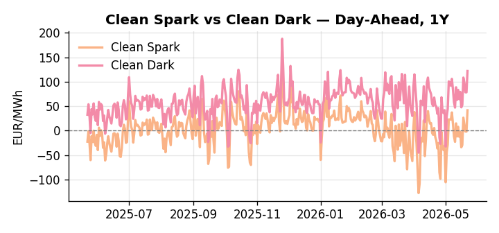
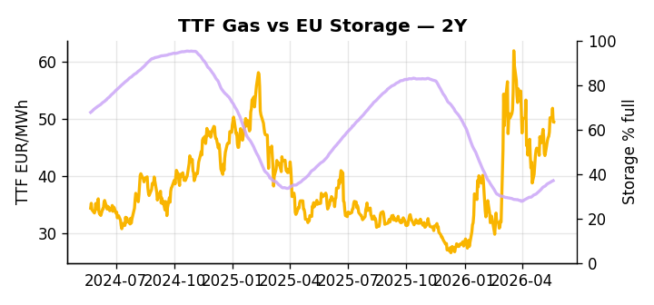

# European Cross-Commodity Risk Pack: Gas + Carbon → Power Curve Implications

**Daily desk brief — 2026-05-22**  
_Author: Sumer Sener · sumerberksener@gmail.com_  
_Generated by `scripts/generate_brief.py`. AI narrative + news themes via Anthropic Claude._

## 1 · Executive summary

**TL;DR — GB Power at 95th percentile and Clean Spark at 93rd drive thermal premium; Hormuz crisis geopolitical tail-risk elevates LNG scarcity markup on TTF and forward power curve.**

GB Power at the 95th percentile and Clean Spark at the 93rd percentile confirm a gas-to-power dispatch regime in full effect, with thermal scarcity the dominant signal across both GB and DE curves. EU storage at 36.99% — running 14 percentage points below seasonal average with daily inflow of only +0.33% — leaves refill velocity materially insufficient to build summer flexibility headroom, compounding the scarcity premium already embedded in front-month TTF. Hormuz tail-risk, with a NATO meeting Friday that could signal corridor closure or explicit sanctions, sustains a structural LNG uncertainty markup on forward power curves, making the upside scenario asymmetric relative to base. Renewable share fell 24.24% week-on-week to 42.27%, anchoring thermal dispatch duration and keeping Clean Spark in-the-money across the near curve. With Hormuz tail-risk reasserting, gas tightness at multi-year highs and the storage deficit compressed against seasonal norms pull front-curve risk wider, and with Clean Spark extended at the 93rd percentile the Cal+1 regime remains a sustained thermal premium environment until refill pace or LNG flow normalisation materially shifts the supply balance.

_Generated by **claude-sonnet-4-6** via Anthropic API (two-pass extract→narrate). Prompts/responses logged to `ai/logs/`._
_Next-5d temperature anomaly — DE +5.5°C / FR +10.2°C / GB +8.2°C vs 5-yr seasonal normal (Open-Meteo)._

## 2 · Monitor metrics

**Primary (cross-commodity headline tiles)**

| Metric | As of | Latest | Unit | 1d Δ | 1w Δ | 5y pctile | Headline |
|---|---|---:|---|---:|---:|---:|---|
| TTF Gas | 2026-05-21 | 49.41 | EUR/MWh | -0.03% | +8.39% | 66 | Within typical range |
| EU Storage | 2026-05-20 | 36.99 | % full | +0.33% | +2.38% | 14 | 14.0 pp below the 5-yr seasonal average |
| EUA Carbon | 2026-05-21 | 31.87 | EUR/tCO2 | -0.41% | +0.50% | 29 | Within typical range |
| DE Power | 2026-05-22 | 152.24 | EUR/MWh | +39.94% | +32.84% | 80 | Within typical range |
| GB Power | 2026-05-22 | 134.55 | EUR/MWh | +8.96% | +1.72% | 95 | 95th-percentile of 5-yr range — historically high |
| Renewables | 2026-05-21 | 42.27 | % of load | -4.91% | -24.24% | 52 | Within typical range |
| Clean Spark | 2026-05-22 | 41.70 | EUR/MWh | +43.45 | +32.32 | 93 | 93th-percentile of 5-yr range — historically high |
| Clean Dark | 2026-05-22 | 121.84 | EUR/MWh | +43.45 | +31.55 | 82 | Within typical range |

**Fundamentals inputs** _(feed derived metrics; not separately traded)_

| Metric | As of | Latest | Unit | 1d Δ | 1w Δ | 5y pctile | Headline |
|---|---|---:|---|---:|---:|---:|---|
| Coal | 2026-05-21 | 10.75 | USD/t | -0.32% | -0.20% | 33 | Within typical range |

_Spreads → abs EUR/MWh deltas; others → pct. Weekly Δ uses 5d trailing means. Full history in `data/<metric>.csv`._

## 3 · Gas + LNG arb

**TTF front-month** prints at 49.41 EUR/MWh — _Within typical range_.
**EU storage** at 37.0% full (-14.0 pp vs 5-yr seasonal avg) — _14.0 pp below the 5-yr seasonal average_.
**TTF − JKM (LNG arb)** at -6.12 EUR/MWh (JKM 18.92 USD/MMBtu) — JKM richer than TTF — Asia pulls cargoes, marginal European tightening risk.

## 4 · Carbon (EU ETS)

**EUA December** prints at 31.87 EUR/tCO2 — _Within typical range_. A euro of EUA adds ~0.37 EUR/MWh to gas-fired and ~0.85 EUR/MWh to coal-fired generation cost; strength compresses the dark spread faster than the spark.

**EU vs UK ETS** — Cobblestone's emissions desk trades EUA and UKA. Post-Brexit auction reform narrowed the UKA discount to EUA from £20+/t to single-digit £/t; CBAM phase-in pulls UK compliance demand toward parity. EUA−UKA basis remains a tradable cross-market signal.

**Supply / policy signal** — _CBAM full operational phase live since 1 Jan 2026 — importers paying for embedded emissions_  
Side: `policy` · Polarity: `bullish EUA` · Source: EU Regulation 2023/956 (CBAM)

Domestic carbon-cost burden gradually levelled with imports; supports EUA demand floor as carbon leakage protection tightens through 2034.

_No ETS-relevant news surfaced today — falling back to `data/policy_facts.py` (hand-maintained structural fact pack). Fact pack last reviewed 2026-05-08 (14d ago)._

## 5 · Power — Day-Ahead & curve

**DE day-ahead baseload** at 152.24 EUR/MWh — _Within typical range_.
**GB day-ahead baseload** at 134.55 EUR/MWh — _95th-percentile of 5-yr range — historically high_.
**DE − GB spread** at +17.69 EUR/MWh (DE premium) — drives interconnector flow direction.
**Cross-border net flows (Power Transportation):** DE↔FR -50.8 GWh (FR export); GB↔FR -85.6 GWh (FR export); NL↔DE -18.7 GWh (DE export).

**Clean spark spread** at +41.70 EUR/MWh — _93th-percentile of 5-yr range — historically high_. Bridge from gas + carbon fundamentals to gas-fired economics; sustained positive spark = TTF moves transmit directly into the power curve.

**Curve shape:** DA → W+1 → M+1 → Q+1 → Cal+1 → Cal+2 = 152 / 99 / 99 / 99 / 99 / 99 EUR/MWh — **Backwardation** (DA −Cal+1 spread +53 EUR/MWh). Forwards are seasonality projections — see Methodology.

{width=49%} {width=49%}

**This week ahead**

- **Fri** 14:30 UTC — EIA weekly natural gas storage report: US storage trajectory anchors LNG export pricing into NW Europe — direct TTF transmission.
- **Fri** — ENTSO-E weekly day-ahead volumes / system-balance summary: Reads the European generation mix in last 7d — confirms or breaks the Cal+1 thesis.
- **Tue** 08:00 UTC — AGSI+ daily storage print: First read on the week's gas injection / withdrawal pace; sets the tone for TTF curve shape.
- **Fri** — NATO Hormuz escalation meeting: Outcome could trigger LNG supply premium shift; monitor for explicit sanctions or corridor closure language. _(news-extracted)_

**Scenarios (1w horizon)**

| | Summary | TTF | DE Power |
|---|---|---:|---:|
| **Base** | Thermal scarcity regime holds; Hormuz volatility contained; storage refill pace stable. Power and Clean Spark remain elevated but stabilize week-on-week. | ±2-3% | ±3-5% |
| **Upside** | Hormuz closure or credible NATO escalation Friday; LNG spot cargoes reroute. TTF risk premium spikes; power forward curve extends. Cold-front demand surge. | +8-15% | +12-18% |
| **Downside** | Hormuz de-escalation or ceasefire signal; crude eases on UK sanction relaxation. Fuel-switch away from gas into power. Mild weekend weather softens demand. Storage inflow accelerates. | -5-8% | -6-10% |

_Illustrative, not forecasts. Magnitudes sized off historical sensitivity; AI-generated from today's extract pass._

## 6 · Today's themes

**Weather watch (next 7d)**
- **Heat dome · DE · Fri 22 – Tue 26 May** — peak +7.1°C vs normal. Mild bullish DE power on cooling load, but gas demand softens. Spark spread compresses; renewables (solar) likely strong — watch DA print fall midday.
- **Heat dome · FR · Fri 22 – Thu 28 May** — peak +11.4°C vs normal. Bullish FR power on AC load and possible nuclear river-cooling derating. Watch FR-nuclear availability prints if heat persists.

**Watchlist (1–4 weeks)**
- NATO Friday meeting on Strait of Hormuz; monitor escalation risk to LNG flow disruption.
- UK sanction exemption scope and duration clarification; potential crude/product market spillover.

_Risk framing — built within a discipline of clear limits and continuous monitoring; observations here are framed as risk inputs, not directional calls. Positioning decisions remain with the desk._
_Methodology + sources: **README §Methodology**. Numbers auditable via the snapshot JSONs. Rule-based / informational — not investment advice._