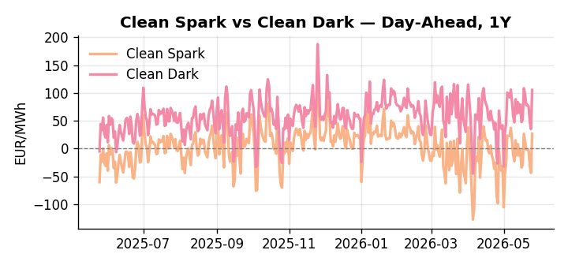
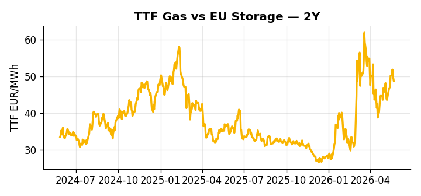

# European Cross-Commodity Risk Pack: Gas + Carbon → Power Curve Implications

**Daily desk brief — 2026-05-25**  
_Author: Sumer Sener · sumerberksener@gmail.com_  
_Generated by `scripts/generate_brief.py`. AI narrative + news themes via Anthropic Claude._

## 1 · Executive summary

**TL;DR — Quiet fundamentals mask geopolitical Hormuz tail-risk; May heatwave stress-tests summer demand, but NATO intervention signal could deflate LNG premium.**

Quiet fundamentals mask a dominant Hormuz tail-risk premium embedded in LNG spot and TTF forward curves, with a NATO security meeting Friday carrying the potential to unwind that premium by 5–10% should de-escalation sentiment firm. The May heatwave is front-loading summer cooling demand and stressing Alpine hydro, keeping DA-ID spreads elevated and intraday balancing costs extended through June, while renewables at the 73rd percentile provide only partial offset. US industrial gas demand running at a record 2026–2027 forecast pace is simultaneously compressing LNG export availability for Northwest Europe, providing structural support to the TTF winter curve even as the Hormuz narrative dominates near-term price action. The Clean Spark at the 86th percentile (26.88 EUR/MWh) confirms gas is deeply in-the-money versus coal across the prompt curve, with no carbon policy signal to shift that balance. With Hormuz tail-risk reasserting, gas tightness pulls front-curve risk wider while the Clean Spark at the 86th percentile keeps the Cal+1 regime anchored in gas-fired generation, and any Hormuz de-escalation from Friday's NATO meeting remains the single event most likely to compress spark headroom and rotate the curve regime.

_Generated by **claude-sonnet-4-6** via Anthropic API (two-pass extract→narrate). Prompts/responses logged to `ai/logs/`._
_Next-5d temperature anomaly — DE +4.2°C / FR +11.5°C vs 5-yr seasonal normal (Open-Meteo)._

## 2 · Monitor metrics

**Primary (cross-commodity headline tiles)**

| Metric | As of | Latest | Unit | 1d Δ | 1w Δ | 5y pctile | Headline |
|---|---|---:|---|---:|---:|---:|---|
| TTF Gas | 2026-05-22 | 48.68 | EUR/MWh | -1.47% | +5.02% | 65 | Within typical range |
| EU Storage | — | — | % full | — | — | — | (no data) |
| EUA Carbon | 2026-05-22 | 32.28 | EUR/tCO2 | +1.30% | +0.16% | 33 | Within typical range |
| DE Power | 2026-05-25 | 136.13 | EUR/MWh | +106.84% | -7.45% | 75 | Within typical range |
| GB Power | 2026-05-25 | 119.33 | EUR/MWh | +7.19% | -1.25% | 87 | Within typical range |
| Renewables | 2026-05-24 | 52.99 | % of load | +7.43% | +6.63% | 73 | Within typical range |
| Clean Spark | 2026-05-25 | 26.88 | EUR/MWh | +70.31 | -4.20 | 86 | Within typical range |
| Clean Dark | 2026-05-25 | 105.37 | EUR/MWh | +70.31 | -8.21 | 77 | Within typical range |

**Fundamentals inputs** _(feed derived metrics; not separately traded)_

| Metric | As of | Latest | Unit | 1d Δ | 1w Δ | 5y pctile | Headline |
|---|---|---:|---|---:|---:|---:|---|
| Coal | 2026-05-22 | 10.77 | USD/t | +0.19% | -0.26% | 34 | Within typical range |

_Spreads → abs EUR/MWh deltas; others → pct. Weekly Δ uses 5d trailing means. Full history in `data/<metric>.csv`._

## 3 · Gas + LNG arb

**TTF front-month** prints at 48.68 EUR/MWh — _Within typical range_.
**TTF − JKM (LNG arb)** at -6.55 EUR/MWh (JKM 18.81 USD/MMBtu) — JKM richer than TTF — Asia pulls cargoes, marginal European tightening risk.

## 4 · Carbon (EU ETS)

**EUA December** prints at 32.28 EUR/tCO2 — _Within typical range_. A euro of EUA adds ~0.37 EUR/MWh to gas-fired and ~0.85 EUR/MWh to coal-fired generation cost; strength compresses the dark spread faster than the spark.

**EU vs UK ETS** — Cobblestone's emissions desk trades EUA and UKA. Post-Brexit auction reform narrowed the UKA discount to EUA from £20+/t to single-digit £/t; CBAM phase-in pulls UK compliance demand toward parity. EUA−UKA basis remains a tradable cross-market signal.

**Supply / policy signal** — _CBAM full operational phase live since 1 Jan 2026 — importers paying for embedded emissions_  
Side: `policy` · Polarity: `bullish EUA` · Source: EU Regulation 2023/956 (CBAM)

Domestic carbon-cost burden gradually levelled with imports; supports EUA demand floor as carbon leakage protection tightens through 2034.

_No ETS-relevant news surfaced today — falling back to `data/policy_facts.py` (hand-maintained structural fact pack). Fact pack last reviewed 2026-05-08 (17d ago)._

## 5 · Power — Day-Ahead & curve

**DE day-ahead baseload** at 136.13 EUR/MWh — _Within typical range_.
**GB day-ahead baseload** at 119.33 EUR/MWh — _Within typical range_.
**DE − GB spread** at +16.80 EUR/MWh (DE premium) — drives interconnector flow direction.
**Cross-border net flows (Power Transportation):** DE↔FR -49.2 GWh (FR export); GB↔FR -74.7 GWh (FR export); NL↔DE -34.6 GWh (DE export).

**Clean spark spread** at +26.88 EUR/MWh — _Within typical range_. Bridge from gas + carbon fundamentals to gas-fired economics; sustained positive spark = TTF moves transmit directly into the power curve.

**Curve shape:** DA → W+1 → M+1 → Q+1 → Cal+1 → Cal+2 = 136 / 99 / 99 / 99 / 99 / 99 EUR/MWh — **Backwardation** (DA −Cal+1 spread +37 EUR/MWh). Forwards are seasonality projections — see Methodology.

{width=49%} {width=49%}

**This week ahead**

- **Tue** 08:00 UTC — AGSI+ daily storage print: First read on the week's gas injection / withdrawal pace; sets the tone for TTF curve shape.
- **Wed** 09:00 UTC — EEX EUA primary auction (Mon–Thu daily; Wed is largest volume): Supply-side EUA signal; auction clearing relative to spot reads as ETS demand strength.
- **Wed** — ENTSO-E DE_LU + GB next-week wind/solar forecast refresh: Sets the residual-load curve a week out; outsized prints move power Cal+1 directionally.
- **Fri** — NATO security meeting — Hormuz intervention signal: Outcome could trigger sharp unwind of LNG closure premium, weakening TTF spot and Cal+1 by 5–8%. _(news-extracted)_

**Scenarios (24-72h horizon)**

| | Summary | TTF | DE Power |
|---|---|---:|---:|
| **Base** | Quiet fundamentals; Hormuz premium contained; summer heatwave elevates cooling demand but renewables at 73rd pctile provide offset. | ±1-2% | ±2-3% |
| **Upside** | Hormuz escalation deepens; LNG arb tightens; heatwave hydro stress in Alps; EU policy tightening accelerates. | +8-12% | +6-10% |
| **Downside** | NATO intervention de-escalates Hormuz closure risk; LNG arb unwinds; heatwave eases by early June. | -6-10% | -5-8% |

_Illustrative, not forecasts. Magnitudes sized off historical sensitivity; AI-generated from today's extract pass._

## 6 · Today's themes

**Weather watch (next 7d)**
- **Heat dome · DE · Mon 25 – Wed 27 May** — peak +8.4°C vs normal. Mild bullish DE power on cooling load, but gas demand softens. Spark spread compresses; renewables (solar) likely strong — watch DA print fall midday.
- **Heat dome · FR · Mon 25 – Sun 31 May** — peak +12.4°C vs normal. Bullish FR power on AC load and possible nuclear river-cooling derating. Watch FR-nuclear availability prints if heat persists.

**Watchlist (1–4 weeks)**
- Strait of Hormuz disruption escalation or de-escalation; NATO meeting outcomes Friday.
- EU energy policy response announcements from Brussels ministerial debate (weeks).

_Risk framing — built within a discipline of clear limits and continuous monitoring; observations here are framed as risk inputs, not directional calls. Positioning decisions remain with the desk._
_Methodology + sources: **README §Methodology**. Numbers auditable via the snapshot JSONs. Rule-based / informational — not investment advice._