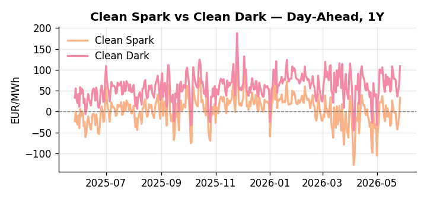
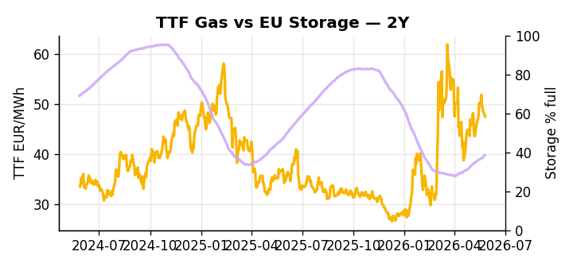

# European Cross-Commodity Risk Pack: Gas + Carbon → Power Curve Implications

**Daily desk brief — 2026-05-27**  
_Author: Sumer Sener · sumerberksener@gmail.com_  
_Generated by `scripts/generate_brief.py`. AI narrative + news themes via Anthropic Claude._

## 1 · Executive summary

**TL;DR — GB Power at 94th-percentile amid Middle East geopolitical premium and record May heat; storage 14 pp below seasonal—refill pace critical for H2 thermal call.**

GB Power at 131.09 EUR/MWh (94th-percentile) is the dominant signal this morning, amplified by Middle East conflict and an active Hormuz geopolitical premium that keeps the TTF repricing window wide open. European storage at 38.5% — 14 percentage points below seasonal norms and sitting at the 15th-percentile — locks in the thermal call through H2 and leaves refill pace as the single most consequential variable for summer generation mix. The Clean Spark Spread at the 90th-percentile confirms gas-to-power economics remain firmly in-the-money, while record May heat adds near-term cooling demand pressure and introduces asymmetric hydro risk across southern EU basins. The GB-DE spread — with GB at 131.09 EUR/MWh against DE at 140.12 EUR/MWh in an apparent inverse — points to transmission constraint or supply asymmetry that deserves close monitoring for intraday arbitrage. With Hormuz tail-risk reasserting and storage tightness extended well below seasonal, gas tightness AND a Clean Spark anchored at the 90th-percentile AND compressed dark-spread headroom pull front-curve risk wider, keeping the Cal+1 regime tilted firmly toward the thermal call.

_Generated by **claude-sonnet-4-6** via Anthropic API (two-pass extract→narrate). Prompts/responses logged to `ai/logs/`._
_Next-5d temperature anomaly — DE +3.9°C / FR +9.5°C / GB +6.6°C vs 5-yr seasonal normal (Open-Meteo)._

## 2 · Monitor metrics

**Primary (cross-commodity headline tiles)**

| Metric | As of | Latest | Unit | 1d Δ | 1w Δ | 5y pctile | Headline |
|---|---|---:|---|---:|---:|---:|---|
| TTF Gas | 2026-05-26 | 47.47 | EUR/MWh | -2.49% | +2.12% | 63 | Within typical range |
| EU Storage | 2026-05-25 | 38.52 | % full | +0.81% | +3.11% | 15 | 14.0 pp below the 5-yr seasonal average |
| EUA Carbon | 2026-05-26 | 32.99 | EUR/tCO2 | +2.19% | +0.93% | 36 | Within typical range |
| DE Power | 2026-05-27 | 140.12 | EUR/MWh | +44.03% | -21.32% | 76 | Within typical range |
| GB Power | 2026-05-27 | 131.09 | EUR/MWh | -6.92% | +1.16% | 94 | 94th-percentile of 5-yr range — historically high |
| Renewables | 2026-05-26 | 50.11 | % of load | -4.74% | +21.05% | 69 | Within typical range |
| Clean Spark | 2026-05-27 | 33.04 | EUR/MWh | +42.83 | -35.05 | 90 | 90th-percentile of 5-yr range — historically high |
| Clean Dark | 2026-05-27 | 108.76 | EUR/MWh | +42.83 | -25.72 | 78 | Within typical range |

**Fundamentals inputs** _(feed derived metrics; not separately traded)_

| Metric | As of | Latest | Unit | 1d Δ | 1w Δ | 5y pctile | Headline |
|---|---|---:|---|---:|---:|---:|---|
| Coal | 2026-05-26 | 10.80 | USD/t | +0.21% | -0.22% | 34 | Within typical range |

_Spreads → abs EUR/MWh deltas; others → pct. Weekly Δ uses 5d trailing means. Full history in `data/<metric>.csv`._

## 3 · Gas + LNG arb

**TTF front-month** prints at 47.47 EUR/MWh — _Within typical range_.
**EU storage** at 38.5% full (-14.0 pp vs 5-yr seasonal avg) — _14.0 pp below the 5-yr seasonal average_.
**TTF − JKM (LNG arb)** at -6.55 EUR/MWh (JKM 18.42 USD/MMBtu) — JKM richer than TTF — Asia pulls cargoes, marginal European tightening risk.

## 4 · Carbon (EU ETS)

**EUA December** prints at 32.99 EUR/tCO2 — _Within typical range_. A euro of EUA adds ~0.37 EUR/MWh to gas-fired and ~0.85 EUR/MWh to coal-fired generation cost; strength compresses the dark spread faster than the spark.

**EU vs UK ETS** — Cobblestone's emissions desk trades EUA and UKA. Post-Brexit auction reform narrowed the UKA discount to EUA from £20+/t to single-digit £/t; CBAM phase-in pulls UK compliance demand toward parity. EUA−UKA basis remains a tradable cross-market signal.

**Supply / policy signal** — _CBAM full operational phase live since 1 Jan 2026 — importers paying for embedded emissions_  
Side: `policy` · Polarity: `bullish EUA` · Source: EU Regulation 2023/956 (CBAM)

Domestic carbon-cost burden gradually levelled with imports; supports EUA demand floor as carbon leakage protection tightens through 2034.

_No ETS-relevant news surfaced today — falling back to `data/policy_facts.py` (hand-maintained structural fact pack). Fact pack last reviewed 2026-05-08 (19d ago)._

## 5 · Power — Day-Ahead & curve

**DE day-ahead baseload** at 140.12 EUR/MWh — _Within typical range_.
**GB day-ahead baseload** at 131.09 EUR/MWh — _94th-percentile of 5-yr range — historically high_.
**DE − GB spread** at +9.03 EUR/MWh (DE premium) — drives interconnector flow direction.
**Cross-border net flows (Power Transportation):** DE↔FR -38.0 GWh (FR export); GB↔FR -80.7 GWh (FR export); NL↔DE -30.2 GWh (DE export).

**Clean spark spread** at +33.04 EUR/MWh — _90th-percentile of 5-yr range — historically high_. Bridge from gas + carbon fundamentals to gas-fired economics; sustained positive spark = TTF moves transmit directly into the power curve.

**Curve shape:** DA → W+1 → M+1 → Q+1 → Cal+1 → Cal+2 = 140 / 102 / 102 / 102 / 102 / 102 EUR/MWh — **Backwardation** (DA −Cal+1 spread +38 EUR/MWh). Forwards are seasonality projections — see Methodology.

{width=49%} {width=49%}

**This week ahead**

- **Wed** 09:00 UTC — EEX EUA primary auction (Mon–Thu daily; Wed is largest volume): Supply-side EUA signal; auction clearing relative to spot reads as ETS demand strength.
- **Wed** — ENTSO-E DE_LU + GB next-week wind/solar forecast refresh: Sets the residual-load curve a week out; outsized prints move power Cal+1 directionally.
- **Fri** 14:30 UTC — EIA weekly natural gas storage report: US storage trajectory anchors LNG export pricing into NW Europe — direct TTF transmission.
- **late May** — NATO Strait of Hormuz security discussion: Geopolitical risk reset on LNG/crude supply; TTF curve repricing window. _(news-extracted)_
- **Q3 2026** — US pipeline capacity commissioning (44.9 Bcf/d): LNG export growth may lower TTF arbitrage and reduce EU supply scarcity premium. _(news-extracted)_

**Scenarios (24-72h | 1w horizon)**

| | Summary | TTF | DE Power |
|---|---|---:|---:|
| **Base** | Geopolitical premium holds; storage refill continues; heat-driven demand offsets mild renewable gains. | ±2-4% | ±1-3% |
| **Upside** | Hormuz escalation or Suez closure disrupts LNG supply; EU growth cuts trigger fiscal stimulus; storage injection pace falls short. | +8-15% | +6-12% |
| **Downside** | Hormuz de-escalation or Middle East ceasefire signals; US LNG exports surge; mild weather suppresses cooling demand; storage recovery accelerates. | -6-12% | -8-14% |

_Illustrative, not forecasts. Magnitudes sized off historical sensitivity; AI-generated from today's extract pass._

## 6 · Today's themes

**Weather watch (next 7d)**
- **Heat dome · FR · Wed 27 – Sat 30 May** — peak +12.2°C vs normal. Bullish FR power on AC load and possible nuclear river-cooling derating. Watch FR-nuclear availability prints if heat persists.
- **Heat dome · GB · Wed 27 – Sun 31 May** — peak +8.9°C vs normal. Modest bullish GB power on cooling demand; less heating-demand downside than continental peers (UK AC penetration is lower).

**Watchlist (1–4 weeks)**
- NATO high-level Strait of Hormuz security discussion (late May 2026); assess geopolitical oil/LNG supply risk.
- EU energy competitiveness ministerial debate in Brussels; watch for grid/market design reforms affecting EUA, forward curves.

_Risk framing — built within a discipline of clear limits and continuous monitoring; observations here are framed as risk inputs, not directional calls. Positioning decisions remain with the desk._
_Methodology + sources: **README §Methodology**. Numbers auditable via the snapshot JSONs. Rule-based / informational — not investment advice._