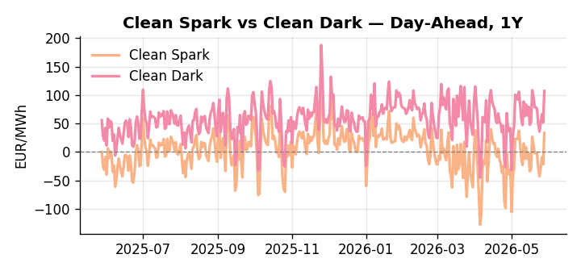
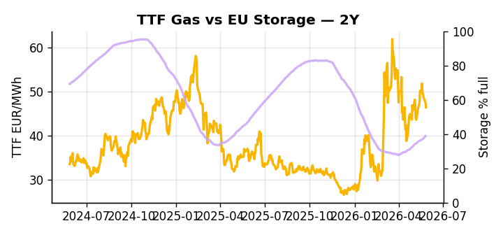

# European Cross-Commodity Risk Pack: Gas + Carbon → Power Curve Implications

**Daily desk brief — 2026-05-28**  
_Author: Sumer Sener · sumerberksener@gmail.com_  
_Generated by `scripts/generate_brief.py`. AI narrative + news themes via Anthropic Claude._

## 1 · Executive summary

**TL;DR — Clean Spark at 90th percentile on heatwave demand surge; EU storage 14 pp below seasonal average constrains summer refill—watch Hormuz escalation for TTF upside.**

Clean Spark at the 90th percentile — 33.55 EUR/MWh — is the dominant signal this morning, driven by a record May heatwave that has pushed cooling demand deep into gas-fired generation territory while EU storage sits at just 38.83% full, 14 percentage points below seasonal norm and at the 16th percentile, leaving refill headroom severely compressed. TTF holds mid-range but the storage deficit means any supply-side shock arrives into an already tight system with little buffer to absorb it. Renewables are covering 59.58% of load at the 83rd percentile, but the heat-dome regime introduces wind and solar volatility that could flip the merit order rapidly and expose the full thermal call beneath. With coal data one day old, dark spreads are indicative rather than bankable, though the clean-spark premium anchors gas firmly in-the-money for power dispatch. With Hormuz NATO stabilization talks carrying a 2–4 week tail-risk window for LNG reroute, gas tightness against a 16th-percentile storage backdrop AND front-curve clean spark extended to the 90th percentile pull front-curve risk wider, keeping the Cal+1 regime exposed to upside asymmetry should Hormuz escalation be confirmed before refill pace can close the seasonal gap.

_Generated by **claude-sonnet-4-6** via Anthropic API (two-pass extract→narrate). Prompts/responses logged to `ai/logs/`._
_Next-5d temperature anomaly — DE +3.4°C / FR +8.2°C / GB +5.3°C vs 5-yr seasonal normal (Open-Meteo)._

## 2 · Monitor metrics

**Primary (cross-commodity headline tiles)**

| Metric | As of | Latest | Unit | 1d Δ | 1w Δ | 5y pctile | Headline |
|---|---|---:|---|---:|---:|---:|---|
| TTF Gas | 2026-05-27 | 46.41 | EUR/MWh | -2.23% | -2.19% | 60 | Within typical range |
| EU Storage | 2026-05-26 | 38.83 | % full | +0.80% | +3.54% | 16 | 14.0 pp below the 5-yr seasonal average |
| EUA Carbon | 2026-05-27 | 33.22 | EUR/tCO2 | +0.69% | +1.85% | 38 | Within typical range |
| DE Power | 2026-05-28 | 138.60 | EUR/MWh | +66.08% | -12.06% | 76 | Within typical range |
| GB Power | 2026-05-28 | 120.94 | EUR/MWh | +2.25% | -0.45% | 88 | Within typical range |
| Renewables | 2026-05-27 | 59.58 | % of load | +18.90% | +39.72% | 83 | Within typical range |
| Clean Spark | 2026-05-28 | 33.55 | EUR/MWh | +55.15 | -5.19 | 90 | 90th-percentile of 5-yr range — historically high |
| Clean Dark | 2026-05-28 | 107.04 | EUR/MWh | +55.15 | -13.49 | 77 | Within typical range |

**Fundamentals inputs** _(feed derived metrics; not separately traded)_

| Metric | As of | Latest | Unit | 1d Δ | 1w Δ | 5y pctile | Headline |
|---|---|---:|---|---:|---:|---:|---|
| Coal | 2026-05-27 | 10.81 | USD/t | +0.09% | -0.12% | 34 | Within typical range |

_Spreads → abs EUR/MWh deltas; others → pct. Weekly Δ uses 5d trailing means. Full history in `data/<metric>.csv`._

## 3 · Gas + LNG arb

**TTF front-month** prints at 46.41 EUR/MWh — _Within typical range_.
**EU storage** at 38.8% full (-14.0 pp vs 5-yr seasonal avg) — _14.0 pp below the 5-yr seasonal average_.
**TTF − JKM (LNG arb)** at -7.06 EUR/MWh (JKM 18.24 USD/MMBtu) — JKM richer than TTF — Asia pulls cargoes, marginal European tightening risk.

## 4 · Carbon (EU ETS)

**EUA December** prints at 33.22 EUR/tCO2 — _Within typical range_. A euro of EUA adds ~0.37 EUR/MWh to gas-fired and ~0.85 EUR/MWh to coal-fired generation cost; strength compresses the dark spread faster than the spark.

**EU vs UK ETS** — Cobblestone's emissions desk trades EUA and UKA. Post-Brexit auction reform narrowed the UKA discount to EUA from £20+/t to single-digit £/t; CBAM phase-in pulls UK compliance demand toward parity. EUA−UKA basis remains a tradable cross-market signal.

**Supply / policy signal** — _CBAM full operational phase live since 1 Jan 2026 — importers paying for embedded emissions_  
Side: `policy` · Polarity: `bullish EUA` · Source: EU Regulation 2023/956 (CBAM)

Domestic carbon-cost burden gradually levelled with imports; supports EUA demand floor as carbon leakage protection tightens through 2034.

_No ETS-relevant news surfaced today — falling back to `data/policy_facts.py` (hand-maintained structural fact pack). Fact pack last reviewed 2026-05-08 (20d ago)._

## 5 · Power — Day-Ahead & curve

**DE day-ahead baseload** at 138.60 EUR/MWh — _Within typical range_.
**GB day-ahead baseload** at 120.94 EUR/MWh — _Within typical range_.
**DE − GB spread** at +17.66 EUR/MWh (DE premium) — drives interconnector flow direction.
**Cross-border net flows (Power Transportation):** DE↔FR -34.8 GWh (FR export); GB↔FR -76.3 GWh (FR export); NL↔DE +2.2 GWh (NL export).

**Clean spark spread** at +33.55 EUR/MWh — _90th-percentile of 5-yr range — historically high_. Bridge from gas + carbon fundamentals to gas-fired economics; sustained positive spark = TTF moves transmit directly into the power curve.

**Curve shape:** DA → W+1 → M+1 → Q+1 → Cal+1 → Cal+2 = 139 / 102 / 102 / 102 / 102 / 102 EUR/MWh — **Backwardation** (DA −Cal+1 spread +36 EUR/MWh). Forwards are seasonality projections — see Methodology.

{width=49%} {width=49%}

**This week ahead**

- **Fri** 14:30 UTC — EIA weekly natural gas storage report: US storage trajectory anchors LNG export pricing into NW Europe — direct TTF transmission.
- **Thu** 14:30 UTC — US EIA weekly crude inventories: Crude — and via crack spreads, refined-products — feed back into LNG arb economics.
- **Fri** — ENTSO-E weekly day-ahead volumes / system-balance summary: Reads the European generation mix in last 7d — confirms or breaks the Cal+1 thesis.
- **Thu** — NATO Hormuz stabilization meeting outcomes: Military intervention signals or ceasefire framework would clarify LNG supply risk; escalation escalates TTF premium. _(news-extracted)_

**Scenarios (1w horizon)**

| | Summary | TTF | DE Power |
|---|---|---:|---:|
| **Base** | Heatwave sustains Clean Spark premium; storage refill gradual. TTF holds mid-range; DE power tracks 76th pctile. | ±1–3% | tracks |
| **Upside** | Hormuz escalation or NATO intervention triggers LNG supply reroute; heatwave persists into June. Storage refill stalls. | +8–12% | +5–7% |
| **Downside** | Heatwave fades, cooling demand normalizes; storage refill accelerates. Hormuz tensions de-escalate or resolve diplomatically. | −4–6% | −3–5% |

_Illustrative, not forecasts. Magnitudes sized off historical sensitivity; AI-generated from today's extract pass._

## 6 · Today's themes

**Weather watch (next 7d)**
- **Heat dome · FR · Thu 28 – Sun 31 May** — peak +12.5°C vs normal. Bullish FR power on AC load and possible nuclear river-cooling derating. Watch FR-nuclear availability prints if heat persists.
- **Heat dome · GB · Thu 28 – Sun 31 May** — peak +8.3°C vs normal. Modest bullish GB power on cooling demand; less heating-demand downside than continental peers (UK AC penetration is lower).

**Watchlist (1–4 weeks)**
- Strait of Hormuz: NATO meeting outcomes (late May), military escalation risk.
- European heatwave: extend/fade forecast for June; hydro storage impact tracking.

_Risk framing — built within a discipline of clear limits and continuous monitoring; observations here are framed as risk inputs, not directional calls. Positioning decisions remain with the desk._
_Methodology + sources: **README §Methodology**. Numbers auditable via the snapshot JSONs. Rule-based / informational — not investment advice._