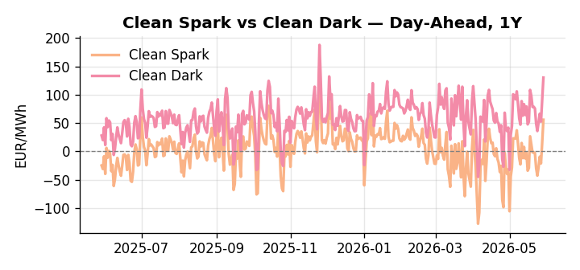
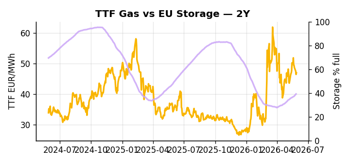

# European Cross-Commodity Risk Pack: Gas + Carbon → Power Curve Implications

**Daily desk brief — 2026-05-29**  
_Author: Sumer Sener · sumerberksener@gmail.com_  
_Generated by `scripts/generate_brief.py`. AI narrative + news themes via Anthropic Claude._

## 1 · Executive summary

**TL;DR — Clean Spark at 96th percentile, storage 14 pp below seasonal, and record heat driving thermal stress create a tight, bullish power regime; Hormuz escalation and EU strategic pivot reinforce geopolitical risk premium on fossil fuels.**

Clean Spark at the 96th percentile, underpinned by storage at 39.1% — 14 percentage points below seasonal norms — signals a structurally extended thermal merit order, with sustained AC demand from the record May heat dome keeping the gas-to-power conversion firmly in-the-money. The storage deficit is the load-bearing signal: at the 16th percentile, the refill shortfall is large enough that any slippage in June injection pace directly tightens the H2 power floor and anchors front-month TTF risk premium. EUA sits in mid-range, carrying a nascent bearish-policy tilt as the June 3 EU tech sovereignty disclosure is expected to signal renewable capex acceleration and potential MSR intake pressure via data-center emissions transparency rules — a slow-motion supply headroom signal that keeps carbon from amplifying spark upside for now. DE Power's 2.1σ extension above trend — with a single-session 32.7% jump — flags tactical extraction risk should heat moderate or renewables surge, while Friday's COP31 Turkey coordination uncertainty adds a secondary thread to ETS trajectory. With Hormuz escalation reasserting a crude and LNG arb risk premium, gas tightness AND EUA mid-range policy overhang AND clean sparks at the 96th percentile keep front-curve risk wide and the thermal-extended regime intact, leaving Cal+1 shape hostage to whether the storage deficit compounds through the refill season.

_Generated by **claude-sonnet-4-6** via Anthropic API (two-pass extract→narrate). Prompts/responses logged to `ai/logs/`._
_Next-5d temperature anomaly — DE +4.2°C / FR +6.1°C vs 5-yr seasonal normal (Open-Meteo)._

## 2 · Monitor metrics

**Primary (cross-commodity headline tiles)**

| Metric | As of | Latest | Unit | 1d Δ | 1w Δ | 5y pctile | Headline |
|---|---|---:|---|---:|---:|---:|---|
| TTF Gas | 2026-05-28 | 46.92 | EUR/MWh | +1.09% | -4.18% | 62 | Within typical range |
| EU Storage | 2026-05-27 | 39.13 | % full | +0.77% | +3.95% | 16 | 14.0 pp below the 5-yr seasonal average |
| EUA Carbon | 2026-05-28 | 33.75 | EUR/tCO2 | +1.60% | +2.75% | 42 | extended 2.1σ above the 50d trend |
| DE Power | 2026-05-29 | 162.14 | EUR/MWh | +32.74% | +16.30% | 82 | extended 2.1σ above the 50d trend |
| GB Power | 2026-05-29 | 121.28 | EUR/MWh | +30.50% | -3.33% | 88 | Within typical range |
| Renewables | 2026-05-28 | 43.62 | % of load | -26.80% | +25.86% | 55 | Within typical range |
| Clean Spark | 2026-05-29 | 55.88 | EUR/MWh | +39.99 | +38.74 | 96 | 96th-percentile of 5-yr range — historically high |
| Clean Dark | 2026-05-29 | 130.13 | EUR/MWh | +39.99 | +14.45 | 83 | extended 2.0σ above the 50d trend |

**Fundamentals inputs** _(feed derived metrics; not separately traded)_

| Metric | As of | Latest | Unit | 1d Δ | 1w Δ | 5y pctile | Headline |
|---|---|---:|---|---:|---:|---:|---|
| Coal | 2026-05-28 | 10.79 | USD/t | -0.14% | -0.16% | 34 | Within typical range |

_Spreads → abs EUR/MWh deltas; others → pct. Weekly Δ uses 5d trailing means. Full history in `data/<metric>.csv`._

## 3 · Gas + LNG arb

**TTF front-month** prints at 46.92 EUR/MWh — _Within typical range_.
**EU storage** at 39.1% full (-14.0 pp vs 5-yr seasonal avg) — _14.0 pp below the 5-yr seasonal average_.
**TTF − JKM (LNG arb)** at -6.93 EUR/MWh (JKM 18.33 USD/MMBtu) — JKM richer than TTF — Asia pulls cargoes, marginal European tightening risk.

## 4 · Carbon (EU ETS)

**EUA December** prints at 33.75 EUR/tCO2 — _extended 2.1σ above the 50d trend_. A euro of EUA adds ~0.37 EUR/MWh to gas-fired and ~0.85 EUR/MWh to coal-fired generation cost; strength compresses the dark spread faster than the spark.

**EU vs UK ETS** — Cobblestone's emissions desk trades EUA and UKA. Post-Brexit auction reform narrowed the UKA discount to EUA from £20+/t to single-digit £/t; CBAM phase-in pulls UK compliance demand toward parity. EUA−UKA basis remains a tradable cross-market signal.

**Supply / policy signal** — _EU tech sovereignty plan disclosure (June 3) expected to signal renewable capex acceleration and green industrial policy alignment; potential MSR intake signal via emissions-intensive data-center power demand disclosure rules._  
Side: `policy` · Polarity: `bearish EUA` · Source: Politico EU Energy

Sustained renewable buildout and data-center power demand clarity reduces long-term structural fuel-switching carbon intensity, pressuring EUA floor if MSR intake accelerates.

_Surfaced from today's news flow by the AI extract pass (`ai/prompts/extract_v1.md` → `carbon_policy_signal`)._

## 5 · Power — Day-Ahead & curve

**DE day-ahead baseload** at 162.14 EUR/MWh — _extended 2.1σ above the 50d trend_.
**GB day-ahead baseload** at 121.28 EUR/MWh — _Within typical range_.
**DE − GB spread** at +40.86 EUR/MWh (DE premium) — drives interconnector flow direction.
**Cross-border net flows (Power Transportation):** DE↔FR -36.6 GWh (FR export); GB↔FR -74.2 GWh (FR export); NL↔DE +10.5 GWh (NL export).

**Clean spark spread** at +55.88 EUR/MWh — _96th-percentile of 5-yr range — historically high_. Bridge from gas + carbon fundamentals to gas-fired economics; sustained positive spark = TTF moves transmit directly into the power curve.

**Curve shape:** DA → W+1 → M+1 → Q+1 → Cal+1 → Cal+2 = 162 / 107 / 107 / 107 / 107 / 107 EUR/MWh — **Backwardation** (DA −Cal+1 spread +55 EUR/MWh). Forwards are seasonality projections — see Methodology.

{width=49%} {width=49%}

**This week ahead**

- **Fri** 14:30 UTC — EIA weekly natural gas storage report: US storage trajectory anchors LNG export pricing into NW Europe — direct TTF transmission.
- **Fri** — ENTSO-E weekly day-ahead volumes / system-balance summary: Reads the European generation mix in last 7d — confirms or breaks the Cal+1 thesis.
- **Tue** 08:00 UTC — AGSI+ daily storage print: First read on the week's gas injection / withdrawal pace; sets the tone for TTF curve shape.
- **Mon** — EU tech sovereignty plan disclosure: May signal renewable capex acceleration and data-center power demand growth, supporting Cal+1 bull narrative. _(news-extracted)_
- **Fri** — COP31 Turkey host role coordination: Cyprus exclusion risk threatens climate policy alignment; uncertainty could shift EU carbon policy trajectory and ETS messaging. _(news-extracted)_

**Scenarios (24-72h horizon)**

| | Summary | TTF | DE Power |
|---|---|---:|---:|
| **Base** | Record heat sustains AC demand and thermal dispatch; storage deficit maintains power premium and fuel-switch backdrop. | ±1-2% | ±3-5% |
| **Upside** | Hormuz escalation or crude spike; storage refill delays through June; renewables miss on forecast. TTF rises via LNG arb tightening; thermal stays extended. | +6-12% | +8-15% |
| **Downside** | Heat moderates mid-week; renewable output surge (wind/solar); storage refill accelerates; Hormuz tensions ease. TTF soft; thermal margin compresses. | -4-8% | -6-12% |

_Illustrative, not forecasts. Magnitudes sized off historical sensitivity; AI-generated from today's extract pass._

## 6 · Today's themes

**Weather watch (next 7d)**
- **Heat dome · FR · Fri 29 – Sun 31 May** — peak +12.1°C vs normal. Bullish FR power on AC load and possible nuclear river-cooling derating. Watch FR-nuclear availability prints if heat persists.
- **Storm · DE · Sat 30 – Mon 01 Jun** — peak gust 42 m/s (~153 km/h) on Sat 30 May. Wind generation likely surges Day 1, then risk of turbine cut-off if gusts exceed 25 m/s. Bearish DA early, sharp reversal possible. Watch DE-FR flow swings.

**Watchlist (1–4 weeks)**
- EU tech sovereignty plan disclosure June 3; potential renewable capex stimulus.
- Turkey COP31 host role (Cyprus exclusion risk); climate policy coordination uncertainty.

_Risk framing — built within a discipline of clear limits and continuous monitoring; observations here are framed as risk inputs, not directional calls. Positioning decisions remain with the desk._
_Methodology + sources: **README §Methodology**. Numbers auditable via the snapshot JSONs. Rule-based / informational — not investment advice._