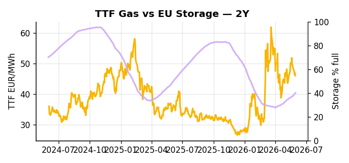

# European Cross-Commodity Risk Pack: Gas + Carbon → Power Curve Implications

**Daily desk brief — 2026-06-01**  
_Author: Sumer Sener · sumerberksener@gmail.com_  
_Generated by `scripts/generate_brief.py`. AI narrative + news themes via Anthropic Claude._

## 1 · Executive summary

**TL;DR — GB Power at 91st-percentile on tight supply; EU storage 14pp below seasonal norm signals H2 thermal call and EUA upside despite July review risk.**

GB Power is printing at the 91st percentile (125.9 EUR/MWh, up 5.8% on the day), the dominant signal, with EU storage sitting 14 percentage points below seasonal norms at 40.09% full — a structural deficit that backstops the H2 thermal call and keeps gas tightness extended into the refill season. EUA at 33.6 EUR/t (+9% MoM) holds its scarcity premium heading into the July 2026 Commission review, though Poland's signalled political resistance to ambition level and exemption scope introduces a bearish-EUA policy overhang that could erode 8–12% of that premium if the review widens Member State opt-outs. The US LNG export ramp of 44.9 Bcf/d planned for 2026–27 remains the medium-term arb compression threat, with TTF headroom at risk of narrowing to 2–4 EUR/MWh on the front-end and flattening the Cal+1 curve shape. With gas tightness anchored by a storage deficit that leaves summer refill pace as the critical variable, EUA compressed between scarcity support and Poland-led review risk, and clean spreads in-the-money on elevated GB power, the front-curve regime stays tight — though the Cal+1 regime faces a slow-motion flattening as LNG supply builds and carbon policy ambiguity widens.

_Generated by **claude-sonnet-4-6** via Anthropic API (two-pass extract→narrate). Prompts/responses logged to `ai/logs/`._
_Next-5d temperature anomaly — DE +0.4°C / FR +0.5°C / GB +0.9°C vs 5-yr seasonal normal (Open-Meteo)._

## 2 · Monitor metrics

**Primary (cross-commodity headline tiles)**

| Metric | As of | Latest | Unit | 1d Δ | 1w Δ | 5y pctile | Headline |
|---|---|---:|---|---:|---:|---:|---|
| TTF Gas | 2026-05-29 | 46.00 | EUR/MWh | -1.96% | -6.20% | 60 | Within typical range |
| EU Storage | 2026-05-30 | 40.09 | % full | +0.88% | +4.24% | 17 | 14.0 pp below the 5-yr seasonal average |
| EUA Carbon | 2026-05-29 | 33.60 | EUR/tCO2 | -0.44% | +3.90% | 40 | Within typical range |
| DE Power | — | — | EUR/MWh | — | — | — | (no data) |
| GB Power | 2026-06-01 | 125.90 | EUR/MWh | +5.82% | -6.86% | 91 | 91th-percentile of 5-yr range — historically high |
| Renewables | — | — | % of load | — | — | — | (no data) |
| Clean Spark | — | — | EUR/MWh | — | — | — | (no data) |
| Clean Dark | — | — | EUR/MWh | — | — | — | (no data) |

**Fundamentals inputs** _(feed derived metrics; not separately traded)_

| Metric | As of | Latest | Unit | 1d Δ | 1w Δ | 5y pctile | Headline |
|---|---|---:|---|---:|---:|---:|---|
| Coal | 2026-05-29 | 10.80 | USD/t | +0.07% | +0.00% | 34 | Within typical range |

_Spreads → abs EUR/MWh deltas; others → pct. Weekly Δ uses 5d trailing means. Full history in `data/<metric>.csv`._

## 3 · Gas + LNG arb

**TTF front-month** prints at 46.00 EUR/MWh — _Within typical range_.
**EU storage** at 40.1% full (-14.0 pp vs 5-yr seasonal avg) — _14.0 pp below the 5-yr seasonal average_.
**TTF − JKM (LNG arb)** at -7.58 EUR/MWh (JKM 18.30 USD/MMBtu) — JKM richer than TTF — Asia pulls cargoes, marginal European tightening risk.

## 4 · Carbon (EU ETS)

**EUA December** prints at 33.60 EUR/tCO2 — _Within typical range_. A euro of EUA adds ~0.37 EUR/MWh to gas-fired and ~0.85 EUR/MWh to coal-fired generation cost; strength compresses the dark spread faster than the spark.

**EU vs UK ETS** — Cobblestone's emissions desk trades EUA and UKA. Post-Brexit auction reform narrowed the UKA discount to EUA from £20+/t to single-digit £/t; CBAM phase-in pulls UK compliance demand toward parity. EUA−UKA basis remains a tradable cross-market signal.

**Supply / policy signal** — _EU ETS review by Commission scheduled July 2026; Poland signals political resistance to ambition level and exemption scope._  
Side: `policy` · Polarity: `bearish EUA` · Source: Politico EU Energy

Review outcome signals ambition trajectory; Poland coalition risk suggests widened exemptions or Member State opt-outs, reducing EUA scarcity premium and flattening power generation marginal cost curve.

_Surfaced from today's news flow by the AI extract pass (`ai/prompts/extract_v1.md` → `carbon_policy_signal`)._

## 5 · Power — Day-Ahead & curve

**GB day-ahead baseload** at 125.90 EUR/MWh — _91th-percentile of 5-yr range — historically high_.

**This week ahead**

- **Tue** 08:00 UTC — AGSI+ daily storage print: First read on the week's gas injection / withdrawal pace; sets the tone for TTF curve shape.
- **Wed** 09:00 UTC — EEX EUA primary auction (Mon–Thu daily; Wed is largest volume): Supply-side EUA signal; auction clearing relative to spot reads as ETS demand strength.
- **Wed** — ENTSO-E DE_LU + GB next-week wind/solar forecast refresh: Sets the residual-load curve a week out; outsized prints move power Cal+1 directionally.
- **Jul** — EU ETS Review (Commission): EUA front-month and Cal+1 volatility; Poland signals political cap-raising risk. _(news-extracted)_
- **Jun** — COP31 (Turkey host): Cyprus row may delay carbon policy consensus; signals EUA curve sentiment shift. _(news-extracted)_

**Scenarios (1w horizon)**

| | Summary | TTF | DE Power |
|---|---|---:|---:|
| **Base** | GB power normalizes on renewable recovery; storage refill steady; EUA trades ahead of July review. | ±1–2% | tracks |
| **Upside** | Cold snap or renewable curtailment extends GB spike; storage refill disappoints. EUA rallies 6–8% pre-review on supply risk. | +3–5% | +8–12% |
| **Downside** | Renewables surge; GB interconnect capacity returns; EU storage catches seasonal norm. EUA dips 5–7% on Poland coalition weakness. | -2–4% | -10–15% |

_Illustrative, not forecasts. Magnitudes sized off historical sensitivity; AI-generated from today's extract pass._

## 6 · Today's themes

**Weather watch (next 7d)**
- **Storm · GB · Mon 01 – Fri 05 Jun** — peak gust 55 m/s (~199 km/h) on Wed 03 Jun. GB wind capacity is large — DA likely soft. Cut-off risk if gusts exceed safety thresholds; opposite tail (sudden tightening) possible.
- **Storm · FR · Tue 02 – Sun 07 Jun** — peak gust 54 m/s (~196 km/h) on Sat 06 Jun. Strong wind boost to French generation; FR may export to neighbours. DA print likely below seasonal norm; watch FR-GB IFA flow toward GB.

**Watchlist (1–4 weeks)**
- EU ETS review by Commission, July 2026: EUA curve volatility risk.
- POLITICO Energy and Climate Forum outcomes: energy security and climate policy momentum signals.

_Risk framing — built within a discipline of clear limits and continuous monitoring; observations here are framed as risk inputs, not directional calls. Positioning decisions remain with the desk._
_Methodology + sources: **README §Methodology**. Numbers auditable via the snapshot JSONs. Rule-based / informational — not investment advice._