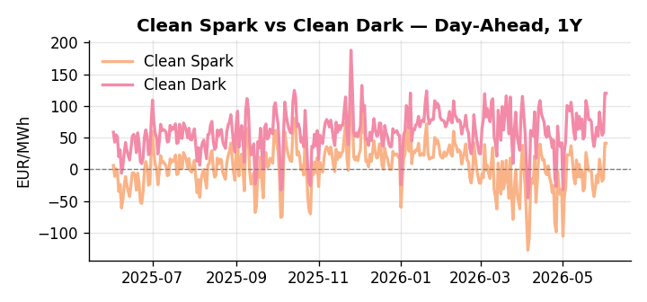
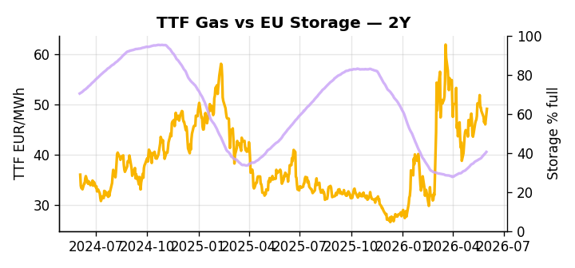

# European Cross-Commodity Risk Pack: Gas + Carbon → Power Curve Implications

**Daily desk brief — 2026-06-02**  
_Author: Sumer Sener · sumerberksener@gmail.com_  
_Generated by `scripts/generate_brief.py`. AI narrative + news themes via Anthropic Claude._

## 1 · Executive summary

**TL;DR — Clean Spark at 93rd percentile (41.24 EUR/MWh) amid 13.9pp storage deficit signals sustained thermal-dispatch premium; EU-US trade accord vote June 16 adds LNG cost repricing risk.**

Clean Spark at the 93rd percentile (41.24 EUR/MWh) is the dominant signal: storage sitting 13.9 percentage points below seasonal norm at just 40.48% full has kept thermal dispatch firmly in-the-money, compressing renewable headroom that is itself running at the 35th percentile following a 16.17% daily drop. GB Power at 124.85 EUR/MWh (90th percentile) alongside DE Power at the 80th percentile confirms the continental merit-order is extended, with interconnect stress amplifying the front-month premium rather than relieving it. EUA at the 39th percentile holds mid-range for now, though the EU ETS review launched by the Commission in July — with Poland vocal in opposition to any carbon price floor or tighter supply cap — creates regulatory overhang that leaves the forward curve exposed to bullish repricing if a floor is formally tabled. The June 16 EU-US trade accord vote adds a live repricing risk on LNG import tariffs, with TTF-HH arb and fuel-switch economics directly in the crosshairs should tariff terms tighten. Gas tightness anchored by a structural storage deficit AND EUA mid-range shadowed by ETS policy uncertainty AND clean spreads extended to the 93rd percentile keep the front-curve regime firmly thermal-led, while the June 16 trade accord vote on LNG tariffs is the single event most capable of repricing front-curve risk before the week is out.

_Generated by **claude-sonnet-4-6** via Anthropic API (two-pass extract→narrate). Prompts/responses logged to `ai/logs/`._
_Next-5d temperature anomaly — DE +0.4°C / FR +0.7°C vs 5-yr seasonal normal (Open-Meteo)._

## 2 · Monitor metrics

**Primary (cross-commodity headline tiles)**

| Metric | As of | Latest | Unit | 1d Δ | 1w Δ | 5y pctile | Headline |
|---|---|---:|---|---:|---:|---:|---|
| TTF Gas | 2026-06-01 | 49.09 | EUR/MWh | +6.72% | -5.48% | 65 | Within typical range |
| EU Storage | 2026-05-31 | 40.48 | % full | +0.97% | +4.20% | 17 | 13.9 pp below the 5-yr seasonal average |
| EUA Carbon | 2026-06-01 | 33.44 | EUR/tCO2 | -0.48% | +4.47% | 39 | Within typical range |
| DE Power | 2026-06-02 | 151.73 | EUR/MWh | -0.09% | +28.70% | 80 | Within typical range |
| GB Power | 2026-06-02 | 124.85 | EUR/MWh | -0.20% | +4.13% | 90 | 90th-percentile of 5-yr range — historically high |
| Renewables | 2026-06-01 | 34.63 | % of load | -16.17% | -15.47% | 35 | Within typical range |
| Clean Spark | 2026-06-02 | 41.24 | EUR/MWh | -0.14 | +26.53 | 93 | 93th-percentile of 5-yr range — historically high |
| Clean Dark | 2026-06-02 | 119.98 | EUR/MWh | -0.14 | +25.43 | 81 | Within typical range |

**Fundamentals inputs** _(feed derived metrics; not separately traded)_

| Metric | As of | Latest | Unit | 1d Δ | 1w Δ | 5y pctile | Headline |
|---|---|---:|---|---:|---:|---:|---|
| Coal | 2026-06-01 | 10.81 | USD/t | +0.09% | +0.18% | 34 | Within typical range |

_Spreads → abs EUR/MWh deltas; others → pct. Weekly Δ uses 5d trailing means. Full history in `data/<metric>.csv`._

## 3 · Gas + LNG arb

**TTF front-month** prints at 49.09 EUR/MWh — _Within typical range_.
**EU storage** at 40.5% full (-13.9 pp vs 5-yr seasonal avg) — _13.9 pp below the 5-yr seasonal average_.
**TTF − JKM (LNG arb)** at -5.64 EUR/MWh (JKM 18.68 USD/MMBtu) — JKM richer than TTF — Asia pulls cargoes, marginal European tightening risk.

## 4 · Carbon (EU ETS)

**EUA December** prints at 33.44 EUR/tCO2 — _Within typical range_. A euro of EUA adds ~0.37 EUR/MWh to gas-fired and ~0.85 EUR/MWh to coal-fired generation cost; strength compresses the dark spread faster than the spark.

**EU vs UK ETS** — Cobblestone's emissions desk trades EUA and UKA. Post-Brexit auction reform narrowed the UKA discount to EUA from £20+/t to single-digit £/t; CBAM phase-in pulls UK compliance demand toward parity. EUA−UKA basis remains a tradable cross-market signal.

**Supply / policy signal** — _EU ETS review launched by Commission in July; Poland vocal opposition signals member-state resistance to carbon price floor or tighter supply cap._  
Side: `policy` · Polarity: `neutral` · Source: Politico EU Energy

Regulatory uncertainty on MSR, supply cap, or sectoral tightening creates forward EUA curve volatility; carbon at 39th pctile exposed to bullish repricing if floor is tabled.

_Surfaced from today's news flow by the AI extract pass (`ai/prompts/extract_v1.md` → `carbon_policy_signal`)._

## 5 · Power — Day-Ahead & curve

**DE day-ahead baseload** at 151.73 EUR/MWh — _Within typical range_.
**GB day-ahead baseload** at 124.85 EUR/MWh — _90th-percentile of 5-yr range — historically high_.
**DE − GB spread** at +26.88 EUR/MWh (DE premium) — drives interconnector flow direction.
**Cross-border net flows (Power Transportation):** DE↔FR -68.2 GWh (FR export); GB↔FR -85.7 GWh (FR export); NL↔DE +7.2 GWh (NL export).

**Clean spark spread** at +41.24 EUR/MWh — _93th-percentile of 5-yr range — historically high_. Bridge from gas + carbon fundamentals to gas-fired economics; sustained positive spark = TTF moves transmit directly into the power curve.

**Curve shape:** DA → W+1 → M+1 → Q+1 → Cal+1 → Cal+2 = 152 / 108 / 108 / 108 / 108 / 108 EUR/MWh — **Backwardation** (DA −Cal+1 spread +44 EUR/MWh). Forwards are seasonality projections — see Methodology.

{width=49%} {width=49%}

**This week ahead**

- **Tue** 08:00 UTC — AGSI+ daily storage print: First read on the week's gas injection / withdrawal pace; sets the tone for TTF curve shape.
- **Wed** 09:00 UTC — EEX EUA primary auction (Mon–Thu daily; Wed is largest volume): Supply-side EUA signal; auction clearing relative to spot reads as ETS demand strength.
- **Wed** — ENTSO-E DE_LU + GB next-week wind/solar forecast refresh: Sets the residual-load curve a week out; outsized prints move power Cal+1 directionally.
- **Mon** — EU ETS review (July) signal watch: Commission regulatory direction on carbon floor/cap tightening affects forward EUA curve and power dispatch incentives. _(news-extracted)_
- **Mon** — EU-US trade accord final vote: June 16 plenary vote on tariff terms reshapes LNG import cost, TTF-HH spread, and power-gas fuel-switch slope. _(news-extracted)_

**Scenarios (24-72h | 1w horizon)**

| | Summary | TTF | DE Power |
|---|---|---:|---:|
| **Base** | Storage deficit sustains thermal premium; Clean Spark holds 90th+ pctile absent renewable rebound or demand softening. | +2-4% | tracks |
| **Upside** | EU-US trade accord vote (June 16) narrows LNG tariffs; shadow-fleet sanctions persist, lifting crude-to-power arb; storage refill pace weak — thermal dispatch stays elevated. | +5-8% | +3-6% |
| **Downside** | Renewable share rebounds sharply (wind/solar forecast >60th pctile); storage injection accelerates above seasonal; trade accord delays or softens tariff terms. | -4-6% | -5-8% |

_Illustrative, not forecasts. Magnitudes sized off historical sensitivity; AI-generated from today's extract pass._

## 6 · Today's themes

**Weather watch (next 7d)**
- **Storm · DE · Tue 02 – Fri 05 Jun** — peak gust 48 m/s (~171 km/h) on Thu 04 Jun. Wind generation likely surges Day 1, then risk of turbine cut-off if gusts exceed 25 m/s. Bearish DA early, sharp reversal possible. Watch DE-FR flow swings.
- **Storm · FR · Tue 02 – Fri 05 Jun** — peak gust 71 m/s (~255 km/h) on Thu 04 Jun. Strong wind boost to French generation; FR may export to neighbours. DA print likely below seasonal norm; watch FR-GB IFA flow toward GB.

**Watchlist (1–4 weeks)**
- EU ETS review launch by Commission, July 2026 — regulatory direction on carbon floor/cap tightening.
- EU-US trade accord final plenary vote, June 16 — tariff/LNG import cost repricing trigger.

_Risk framing — built within a discipline of clear limits and continuous monitoring; observations here are framed as risk inputs, not directional calls. Positioning decisions remain with the desk._
_Methodology + sources: **README §Methodology**. Numbers auditable via the snapshot JSONs. Rule-based / informational — not investment advice._