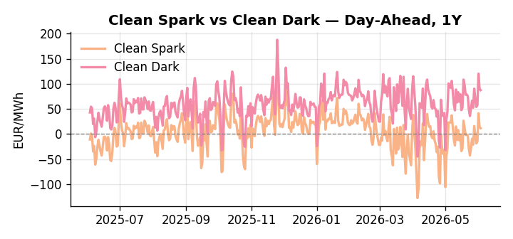
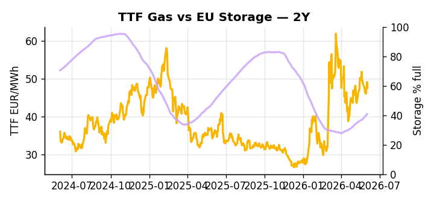

# European Cross-Commodity Risk Pack: Gas + Carbon → Power Curve Implications

**Daily desk brief — 2026-06-03**  
_Author: Sumer Sener · sumerberksener@gmail.com_  
_Generated by `scripts/generate_brief.py`. AI narrative + news themes via Anthropic Claude._

## 1 · Executive summary

**TL;DR — GB Power at 90th percentile; EU storage 14pp below seasonal norm signals tight thermal dispatch into summer amid El Niño heat risk.**

GB Power at the 90th percentile (125.28 EUR/MWh versus DE at 119.1, 68th percentile) is the dominant signal, with EU storage sitting at 40.76% — a 14-percentage-point deficit at the 17th percentile with only four weeks to peak refill — leaving thermal dispatch headroom compressed and summer margin thin. The GB premium over DE points to localized supply tightness or an interconnect binding, and any nuclear or wind outage would extend that differential further into the front-month. EUA at 33.34 EUR/t (39th percentile) holds mid-range as the July Commission ETS review and Polish political opposition to the carbon framework create bidirectional volatility, a slow-motion policy signal that could reprice the power-carbon merit order through floor/ceiling or scope adjustments without yet delivering structural repricing. El Niño heat risk cascades into a gas call that keeps TTF anchored to the upper end of the summer curve, while the June 16 EU trade accord vote — carrying a proposed 10% forced-labor levy — adds sentiment drag to LNG capex and Cal+1 investment positioning. With the June 16 EU-US tariff vote asserting front-curve risk, gas tightness at storage's 17th percentile AND EUA mid-range policy uncertainty AND clean spreads compressed by the GB-DE differential keep the front-month regime extended while Cal+1 stability remains contingent on the ETS review outcome.

_Generated by **claude-sonnet-4-6** via Anthropic API (two-pass extract→narrate). Prompts/responses logged to `ai/logs/`._
_Next-5d temperature anomaly — DE -0.1°C / FR +1.9°C vs 5-yr seasonal normal (Open-Meteo)._

## 2 · Monitor metrics

**Primary (cross-commodity headline tiles)**

| Metric | As of | Latest | Unit | 1d Δ | 1w Δ | 5y pctile | Headline |
|---|---|---:|---|---:|---:|---:|---|
| TTF Gas | 2026-06-02 | 47.61 | EUR/MWh | -3.02% | -4.36% | 63 | Within typical range |
| EU Storage | 2026-06-01 | 40.76 | % full | +0.69% | +4.14% | 17 | 14.0 pp below the 5-yr seasonal average |
| EUA Carbon | 2026-06-02 | 33.34 | EUR/tCO2 | -0.30% | +4.01% | 39 | Within typical range |
| DE Power | 2026-06-03 | 119.10 | EUR/MWh | -2.14% | +16.35% | 68 | Within typical range |
| GB Power | 2026-06-03 | 125.28 | EUR/MWh | -4.96% | +5.25% | 90 | 90th-percentile of 5-yr range — historically high |
| Renewables | 2026-06-02 | 42.00 | % of load | +21.30% | -14.23% | 50 | Within typical range |
| Clean Spark | 2026-06-03 | 11.62 | EUR/MWh | -2.61 | +17.34 | 68 | Within typical range |
| Clean Dark | 2026-06-03 | 87.43 | EUR/MWh | -2.61 | +15.72 | 69 | Within typical range |

**Fundamentals inputs** _(feed derived metrics; not separately traded)_

| Metric | As of | Latest | Unit | 1d Δ | 1w Δ | 5y pctile | Headline |
|---|---|---:|---|---:|---:|---:|---|
| Coal | 2026-06-02 | 10.80 | USD/t | -0.05% | +0.22% | 34 | Within typical range |

_Spreads → abs EUR/MWh deltas; others → pct. Weekly Δ uses 5d trailing means. Full history in `data/<metric>.csv`._

## 3 · Gas + LNG arb

**TTF front-month** prints at 47.61 EUR/MWh — _Within typical range_.
**EU storage** at 40.8% full (-14.0 pp vs 5-yr seasonal avg) — _14.0 pp below the 5-yr seasonal average_.
**TTF − JKM (LNG arb)** at -6.97 EUR/MWh (JKM 18.61 USD/MMBtu) — JKM richer than TTF — Asia pulls cargoes, marginal European tightening risk.

## 4 · Carbon (EU ETS)

**EUA December** prints at 33.34 EUR/tCO2 — _Within typical range_. A euro of EUA adds ~0.37 EUR/MWh to gas-fired and ~0.85 EUR/MWh to coal-fired generation cost; strength compresses the dark spread faster than the spark.

**EU vs UK ETS** — Cobblestone's emissions desk trades EUA and UKA. Post-Brexit auction reform narrowed the UKA discount to EUA from £20+/t to single-digit £/t; CBAM phase-in pulls UK compliance demand toward parity. EUA−UKA basis remains a tradable cross-market signal.

**Supply / policy signal** — _ETS review due July; Poland criticizes 'insane' EU climate policy framework; watch for floor/ceiling and scope tweaks affecting EUA trading ranges and power-carbon spark._  
Side: `policy` · Polarity: `neutral` · Source: Politico EU Energy

July Commission ETS reset will reshape carbon price signal and power-generation merit order; Polish political pushback signals possible supply-side adjustments affecting EUA volatility and thermal-baseload economics.

_Surfaced from today's news flow by the AI extract pass (`ai/prompts/extract_v1.md` → `carbon_policy_signal`)._

## 5 · Power — Day-Ahead & curve

**DE day-ahead baseload** at 119.10 EUR/MWh — _Within typical range_.
**GB day-ahead baseload** at 125.28 EUR/MWh — _90th-percentile of 5-yr range — historically high_.
**DE − GB spread** at -6.18 EUR/MWh (GB premium) — drives interconnector flow direction.
**Cross-border net flows (Power Transportation):** DE↔FR -70.3 GWh (FR export); GB↔FR -72.8 GWh (FR export); NL↔DE -27.0 GWh (DE export).

**Clean spark spread** at +11.62 EUR/MWh — _Within typical range_. Bridge from gas + carbon fundamentals to gas-fired economics; sustained positive spark = TTF moves transmit directly into the power curve.

**Curve shape:** DA → W+1 → M+1 → Q+1 → Cal+1 → Cal+2 = 119 / 105 / 105 / 105 / 105 / 105 EUR/MWh — **Backwardation** (DA −Cal+1 spread +14 EUR/MWh). Forwards are seasonality projections — see Methodology.

{width=49%} {width=49%}

**This week ahead**

- **Wed** 09:00 UTC — EEX EUA primary auction (Mon–Thu daily; Wed is largest volume): Supply-side EUA signal; auction clearing relative to spot reads as ETS demand strength.
- **Wed** — ENTSO-E DE_LU + GB next-week wind/solar forecast refresh: Sets the residual-load curve a week out; outsized prints move power Cal+1 directionally.
- **Fri** 14:30 UTC — EIA weekly natural gas storage report: US storage trajectory anchors LNG export pricing into NW Europe — direct TTF transmission.
- **Mon** — EU trade accord final vote (June 16): Tariff escalation enactment risk; 10% forced-labor levy could disrupt LNG capex sentiment and Cal+1 curve volatility. _(news-extracted)_
- **TBD** — July ETS review publication: Carbon supply/policy reset; watch for floor/ceiling tweaks affecting EUA pricing and power-carbon spark around merit-order threshold. _(news-extracted)_

**Scenarios (1w horizon)**

| | Summary | TTF | DE Power |
|---|---|---:|---:|
| **Base** | GB tightness persists; storage deficit slowly tightens through June. TTF and DE Power stable around current levels. | ±1-3% | ±1-3% |
| **Upside** | El Niño heat intensifies; European hydropower disappoints; US LNG export tightness diverts fewer cargoes. Cooling demand surge. | +8-12% | +6-10% |
| **Downside** | Trade accord vote defers tariff escalation; EU-US tensions ease. El Niño forecasts weaken; cooler weather reduces AC load. | -6-9% | -5-8% |

_Illustrative, not forecasts. Magnitudes sized off historical sensitivity; AI-generated from today's extract pass._

## 6 · Today's themes

**Weather watch (next 7d)**
- **Storm · DE · Wed 03 – Fri 05 Jun** — peak gust 44 m/s (~158 km/h) on Thu 04 Jun. Wind generation likely surges Day 1, then risk of turbine cut-off if gusts exceed 25 m/s. Bearish DA early, sharp reversal possible. Watch DE-FR flow swings.
- **Storm · FR · Wed 03 – Tue 09 Jun** — peak gust 56 m/s (~203 km/h) on Sat 06 Jun. Strong wind boost to French generation; FR may export to neighbours. DA print likely below seasonal norm; watch FR-GB IFA flow toward GB.

**Watchlist (1–4 weeks)**
- June 16: EU trade accord final plenary vote; assess tariff escalation impact on LNG/green capex.
- July: Commission ETS review publication; watch for floor/ceiling, scope changes (potential EUA spike).

_Risk framing — built within a discipline of clear limits and continuous monitoring; observations here are framed as risk inputs, not directional calls. Positioning decisions remain with the desk._
_Methodology + sources: **README §Methodology**. Numbers auditable via the snapshot JSONs. Rule-based / informational — not investment advice._