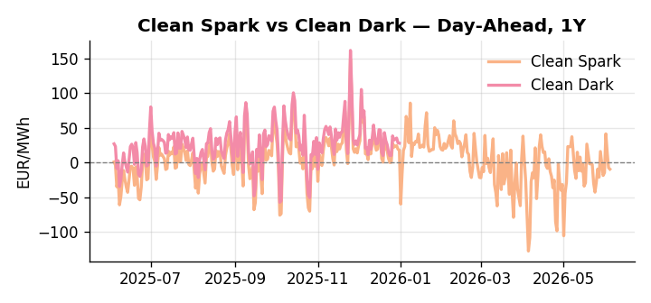
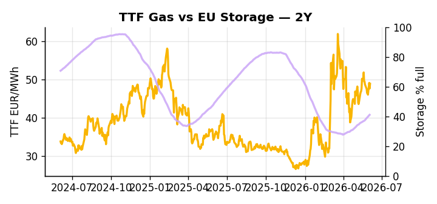

# European Cross-Commodity Risk Pack: Gas + Carbon → Power Curve Implications

**Daily desk brief — 2026-06-04**  
_Author: Sumer Sener · sumerberksener@gmail.com_  
_Generated by `scripts/generate_brief.py`. AI narrative + news themes via Anthropic Claude._

> **Data-freshness caveat:** Clean Dark (last 2025-12-31, 155d old); Coal (last 2025-12-26, 160d old). Numbers below should be read with this in mind.

## 1 · Executive summary

**TL;DR — GB Power at 7th-percentile (48.23 EUR/MWh) amid 53% renewable share; EU storage 14 pp below seasonal drives summer margin risk; coal/dark spreads historically compressed.**

GB Power has collapsed to the 7th percentile at 48.23 EUR/MWh as a 53% renewable share — itself at the 74th percentile — saturates the grid, compressing peak margins and keeping curtailment and negative-pricing tail-risk live. EU storage at 41% full, sitting 14 percentage points below the five-year seasonal norm (17th percentile), means the June refill pace is the critical variable for summer baseload arbitrage and any miss tightens Aug/Sept and lifts Cal+1 power. EUA at 33.30 EUR/t (39th percentile) holds mid-range for now, though Poland's political pressure on cap and free-allowance rules ahead of the July 2026 Commission ETS review introduces a slow-motion re-pricing risk across the forward carbon curve. With coal data 160 days stale and the clean-dark spread 155 days old, the 49th-percentile dark spread read at 27.95 EUR/MWh is indicative not bankable, and coal's historically compressed 7th-percentile position may shift fast if gas or storage dynamics reprice the merit order. Gas tightness anchored by the EU storage deficit AND EUA mid-range clouded by July 2026 review risk AND clean-dark spreads neutral-to-compressed keep the curve in a renewable-suppressed front-month regime, with the EU–Trump trade vote on June 16 the live geopolitical trigger that could widen front-curve risk if tariff escalation feeds into power input costs.

_Generated by **claude-sonnet-4-6** via Anthropic API (two-pass extract→narrate). Prompts/responses logged to `ai/logs/`._
_Next-5d temperature anomaly — DE -0.0°C / GB -1.0°C vs 5-yr seasonal normal (Open-Meteo)._

## 2 · Monitor metrics

**Primary (cross-commodity headline tiles)**

| Metric | As of | Latest | Unit | 1d Δ | 1w Δ | 5y pctile | Headline |
|---|---|---:|---|---:|---:|---:|---|
| TTF Gas | 2026-06-03 | 48.86 | EUR/MWh | +2.64% | -1.21% | 65 | Within typical range |
| EU Storage | 2026-06-02 | 41.03 | % full | +0.66% | +4.12% | 17 | 14.1 pp below the 5-yr seasonal average |
| EUA Carbon | 2026-06-03 | 33.30 | EUR/tCO2 | -0.13% | +3.12% | 39 | Within typical range |
| DE Power | 2026-06-04 | 100.55 | EUR/MWh | -1.87% | +14.97% | 52 | Within typical range |
| GB Power | 2026-06-04 | 48.23 | EUR/MWh | -57.24% | -9.44% | 7 | 7th-percentile of 5-yr range — historically low |
| Renewables | 2026-06-03 | 53.18 | % of load | +26.62% | -10.35% | 74 | Within typical range |
| Clean Spark | 2026-06-04 | -9.43 | EUR/MWh | -1.91 | +13.07 | 40 | Within typical range |
| Clean Dark | 2025-12-31 (STALE) | 27.95 | EUR/MWh | -0.56 | +11.63 | 49 | Within typical range |

**Fundamentals inputs** _(feed derived metrics; not separately traded)_

| Metric | As of | Latest | Unit | 1d Δ | 1w Δ | 5y pctile | Headline |
|---|---|---:|---|---:|---:|---:|---|
| Coal | 2025-12-26 (STALE) | 96.00 | USD/t | -0.57% | +0.08% | 7 | 7th-percentile of 5-yr range — historically low |

_Spreads → abs EUR/MWh deltas; others → pct. Weekly Δ uses 5d trailing means. Full history in `data/<metric>.csv`._

## 3 · Gas + LNG arb

**TTF front-month** prints at 48.86 EUR/MWh — _Within typical range_.
**EU storage** at 41.0% full (-14.1 pp vs 5-yr seasonal avg) — _14.1 pp below the 5-yr seasonal average_.
**TTF − JKM (LNG arb)** at -6.38 EUR/MWh (JKM 18.82 USD/MMBtu) — JKM richer than TTF — Asia pulls cargoes, marginal European tightening risk.

## 4 · Carbon (EU ETS)

**EUA December** prints at 33.30 EUR/tCO2 — _Within typical range_. A euro of EUA adds ~0.37 EUR/MWh to gas-fired and ~0.85 EUR/MWh to coal-fired generation cost; strength compresses the dark spread faster than the spark.

**EU vs UK ETS** — Cobblestone's emissions desk trades EUA and UKA. Post-Brexit auction reform narrowed the UKA discount to EUA from £20+/t to single-digit £/t; CBAM phase-in pulls UK compliance demand toward parity. EUA−UKA basis remains a tradable cross-market signal.

**Supply / policy signal** — _EU ETS Commission review scheduled July 2026; Poland political pressure on cap and allowance rules ahead of formal review; potential trigger for free-allowance expansion or cap-loosening._  
Side: `policy` · Polarity: `neutral` · Source: Politico EU Energy

EUA forward curve at risk if July review signals cap expansion or free-allowance loosening; could re-price carbon-cost embedded in power merit order and dark spreads into H2 2026.

_Surfaced from today's news flow by the AI extract pass (`ai/prompts/extract_v1.md` → `carbon_policy_signal`)._

## 5 · Power — Day-Ahead & curve

**DE day-ahead baseload** at 100.55 EUR/MWh — _Within typical range_.
**GB day-ahead baseload** at 48.23 EUR/MWh — _7th-percentile of 5-yr range — historically low_.
**DE − GB spread** at +52.32 EUR/MWh (DE premium) — drives interconnector flow direction.
**Cross-border net flows (Power Transportation):** DE↔FR -62.2 GWh (FR export); GB↔FR -61.1 GWh (FR export); NL↔DE -11.7 GWh (DE export).

**Clean spark spread** at -9.43 EUR/MWh — _Within typical range_. Bridge from gas + carbon fundamentals to gas-fired economics; sustained positive spark = TTF moves transmit directly into the power curve.

**Curve shape:** DA → W+1 → M+1 → Q+1 → Cal+1 → Cal+2 = 101 / 103 / 103 / 103 / 103 / 103 EUR/MWh — **Contango** (DA −Cal+1 spread -2 EUR/MWh). Forwards are seasonality projections — see Methodology.

{width=49%} {width=49%}

**This week ahead**

- **Fri** 14:30 UTC — EIA weekly natural gas storage report: US storage trajectory anchors LNG export pricing into NW Europe — direct TTF transmission.
- **Thu** 14:30 UTC — US EIA weekly crude inventories: Crude — and via crack spreads, refined-products — feed back into LNG arb economics.
- **Fri** — ENTSO-E weekly day-ahead volumes / system-balance summary: Reads the European generation mix in last 7d — confirms or breaks the Cal+1 thesis.
- **Mon** — EU–Trump trade vote (Jun 16): Tariff escalation risk feeds transatlantic cost inflation → power input costs _(news-extracted)_
- **Mon** — EU ETS review (Jul 2026): Political consensus on cap/MSR/allowances critical for Q3–Q4 curve re-pricing _(news-extracted)_

**Scenarios (24-72h | 1w horizon)**

| | Summary | TTF | DE Power |
|---|---|---:|---:|
| **Base** | Renewable-led suppression of GB/DE DA continues; EU storage refill steady; TTF stable mid-60s; EUA holds 33–34 EUR/t ahead of July review. | ±1-3% | ±2-4% |
| **Upside** | El Niño heat wave drives summer cooling demand; Alpine/Nordic hydro shortfall tightens intraday baseload; storage refill falters into July. | +5-8% | +8-12% |
| **Downside** | US LNG capex ramp increases global supply; Henry Hub soft; TTF arbitrage widens; renewable wind/solar persistence sustains DA suppression; AI demand flattening extends. | -4-7% | -6-10% |

_Illustrative, not forecasts. Magnitudes sized off historical sensitivity; AI-generated from today's extract pass._

## 6 · Today's themes

**Weather watch (next 7d)**
- **Storm · DE · Thu 04 – Fri 05 Jun** — peak gust 50 m/s (~181 km/h) on Thu 04 Jun. Wind generation likely surges Day 1, then risk of turbine cut-off if gusts exceed 25 m/s. Bearish DA early, sharp reversal possible. Watch DE-FR flow swings.
- **Storm · GB · Thu 04 – Wed 10 Jun** — peak gust 58 m/s (~209 km/h) on Sat 06 Jun. GB wind capacity is large — DA likely soft. Cut-off risk if gusts exceed safety thresholds; opposite tail (sudden tightening) possible.

**Watchlist (1–4 weeks)**
- EU–Trump trade deal plenary vote: June 16. Tariff escalation risk → transatlantic cost inflation → power input costs.
- EU ETS Commission review: July 2026. Political consensus on carbon price target / cap tightening / MSR rules critical for Q3–Q4 curve.

_Risk framing — built within a discipline of clear limits and continuous monitoring; observations here are framed as risk inputs, not directional calls. Positioning decisions remain with the desk._
_Methodology + sources: **README §Methodology**. Numbers auditable via the snapshot JSONs. Rule-based / informational — not investment advice._