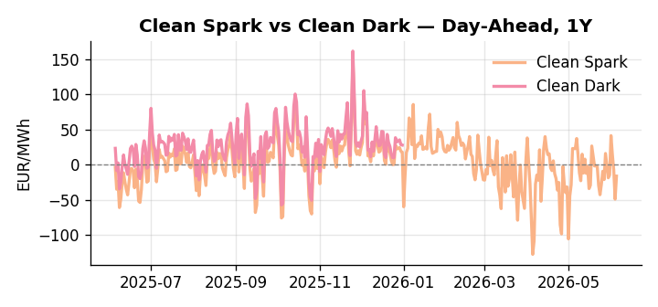
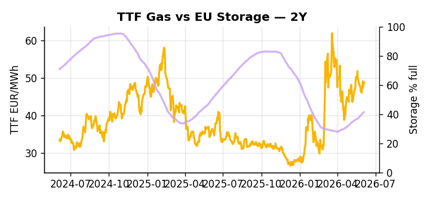

# European Cross-Commodity Risk Pack: Gas + Carbon → Power Curve Implications

**Daily desk brief — 2026-06-05**  
_Author: Sumer Sener · sumerberksener@gmail.com_  
_Generated by `scripts/generate_brief.py`. AI narrative + news themes via Anthropic Claude._

> **Data-freshness caveat:** Clean Dark (last 2025-12-31, 156d old); Coal (last 2025-12-26, 161d old). Numbers below should be read with this in mind.

## 1 · Executive summary

**TL;DR — Renewables at 97th-percentile crush merit order; storage 14 pp below seasonal average sets H2 refill urgency amid demand surge from AI and peak-shaving compression.**

Renewables at the 97th percentile — covering 80.2% of load — are the dominant regime signal this morning, crushing the spot merit order and compressing peak-to-off-peak DA spreads as AI-driven demand-side response flattens residual-load volatility further. The storage deficit is the countervailing tightness: EU facilities sit at just 41.25% full, 14.2 percentage points below the five-year seasonal norm (17th percentile), making the summer refill race the primary lever for H2 power and TTF curve shape. EUA positioning carries its own overhang, with the July Commission review set to revisit the EUA floor price, free allocation rules, and carbon-leakage provisions amid Polish criticism — a slow-motion supply and cost uncertainty that clouds Q3 roll exposure on the carbon side. With coal and clean-dark spread data respectively 161 and 156 days stale, the dark spread is indicative not bankable and merit-order ranking should be treated as directional only pending a data refresh. Gas tightness from the storage deficit AND EUA mid-range regulatory uncertainty ahead of the July review AND clean spreads compressed by record renewable penetration keep the front-curve anchored in a renewable-suppression regime, with Russian sanctions tail-risk the sole catalyst capable of extending TTF front-month materially and reopening front-curve risk.

_Generated by **claude-sonnet-4-6** via Anthropic API (two-pass extract→narrate). Prompts/responses logged to `ai/logs/`._
_Next-5d temperature anomaly — DE +0.5°C / GB -1.4°C vs 5-yr seasonal normal (Open-Meteo)._

## 2 · Monitor metrics

**Primary (cross-commodity headline tiles)**

| Metric | As of | Latest | Unit | 1d Δ | 1w Δ | 5y pctile | Headline |
|---|---|---:|---|---:|---:|---:|---|
| TTF Gas | 2026-06-04 | 48.75 | EUR/MWh | -0.23% | +0.59% | 65 | Within typical range |
| EU Storage | 2026-06-03 | 41.25 | % full | +0.54% | +4.07% | 17 | 14.2 pp below the 5-yr seasonal average |
| EUA Carbon | 2026-06-03 | 33.30 | EUR/tCO2 | -0.13% | +3.12% | 39 | Within typical range |
| DE Power | 2026-06-05 | 93.68 | EUR/MWh | +53.75% | +9.51% | 45 | Within typical range |
| GB Power | 2026-06-05 | 76.85 | EUR/MWh | +58.88% | -13.41% | 22 | Within typical range |
| Renewables | 2026-06-04 | 80.20 | % of load | +50.80% | -2.37% | 97 | 97th-percentile of 5-yr range — historically high |
| Clean Spark | 2026-06-05 | -16.08 | EUR/MWh | +32.75 | +6.21 | 34 | Within typical range |
| Clean Dark | 2025-12-31 (STALE) | 27.95 | EUR/MWh | -0.56 | +11.63 | 49 | Within typical range |

**Fundamentals inputs** _(feed derived metrics; not separately traded)_

| Metric | As of | Latest | Unit | 1d Δ | 1w Δ | 5y pctile | Headline |
|---|---|---:|---|---:|---:|---:|---|
| Coal | 2025-12-26 (STALE) | 96.00 | USD/t | -0.57% | +0.08% | 7 | 7th-percentile of 5-yr range — historically low |

_Spreads → abs EUR/MWh deltas; others → pct. Weekly Δ uses 5d trailing means. Full history in `data/<metric>.csv`._

## 3 · Gas + LNG arb

**TTF front-month** prints at 48.75 EUR/MWh — _Within typical range_.
**EU storage** at 41.2% full (-14.2 pp vs 5-yr seasonal avg) — _14.2 pp below the 5-yr seasonal average_.
**TTF − JKM (LNG arb)** at -6.40 EUR/MWh (JKM 18.76 USD/MMBtu) — JKM richer than TTF — Asia pulls cargoes, marginal European tightening risk.

## 4 · Carbon (EU ETS)

**EUA December** prints at 33.30 EUR/tCO2 — _Within typical range_. A euro of EUA adds ~0.37 EUR/MWh to gas-fired and ~0.85 EUR/MWh to coal-fired generation cost; strength compresses the dark spread faster than the spark.

**EU vs UK ETS** — Cobblestone's emissions desk trades EUA and UKA. Post-Brexit auction reform narrowed the UKA discount to EUA from £20+/t to single-digit £/t; CBAM phase-in pulls UK compliance demand toward parity. EUA−UKA basis remains a tradable cross-market signal.

**Supply / policy signal** — _EU ETS review scheduled July; Commission to revisit EUA floor price, free allocation rules, and carbon-leakage provisions amid Poland criticism._  
Side: `policy` · Polarity: `neutral` · Source: Politico EU Energy

July policy review creates near-term regulatory uncertainty on fossil-fuel dispatch marginal cost and EUA curve shape; Q3 roll risk for desk positioning.

_Surfaced from today's news flow by the AI extract pass (`ai/prompts/extract_v1.md` → `carbon_policy_signal`)._

## 5 · Power — Day-Ahead & curve

**DE day-ahead baseload** at 93.68 EUR/MWh — _Within typical range_.
**GB day-ahead baseload** at 76.85 EUR/MWh — _Within typical range_.
**DE − GB spread** at +16.83 EUR/MWh (DE premium) — drives interconnector flow direction.
**Cross-border net flows (Power Transportation):** DE↔FR -62.3 GWh (FR export); GB↔FR -51.4 GWh (FR export); NL↔DE -14.1 GWh (DE export).

**Clean spark spread** at -16.08 EUR/MWh — _Within typical range_. Bridge from gas + carbon fundamentals to gas-fired economics; sustained positive spark = TTF moves transmit directly into the power curve.

**Curve shape:** DA → W+1 → M+1 → Q+1 → Cal+1 → Cal+2 = 94 / 99 / 99 / 99 / 99 / 99 EUR/MWh — **Contango** (DA −Cal+1 spread -6 EUR/MWh). Forwards are seasonality projections — see Methodology.

{width=49%} {width=49%}

**This week ahead**

- **Fri** 14:30 UTC — EIA weekly natural gas storage report: US storage trajectory anchors LNG export pricing into NW Europe — direct TTF transmission.
- **Fri** — ENTSO-E weekly day-ahead volumes / system-balance summary: Reads the European generation mix in last 7d — confirms or breaks the Cal+1 thesis.
- **Tue** 08:00 UTC — AGSI+ daily storage print: First read on the week's gas injection / withdrawal pace; sets the tone for TTF curve shape.
- **Jun** — EU trade deal final vote: Tariff outcome will signal transatlantic LNG flow risk and crude-linked gas arb sensitivity. _(news-extracted)_
- **Jul** — Commission ETS review: EUA floor, free allocation, and carbon-leakage rules revision; high desk relevance for Q3 curve positioning. _(news-extracted)_

**Scenarios (1w horizon)**

| | Summary | TTF | DE Power |
|---|---|---:|---:|
| **Base** | Renewables suppress DA spreads; storage refill steady; TTF grinds near 50 EUR/MWh; DE power at median. | ±1-2% | tracks |
| **Upside** | Geopolitical oil shock (Russian sanctions tightening) lifts Brent; crude-linked LNG contracts push TTF +5–8%; storage refill defers into H2. | +5-8% | +6-10% |
| **Downside** | Mild weather, strong renewables ramp, and fiscal-driven capex acceleration compress power prices; storage fills ahead of schedule; TTF slides. | -4-6% | -8-12% |

_Illustrative, not forecasts. Magnitudes sized off historical sensitivity; AI-generated from today's extract pass._

## 6 · Today's themes

**Weather watch (next 7d)**
- **Storm · GB · Fri 05 – Thu 11 Jun** — peak gust 55 m/s (~198 km/h) on Sat 06 Jun. GB wind capacity is large — DA likely soft. Cut-off risk if gusts exceed safety thresholds; opposite tail (sudden tightening) possible.
- **Storm · DE · Sun 07 – Tue 09 Jun** — peak gust 45 m/s (~161 km/h) on Sun 07 Jun. Wind generation likely surges Day 1, then risk of turbine cut-off if gusts exceed 25 m/s. Bearish DA early, sharp reversal possible. Watch DE-FR flow swings.

**Watchlist (1–4 weeks)**
- EU trade deal final plenary vote June 16; monitor tariff outcome risk to transatlantic LNG flows.
- Commission ETS review expected July; watch EUA floor price and free allocation policy changes.

_Risk framing — built within a discipline of clear limits and continuous monitoring; observations here are framed as risk inputs, not directional calls. Positioning decisions remain with the desk._
_Methodology + sources: **README §Methodology**. Numbers auditable via the snapshot JSONs. Rule-based / informational — not investment advice._