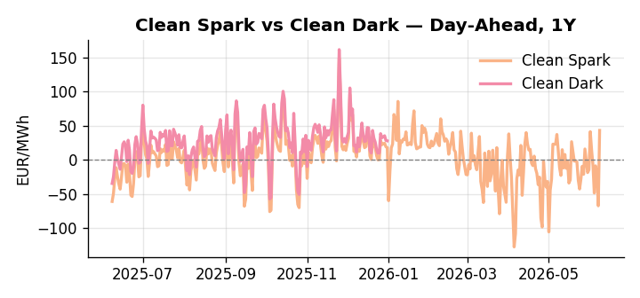
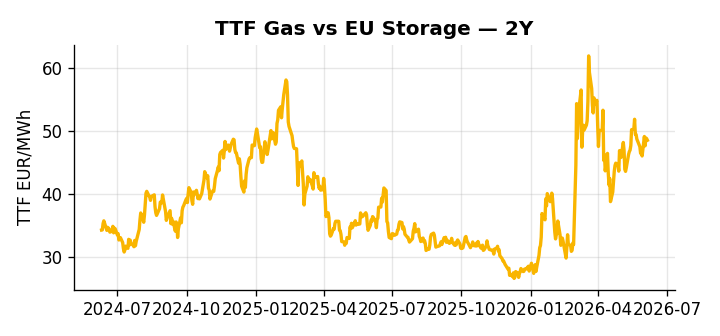

# European Cross-Commodity Risk Pack: Gas + Carbon → Power Curve Implications

**Daily desk brief — 2026-06-08**  
_Author: Sumer Sener · sumerberksener@gmail.com_  
_Generated by `scripts/generate_brief.py`. AI narrative + news themes via Anthropic Claude._

> **Data-freshness caveat:** Clean Dark (last 2025-12-31, 159d old); Coal (last 2025-12-26, 164d old). Numbers below should be read with this in mind.

## 1 · Executive summary

**TL;DR — Clean Spark at 94th percentile on structural EU power demand surge from AI/industry; renewables at 93rd percentile offset by shipping-driven LNG risk and China sanctions friction.**

Clean Spark at the 94th percentile (43.16 EUR/MWh, with a +110 EUR/MWh daily move flagged) is the dominant signal, driven by a structural AI and industrial demand surge competing for electrons against renewables covering 70.34% of load — itself a 93rd-percentile reading that would ordinarily compress spark margins but is being overwhelmed by demand-side pressure. Coal sits at the 7th percentile (96 USD/t), anchoring the fuel-switch regime firmly in favour of gas and keeping thermal displacement extended, though with coal data 164 days old and the clean dark 159 days stale, the dark spread is indicative not bankable. LNG reliability is the key headroom constraint: EU-China sanctions escalation and shipping disruption threaten cargo economics, with spot premiums of 20–30% creating TTF arbitrage upside that could tighten front-month gas markets further. German power printed at 152.12 EUR/MWh (80th percentile) on a +263% daily move, a dislocation not yet reconciled to fundamentals and warranting close watching for intraday spread widening. With EU-China sanctions friction reasserting supply-chain risk across LNG and renewable capex simultaneously, gas tightness AND EUA absent a policy anchor AND clean spark in-the-money at historic highs pull front-curve risk wider, while coal depression and renewable build momentum leave the Cal+1 regime suspended between extended clean-spark support and the unresolved threat of green capacity delay.

_Generated by **claude-sonnet-4-6** via Anthropic API (two-pass extract→narrate). Prompts/responses logged to `ai/logs/`._
_Next-5d temperature anomaly — DE -1.4°C / GB -2.8°C vs 5-yr seasonal normal (Open-Meteo)._

## 2 · Monitor metrics

**Primary (cross-commodity headline tiles)**

| Metric | As of | Latest | Unit | 1d Δ | 1w Δ | 5y pctile | Headline |
|---|---|---:|---|---:|---:|---:|---|
| TTF Gas | 2026-06-05 | 48.50 | EUR/MWh | -0.53% | +3.11% | 64 | Within typical range |
| EU Storage | — | — | % full | — | — | — | (no data) |
| EUA Carbon | 2026-06-05 | 32.51 | EUR/tCO2 | -1.72% | -0.11% | 34 | Within typical range |
| DE Power | 2026-06-08 | 152.12 | EUR/MWh | +263.53% | -19.59% | 80 | Within typical range |
| GB Power | 2026-06-08 | 114.46 | EUR/MWh | +143.37% | -31.58% | 80 | Within typical range |
| Renewables | 2026-06-07 | 70.34 | % of load | +74.99% | +35.18% | 93 | 93th-percentile of 5-yr range — historically high |
| Clean Spark | 2026-06-08 | 43.16 | EUR/MWh | +110.28 | -23.40 | 94 | 94th-percentile of 5-yr range — historically high |
| Clean Dark | 2025-12-31 (STALE) | 27.95 | EUR/MWh | -0.56 | +11.63 | 49 | Within typical range |

**Fundamentals inputs** _(feed derived metrics; not separately traded)_

| Metric | As of | Latest | Unit | 1d Δ | 1w Δ | 5y pctile | Headline |
|---|---|---:|---|---:|---:|---:|---|
| Coal | 2025-12-26 (STALE) | 96.00 | USD/t | -0.57% | +0.08% | 7 | 7th-percentile of 5-yr range — historically low |

_Spreads → abs EUR/MWh deltas; others → pct. Weekly Δ uses 5d trailing means. Full history in `data/<metric>.csv`._

## 3 · Gas + LNG arb

**TTF front-month** prints at 48.50 EUR/MWh — _Within typical range_.
**TTF − JKM (LNG arb)** at -6.67 EUR/MWh (JKM 18.77 USD/MMBtu) — JKM richer than TTF — Asia pulls cargoes, marginal European tightening risk.

## 4 · Carbon (EU ETS)

**EUA December** prints at 32.51 EUR/tCO2 — _Within typical range_. A euro of EUA adds ~0.37 EUR/MWh to gas-fired and ~0.85 EUR/MWh to coal-fired generation cost; strength compresses the dark spread faster than the spark.

**EU vs UK ETS** — Cobblestone's emissions desk trades EUA and UKA. Post-Brexit auction reform narrowed the UKA discount to EUA from £20+/t to single-digit £/t; CBAM phase-in pulls UK compliance demand toward parity. EUA−UKA basis remains a tradable cross-market signal.

**Supply / policy signal** — _CBAM full operational phase live since 1 Jan 2026 — importers paying for embedded emissions_  
Side: `policy` · Polarity: `bullish EUA` · Source: EU Regulation 2023/956 (CBAM)

Domestic carbon-cost burden gradually levelled with imports; supports EUA demand floor as carbon leakage protection tightens through 2034.

_No ETS-relevant news surfaced today — falling back to `data/policy_facts.py` (hand-maintained structural fact pack). Fact pack last reviewed 2026-05-08 (31d ago)._

## 5 · Power — Day-Ahead & curve

**DE day-ahead baseload** at 152.12 EUR/MWh — _Within typical range_.
**GB day-ahead baseload** at 114.46 EUR/MWh — _Within typical range_.
**DE − GB spread** at +37.66 EUR/MWh (DE premium) — drives interconnector flow direction.
**Cross-border net flows (Power Transportation):** DE↔FR -60.7 GWh (FR export); GB↔FR -45.9 GWh (FR export); NL↔DE -11.5 GWh (DE export).

**Clean spark spread** at +43.16 EUR/MWh — _94th-percentile of 5-yr range — historically high_. Bridge from gas + carbon fundamentals to gas-fired economics; sustained positive spark = TTF moves transmit directly into the power curve.

**Curve shape:** DA → W+1 → M+1 → Q+1 → Cal+1 → Cal+2 = 152 / 101 / 101 / 101 / 101 / 101 EUR/MWh — **Backwardation** (DA −Cal+1 spread +51 EUR/MWh). Forwards are seasonality projections — see Methodology.

{width=49%} {width=49%}

**This week ahead**

- **Tue** 08:00 UTC — AGSI+ daily storage print: First read on the week's gas injection / withdrawal pace; sets the tone for TTF curve shape.
- **Wed** 09:00 UTC — EEX EUA primary auction (Mon–Thu daily; Wed is largest volume): Supply-side EUA signal; auction clearing relative to spot reads as ETS demand strength.
- **Wed** — ENTSO-E DE_LU + GB next-week wind/solar forecast refresh: Sets the residual-load curve a week out; outsized prints move power Cal+1 directionally.

**Scenarios (1w horizon)**

| | Summary | TTF | DE Power |
|---|---|---:|---:|
| **Base** | Renewables remain elevated; Clean Spark stays 90th+ percentile. AI demand announcements prop power intraday spreads; LNG spot cargoes trade 10-15% premium on shipping friction. | +2–5% | +1–3% |
| **Upside** | EU-China sanctions escalate; solar/EV battery imports disrupted, renewable capex delayed. LNG cargoes face 25-30% shipping premium; arbitrage drives TTF spike. Peak shaving mandate tightens grid capacity. | +8–12% | +6–10% |
| **Downside** | US-EU tariff truce holds; shipping disruption eases via insurance/corridor solutions. Renewables auction fills accelerate; oversupply of wind/solar in grid depresses DA spreads. Coal recovers from multi-year lows. | −3–6% | −2–5% |

_Illustrative, not forecasts. Magnitudes sized off historical sensitivity; AI-generated from today's extract pass._

## 6 · Today's themes

**Weather watch (next 7d)**
- **Storm · GB · Mon 08 – Fri 12 Jun** — peak gust 47 m/s (~168 km/h) on Thu 11 Jun. GB wind capacity is large — DA likely soft. Cut-off risk if gusts exceed safety thresholds; opposite tail (sudden tightening) possible.
- **Storm · DE · Tue 09 – Sun 14 Jun** — peak gust 44 m/s (~159 km/h) on Tue 09 Jun. Wind generation likely surges Day 1, then risk of turbine cut-off if gusts exceed 25 m/s. Bearish DA early, sharp reversal possible. Watch DE-FR flow swings.

**Watchlist (1–4 weeks)**
- EU sanctions implementation timeline vs. China retaliation on solar/EV supply chain
- Industrial electricity demand / AI datacenter facility announcements in EU; grid stress testing

_Risk framing — built within a discipline of clear limits and continuous monitoring; observations here are framed as risk inputs, not directional calls. Positioning decisions remain with the desk._
_Methodology + sources: **README §Methodology**. Numbers auditable via the snapshot JSONs. Rule-based / informational — not investment advice._