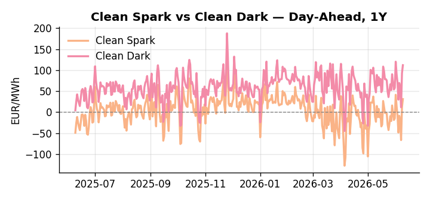
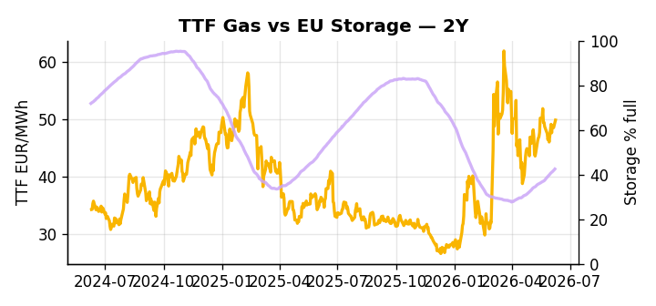

# European Cross-Commodity Risk Pack: Gas + Carbon → Power Curve Implications

**Daily desk brief — 2026-06-09**  
_Author: Sumer Sener · sumerberksener@gmail.com_  
_Generated by `scripts/generate_brief.py`. AI narrative + news themes via Anthropic Claude._

## 1 · Executive summary

**TL;DR — Storage 14.3 pp below seasonal; TTF +2.7% and power tracking 77th–87th percentile amid demand surge from AI/industry and Hormuz geopolitical risk.**

EU gas storage at 42.48% — 14.3 percentage points below seasonal norm and sitting at the 18th percentile — locks the market into a tight-gas regime heading into refill season, with TTF up 2.7% and printing at the 66th percentile as LNG supply anxiety builds. Power is tracking between the 77th and 87th percentile, driven by an AI- and industry-led demand surge that is colliding with nascent peak-shaving legislation whose implementation still lags by weeks, keeping the thermal call extended and day-ahead volatility elevated. The Clean Spark spread is deep in-the-money at 31.25 EUR/MWh (89th percentile), confirming gas has decisively cleared the fuel-switch threshold over coal and that margin compression is structural rather than episodic. Chinese sanctions on Russian-linked firms introduce a slow-moving constraint on renewables components and grid infrastructure, adding a structural bid to the longer-dated curve that headroom from any near-term demand flexibility cannot yet offset. With Hormuz tail-risk reasserting after the February 28 closure — adding three to five weeks to LNG delivery timelines and sustaining the crude-linked fuel-switch premium — gas tightness AND carbon stable AND Clean Spark at the 89th percentile pull front-curve risk wider, keeping the Cal+1 regime anchored in elevated-thermal territory until storage refill pace and geopolitical resolution materially shift the supply balance.

_Generated by **claude-sonnet-4-6** via Anthropic API (two-pass extract→narrate). Prompts/responses logged to `ai/logs/`._
_Next-5d temperature anomaly — DE -1.9°C / FR -1.5°C vs 5-yr seasonal normal (Open-Meteo)._

## 2 · Monitor metrics

**Primary (cross-commodity headline tiles)**

| Metric | As of | Latest | Unit | 1d Δ | 1w Δ | 5y pctile | Headline |
|---|---|---:|---|---:|---:|---:|---|
| TTF Gas | 2026-06-08 | 49.83 | EUR/MWh | +2.74% | +3.24% | 66 | Within typical range |
| EU Storage | 2026-06-07 | 42.48 | % full | +0.83% | +3.50% | 18 | 14.3 pp below the 5-yr seasonal average |
| EUA Carbon | 2026-06-08 | 32.52 | EUR/tCO2 | +0.03% | -1.35% | 34 | Within typical range |
| DE Power | 2026-06-09 | 142.87 | EUR/MWh | +15.26% | -5.59% | 77 | Within typical range |
| GB Power | 2026-06-09 | 121.78 | EUR/MWh | -1.26% | -6.96% | 87 | Within typical range |
| Renewables | 2026-06-08 | 39.90 | % of load | -43.28% | +26.13% | 45 | Within typical range |
| Clean Spark | 2026-06-09 | 31.25 | EUR/MWh | +18.91 | -7.52 | 89 | Within typical range |
| Clean Dark | 2026-06-09 | 111.83 | EUR/MWh | +18.91 | -5.23 | 79 | Within typical range |

**Fundamentals inputs** _(feed derived metrics; not separately traded)_

| Metric | As of | Latest | Unit | 1d Δ | 1w Δ | 5y pctile | Headline |
|---|---|---:|---|---:|---:|---:|---|
| Coal | 2026-06-08 | 10.93 | USD/t | +0.11% | +0.60% | 36 | Within typical range |

_Spreads → abs EUR/MWh deltas; others → pct. Weekly Δ uses 5d trailing means. Full history in `data/<metric>.csv`._

## 3 · Gas + LNG arb

**TTF front-month** prints at 49.83 EUR/MWh — _Within typical range_.
**EU storage** at 42.5% full (-14.3 pp vs 5-yr seasonal avg) — _14.3 pp below the 5-yr seasonal average_.
**TTF − JKM (LNG arb)** at -6.13 EUR/MWh (JKM 18.90 USD/MMBtu) — JKM richer than TTF — Asia pulls cargoes, marginal European tightening risk.

## 4 · Carbon (EU ETS)

**EUA December** prints at 32.52 EUR/tCO2 — _Within typical range_. A euro of EUA adds ~0.37 EUR/MWh to gas-fired and ~0.85 EUR/MWh to coal-fired generation cost; strength compresses the dark spread faster than the spark.

**EU vs UK ETS** — Cobblestone's emissions desk trades EUA and UKA. Post-Brexit auction reform narrowed the UKA discount to EUA from £20+/t to single-digit £/t; CBAM phase-in pulls UK compliance demand toward parity. EUA−UKA basis remains a tradable cross-market signal.

**Supply / policy signal** — _CBAM full operational phase live since 1 Jan 2026 — importers paying for embedded emissions_  
Side: `policy` · Polarity: `bullish EUA` · Source: EU Regulation 2023/956 (CBAM)

Domestic carbon-cost burden gradually levelled with imports; supports EUA demand floor as carbon leakage protection tightens through 2034.

_No ETS-relevant news surfaced today — falling back to `data/policy_facts.py` (hand-maintained structural fact pack). Fact pack last reviewed 2026-05-08 (32d ago)._

## 5 · Power — Day-Ahead & curve

**DE day-ahead baseload** at 142.87 EUR/MWh — _Within typical range_.
**GB day-ahead baseload** at 121.78 EUR/MWh — _Within typical range_.
**DE − GB spread** at +21.09 EUR/MWh (DE premium) — drives interconnector flow direction.
**Cross-border net flows (Power Transportation):** DE↔FR -72.4 GWh (FR export); GB↔FR -61.1 GWh (FR export); NL↔DE -9.2 GWh (DE export).

**Clean spark spread** at +31.25 EUR/MWh — _Within typical range_. Bridge from gas + carbon fundamentals to gas-fired economics; sustained positive spark = TTF moves transmit directly into the power curve.

**Curve shape:** DA → W+1 → M+1 → Q+1 → Cal+1 → Cal+2 = 143 / 102 / 102 / 102 / 102 / 102 EUR/MWh — **Backwardation** (DA −Cal+1 spread +40 EUR/MWh). Forwards are seasonality projections — see Methodology.

{width=49%} {width=49%}

**This week ahead**

- **Tue** 08:00 UTC — AGSI+ daily storage print: First read on the week's gas injection / withdrawal pace; sets the tone for TTF curve shape.
- **Wed** 09:00 UTC — EEX EUA primary auction (Mon–Thu daily; Wed is largest volume): Supply-side EUA signal; auction clearing relative to spot reads as ETS demand strength.
- **Wed** — ENTSO-E DE_LU + GB next-week wind/solar forecast refresh: Sets the residual-load curve a week out; outsized prints move power Cal+1 directionally.

**Scenarios (1w horizon)**

| | Summary | TTF | DE Power |
|---|---|---:|---:|
| **Base** | Tight storage, firm TTF, power elevated; AI demand-side legislation delays; geopolitics contained. | +1-3% | +2-4% |
| **Upside** | Hormuz escalation or LNG delivery delays; storage refill disappoints; AI demand peak-shaving stalls. | +8-15% | +12-18% |
| **Downside** | Hormuz de-escalates; LNG flows accelerate; mild weather, renewables surge; demand-side flexibility gains traction. | -6-10% | -10-15% |

_Illustrative, not forecasts. Magnitudes sized off historical sensitivity; AI-generated from today's extract pass._

## 6 · Today's themes

**Weather watch (next 7d)**
- **Storm · DE · Tue 09 – Mon 15 Jun** — peak gust 56 m/s (~203 km/h) on Tue 09 Jun. Wind generation likely surges Day 1, then risk of turbine cut-off if gusts exceed 25 m/s. Bearish DA early, sharp reversal possible. Watch DE-FR flow swings.
- **Storm · FR · Tue 09 – Fri 12 Jun** — peak gust 40 m/s (~144 km/h) on Wed 10 Jun. Strong wind boost to French generation; FR may export to neighbours. DA print likely below seasonal norm; watch FR-GB IFA flow toward GB.

**Watchlist (1–4 weeks)**
- EU forced labour tariff negotiation outcome with Trump administration; truce fragility.
- Straits geopolitics: continued supply disruption risk and crude/energy price contagion to EU.

_Risk framing — built within a discipline of clear limits and continuous monitoring; observations here are framed as risk inputs, not directional calls. Positioning decisions remain with the desk._
_Methodology + sources: **README §Methodology**. Numbers auditable via the snapshot JSONs. Rule-based / informational — not investment advice._