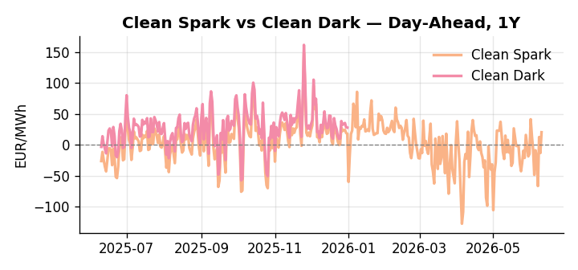
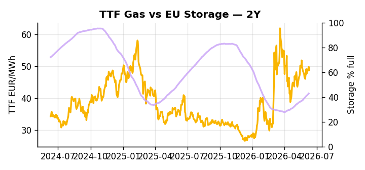

# European Cross-Commodity Risk Pack: Gas + Carbon → Power Curve Implications

**Daily desk brief — 2026-06-10**  
_Author: Sumer Sener · sumerberksener@gmail.com_  
_Generated by `scripts/generate_brief.py`. AI narrative + news themes via Anthropic Claude._

> **Data-freshness caveat:** Clean Dark (last 2025-12-31, 161d old); Coal (last 2025-12-26, 166d old). Numbers below should be read with this in mind.

## 1 · Executive summary

**TL;DR — EU storage 14 pp below seasonal; coal at 7th-percentile; Hormuz closure and Russian sanctions tighten crude-to-power cost chain via LNG arbitrage and fuel-switch exposure.**

EU storage sitting at 42.8% — 14.3 percentage points below seasonal norms at the 19th percentile — is the dominant signal this morning, leaving the thermal backstop stretched into summer with limited headroom to absorb a supply shock. Coal at the 7th percentile suppresses dark-spread economics, though with coal data 166 days old and clean-dark 161 days stale, both spreads are indicative not bankable. The Hormuz closure of February 28 remains live, having already spiked jet fuel and elevated LNG delivery premiums that are narrowing EU-Asia arbitrage and anchoring TTF in the 48–50 EUR/MWh range, while Russian sanctions package 21 freezes the oil price cap and adds an unresolved crude supply-chain overhang that feeds directly into the fuel-switch cost curve. Renewables running at the 77th percentile are compressing the near-term gas call, but the storage deficit means any demand inflection into H2 re-opens refill risk sharply. With Hormuz tail-risk unresolved, gas tightness AND coal-suppressed carbon backstop AND stale but indicative clean-dark spreads in-the-money keep front-curve risk bid, while the Cal+1 regime remains hostage to whether LNG arbitrage re-opens or sanctions package 21 locks in a structurally elevated cost chain.

_Generated by **claude-sonnet-4-6** via Anthropic API (two-pass extract→narrate). Prompts/responses logged to `ai/logs/`._
_Next-5d temperature anomaly — DE -2.4°C / FR -0.6°C vs 5-yr seasonal normal (Open-Meteo)._

## 2 · Monitor metrics

**Primary (cross-commodity headline tiles)**

| Metric | As of | Latest | Unit | 1d Δ | 1w Δ | 5y pctile | Headline |
|---|---|---:|---|---:|---:|---:|---|
| TTF Gas | 2026-06-09 | 48.74 | EUR/MWh | -2.17% | +3.66% | 65 | Within typical range |
| EU Storage | 2026-06-08 | 42.79 | % full | +0.73% | +3.49% | 19 | 14.3 pp below the 5-yr seasonal average |
| EUA Carbon | 2026-06-08 | 32.52 | EUR/tCO2 | +0.03% | -1.35% | 34 | Within typical range |
| DE Power | 2026-06-10 | 129.90 | EUR/MWh | +34.76% | -10.52% | 73 | Within typical range |
| GB Power | 2026-06-10 | 113.96 | EUR/MWh | +0.67% | -7.64% | 78 | Within typical range |
| Renewables | 2026-06-09 | 55.45 | % of load | +38.97% | +4.30% | 77 | Within typical range |
| Clean Spark | 2026-06-10 | 20.44 | EUR/MWh | +33.51 | -11.69 | 80 | Within typical range |
| Clean Dark | 2025-12-31 (STALE) | 27.95 | EUR/MWh | -0.56 | +11.63 | 49 | Within typical range |

**Fundamentals inputs** _(feed derived metrics; not separately traded)_

| Metric | As of | Latest | Unit | 1d Δ | 1w Δ | 5y pctile | Headline |
|---|---|---:|---|---:|---:|---:|---|
| Coal | 2025-12-26 (STALE) | 96.00 | USD/t | -0.57% | +0.08% | 7 | 7th-percentile of 5-yr range — historically low |

_Spreads → abs EUR/MWh deltas; others → pct. Weekly Δ uses 5d trailing means. Full history in `data/<metric>.csv`._

## 3 · Gas + LNG arb

**TTF front-month** prints at 48.74 EUR/MWh — _Within typical range_.
**EU storage** at 42.8% full (-14.3 pp vs 5-yr seasonal avg) — _14.3 pp below the 5-yr seasonal average_.
**TTF − JKM (LNG arb)** at -7.15 EUR/MWh (JKM 18.89 USD/MMBtu) — JKM richer than TTF — Asia pulls cargoes, marginal European tightening risk.

## 4 · Carbon (EU ETS)

**EUA December** prints at 32.52 EUR/tCO2 — _Within typical range_. A euro of EUA adds ~0.37 EUR/MWh to gas-fired and ~0.85 EUR/MWh to coal-fired generation cost; strength compresses the dark spread faster than the spark.

**EU vs UK ETS** — Cobblestone's emissions desk trades EUA and UKA. Post-Brexit auction reform narrowed the UKA discount to EUA from £20+/t to single-digit £/t; CBAM phase-in pulls UK compliance demand toward parity. EUA−UKA basis remains a tradable cross-market signal.

**Supply / policy signal** — _CBAM full operational phase live since 1 Jan 2026 — importers paying for embedded emissions_  
Side: `policy` · Polarity: `bullish EUA` · Source: EU Regulation 2023/956 (CBAM)

Domestic carbon-cost burden gradually levelled with imports; supports EUA demand floor as carbon leakage protection tightens through 2034.

_No ETS-relevant news surfaced today — falling back to `data/policy_facts.py` (hand-maintained structural fact pack). Fact pack last reviewed 2026-05-08 (33d ago)._

## 5 · Power — Day-Ahead & curve

**DE day-ahead baseload** at 129.90 EUR/MWh — _Within typical range_.
**GB day-ahead baseload** at 113.96 EUR/MWh — _Within typical range_.
**DE − GB spread** at +15.94 EUR/MWh (DE premium) — drives interconnector flow direction.
**Cross-border net flows (Power Transportation):** DE↔FR -63.4 GWh (FR export); GB↔FR -60.7 GWh (FR export); NL↔DE -5.7 GWh (DE export).

**Clean spark spread** at +20.44 EUR/MWh — _Within typical range_. Bridge from gas + carbon fundamentals to gas-fired economics; sustained positive spark = TTF moves transmit directly into the power curve.

**Curve shape:** DA → W+1 → M+1 → Q+1 → Cal+1 → Cal+2 = 130 / 101 / 101 / 101 / 101 / 101 EUR/MWh — **Backwardation** (DA −Cal+1 spread +29 EUR/MWh). Forwards are seasonality projections — see Methodology.

{width=49%} {width=49%}

**This week ahead**

- **Wed** 09:00 UTC — EEX EUA primary auction (Mon–Thu daily; Wed is largest volume): Supply-side EUA signal; auction clearing relative to spot reads as ETS demand strength.
- **Wed** — ENTSO-E DE_LU + GB next-week wind/solar forecast refresh: Sets the residual-load curve a week out; outsized prints move power Cal+1 directionally.
- **Fri** 14:30 UTC — EIA weekly natural gas storage report: US storage trajectory anchors LNG export pricing into NW Europe — direct TTF transmission.
- **TBD** — EU sanctions package 21 implementation details (Russian oil export curbs): Clarify export volume curbs and timeline; direct input to crude-to-power cost pass-through and LNG re-routing risk. _(news-extracted)_
- **TBD** — Hormuz strait reopening or escalation update: Current closure (Feb 28) is live; any reopening or further closure spreads directly into LNG delivery costs and EU gas arbitrage. _(news-extracted)_

**Scenarios (24-72h | 1w horizon)**

| | Summary | TTF | DE Power |
|---|---|---:|---:|
| **Base** | TTF holds 48–50 EUR/MWh; DE Power 125–135 EUR/MWh; coal suppression persists; renewables offset gas call. | ±1–3% | ±2–4% |
| **Upside** | Hormuz closure persists; sanctions package 21 Russian oil curbs lock in; crude spikes; LNG delivery costs rise; TTF and power rally. | +8–15% | +12–18% |
| **Downside** | Hormuz reopens; shipping normalizes; global LNG supply eases; renewables remain strong; storage refill accelerates; TTF softens. | -6–12% | -8–14% |

_Illustrative, not forecasts. Magnitudes sized off historical sensitivity; AI-generated from today's extract pass._

## 6 · Today's themes

**Weather watch (next 7d)**
- **Storm · DE · Wed 10 – Mon 15 Jun** — peak gust 59 m/s (~212 km/h) on Sun 14 Jun. Wind generation likely surges Day 1, then risk of turbine cut-off if gusts exceed 25 m/s. Bearish DA early, sharp reversal possible. Watch DE-FR flow swings.
- **Storm · FR · Wed 10 – Fri 12 Jun** — peak gust 41 m/s (~147 km/h) on Fri 12 Jun. Strong wind boost to French generation; FR may export to neighbours. DA print likely below seasonal norm; watch FR-GB IFA flow toward GB.

**Watchlist (1–4 weeks)**
- Hormuz closure impact on crude/LNG spreads; watch Brent-TTF arb narrowing.
- EU sanctions package 21 implementation: Russian oil export curbs details due.

_Risk framing — built within a discipline of clear limits and continuous monitoring; observations here are framed as risk inputs, not directional calls. Positioning decisions remain with the desk._
_Methodology + sources: **README §Methodology**. Numbers auditable via the snapshot JSONs. Rule-based / informational — not investment advice._