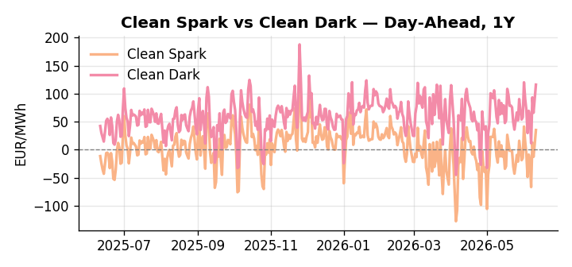
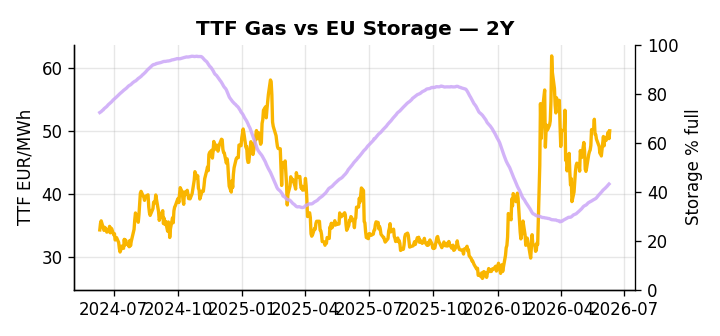

# European Cross-Commodity Risk Pack: Gas + Carbon → Power Curve Implications

**Daily desk brief — 2026-06-11**  
_Author: Sumer Sener · sumerberksener@gmail.com_  
_Generated by `scripts/generate_brief.py`. AI narrative + news themes via Anthropic Claude._

## 1 · Executive summary

**TL;DR — Clean Spark at 91st-percentile (35.2 EUR/MWh) and GB Power at 90th-percentile (125.69 EUR/MWh) signal tight thermal merit order; Storage 14.3 pp below seasonal pushes H2 refill urgency amid Hormuz geopolitical risk.**

Clean Spark at the 91st percentile (35.2 EUR/MWh) and GB Power at the 90th percentile (125.69 EUR/MWh) confirm a tight thermal merit order with generation firmly in-the-money across the front curve. EU storage at 43.1% — 14.3 percentage points below seasonal norms at the 19th percentile of the five-year range — compresses refill headroom and elevates the H2 generation call, keeping summer baseload premiums extended. GB's 41.7% renewable share, down 24.8% year-on-year, has tightened cross-channel arbitrage and reinforced the UK import scarcity signal, while the EU 21st sanctions package freezing the Russian oil price cap is reshaping alternative crude sourcing and may widen the LNG arb into summer. With Hormuz tail-risk asserting a structural bullish bias across crude and refined products, gas tightness anchored by a 14.3 pp storage deficit and clean spreads locked at multi-year highs pull front-curve risk wider, keeping the Cal+1 regime in an extended thermal in-the-money posture until refill pace or geopolitical resolution materially shifts the merit order.

_Generated by **claude-sonnet-4-6** via Anthropic API (two-pass extract→narrate). Prompts/responses logged to `ai/logs/`._

## 2 · Monitor metrics

**Primary (cross-commodity headline tiles)**

| Metric | As of | Latest | Unit | 1d Δ | 1w Δ | 5y pctile | Headline |
|---|---|---:|---|---:|---:|---:|---|
| TTF Gas | 2026-06-10 | 49.99 | EUR/MWh | +2.55% | +3.07% | 66 | Within typical range |
| EU Storage | 2026-06-09 | 43.10 | % full | +0.70% | +3.54% | 19 | 14.3 pp below the 5-yr seasonal average |
| EUA Carbon | 2026-06-10 | 32.73 | EUR/tCO2 | +1.03% | -2.50% | 35 | Within typical range |
| DE Power | 2026-06-11 | 147.22 | EUR/MWh | +20.25% | +12.36% | 79 | Within typical range |
| GB Power | 2026-06-11 | 125.69 | EUR/MWh | +0.60% | +6.24% | 90 | 90th-percentile of 5-yr range — historically high |
| Renewables | 2026-06-10 | 41.70 | % of load | -24.80% | -7.01% | 49 | Within typical range |
| Clean Spark | 2026-06-11 | 35.20 | EUR/MWh | +24.79 | +9.94 | 91 | 91th-percentile of 5-yr range — historically high |
| Clean Dark | 2026-06-11 | 116.01 | EUR/MWh | +24.79 | +12.00 | 80 | Within typical range |

**Fundamentals inputs** _(feed derived metrics; not separately traded)_

| Metric | As of | Latest | Unit | 1d Δ | 1w Δ | 5y pctile | Headline |
|---|---|---:|---|---:|---:|---:|---|
| Coal | 2026-06-10 | 10.92 | USD/t | -0.48% | +1.07% | 35 | Within typical range |

_Spreads → abs EUR/MWh deltas; others → pct. Weekly Δ uses 5d trailing means. Full history in `data/<metric>.csv`._

## 3 · Gas + LNG arb

**TTF front-month** prints at 49.99 EUR/MWh — _Within typical range_.
**EU storage** at 43.1% full (-14.3 pp vs 5-yr seasonal avg) — _14.3 pp below the 5-yr seasonal average_.
**TTF − JKM (LNG arb)** at -5.96 EUR/MWh (JKM 18.92 USD/MMBtu) — JKM richer than TTF — Asia pulls cargoes, marginal European tightening risk.

## 4 · Carbon (EU ETS)

**EUA December** prints at 32.73 EUR/tCO2 — _Within typical range_. A euro of EUA adds ~0.37 EUR/MWh to gas-fired and ~0.85 EUR/MWh to coal-fired generation cost; strength compresses the dark spread faster than the spark.

**EU vs UK ETS** — Cobblestone's emissions desk trades EUA and UKA. Post-Brexit auction reform narrowed the UKA discount to EUA from £20+/t to single-digit £/t; CBAM phase-in pulls UK compliance demand toward parity. EUA−UKA basis remains a tradable cross-market signal.

**Supply / policy signal** — _CBAM full operational phase live since 1 Jan 2026 — importers paying for embedded emissions_  
Side: `policy` · Polarity: `bullish EUA` · Source: EU Regulation 2023/956 (CBAM)

Domestic carbon-cost burden gradually levelled with imports; supports EUA demand floor as carbon leakage protection tightens through 2034.

_No ETS-relevant news surfaced today — falling back to `data/policy_facts.py` (hand-maintained structural fact pack). Fact pack last reviewed 2026-05-08 (34d ago)._

## 5 · Power — Day-Ahead & curve

**DE day-ahead baseload** at 147.22 EUR/MWh — _Within typical range_.
**GB day-ahead baseload** at 125.69 EUR/MWh — _90th-percentile of 5-yr range — historically high_.
**DE − GB spread** at +21.53 EUR/MWh (DE premium) — drives interconnector flow direction.
**Cross-border net flows (Power Transportation):** DE↔FR -63.2 GWh (FR export); GB↔FR -61.0 GWh (FR export); NL↔DE -18.7 GWh (DE export).

**Clean spark spread** at +35.20 EUR/MWh — _91th-percentile of 5-yr range — historically high_. Bridge from gas + carbon fundamentals to gas-fired economics; sustained positive spark = TTF moves transmit directly into the power curve.

**Curve shape:** DA → W+1 → M+1 → Q+1 → Cal+1 → Cal+2 = 147 / 104 / 104 / 104 / 104 / 104 EUR/MWh — **Backwardation** (DA −Cal+1 spread +43 EUR/MWh). Forwards are seasonality projections — see Methodology.

{width=49%} {width=49%}

**This week ahead**

- **Fri** 14:30 UTC — EIA weekly natural gas storage report: US storage trajectory anchors LNG export pricing into NW Europe — direct TTF transmission.
- **Thu** 14:30 UTC — US EIA weekly crude inventories: Crude — and via crack spreads, refined-products — feed back into LNG arb economics.
- **Fri** — ENTSO-E weekly day-ahead volumes / system-balance summary: Reads the European generation mix in last 7d — confirms or breaks the Cal+1 thesis.

**Scenarios (24-72h | 1w horizon)**

| | Summary | TTF | DE Power |
|---|---|---:|---:|
| **Base** | Clean Spark and GB Power remain elevated; TTF stable mid-60s percentile; storage refill steady. Thermal in-the-money persists. | +1-3% | +2-5% |
| **Upside** | Iran nuclear collapse or Hormuz closure deepens; crude spikes; refined product scarcity tightens thermal marginal cost; storage injection slows. | +5-8% | +8-12% |
| **Downside** | Jet fuel crisis fully resolves; refinery margins normalize; crude retreats; storage injection accelerates on mild weather and demand softening. | -3-5% | -5-8% |

_Illustrative, not forecasts. Magnitudes sized off historical sensitivity; AI-generated from today's extract pass._

## 6 · Today's themes

**Watchlist (1–4 weeks)**
- Iran nuclear deal collapse risk; monitor crude and product futures for supply shock tail
- EU sanctions package 21 implementation timeline; Russian crude rerouting impacts LNG arb

_Risk framing — built within a discipline of clear limits and continuous monitoring; observations here are framed as risk inputs, not directional calls. Positioning decisions remain with the desk._
_Methodology + sources: **README §Methodology**. Numbers auditable via the snapshot JSONs. Rule-based / informational — not investment advice._