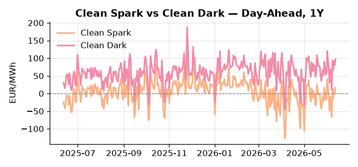
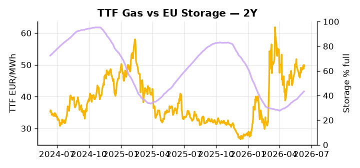

# European Cross-Commodity Risk Pack: Gas + Carbon → Power Curve Implications

**Daily desk brief — 2026-06-12**  
_Author: Sumer Sener · sumerberksener@gmail.com_  
_Generated by `scripts/generate_brief.py`. AI narrative + news themes via Anthropic Claude._

## 1 · Executive summary

**TL;DR — Clean Spark explodes 15.2σ on Hormuz-driven oil rally; EU storage 14.3 pp below seasonal raises H2 refill urgency amid geopolitical supply risk.**

Clean Spark's 15.2σ move to the 74th percentile signals a rapid, disorderly rotation into gas-fired generation driven by the Hormuz closure, which is disrupting over 20% of global crude exports and transmitting directly into European merit-order economics. EU storage sitting at 43.36% — 14.3 percentage points below the five-year seasonal norm at the 19th percentile — leaves summer refill headroom critically compressed, elevating the thermal dispatch call through H2 with little buffer against sustained LNG diversion to Asia. Storage data carries a two-day lag and TTF a one-day lag, so the precise fill trajectory is indicative rather than real-time, though the directional deficit is unambiguous. Trump-Iran escalation represents the live upside risk to Brent, and any further tightening of crude supply would reinforce fuel-switch economics favouring extended thermal over storage discharge. With Hormuz tail-risk anchoring gas tightness, clean spark in-the-money at an extended percentile, and storage deficit keeping the curve exposed, front-curve risk remains wide while the Hormuz-driven geopolitical premium sustains the current thermal-over-storage dispatch regime.

_Generated by **claude-sonnet-4-6** via Anthropic API (two-pass extract→narrate). Prompts/responses logged to `ai/logs/`._
_Next-5d temperature anomaly — DE -2.7°C / FR -0.4°C / GB +0.8°C vs 5-yr seasonal normal (Open-Meteo)._

## 2 · Monitor metrics

**Primary (cross-commodity headline tiles)**

| Metric | As of | Latest | Unit | 1d Δ | 1w Δ | 5y pctile | Headline |
|---|---|---:|---|---:|---:|---:|---|
| TTF Gas | 2026-06-11 | 49.69 | EUR/MWh | -0.60% | +2.68% | 66 | Within typical range |
| EU Storage | 2026-06-10 | 43.36 | % full | +0.60% | +3.64% | 19 | 14.3 pp below the 5-yr seasonal average |
| EUA Carbon | 2026-06-11 | 32.57 | EUR/tCO2 | -0.49% | -2.42% | 35 | Within typical range |
| DE Power | 2026-06-12 | 128.14 | EUR/MWh | +14.72% | +47.55% | 72 | Within typical range |
| GB Power | 2026-06-12 | 106.99 | EUR/MWh | -17.87% | +44.07% | 71 | Within typical range |
| Renewables | 2026-06-11 | 38.12 | % of load | -8.58% | -9.68% | 41 | Within typical range |
| Clean Spark | 2026-06-12 | 16.77 | EUR/MWh | +16.45 | +35.76 | 74 | outsized daily move (+5020.17%, 15.2σ) |
| Clean Dark | 2026-06-12 | 97.05 | EUR/MWh | +16.45 | +37.75 | 73 | Within typical range |

**Fundamentals inputs** _(feed derived metrics; not separately traded)_

| Metric | As of | Latest | Unit | 1d Δ | 1w Δ | 5y pctile | Headline |
|---|---|---:|---|---:|---:|---:|---|
| Coal | 2026-06-11 | 10.97 | USD/t | +0.43% | +1.15% | 36 | Within typical range |

_Spreads → abs EUR/MWh deltas; others → pct. Weekly Δ uses 5d trailing means. Full history in `data/<metric>.csv`._

## 3 · Gas + LNG arb

**TTF front-month** prints at 49.69 EUR/MWh — _Within typical range_.
**EU storage** at 43.4% full (-14.3 pp vs 5-yr seasonal avg) — _14.3 pp below the 5-yr seasonal average_.
**TTF − JKM (LNG arb)** at -6.27 EUR/MWh (JKM 18.92 USD/MMBtu) — JKM richer than TTF — Asia pulls cargoes, marginal European tightening risk.

## 4 · Carbon (EU ETS)

**EUA December** prints at 32.57 EUR/tCO2 — _Within typical range_. A euro of EUA adds ~0.37 EUR/MWh to gas-fired and ~0.85 EUR/MWh to coal-fired generation cost; strength compresses the dark spread faster than the spark.

**EU vs UK ETS** — Cobblestone's emissions desk trades EUA and UKA. Post-Brexit auction reform narrowed the UKA discount to EUA from £20+/t to single-digit £/t; CBAM phase-in pulls UK compliance demand toward parity. EUA−UKA basis remains a tradable cross-market signal.

**Supply / policy signal** — _CBAM full operational phase live since 1 Jan 2026 — importers paying for embedded emissions_  
Side: `policy` · Polarity: `bullish EUA` · Source: EU Regulation 2023/956 (CBAM)

Domestic carbon-cost burden gradually levelled with imports; supports EUA demand floor as carbon leakage protection tightens through 2034.

_No ETS-relevant news surfaced today — falling back to `data/policy_facts.py` (hand-maintained structural fact pack). Fact pack last reviewed 2026-05-08 (35d ago)._

## 5 · Power — Day-Ahead & curve

**DE day-ahead baseload** at 128.14 EUR/MWh — _Within typical range_.
**GB day-ahead baseload** at 106.99 EUR/MWh — _Within typical range_.
**DE − GB spread** at +21.15 EUR/MWh (DE premium) — drives interconnector flow direction.
**Cross-border net flows (Power Transportation):** DE↔FR -72.5 GWh (FR export); GB↔FR -61.0 GWh (FR export); NL↔DE +14.7 GWh (NL export).

**Clean spark spread** at +16.77 EUR/MWh — _outsized daily move (+5020.17%, 15.2σ)_. Bridge from gas + carbon fundamentals to gas-fired economics; sustained positive spark = TTF moves transmit directly into the power curve.

**Curve shape:** DA → W+1 → M+1 → Q+1 → Cal+1 → Cal+2 = 128 / 103 / 103 / 103 / 103 / 103 EUR/MWh — **Backwardation** (DA −Cal+1 spread +25 EUR/MWh). Forwards are seasonality projections — see Methodology.

{width=49%} {width=49%}

**This week ahead**

- **Fri** 14:30 UTC — EIA weekly natural gas storage report: US storage trajectory anchors LNG export pricing into NW Europe — direct TTF transmission.
- **Fri** — ENTSO-E weekly day-ahead volumes / system-balance summary: Reads the European generation mix in last 7d — confirms or breaks the Cal+1 thesis.
- **Tue** 08:00 UTC — AGSI+ daily storage print: First read on the week's gas injection / withdrawal pace; sets the tone for TTF curve shape.

**Scenarios (1w horizon)**

| | Summary | TTF | DE Power |
|---|---|---:|---:|
| **Base** | Hormuz closure persists; storage refill steady; DE power tracks current thermal premium. | +2-4% | tracks |
| **Upside** | Hormuz remains blocked; Trump-Iran escalation tightens crude; LNG redirects to Asia; European thermal dispatch extends. | +8-12% | +12-18% |
| **Downside** | Hormuz reopens; crude rally reverses; storage refill accelerates; fuel-switch margin compresses. | -5-8% | -10-15% |

_Illustrative, not forecasts. Magnitudes sized off historical sensitivity; AI-generated from today's extract pass._

## 6 · Today's themes

**Weather watch (next 7d)**
- **Storm · DE · Fri 12 – Thu 18 Jun** — peak gust 67 m/s (~240 km/h) on Sat 13 Jun. Wind generation likely surges Day 1, then risk of turbine cut-off if gusts exceed 25 m/s. Bearish DA early, sharp reversal possible. Watch DE-FR flow swings.
- **Storm · FR · Fri 12 – Sun 14 Jun** — peak gust 41 m/s (~147 km/h) on Fri 12 Jun. Strong wind boost to French generation; FR may export to neighbours. DA print likely below seasonal norm; watch FR-GB IFA flow toward GB.

**Watchlist (1–4 weeks)**
- Hormuz closure duration and impact on crude/LNG supply routing to Europe.
- Iran–Trump escalation; risk of further US sanctions or military action.

_Risk framing — built within a discipline of clear limits and continuous monitoring; observations here are framed as risk inputs, not directional calls. Positioning decisions remain with the desk._
_Methodology + sources: **README §Methodology**. Numbers auditable via the snapshot JSONs. Rule-based / informational — not investment advice._