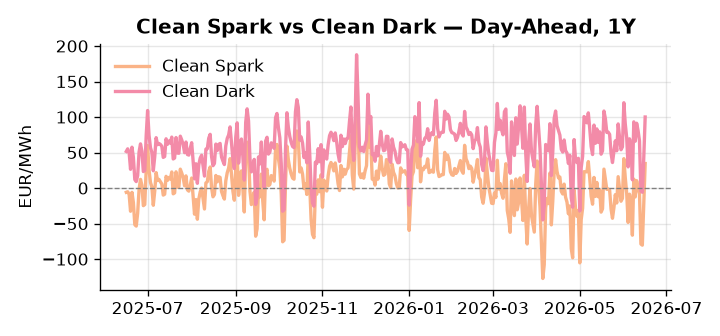
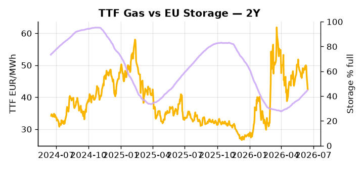

# European Cross-Commodity Risk Pack: Gas + Carbon → Power Curve Implications

**Daily desk brief — 2026-06-16**  
_Author: Sumer Sener · sumerberksener@gmail.com_  
_Generated by `scripts/generate_brief.py`. AI narrative + news themes via Anthropic Claude._

## 1 · Executive summary

**TL;DR — Renewables at 93rd percentile suppress thermal; clean spark near 11-year highs despite gas at 52nd percentile—storage 14 pp below seasonal signals tight H2 refill risk.**

Renewables running at the 93rd percentile (70.98% of load) are compressing thermal dispatch, yet the clean spark has climbed to the 91st percentile at 34.54 EUR/MWh despite TTF sitting near the median at 42.51 EUR/MWh, a dislocation that points to coal-to-gas fuel switch firmly in-the-money and a merit-order premium the gas price alone does not justify. EU storage at 44.7% — 14.3 percentage points below seasonal average and at the 20th percentile — keeps H2 refill risk anchored at the front of the curve, with summer injection velocity the critical variable for winter margin adequacy. EUA at the 40th percentile (33.4 EUR/tCO2) is not driving the spark strength in isolation, but political momentum to freeze EU ETS pricing and weaken cost pass-through rules and free-allocation guardrails under review introduces a bearish-EUA tail that could suppress carbon carry and cool the coal-exit incentive embedded in the current merit order, with the 2.77% daily EUA move (2.1σ) flagging that policy clarity is not yet priced. The Iran-US Hormuz deal removes the crude supply disruption premium and caps TTF upside as the LNG arb into Europe eases, though TTF retains a 2.4% weekly cushion until arb unwind is confirmed through charter rates and JKM spreads. With Hormuz tail-risk unwinding, gas tightness from the storage deficit AND EUA mid-range under bearish policy pressure AND clean spark at the 91st percentile keep the front-curve regime paradoxically elevated, while the Cal+1 curve faces a flattening bias if carbon cost pass-through headroom is legislated away.

_Generated by **claude-sonnet-4-6** via Anthropic API (two-pass extract→narrate). Prompts/responses logged to `ai/logs/`._
_Next-5d temperature anomaly — DE +2.0°C / FR +6.5°C / GB +4.0°C vs 5-yr seasonal normal (Open-Meteo)._

## 2 · Monitor metrics

**Primary (cross-commodity headline tiles)**

| Metric | As of | Latest | Unit | 1d Δ | 1w Δ | 5y pctile | Headline |
|---|---|---:|---|---:|---:|---:|---|
| TTF Gas | 2026-06-15 | 42.51 | EUR/MWh | -9.12% | -2.40% | 52 | Within typical range |
| EU Storage | 2026-06-14 | 44.72 | % full | +0.86% | +3.60% | 20 | 14.3 pp below the 5-yr seasonal average |
| EUA Carbon | 2026-06-15 | 33.40 | EUR/tCO2 | +2.77% | -0.70% | 40 | outsized daily move (+2.77%, 2.1σ) |
| DE Power | 2026-06-16 | 131.85 | EUR/MWh | +78.57% | -28.75% | 74 | Within typical range |
| GB Power | 2026-06-16 | 118.19 | EUR/MWh | +0.45% | -22.49% | 83 | Within typical range |
| Renewables | 2026-06-15 | 70.98 | % of load | -19.86% | +34.72% | 93 | 93th-percentile of 5-yr range — historically high |
| Clean Spark | 2026-06-16 | 34.54 | EUR/MWh | +58.01 | -17.28 | 91 | 91th-percentile of 5-yr range — historically high |
| Clean Dark | 2026-06-16 | 100.05 | EUR/MWh | +58.01 | -28.94 | 75 | Within typical range |

**Fundamentals inputs** _(feed derived metrics; not separately traded)_

| Metric | As of | Latest | Unit | 1d Δ | 1w Δ | 5y pctile | Headline |
|---|---|---:|---|---:|---:|---:|---|
| Coal | 2026-06-15 | 11.05 | USD/t | +0.43% | +1.11% | 37 | Within typical range |

_Spreads → abs EUR/MWh deltas; others → pct. Weekly Δ uses 5d trailing means. Full history in `data/<metric>.csv`._

## 3 · Gas + LNG arb

**TTF front-month** prints at 42.51 EUR/MWh — _Within typical range_.
**EU storage** at 44.7% full (-14.3 pp vs 5-yr seasonal avg) — _14.3 pp below the 5-yr seasonal average_.
**TTF − JKM (LNG arb)** at -12.73 EUR/MWh (JKM 18.78 USD/MMBtu) — JKM richer than TTF — Asia pulls cargoes, marginal European tightening risk.

## 4 · Carbon (EU ETS)

**EUA December** prints at 33.40 EUR/tCO2 — _outsized daily move (+2.77%, 2.1σ)_. A euro of EUA adds ~0.37 EUR/MWh to gas-fired and ~0.85 EUR/MWh to coal-fired generation cost; strength compresses the dark spread faster than the spark.

**EU vs UK ETS** — Cobblestone's emissions desk trades EUA and UKA. Post-Brexit auction reform narrowed the UKA discount to EUA from £20+/t to single-digit £/t; CBAM phase-in pulls UK compliance demand toward parity. EUA−UKA basis remains a tradable cross-market signal.

**Supply / policy signal** — _EU ETS industry pressure to freeze carbon pricing; political momentum for weakening cost pass-through rules and free-allocation guardrails under review._  
Side: `policy` · Polarity: `bearish EUA` · Source: Politico EU Energy

Weakening political support for carbon cost pass-through lowers thermal generation marginal cost and cools merit-order incentive for coal-exit; may suppress EUA carry and flatten 2026+ power curve.

_Surfaced from today's news flow by the AI extract pass (`ai/prompts/extract_v1.md` → `carbon_policy_signal`)._

## 5 · Power — Day-Ahead & curve

**DE day-ahead baseload** at 131.85 EUR/MWh — _Within typical range_.
**GB day-ahead baseload** at 118.19 EUR/MWh — _Within typical range_.
**DE − GB spread** at +13.66 EUR/MWh (DE premium) — drives interconnector flow direction.
**Cross-border net flows (Power Transportation):** DE↔FR -10.7 GWh (FR export); GB↔FR -80.7 GWh (FR export); NL↔DE -83.8 GWh (DE export).

**Clean spark spread** at +34.54 EUR/MWh — _91th-percentile of 5-yr range — historically high_. Bridge from gas + carbon fundamentals to gas-fired economics; sustained positive spark = TTF moves transmit directly into the power curve.

**Curve shape:** DA → W+1 → M+1 → Q+1 → Cal+1 → Cal+2 = 132 / 94 / 94 / 94 / 94 / 94 EUR/MWh — **Backwardation** (DA −Cal+1 spread +38 EUR/MWh). Forwards are seasonality projections — see Methodology.

{width=49%} {width=49%}

**This week ahead**

- **Tue** 08:00 UTC — AGSI+ daily storage print: First read on the week's gas injection / withdrawal pace; sets the tone for TTF curve shape.
- **Wed** 09:00 UTC — EEX EUA primary auction (Mon–Thu daily; Wed is largest volume): Supply-side EUA signal; auction clearing relative to spot reads as ETS demand strength.
- **Wed** — ENTSO-E DE_LU + GB next-week wind/solar forecast refresh: Sets the residual-load curve a week out; outsized prints move power Cal+1 directionally.
- **Mon** — G7 Evian summit (energy/Iran outcomes): Hormuz and energy sanctions clarity feeds into crude cost and LNG arb stability; feeds TTF curve expectation for H2 supply. _(news-extracted)_

**Scenarios (1w horizon)**

| | Summary | TTF | DE Power |
|---|---|---:|---:|
| **Base** | Renewables moderate to 60–65th percentile; storage refill steady; clean spark normalizes to 50th pctile as thermal call flattens. | −3 to +2% | −8 to −4% |
| **Upside** | Cold front or renewable forecast miss; storage refill lags seasonal by >20 pp; TTF strength and thermal dispatch surge ahead of H2. | +8 to +15% | +12 to +20% |
| **Downside** | Renewables sustained >85th pctile; mild weather extends; LNG arb weakens post-Hormuz as Brent softens; thermal margin squeezes further. | −10 to −5% | −18 to −10% |

_Illustrative, not forecasts. Magnitudes sized off historical sensitivity; AI-generated from today's extract pass._

## 6 · Today's themes

**Weather watch (next 7d)**
- **Heat dome · FR · Tue 16 – Mon 22 Jun** — peak +10.7°C vs normal. Bullish FR power on AC load and possible nuclear river-cooling derating. Watch FR-nuclear availability prints if heat persists.
- **Storm · FR · Tue 16 – Sun 21 Jun** — peak gust 37 m/s (~132 km/h) on Tue 16 Jun. Strong wind boost to French generation; FR may export to neighbours. DA print likely below seasonal norm; watch FR-GB IFA flow toward GB.

**Watchlist (1–4 weeks)**
- G7 summit (Evian) outcomes on energy/critical minerals policy & Iran escalation risk
- ETS carbon price reaction to industry freeze demand; political momentum test

_Risk framing — built within a discipline of clear limits and continuous monitoring; observations here are framed as risk inputs, not directional calls. Positioning decisions remain with the desk._
_Methodology + sources: **README §Methodology**. Numbers auditable via the snapshot JSONs. Rule-based / informational — not investment advice._