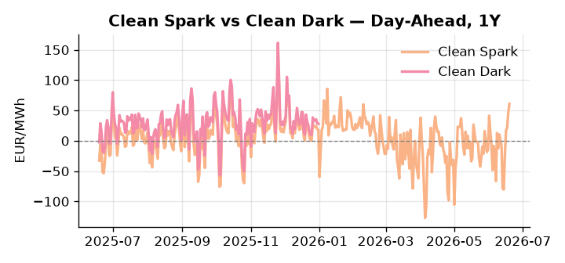
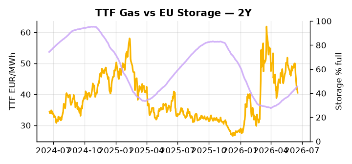

# European Cross-Commodity Risk Pack: Gas + Carbon → Power Curve Implications

**Daily desk brief — 2026-06-19**  
_Author: Sumer Sener · sumerberksener@gmail.com_  
_Generated by `scripts/generate_brief.py`. AI narrative + news themes via Anthropic Claude._

> **Data-freshness caveat:** Clean Dark (last 2025-12-31, 170d old); Coal (last 2025-12-26, 175d old). Numbers below should be read with this in mind.

## 1 · Executive summary

**TL;DR — Clean Spark at 97th-percentile with gas weakness; storage 14.3pp below seasonal drives H2 thermal upside; geopolitical risk premium on oil supports LNG arb floor.**

Clean Spark at the 97th percentile (60.96 EUR/MWh) is the dominant signal this morning, with gas-backed generation deep in-the-money as Permian LNG volume (27.6 Bcf/d) continues to press TTF down 21.79% on the month to 40.52 EUR/MWh (48th-percentile), keeping fuel-switch economics firmly extended in favour of thermal dispatch. EU storage at 45.56% — 14.3 percentage points below seasonal norms and sitting at the 21st percentile — keeps refill urgency acute and anchors the H2 power curve to a tight thermal call, with coal comparison data 175 days stale meaning the clean dark spread is indicative not bankable. On the carbon side, EUA at the 39th percentile is under incremental pressure as EU greenhouse gas emissions rose in 2025 — stagnating the abatement trajectory and weakening the implicit carbon floor under the merit order, a slow-motion bearish drift on the supply side of the ETS. Thursday's European Council summit on trade, China, and sanctions carries live tail-risk: any follow-through on G7 Russia oil sanctions would narrow the crude-LNG arbitrage and reprice the TTF floor sharply higher. Gas tightness from storage deficit AND EUA mid-range softening on rising emissions AND clean spark historically extended keep the front-curve regime in an elevated thermal in-the-money posture, with G7 Russia sanctions escalation the primary event risk that could compress headroom and reassert front-curve risk premium.

_Generated by **claude-sonnet-4-6** via Anthropic API (two-pass extract→narrate). Prompts/responses logged to `ai/logs/`._
_Next-5d temperature anomaly — DE +4.7°C / FR +9.3°C vs 5-yr seasonal normal (Open-Meteo)._

## 2 · Monitor metrics

**Primary (cross-commodity headline tiles)**

| Metric | As of | Latest | Unit | 1d Δ | 1w Δ | 5y pctile | Headline |
|---|---|---:|---|---:|---:|---:|---|
| TTF Gas | 2026-06-18 | 40.52 | EUR/MWh | -3.32% | -13.48% | 48 | Within typical range |
| EU Storage | 2026-06-17 | 45.56 | % full | +0.60% | +3.78% | 21 | 14.3 pp below the 5-yr seasonal average |
| EUA Carbon | 2026-06-17 | 33.29 | EUR/tCO2 | -0.86% | +1.29% | 39 | Within typical range |
| DE Power | 2026-06-19 | 154.26 | EUR/MWh | +10.28% | +56.03% | 80 | Within typical range |
| GB Power | 2026-06-19 | 107.46 | EUR/MWh | -13.54% | +37.91% | 70 | Within typical range |
| Renewables | 2026-06-18 | 40.97 | % of load | +18.82% | -0.27% | 47 | Within typical range |
| Clean Spark | 2026-06-19 | 60.96 | EUR/MWh | +14.38 | +63.81 | 97 | 97th-percentile of 5-yr range — historically high |
| Clean Dark | 2025-12-31 (STALE) | 27.95 | EUR/MWh | -0.56 | +11.63 | 49 | Within typical range |

**Fundamentals inputs** _(feed derived metrics; not separately traded)_

| Metric | As of | Latest | Unit | 1d Δ | 1w Δ | 5y pctile | Headline |
|---|---|---:|---|---:|---:|---:|---|
| Coal | 2025-12-26 (STALE) | 96.00 | USD/t | -0.57% | +0.08% | 7 | 7th-percentile of 5-yr range — historically low |

_Spreads → abs EUR/MWh deltas; others → pct. Weekly Δ uses 5d trailing means. Full history in `data/<metric>.csv`._

## 3 · Gas + LNG arb

**TTF front-month** prints at 40.52 EUR/MWh — _Within typical range_.
**EU storage** at 45.6% full (-14.3 pp vs 5-yr seasonal avg) — _14.3 pp below the 5-yr seasonal average_.
**TTF − JKM (LNG arb)** at -4.89 EUR/MWh (JKM 15.31 USD/MMBtu) — JKM richer than TTF — Asia pulls cargoes, marginal European tightening risk.

## 4 · Carbon (EU ETS)

**EUA December** prints at 33.29 EUR/tCO2 — _Within typical range_. A euro of EUA adds ~0.37 EUR/MWh to gas-fired and ~0.85 EUR/MWh to coal-fired generation cost; strength compresses the dark spread faster than the spark.

**EU vs UK ETS** — Cobblestone's emissions desk trades EUA and UKA. Post-Brexit auction reform narrowed the UKA discount to EUA from £20+/t to single-digit £/t; CBAM phase-in pulls UK compliance demand toward parity. EUA−UKA basis remains a tradable cross-market signal.

**Supply / policy signal** — _EU greenhouse gas emissions rose in 2025, stagnating climate progress and weakening carbon abatement trajectory._  
Side: `supply` · Polarity: `bearish EUA` · Source: Politico EU Energy

Rising emissions signal weaker ETS compliance and lower implicit carbon floor; pressures EUA downward (now 39th-percentile) and reduces carbon component of power marginal cost.

_Surfaced from today's news flow by the AI extract pass (`ai/prompts/extract_v1.md` → `carbon_policy_signal`)._

## 5 · Power — Day-Ahead & curve

**DE day-ahead baseload** at 154.26 EUR/MWh — _Within typical range_.
**GB day-ahead baseload** at 107.46 EUR/MWh — _Within typical range_.
**DE − GB spread** at +46.80 EUR/MWh (DE premium) — drives interconnector flow direction.
**Cross-border net flows (Power Transportation):** DE↔FR -57.6 GWh (FR export); GB↔FR -80.9 GWh (FR export); NL↔DE +21.0 GWh (NL export).

**Clean spark spread** at +60.96 EUR/MWh — _97th-percentile of 5-yr range — historically high_. Bridge from gas + carbon fundamentals to gas-fired economics; sustained positive spark = TTF moves transmit directly into the power curve.

**Curve shape:** DA → W+1 → M+1 → Q+1 → Cal+1 → Cal+2 = 154 / 101 / 101 / 101 / 101 / 101 EUR/MWh — **Backwardation** (DA −Cal+1 spread +53 EUR/MWh). Forwards are seasonality projections — see Methodology.

{width=49%} {width=49%}

**This week ahead**

- **Fri** 14:30 UTC — EIA weekly natural gas storage report: US storage trajectory anchors LNG export pricing into NW Europe — direct TTF transmission.
- **Fri** — ENTSO-E weekly day-ahead volumes / system-balance summary: Reads the European generation mix in last 7d — confirms or breaks the Cal+1 thesis.
- **Tue** 08:00 UTC — AGSI+ daily storage print: First read on the week's gas injection / withdrawal pace; sets the tone for TTF curve shape.
- **Thu** — European Council summit — trade, China, sanctions: Watch for Russia oil sanctions escalation signal and crude-LNG arb impact on TTF floor. _(news-extracted)_

**Scenarios (1w horizon)**

| | Summary | TTF | DE Power |
|---|---|---:|---:|
| **Base** | Gas softness persists on Permian LNG ramp; storage refill steady; thermal margins stable. | -2% to +1% | +2% to -3% |
| **Upside** | Trump escalates Russia oil sanctions; crude-LNG arb narrows; TTF reprices higher; storage lag compounds refill anxiety. | +8% to +15% | +10% to +18% |
| **Downside** | Permian LNG export ramp accelerates; US Gulf loading smooth; arb closure deepens; TTF declines on supply flood. | -5% to -10% | -8% to -12% |

_Illustrative, not forecasts. Magnitudes sized off historical sensitivity; AI-generated from today's extract pass._

## 6 · Today's themes

**Weather watch (next 7d)**
- **Heat dome · DE · Fri 19 – Sun 21 Jun** — peak +6.2°C vs normal. Mild bullish DE power on cooling load, but gas demand softens. Spark spread compresses; renewables (solar) likely strong — watch DA print fall midday.
- **Heat dome · FR · Fri 19 – Wed 24 Jun** — peak +10.8°C vs normal. Bullish FR power on AC load and possible nuclear river-cooling derating. Watch FR-nuclear availability prints if heat persists.

**Watchlist (1–4 weeks)**
- European Council summit Thu 19 Jun: watch trade/China and sanctions policy statements for crude-gas arb impact.
- G7 oil sanctions on Russia: monitor Trump administration follow-through; direct TTF tail-risk if implemented.

_Risk framing — built within a discipline of clear limits and continuous monitoring; observations here are framed as risk inputs, not directional calls. Positioning decisions remain with the desk._
_Methodology + sources: **README §Methodology**. Numbers auditable via the snapshot JSONs. Rule-based / informational — not investment advice._