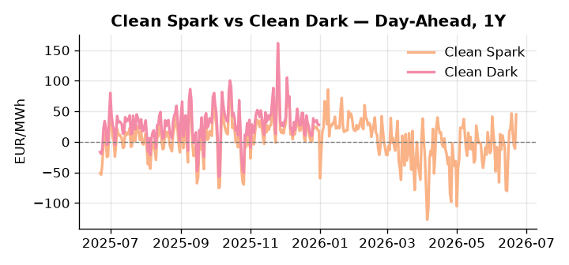
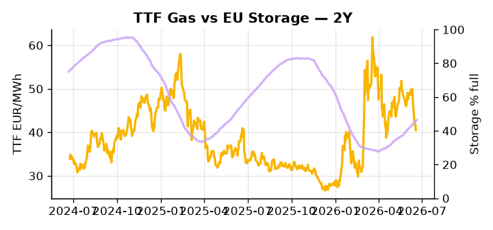

# European Cross-Commodity Risk Pack: Gas + Carbon → Power Curve Implications

**Daily desk brief — 2026-06-22**  
_Author: Sumer Sener · sumerberksener@gmail.com_  
_Generated by `scripts/generate_brief.py`. AI narrative + news themes via Anthropic Claude._

> **Data-freshness caveat:** Clean Dark (last 2025-12-31, 173d old); Coal (last 2025-12-26, 178d old). Numbers below should be read with this in mind.

## 1 · Executive summary

**TL;DR — Clean Spark at 94th-percentile (44.83 EUR/MWh) amid tight EU storage (14.5 pp below seasonal); LNG bidding war with Asia threatens winter fill and TTF upside.**

Clean Spark at 44.83 EUR/MWh — a 94th-percentile reading — is the dominant signal this morning, confirming gas-fired generation firmly in-the-money and thermal dispatch supported as coal sits at the 7th percentile (96 USD/t), though with coal and clean dark data 173–178 days old the dark spread is indicative not bankable. EU storage at 46.4% full, 14.5 percentage points below the five-year seasonal average, keeps the refill trajectory under pressure heading into autumn, with Asia actively outbidding European buyers for LNG cargoes adding direct TTF upside risk and compressing headroom on winter fill. EUA sits in a market where 2025 emissions rose versus 2024 and the linear reduction trajectory is under scrutiny, as the Commission debates carbon backstop measures and MSR intake acceleration for Q3 2026 — a slow-motion supply tightening that introduces near-term EUA volatility and keeps fossil dispatch economics unsettled. AI baseload demand growth supports the extended power curve into 2027–28, partially offsetting any softening from renewables currently running at the 64th percentile of load share. Gas tightness at the 94th-percentile spark spread AND EUA policy pressure from MSR review AND clean dark spreads indicative-only keep the front-curve regime extended, with the Asia LNG bidding war the live geopolitical driver pulling front-curve risk wider even as Cal+1 structure holds anchored to the storage-refill narrative.

_Generated by **claude-sonnet-4-6** via Anthropic API (two-pass extract→narrate). Prompts/responses logged to `ai/logs/`._
_Next-5d temperature anomaly — DE +3.3°C / FR +12.2°C / GB +6.9°C vs 5-yr seasonal normal (Open-Meteo)._

## 2 · Monitor metrics

**Primary (cross-commodity headline tiles)**

| Metric | As of | Latest | Unit | 1d Δ | 1w Δ | 5y pctile | Headline |
|---|---|---:|---|---:|---:|---:|---|
| TTF Gas | 2026-06-18 | 40.52 | EUR/MWh | -3.32% | -13.48% | 48 | Within typical range |
| EU Storage | 2026-06-20 | 46.40 | % full | +0.67% | +3.42% | 21 | 14.5 pp below the 5-yr seasonal average |
| EUA Carbon | 2026-06-18 | 33.38 | EUR/tCO2 | +0.27% | +2.10% | 40 | Within typical range |
| DE Power | 2026-06-22 | 138.16 | EUR/MWh | +67.84% | +55.79% | 76 | Within typical range |
| GB Power | 2026-06-22 | 124.72 | EUR/MWh | +2.10% | +30.41% | 89 | Within typical range |
| Renewables | 2026-06-21 | 48.63 | % of load | -6.84% | -32.99% | 64 | Within typical range |
| Clean Spark | 2026-06-22 | 44.83 | EUR/MWh | +55.84 | +46.56 | 94 | 94th-percentile of 5-yr range — historically high |
| Clean Dark | 2025-12-31 (STALE) | 27.95 | EUR/MWh | -0.56 | +11.63 | 49 | Within typical range |

**Fundamentals inputs** _(feed derived metrics; not separately traded)_

| Metric | As of | Latest | Unit | 1d Δ | 1w Δ | 5y pctile | Headline |
|---|---|---:|---|---:|---:|---:|---|
| Coal | 2025-12-26 (STALE) | 96.00 | USD/t | -0.57% | +0.08% | 7 | 7th-percentile of 5-yr range — historically low |

_Spreads → abs EUR/MWh deltas; others → pct. Weekly Δ uses 5d trailing means. Full history in `data/<metric>.csv`._

## 3 · Gas + LNG arb

**TTF front-month** prints at 40.52 EUR/MWh — _Within typical range_.
**EU storage** at 46.4% full (-14.5 pp vs 5-yr seasonal avg) — _14.5 pp below the 5-yr seasonal average_.
**TTF − JKM (LNG arb)** at -5.08 EUR/MWh (JKM 15.31 USD/MMBtu) — JKM richer than TTF — Asia pulls cargoes, marginal European tightening risk.

## 4 · Carbon (EU ETS)

**EUA December** prints at 33.38 EUR/tCO2 — _Within typical range_. A euro of EUA adds ~0.37 EUR/MWh to gas-fired and ~0.85 EUR/MWh to coal-fired generation cost; strength compresses the dark spread faster than the spark.

**EU vs UK ETS** — Cobblestone's emissions desk trades EUA and UKA. Post-Brexit auction reform narrowed the UKA discount to EUA from £20+/t to single-digit £/t; CBAM phase-in pulls UK compliance demand toward parity. EUA−UKA basis remains a tradable cross-market signal.

**Supply / policy signal** — _EU emissions rose 2025; linear reduction trajectory at risk; Commission reviewing carbon backstop measures and MSR intake triggers for Q3 2026._  
Side: `policy` · Polarity: `neutral` · Source: Politico EU Energy

EUA near-term volatility as policy response debated; potential MSR intake acceleration or backstop carbon price floor would shift fossil dispatch economics and power marginal cost.

_Surfaced from today's news flow by the AI extract pass (`ai/prompts/extract_v1.md` → `carbon_policy_signal`)._

## 5 · Power — Day-Ahead & curve

**DE day-ahead baseload** at 138.16 EUR/MWh — _Within typical range_.
**GB day-ahead baseload** at 124.72 EUR/MWh — _Within typical range_.
**DE − GB spread** at +13.44 EUR/MWh (DE premium) — drives interconnector flow direction.
**Cross-border net flows (Power Transportation):** DE↔FR -45.5 GWh (FR export); GB↔FR -85.2 GWh (FR export); NL↔DE +6.2 GWh (NL export).

**Clean spark spread** at +44.83 EUR/MWh — _94th-percentile of 5-yr range — historically high_. Bridge from gas + carbon fundamentals to gas-fired economics; sustained positive spark = TTF moves transmit directly into the power curve.

**Curve shape:** DA → W+1 → M+1 → Q+1 → Cal+1 → Cal+2 = 138 / 99 / 99 / 99 / 99 / 99 EUR/MWh — **Backwardation** (DA −Cal+1 spread +40 EUR/MWh). Forwards are seasonality projections — see Methodology.

{width=49%} {width=49%}

**This week ahead**

- **Tue** 08:00 UTC — AGSI+ daily storage print: First read on the week's gas injection / withdrawal pace; sets the tone for TTF curve shape.
- **Wed** 09:00 UTC — EEX EUA primary auction (Mon–Thu daily; Wed is largest volume): Supply-side EUA signal; auction clearing relative to spot reads as ETS demand strength.
- **Wed** — ENTSO-E DE_LU + GB next-week wind/solar forecast refresh: Sets the residual-load curve a week out; outsized prints move power Cal+1 directionally.
- **Thu** — European Council summit (19 June): Trade/energy policy direction; watch for China, LNG, deregulation signals impacting gas/power outlook. _(news-extracted)_

**Scenarios (1w horizon)**

| | Summary | TTF | DE Power |
|---|---|---:|---:|
| **Base** | TTF steady around 40 EUR/MWh; Clean Spark elevated on thermal merit; storage refill gradual. | −2% to +3% | −5% to +5% |
| **Upside** | Asia LNG bidding war intensifies; winter 2026–27 storage fill risk forces TTF and power curve higher. | +8% to +15% | +12% to +18% |
| **Downside** | Permian surge and US LNG export ramp deliver ample global supply; renewables forecast improves on mild weather. | −6% to −12% | −8% to −14% |

_Illustrative, not forecasts. Magnitudes sized off historical sensitivity; AI-generated from today's extract pass._

## 6 · Today's themes

**Weather watch (next 7d)**
- **Heat dome · FR · Mon 22 – Sun 28 Jun** — peak +13.4°C vs normal. Bullish FR power on AC load and possible nuclear river-cooling derating. Watch FR-nuclear availability prints if heat persists.
- **Storm · GB · Mon 22 – Sun 28 Jun** — peak gust 44 m/s (~157 km/h) on Fri 26 Jun. GB wind capacity is large — DA likely soft. Cut-off risk if gusts exceed safety thresholds; opposite tail (sudden tightening) possible.

**Watchlist (1–4 weeks)**
- European Council summit (Thu 19 June) — trade/energy policy direction; watch for China, LNG, deregulation signals.
- EU methane rule renegotiation outcome — Q3 2026 Commission decision; upstream cost/supply pass-through risk.

_Risk framing — built within a discipline of clear limits and continuous monitoring; observations here are framed as risk inputs, not directional calls. Positioning decisions remain with the desk._
_Methodology + sources: **README §Methodology**. Numbers auditable via the snapshot JSONs. Rule-based / informational — not investment advice._