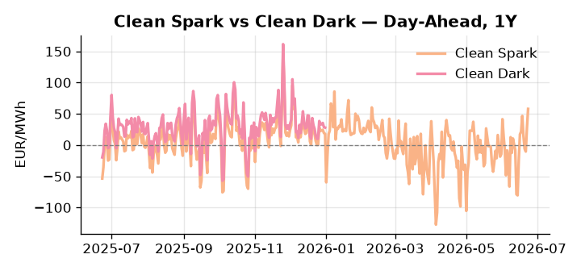
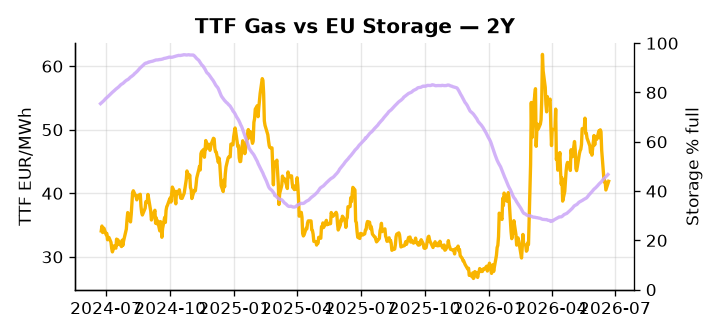

# European Cross-Commodity Risk Pack: Gas + Carbon → Power Curve Implications

**Daily desk brief — 2026-06-23**  
_Author: Sumer Sener · sumerberksener@gmail.com_  
_Generated by `scripts/generate_brief.py`. AI narrative + news themes via Anthropic Claude._

> **Data-freshness caveat:** Clean Dark (last 2025-12-31, 174d old); Coal (last 2025-12-26, 179d old). Numbers below should be read with this in mind.

## 1 · Executive summary

**TL;DR — Clean Spark at 96th-percentile amid storage 14.4 pp below seasonal; Asian LNG competition tightens European gas supply while emissions rise, signalling structural gas demand headwinds.**

Clean Spark at the 96th percentile — 57.89 EUR/MWh — is the dominant signal: gas-fired generation is structurally in-the-money and the fuel-switch regime is not cyclical noise but a persistent market state, with coal at the 7th percentile reinforcing that coal plant economics remain broken. Storage at 46.7% (22nd percentile, 14.4 percentage points below seasonal) keeps the supply picture tight heading into summer, with injection pace now the single most critical lever for H1 2027 winter headroom and forward curve risk premium through Q4. Asian LNG bidding competition is compressing Europe's access to spot cargoes, leaving TTF vulnerable to 5–10% upside if Asian bids harden — a supply-competition risk that sits directly beneath current pricing. EUA policy adds a bullish undertow: with EU-UK ETS linkage talks stalled by the UK political crisis on an unknown rescheduling date, stalled decarbonisation and rising 2025 emissions point toward stricter Phase 4 auction schedules or MSR drawdowns, supporting EUA futures and widening the UKA-EUA arb window — note that with coal and clean dark data 174–179 days stale, the dark spread is indicative not bankable and emphasis falls on current clean spark and DE power reads. With Asian LNG competition asserting direct pressure on European spot supply, gas tightness AND EUA policy-bullish drift AND clean spark extended at the 96th percentile keep the front-curve risk premium anchored and the Cal+1 regime firmly in a structural gas-in-the-money configuration.

_Generated by **claude-sonnet-4-6** via Anthropic API (two-pass extract→narrate). Prompts/responses logged to `ai/logs/`._
_Next-5d temperature anomaly — DE +5.6°C / FR +7.6°C / GB +8.9°C vs 5-yr seasonal normal (Open-Meteo)._

## 2 · Monitor metrics

**Primary (cross-commodity headline tiles)**

| Metric | As of | Latest | Unit | 1d Δ | 1w Δ | 5y pctile | Headline |
|---|---|---:|---|---:|---:|---:|---|
| TTF Gas | 2026-06-22 | 41.89 | EUR/MWh | +3.37% | -14.86% | 50 | Within typical range |
| EU Storage | 2026-06-21 | 46.72 | % full | +0.69% | +3.27% | 22 | 14.4 pp below the 5-yr seasonal average |
| EUA Carbon | 2026-06-22 | 33.87 | EUR/tCO2 | +1.47% | +2.95% | 44 | Within typical range |
| DE Power | 2026-06-23 | 154.13 | EUR/MWh | +24.36% | +18.45% | 80 | Within typical range |
| GB Power | 2026-06-23 | 113.34 | EUR/MWh | -8.62% | +6.79% | 77 | Within typical range |
| Renewables | 2026-06-22 | 43.33 | % of load | -10.89% | -26.70% | 54 | Within typical range |
| Clean Spark | 2026-06-23 | 57.89 | EUR/MWh | +30.19 | +20.47 | 96 | 96th-percentile of 5-yr range — historically high |
| Clean Dark | 2025-12-31 (STALE) | 27.95 | EUR/MWh | -0.56 | +11.63 | 49 | Within typical range |

**Fundamentals inputs** _(feed derived metrics; not separately traded)_

| Metric | As of | Latest | Unit | 1d Δ | 1w Δ | 5y pctile | Headline |
|---|---|---:|---|---:|---:|---:|---|
| Coal | 2025-12-26 (STALE) | 96.00 | USD/t | -0.57% | +0.08% | 7 | 7th-percentile of 5-yr range — historically low |

_Spreads → abs EUR/MWh deltas; others → pct. Weekly Δ uses 5d trailing means. Full history in `data/<metric>.csv`._

## 3 · Gas + LNG arb

**TTF front-month** prints at 41.89 EUR/MWh — _Within typical range_.
**EU storage** at 46.7% full (-14.4 pp vs 5-yr seasonal avg) — _14.4 pp below the 5-yr seasonal average_.
**TTF − JKM (LNG arb)** at -5.32 EUR/MWh (JKM 15.86 USD/MMBtu) — JKM richer than TTF — Asia pulls cargoes, marginal European tightening risk.

## 4 · Carbon (EU ETS)

**EUA December** prints at 33.87 EUR/tCO2 — _Within typical range_. A euro of EUA adds ~0.37 EUR/MWh to gas-fired and ~0.85 EUR/MWh to coal-fired generation cost; strength compresses the dark spread faster than the spark.

**EU vs UK ETS** — Cobblestone's emissions desk trades EUA and UKA. Post-Brexit auction reform narrowed the UKA discount to EUA from £20+/t to single-digit £/t; CBAM phase-in pulls UK compliance demand toward parity. EUA−UKA basis remains a tradable cross-market signal.

**Supply / policy signal** — _EU-UK emissions trading agreement talks delayed by UK political crisis; rescheduling date unknown. EU emissions rose 2025, stalling decarbonisation; stricter Phase 4 auction schedules or MSR drawdowns likely._  
Side: `policy` · Polarity: `bullish EUA` · Source: Politico EU Energy

Stalled decarbonisation forces tighter EU cap mechanics; MSR drawdowns and auction compression will support EUA futures. Linkage delay widens UKA-EUA arb window and defers regulatory certainty on cross-border trading, affecting power generation carbon-cost assumptions.

_Surfaced from today's news flow by the AI extract pass (`ai/prompts/extract_v1.md` → `carbon_policy_signal`)._

## 5 · Power — Day-Ahead & curve

**DE day-ahead baseload** at 154.13 EUR/MWh — _Within typical range_.
**GB day-ahead baseload** at 113.34 EUR/MWh — _Within typical range_.
**DE − GB spread** at +40.79 EUR/MWh (DE premium) — drives interconnector flow direction.
**Cross-border net flows (Power Transportation):** DE↔FR -43.8 GWh (FR export); GB↔FR -71.5 GWh (FR export); NL↔DE +36.3 GWh (NL export).

**Clean spark spread** at +57.89 EUR/MWh — _96th-percentile of 5-yr range — historically high_. Bridge from gas + carbon fundamentals to gas-fired economics; sustained positive spark = TTF moves transmit directly into the power curve.

**Curve shape:** DA → W+1 → M+1 → Q+1 → Cal+1 → Cal+2 = 154 / 102 / 102 / 102 / 102 / 102 EUR/MWh — **Backwardation** (DA −Cal+1 spread +52 EUR/MWh). Forwards are seasonality projections — see Methodology.

{width=49%} {width=49%}

**This week ahead**

- **Tue** 08:00 UTC — AGSI+ daily storage print: First read on the week's gas injection / withdrawal pace; sets the tone for TTF curve shape.
- **Wed** 09:00 UTC — EEX EUA primary auction (Mon–Thu daily; Wed is largest volume): Supply-side EUA signal; auction clearing relative to spot reads as ETS demand strength.
- **Wed** — ENTSO-E DE_LU + GB next-week wind/solar forecast refresh: Sets the residual-load curve a week out; outsized prints move power Cal+1 directionally.
- **Fri** — European Council energy/trade agenda closure: May rescheduled EU-UK ETS linkage summit date; confirms regulatory clarity timeline for carbon arbitrage and cross-border trading mechanics. _(news-extracted)_

**Scenarios (1m horizon)**

| | Summary | TTF | DE Power |
|---|---|---:|---:|
| **Base** | Storage refill steady; TTF holds 40–45 range; Clean Spark remains 50–60 EUR/MWh; gas-in-money regime persists. | ±1-3% | ±2-4% |
| **Upside** | Asian LNG bids surge; European spot tightens; cold front or data-centre demand surprise; storage refill lags seasonal norm. | +5-10% | +8-12% |
| **Downside** | Warm summer, EU demand softens; Asian LNG bids ease; storage injection accelerates; TTF front normalises to 35–40 range. | -3-6% | -5-8% |

_Illustrative, not forecasts. Magnitudes sized off historical sensitivity; AI-generated from today's extract pass._

## 6 · Today's themes

**Weather watch (next 7d)**
- **Heat dome · FR · Tue 23 – Sat 27 Jun** — peak +10.4°C vs normal. Bullish FR power on AC load and possible nuclear river-cooling derating. Watch FR-nuclear availability prints if heat persists.
- **Heat dome · GB · Tue 23 – Sun 28 Jun** — peak +10.5°C vs normal. Modest bullish GB power on cooling demand; less heating-demand downside than continental peers (UK AC penetration is lower).

**Watchlist (1–4 weeks)**
- European Council trade/energy agenda closure (mid-late June 2026).
- EU-UK summit rescheduling for emissions trading linkage finalisation.

_Risk framing — built within a discipline of clear limits and continuous monitoring; observations here are framed as risk inputs, not directional calls. Positioning decisions remain with the desk._
_Methodology + sources: **README §Methodology**. Numbers auditable via the snapshot JSONs. Rule-based / informational — not investment advice._