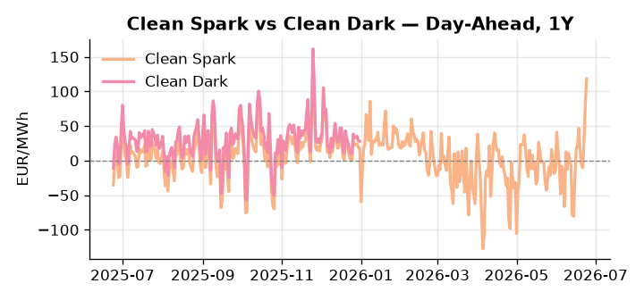
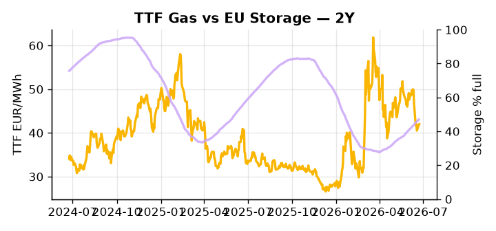

# European Cross-Commodity Risk Pack: Gas + Carbon → Power Curve Implications

**Daily desk brief — 2026-06-24**  
_Author: Sumer Sener · sumerberksener@gmail.com_  
_Generated by `scripts/generate_brief.py`. AI narrative + news themes via Anthropic Claude._

> **Data-freshness caveat:** Clean Dark (last 2025-12-31, 175d old); Coal (last 2025-12-26, 180d old). Numbers below should be read with this in mind.

## 1 · Executive summary

**TL;DR — Clean Spark at 99th-percentile (118.24 EUR/MWh) amid extreme heat and low storage (47% full, 14.5 pp below seasonal); gas weakly bid despite LNG competition tightening.**

Clean Spark at the 99th percentile (118.24 EUR/MWh) is the dominant signal: extreme European heat is compressing day-ahead margins and pushing real-time premiums toward near-capacity stress, with GB Power equally pinned at the 99th percentile (162.81 EUR/MWh) as interconnector constraints widen the island premium and lift the EU wholesale floor via arbitrage. Storage at 46.97% full — 14.5 percentage points below seasonal norm at the 22nd percentile — materially limits gas swing capacity, and rising Asian LNG competition is narrowing the import window that would otherwise relieve TTF, which sits at a deceptively neutral 51st percentile. EUA at 33.29 EUR/t (39th percentile) holds a mid-range anchor, though with EU greenhouse gas emissions confirmed higher in 2025, accelerated phase-IV cap tightening and coal phase-out pressure build a policy-driven floor beneath current levels that the spot percentile underprices. With coal data 180 days old and clean dark spreads stale by 175 days, the dark spread is indicative not bankable — live proxies in DE Power (89th percentile) and Clean Spark confirm the merit-order tilted firmly toward gas and renewables. Gas tightness from storage deficit and LNG competition AND EUA mid-range with a bullish policy supply tail AND clean spark deep in-the-money keep the front-curve regime in extended stress, with post-Starmer UK political uncertainty clouding ETS linkage timing and adding tail-risk to front-curve risk via GB-DE arbitrage dislocation.

_Generated by **claude-sonnet-4-6** via Anthropic API (two-pass extract→narrate). Prompts/responses logged to `ai/logs/`._
_Next-5d temperature anomaly — DE +7.7°C / GB +10.5°C vs 5-yr seasonal normal (Open-Meteo)._

## 2 · Monitor metrics

**Primary (cross-commodity headline tiles)**

| Metric | As of | Latest | Unit | 1d Δ | 1w Δ | 5y pctile | Headline |
|---|---|---:|---|---:|---:|---:|---|
| TTF Gas | 2026-06-23 | 42.01 | EUR/MWh | +0.30% | -12.45% | 51 | Within typical range |
| EU Storage | 2026-06-22 | 46.97 | % full | +0.54% | +3.14% | 22 | 14.5 pp below the 5-yr seasonal average |
| EUA Carbon | 2026-06-23 | 33.29 | EUR/tCO2 | -1.71% | +2.33% | 39 | Within typical range |
| DE Power | 2026-06-24 | 214.52 | EUR/MWh | +22.49% | +23.71% | 89 | extended 3.4σ above the 50d trend |
| GB Power | 2026-06-24 | 162.81 | EUR/MWh | -19.69% | +23.70% | 99 | 99th-percentile of 5-yr range — historically high |
| Renewables | 2026-06-23 | 36.89 | % of load | -14.86% | -16.25% | 38 | Within typical range |
| Clean Spark | 2026-06-24 | 118.24 | EUR/MWh | +39.39 | +26.32 | 99 | 99th-percentile of 5-yr range — historically high |
| Clean Dark | 2025-12-31 (STALE) | 27.95 | EUR/MWh | -0.56 | +11.63 | 49 | Within typical range |

**Fundamentals inputs** _(feed derived metrics; not separately traded)_

| Metric | As of | Latest | Unit | 1d Δ | 1w Δ | 5y pctile | Headline |
|---|---|---:|---|---:|---:|---:|---|
| Coal | 2025-12-26 (STALE) | 96.00 | USD/t | -0.57% | +0.08% | 7 | 7th-percentile of 5-yr range — historically low |

_Spreads → abs EUR/MWh deltas; others → pct. Weekly Δ uses 5d trailing means. Full history in `data/<metric>.csv`._

## 3 · Gas + LNG arb

**TTF front-month** prints at 42.01 EUR/MWh — _Within typical range_.
**EU storage** at 47.0% full (-14.5 pp vs 5-yr seasonal avg) — _14.5 pp below the 5-yr seasonal average_.
**TTF − JKM (LNG arb)** at -4.99 EUR/MWh (JKM 15.74 USD/MMBtu) — JKM richer than TTF — Asia pulls cargoes, marginal European tightening risk.

## 4 · Carbon (EU ETS)

**EUA December** prints at 33.29 EUR/tCO2 — _Within typical range_. A euro of EUA adds ~0.37 EUR/MWh to gas-fired and ~0.85 EUR/MWh to coal-fired generation cost; strength compresses the dark spread faster than the spark.

**EU vs UK ETS** — Cobblestone's emissions desk trades EUA and UKA. Post-Brexit auction reform narrowed the UKA discount to EUA from £20+/t to single-digit £/t; CBAM phase-in pulls UK compliance demand toward parity. EUA−UKA basis remains a tradable cross-market signal.

**Supply / policy signal** — _EU greenhouse gas emissions rose in 2025; stagnant decarbonization progress triggers tighter phase-III/IV ETS caps and accelerated coal phase-out pressure._  
Side: `supply` · Polarity: `bullish EUA` · Source: Politico EU Energy

Missed targets will force regulator to tighten EUA issuance in future phases and/or accelerate coal retirement, supporting thermal generation margins and raising EUA floor despite current neutral percentile (39th).

_Surfaced from today's news flow by the AI extract pass (`ai/prompts/extract_v1.md` → `carbon_policy_signal`)._

## 5 · Power — Day-Ahead & curve

**DE day-ahead baseload** at 214.52 EUR/MWh — _extended 3.4σ above the 50d trend_.
**GB day-ahead baseload** at 162.81 EUR/MWh — _99th-percentile of 5-yr range — historically high_.
**DE − GB spread** at +51.71 EUR/MWh (DE premium) — drives interconnector flow direction.
**Cross-border net flows (Power Transportation):** DE↔FR -32.8 GWh (FR export); GB↔FR -44.2 GWh (FR export); NL↔DE +13.8 GWh (NL export).

**Clean spark spread** at +118.24 EUR/MWh — _99th-percentile of 5-yr range — historically high_. Bridge from gas + carbon fundamentals to gas-fired economics; sustained positive spark = TTF moves transmit directly into the power curve.

**Curve shape:** DA → W+1 → M+1 → Q+1 → Cal+1 → Cal+2 = 215 / 111 / 111 / 111 / 111 / 111 EUR/MWh — **Backwardation** (DA −Cal+1 spread +103 EUR/MWh). Forwards are seasonality projections — see Methodology.

{width=49%} {width=49%}

**This week ahead**

- **Wed** 09:00 UTC — EEX EUA primary auction (Mon–Thu daily; Wed is largest volume): Supply-side EUA signal; auction clearing relative to spot reads as ETS demand strength.
- **Wed** — ENTSO-E DE_LU + GB next-week wind/solar forecast refresh: Sets the residual-load curve a week out; outsized prints move power Cal+1 directionally.
- **Fri** 14:30 UTC — EIA weekly natural gas storage report: US storage trajectory anchors LNG export pricing into NW Europe — direct TTF transmission.
- **Wed** — European Council: China trade agenda: Energy-tech supply-chain outcome may constrain renewables rollout; indirect upside to power prices if decarbonization delays. _(news-extracted)_

**Scenarios (24-72h horizon)**

| | Summary | TTF | DE Power |
|---|---|---:|---:|
| **Base** | Heat stress sustains peak demand through week; storage steady-state; TTF neutral; Clean Spark elevated but stable. | ±1-2% | +5-8% |
| **Upside** | Cooling-water constraints trigger nuclear/hydro outages; LNG Asia bidding tightens cargoes further; storage refill slows. | +8-12% | +12-18% |
| **Downside** | Heat wave abates or demand softens; LNG cargoes divert to EU; storage injection accelerates; mechanical relief from coal/gas. | -5-8% | -8-12% |

_Illustrative, not forecasts. Magnitudes sized off historical sensitivity; AI-generated from today's extract pass._

## 6 · Today's themes

**Weather watch (next 7d)**
- **Heat dome · DE · Wed 24 – Sun 28 Jun** — peak +11.5°C vs normal. Mild bullish DE power on cooling load, but gas demand softens. Spark spread compresses; renewables (solar) likely strong — watch DA print fall midday.
- **Heat dome · GB · Wed 24 – Tue 30 Jun** — peak +13.6°C vs normal. Modest bullish GB power on cooling demand; less heating-demand downside than continental peers (UK AC penetration is lower).

**Watchlist (1–4 weeks)**
- EU-UK summit rescheduled after Starmer resignation—emissions trading deal timing now uncertain.
- European Council agenda includes China trade competition; outcome may affect EU energy-tech supply chains.

_Risk framing — built within a discipline of clear limits and continuous monitoring; observations here are framed as risk inputs, not directional calls. Positioning decisions remain with the desk._
_Methodology + sources: **README §Methodology**. Numbers auditable via the snapshot JSONs. Rule-based / informational — not investment advice._