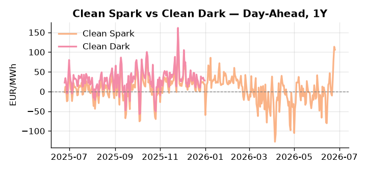
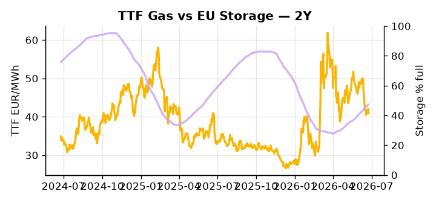

# European Cross-Commodity Risk Pack: Gas + Carbon → Power Curve Implications

**Daily desk brief — 2026-06-25**  
_Author: Sumer Sener · sumerberksener@gmail.com_  
_Generated by `scripts/generate_brief.py`. AI narrative + news themes via Anthropic Claude._

> **Data-freshness caveat:** Clean Dark (last 2025-12-31, 176d old); Coal (last 2025-12-26, 181d old). Numbers below should be read with this in mind.

## 1 · Executive summary

**TL;DR — Clean Spark at 99th-percentile amid extreme heat, storage 14.5 pp below seasonal, and Asian LNG competition threaten winter refill—gas structural tightness dominates.**

Clean Spark at 106 EUR/MWh (99th percentile) is the dominant signal: heatwave conditions have simultaneously collapsed gas-to-coal switching and derailed hydro and thermal availability, driving DE Power to 200.1 EUR/MWh (87th percentile) on a 226% monthly surge while storage sits at 47.2% — 14.5 percentage points below seasonal norms at the 22nd percentile. Asian LNG bidders are outcompeting EU importers for cargoes, compounding the structural gas tightness and putting the H2 refill trajectory under serious pressure. EUA mid-range carries its own uncertainty as the EU-UK ETS linkage deal is postponed following Keir Starmer's resignation with no rescheduled summit date confirmed, deferring UKA-EUA spread arbitrage clarity and leaving cross-border hedging mechanics suspended — a slow-motion policy overhang on the carbon side. With coal data 181 days old and Clean Dark spreads 176 days stale, the dark spread is indicative not bankable, and intraday positioning should be anchored to the fresh TTF, EUA, and power series only. Gas tightness at the 22nd-percentile storage level AND carbon headroom compressed by ETS linkage uncertainty AND Clean Spark deep in-the-money at the 99th percentile keep the front-curve regime extended, with Asian LNG competition the live geopolitical driver pulling front-curve risk wider and leaving Cal+1 gas premium structurally supported through the refill season.

_Generated by **claude-sonnet-4-6** via Anthropic API (two-pass extract→narrate). Prompts/responses logged to `ai/logs/`._
_Next-5d temperature anomaly — DE +7.8°C / GB +7.4°C vs 5-yr seasonal normal (Open-Meteo)._

## 2 · Monitor metrics

**Primary (cross-commodity headline tiles)**

| Metric | As of | Latest | Unit | 1d Δ | 1w Δ | 5y pctile | Headline |
|---|---|---:|---|---:|---:|---:|---|
| TTF Gas | 2026-06-24 | 40.88 | EUR/MWh | -2.71% | -10.19% | 48 | Within typical range |
| EU Storage | 2026-06-23 | 47.20 | % full | +0.49% | +3.07% | 22 | 14.5 pp below the 5-yr seasonal average |
| EUA Carbon | 2026-06-24 | 33.49 | EUR/tCO2 | +0.60% | +1.54% | 41 | Within typical range |
| DE Power | 2026-06-25 | 200.10 | EUR/MWh | -3.69% | +39.48% | 87 | extended 2.7σ above the 50d trend |
| GB Power | 2026-06-25 | 144.29 | EUR/MWh | -0.48% | +22.31% | 97 | 97th-percentile of 5-yr range — historically high |
| Renewables | 2026-06-24 | 37.81 | % of load | +2.48% | -3.72% | 40 | Within typical range |
| Clean Spark | 2026-06-25 | 106.02 | EUR/MWh | -7.67 | +44.31 | 99 | 99th-percentile of 5-yr range — historically high |
| Clean Dark | 2025-12-31 (STALE) | 27.95 | EUR/MWh | -0.56 | +11.63 | 49 | Within typical range |

**Fundamentals inputs** _(feed derived metrics; not separately traded)_

| Metric | As of | Latest | Unit | 1d Δ | 1w Δ | 5y pctile | Headline |
|---|---|---:|---|---:|---:|---:|---|
| Coal | 2025-12-26 (STALE) | 96.00 | USD/t | -0.57% | +0.08% | 7 | 7th-percentile of 5-yr range — historically low |

_Spreads → abs EUR/MWh deltas; others → pct. Weekly Δ uses 5d trailing means. Full history in `data/<metric>.csv`._

## 3 · Gas + LNG arb

**TTF front-month** prints at 40.88 EUR/MWh — _Within typical range_.
**EU storage** at 47.2% full (-14.5 pp vs 5-yr seasonal avg) — _14.5 pp below the 5-yr seasonal average_.
**TTF − JKM (LNG arb)** at -5.75 EUR/MWh (JKM 15.55 USD/MMBtu) — JKM richer than TTF — Asia pulls cargoes, marginal European tightening risk.

## 4 · Carbon (EU ETS)

**EUA December** prints at 33.49 EUR/tCO2 — _Within typical range_. A euro of EUA adds ~0.37 EUR/MWh to gas-fired and ~0.85 EUR/MWh to coal-fired generation cost; strength compresses the dark spread faster than the spark.

**EU vs UK ETS** — Cobblestone's emissions desk trades EUA and UKA. Post-Brexit auction reform narrowed the UKA discount to EUA from £20+/t to single-digit £/t; CBAM phase-in pulls UK compliance demand toward parity. EUA−UKA basis remains a tradable cross-market signal.

**Supply / policy signal** — _EU-UK ETS linkage deal postponed following Keir Starmer resignation; July 22 summit reschedule date TBD._  
Side: `policy` · Polarity: `neutral` · Source: Politico EU Energy

Delay defers UKA-EUA spread arbitrage clarity and cross-border hedging mechanics; valuation uncertainty on both blocs persists until summit rescheduled.

_Surfaced from today's news flow by the AI extract pass (`ai/prompts/extract_v1.md` → `carbon_policy_signal`)._

## 5 · Power — Day-Ahead & curve

**DE day-ahead baseload** at 200.10 EUR/MWh — _extended 2.7σ above the 50d trend_.
**GB day-ahead baseload** at 144.29 EUR/MWh — _97th-percentile of 5-yr range — historically high_.
**DE − GB spread** at +55.81 EUR/MWh (DE premium) — drives interconnector flow direction.
**Cross-border net flows (Power Transportation):** DE↔FR -26.6 GWh (FR export); GB↔FR -67.9 GWh (FR export); NL↔DE -11.8 GWh (DE export).

**Clean spark spread** at +106.02 EUR/MWh — _99th-percentile of 5-yr range — historically high_. Bridge from gas + carbon fundamentals to gas-fired economics; sustained positive spark = TTF moves transmit directly into the power curve.

**Curve shape:** DA → W+1 → M+1 → Q+1 → Cal+1 → Cal+2 = 200 / 115 / 115 / 115 / 115 / 115 EUR/MWh — **Backwardation** (DA −Cal+1 spread +85 EUR/MWh). Forwards are seasonality projections — see Methodology.

{width=49%} {width=49%}

**This week ahead**

- **Fri** 14:30 UTC — EIA weekly natural gas storage report: US storage trajectory anchors LNG export pricing into NW Europe — direct TTF transmission.
- **Thu** 14:30 UTC — US EIA weekly crude inventories: Crude — and via crack spreads, refined-products — feed back into LNG arb economics.
- **Fri** — ENTSO-E weekly day-ahead volumes / system-balance summary: Reads the European generation mix in last 7d — confirms or breaks the Cal+1 thesis.
- **Mon** — Heatwave hydro impact (intraday): High temps reduce water availability for thermal cooling and hydro generation; DA power spreads widen, Cal+1 rally risk. _(news-extracted)_

**Scenarios (24-72h horizon)**

| | Summary | TTF | DE Power |
|---|---|---:|---:|
| **Base** | Heatwave persists, hydro/thermal constrained, Clean Spark elevated, storage build slow, gas soft on weak demand. | -2 to +3% | -5 to +8% |
| **Upside** | Heatwave extends, cooling-water scarcity worsens thermal derate, hydro collapse, Asian LNG bids spike—gas and power front-month rally. | +8 to +15% | +15 to +25% |
| **Downside** | Heat breaks mid-week, hydro inflows recover, thermal units return online, DA supply pressure eases, gas seasonal softness dominates. | -8 to -12% | -12 to -18% |

_Illustrative, not forecasts. Magnitudes sized off historical sensitivity; AI-generated from today's extract pass._

## 6 · Today's themes

**Weather watch (next 7d)**
- **Heat dome · DE · Thu 25 – Mon 29 Jun** — peak +12.4°C vs normal. Mild bullish DE power on cooling load, but gas demand softens. Spark spread compresses; renewables (solar) likely strong — watch DA print fall midday.
- **Heat dome · GB · Thu 25 – Sun 28 Jun** — peak +12.3°C vs normal. Modest bullish GB power on cooling demand; less heating-demand downside than continental peers (UK AC penetration is lower).

**Watchlist (1–4 weeks)**
- EU-UK ETS linkage summit rescheduled (new date TBD post-Starmer transition).
- Methane rule lobbying intensity — watch for Commission softening June–July.

_Risk framing — built within a discipline of clear limits and continuous monitoring; observations here are framed as risk inputs, not directional calls. Positioning decisions remain with the desk._
_Methodology + sources: **README §Methodology**. Numbers auditable via the snapshot JSONs. Rule-based / informational — not investment advice._