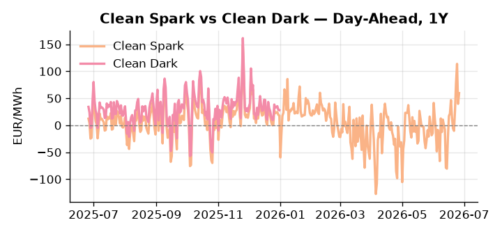
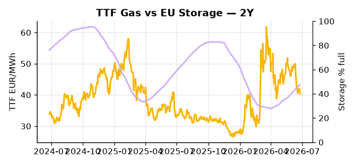

# European Cross-Commodity Risk Pack: Gas + Carbon → Power Curve Implications

**Daily desk brief — 2026-06-26**  
_Author: Sumer Sener · sumerberksener@gmail.com_  
_Generated by `scripts/generate_brief.py`. AI narrative + news themes via Anthropic Claude._

> **Data-freshness caveat:** Clean Dark (last 2025-12-31, 177d old); Coal (last 2025-12-26, 182d old). Numbers below should be read with this in mind.

## 1 · Executive summary

**TL;DR — Clean Spark at 96th percentile amid record heat and Hormuz tensions; storage 14.6 pp below seasonal lows creates sustained thermal scarcity into H2.**

Clean Spark at the 96th percentile (59.64 EUR/MWh) is the dominant signal this morning, driven by record European heat compressing thermal headroom and pushing intraday power volatility to unsustainable levels. EU storage sits at 47.43% — 14.6 percentage points below seasonal norms at the 22nd percentile — locking in a structural H2 thermal call that keeps gas-to-power switching firmly extended and refill pace the single most consequential variable for Q3–Q4 dispatch economics. EUA policy adds a slow-motion layer of uncertainty: with EU–UK ETS linking negotiations postponed into H2 2026 or beyond, UKA-EUA arbitrage horizons remain unresolved and bilateral carbon-curve shape asymmetry continues to distort multi-year power-generation hedging, keeping the carbon side anchored in limbo rather than clearing. With coal data 182 days old and clean-dark spreads stale by 177 days, the dark spread is indicative not bankable, meaning fuel-switch economics cannot be relied upon to anchor the thermal stack with confidence. With Hormuz tail-risk tightening LNG spare capacity and supporting the crude-to-gas arb floor, gas tightness AND carbon mid-range policy uncertainty AND clean spark deep in-the-money pull front-curve risk materially wider, while the Cal+1 regime remains contingent on whether the Hormuz corridor and summer storage inflow can reassert any structural relief before August.

_Generated by **claude-sonnet-4-6** via Anthropic API (two-pass extract→narrate). Prompts/responses logged to `ai/logs/`._
_Next-5d temperature anomaly — DE +7.3°C / FR +4.9°C vs 5-yr seasonal normal (Open-Meteo)._

## 2 · Monitor metrics

**Primary (cross-commodity headline tiles)**

| Metric | As of | Latest | Unit | 1d Δ | 1w Δ | 5y pctile | Headline |
|---|---|---:|---|---:|---:|---:|---|
| TTF Gas | 2026-06-25 | 40.40 | EUR/MWh | -1.15% | -7.61% | 47 | Within typical range |
| EU Storage | 2026-06-24 | 47.43 | % full | +0.49% | +3.04% | 22 | 14.6 pp below the 5-yr seasonal average |
| EUA Carbon | 2026-06-25 | 33.46 | EUR/tCO2 | -0.09% | +1.30% | 41 | Within typical range |
| DE Power | 2026-06-26 | 152.76 | EUR/MWh | +15.00% | +47.79% | 80 | Within typical range |
| GB Power | 2026-06-26 | 113.13 | EUR/MWh | -7.14% | +17.76% | 76 | Within typical range |
| Renewables | 2026-06-25 | 43.47 | % of load | +14.98% | +0.77% | 54 | Within typical range |
| Clean Spark | 2026-06-26 | 59.64 | EUR/MWh | +19.92 | +50.56 | 96 | 96th-percentile of 5-yr range — historically high |
| Clean Dark | 2025-12-31 (STALE) | 27.95 | EUR/MWh | -0.56 | +11.63 | 49 | Within typical range |

**Fundamentals inputs** _(feed derived metrics; not separately traded)_

| Metric | As of | Latest | Unit | 1d Δ | 1w Δ | 5y pctile | Headline |
|---|---|---:|---|---:|---:|---:|---|
| Coal | 2025-12-26 (STALE) | 96.00 | USD/t | -0.57% | +0.08% | 7 | 7th-percentile of 5-yr range — historically low |

_Spreads → abs EUR/MWh deltas; others → pct. Weekly Δ uses 5d trailing means. Full history in `data/<metric>.csv`._

## 3 · Gas + LNG arb

**TTF front-month** prints at 40.40 EUR/MWh — _Within typical range_.
**EU storage** at 47.4% full (-14.6 pp vs 5-yr seasonal avg) — _14.6 pp below the 5-yr seasonal average_.
**TTF − JKM (LNG arb)** at -5.83 EUR/MWh (JKM 15.39 USD/MMBtu) — JKM richer than TTF — Asia pulls cargoes, marginal European tightening risk.

## 4 · Carbon (EU ETS)

**EUA December** prints at 33.46 EUR/tCO2 — _Within typical range_. A euro of EUA adds ~0.37 EUR/MWh to gas-fired and ~0.85 EUR/MWh to coal-fired generation cost; strength compresses the dark spread faster than the spark.

**EU vs UK ETS** — Cobblestone's emissions desk trades EUA and UKA. Post-Brexit auction reform narrowed the UKA discount to EUA from £20+/t to single-digit £/t; CBAM phase-in pulls UK compliance demand toward parity. EUA−UKA basis remains a tradable cross-market signal.

**Supply / policy signal** — _EU–UK ETS linking negotiations postponed following UK political transition; bilateral agreement timeline extended into H2 2026 or beyond._  
Side: `policy` · Polarity: `neutral` · Source: Politico EU Energy

Delayed linkage prolongs UKA-EUA arbitrage uncertainty and free-allocation hedging horizon; extends bilateral carbon-curve shape asymmetry, affecting power-generation marginal cost hedging for multi-year contracts.

_Surfaced from today's news flow by the AI extract pass (`ai/prompts/extract_v1.md` → `carbon_policy_signal`)._

## 5 · Power — Day-Ahead & curve

**DE day-ahead baseload** at 152.76 EUR/MWh — _Within typical range_.
**GB day-ahead baseload** at 113.13 EUR/MWh — _Within typical range_.
**DE − GB spread** at +39.63 EUR/MWh (DE premium) — drives interconnector flow direction.
**Cross-border net flows (Power Transportation):** DE↔FR -38.5 GWh (FR export); GB↔FR -40.0 GWh (FR export); NL↔DE +14.6 GWh (NL export).

**Clean spark spread** at +59.64 EUR/MWh — _96th-percentile of 5-yr range — historically high_. Bridge from gas + carbon fundamentals to gas-fired economics; sustained positive spark = TTF moves transmit directly into the power curve.

**Curve shape:** DA → W+1 → M+1 → Q+1 → Cal+1 → Cal+2 = 153 / 111 / 111 / 111 / 111 / 111 EUR/MWh — **Backwardation** (DA −Cal+1 spread +42 EUR/MWh). Forwards are seasonality projections — see Methodology.

{width=49%} {width=49%}

**This week ahead**

- **Fri** 14:30 UTC — EIA weekly natural gas storage report: US storage trajectory anchors LNG export pricing into NW Europe — direct TTF transmission.
- **Fri** — ENTSO-E weekly day-ahead volumes / system-balance summary: Reads the European generation mix in last 7d — confirms or breaks the Cal+1 thesis.
- **Tue** 08:00 UTC — AGSI+ daily storage print: First read on the week's gas injection / withdrawal pace; sets the tone for TTF curve shape.
- **TBD** — EU–UK ETS summit rescheduled (date TBD): New date announcement will clarify bilateral carbon linkage timeline and UKA arbitrage hedging window. _(news-extracted)_

**Scenarios (24-72h | 1w horizon)**

| | Summary | TTF | DE Power |
|---|---|---:|---:|
| **Base** | Heat wave sustains peak demand; storage refill slow; Hormuz tensions contained; TTF drifts ±3%, DE power ±5%. | −2 to +1% | −3 to +7% |
| **Upside** | Hormuz escalation halts LNG shipments or forces reroute; crude spikes; arb-driven gas demand offsets methane-delay weakness. Heat extends into July. | +8 to +15% | +12 to +18% |
| **Downside** | European demand softens mid-week; cooling load subsides; Hormuz corridor reopens; methane cap deferral dampens supply-side cost. Storage inflow accelerates. | −5 to −12% | −8 to −14% |

_Illustrative, not forecasts. Magnitudes sized off historical sensitivity; AI-generated from today's extract pass._

## 6 · Today's themes

**Weather watch (next 7d)**
- **Heat dome · DE · Fri 26 – Tue 30 Jun** — peak +11.5°C vs normal. Mild bullish DE power on cooling load, but gas demand softens. Spark spread compresses; renewables (solar) likely strong — watch DA print fall midday.
- **Heat dome · FR · Fri 26 – Sun 28 Jun** — peak +10.2°C vs normal. Bullish FR power on AC load and possible nuclear river-cooling derating. Watch FR-nuclear availability prints if heat persists.

**Watchlist (1–4 weeks)**
- EU–UK ETS summit rescheduling (emissions deal timeline uncertain; watch for new date announcement)
- French nuclear output monitoring (heat-driven cooling constraints; nuclear hedges CA+1 power curve)

_Risk framing — built within a discipline of clear limits and continuous monitoring; observations here are framed as risk inputs, not directional calls. Positioning decisions remain with the desk._
_Methodology + sources: **README §Methodology**. Numbers auditable via the snapshot JSONs. Rule-based / informational — not investment advice._