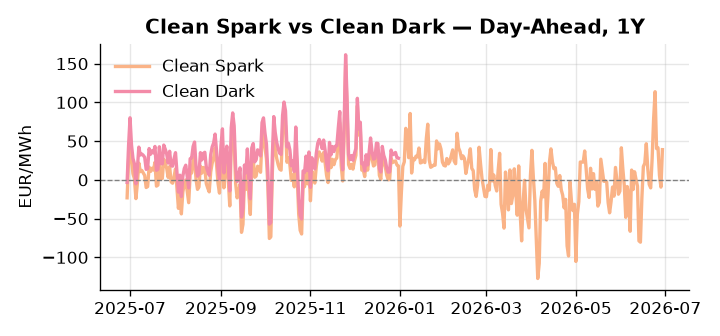
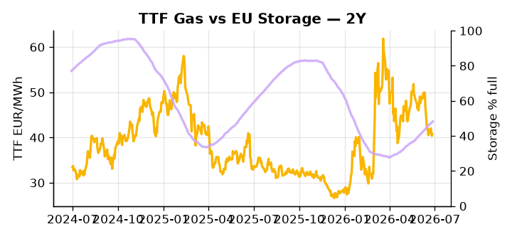

# European Cross-Commodity Risk Pack: Gas + Carbon → Power Curve Implications

**Daily desk brief — 2026-06-29**  
_Author: Sumer Sener · sumerberksener@gmail.com_  
_Generated by `scripts/generate_brief.py`. AI narrative + news themes via Anthropic Claude._

> **Data-freshness caveat:** Clean Dark (last 2025-12-31, 180d old); Coal (last 2025-12-26, 185d old). Numbers below should be read with this in mind.

## 1 · Executive summary

**TL;DR — Clean Spark at 92nd-percentile (39.01 EUR/MWh) amid French heat-driven power spike; storage 14.6 pp below seasonal; geopolitical tail-risk on Hormuz threatens LNG arb.**

Clean Spark at the 92nd-percentile (39.01 EUR/MWh) is the dominant signal this morning, driven by record French heatwave cooling demand compressing gas-to-power fuel-switch economics and lifting DA prices intraday as nuclear units approach cooling-water thermal limits. EU storage at 48.29% — the 23rd-percentile and 14.6 percentage points below seasonal norm — keeps the refill narrative tight and sustains merit-order tension through H2. EUA sits in mid-range as Ireland mediates a deadlocked EU on ETS reform, where the outcome over a weeks horizon directly resets the 2027–2030 carbon cost floor and industrial fuel-switch incentives, introducing slow-burn volatility risk into the forward curve. With coal data 185 days old and Clean Dark stale by 180 days, the dark spread is indicative not bankable, and historical positionality on coal at the 7th-percentile should be treated with caution. With Hormuz tail-risk reasserting via a confirmed ship attack and Iranian corridor enforcement, gas tightness pulls front-curve risk wider while EUA mid-range uncertainty and Clean Spark extended deep into the money keep the Cal+1 regime anchored to a high-spark, headroom-constrained dispatch stack.

_Generated by **claude-sonnet-4-6** via Anthropic API (two-pass extract→narrate). Prompts/responses logged to `ai/logs/`._
_Next-5d temperature anomaly — DE +0.7°C / FR +1.7°C vs 5-yr seasonal normal (Open-Meteo)._

## 2 · Monitor metrics

**Primary (cross-commodity headline tiles)**

| Metric | As of | Latest | Unit | 1d Δ | 1w Δ | 5y pctile | Headline |
|---|---|---:|---|---:|---:|---:|---|
| TTF Gas | 2026-06-26 | 40.78 | EUR/MWh | +0.93% | -3.52% | 48 | Within typical range |
| EU Storage | 2026-06-27 | 48.29 | % full | +0.69% | +2.83% | 23 | 14.6 pp below the 5-yr seasonal average |
| EUA Carbon | 2026-06-26 | 33.08 | EUR/tCO2 | -1.14% | +0.63% | 37 | Within typical range |
| DE Power | 2026-06-29 | 132.75 | EUR/MWh | +57.34% | -13.60% | 74 | Within typical range |
| GB Power | 2026-06-29 | 121.81 | EUR/MWh | +65.70% | -25.23% | 84 | Within typical range |
| Renewables | 2026-06-28 | 54.18 | % of load | +2.27% | +5.13% | 75 | Within typical range |
| Clean Spark | 2026-06-29 | 39.01 | EUR/MWh | +48.38 | -17.39 | 92 | 92th-percentile of 5-yr range — historically high |
| Clean Dark | 2025-12-31 (STALE) | 27.95 | EUR/MWh | -0.56 | +11.63 | 49 | Within typical range |

**Fundamentals inputs** _(feed derived metrics; not separately traded)_

| Metric | As of | Latest | Unit | 1d Δ | 1w Δ | 5y pctile | Headline |
|---|---|---:|---|---:|---:|---:|---|
| Coal | 2025-12-26 (STALE) | 96.00 | USD/t | -0.57% | +0.08% | 7 | 7th-percentile of 5-yr range — historically low |

_Spreads → abs EUR/MWh deltas; others → pct. Weekly Δ uses 5d trailing means. Full history in `data/<metric>.csv`._

## 3 · Gas + LNG arb

**TTF front-month** prints at 40.78 EUR/MWh — _Within typical range_.
**EU storage** at 48.3% full (-14.6 pp vs 5-yr seasonal avg) — _14.6 pp below the 5-yr seasonal average_.
**TTF − JKM (LNG arb)** at -5.84 EUR/MWh (JKM 15.52 USD/MMBtu) — JKM richer than TTF — Asia pulls cargoes, marginal European tightening risk.

## 4 · Carbon (EU ETS)

**EUA December** prints at 33.08 EUR/tCO2 — _Within typical range_. A euro of EUA adds ~0.37 EUR/MWh to gas-fired and ~0.85 EUR/MWh to coal-fired generation cost; strength compresses the dark spread faster than the spark.

**EU vs UK ETS** — Cobblestone's emissions desk trades EUA and UKA. Post-Brexit auction reform narrowed the UKA discount to EUA from £20+/t to single-digit £/t; CBAM phase-in pulls UK compliance demand toward parity. EUA−UKA basis remains a tradable cross-market signal.

**Supply / policy signal** — _Ireland mediates divided EU on ETS reform and decarbonization targets — outcome (weeks) shapes 2027–2030 carbon cost floor and industrial fuel-switch incentives._  
Side: `policy` · Polarity: `neutral` · Source: Politico EU Energy

ETS ambition directly resets EUA price and power-generation marginal cost; split between reform advocates and gutting camps creates volatility risk for 2027 curve.

_Surfaced from today's news flow by the AI extract pass (`ai/prompts/extract_v1.md` → `carbon_policy_signal`)._

## 5 · Power — Day-Ahead & curve

**DE day-ahead baseload** at 132.75 EUR/MWh — _Within typical range_.
**GB day-ahead baseload** at 121.81 EUR/MWh — _Within typical range_.
**DE − GB spread** at +10.94 EUR/MWh (DE premium) — drives interconnector flow direction.
**Cross-border net flows (Power Transportation):** DE↔FR -31.0 GWh (FR export); GB↔FR -28.1 GWh (FR export); NL↔DE +30.4 GWh (NL export).

**Clean spark spread** at +39.01 EUR/MWh — _92th-percentile of 5-yr range — historically high_. Bridge from gas + carbon fundamentals to gas-fired economics; sustained positive spark = TTF moves transmit directly into the power curve.

**Curve shape:** DA → W+1 → M+1 → Q+1 → Cal+1 → Cal+2 = 133 / 107 / 107 / 107 / 107 / 107 EUR/MWh — **Backwardation** (DA −Cal+1 spread +26 EUR/MWh). Forwards are seasonality projections — see Methodology.

{width=49%} {width=49%}

**This week ahead**

- **Tue** 08:00 UTC — AGSI+ daily storage print: First read on the week's gas injection / withdrawal pace; sets the tone for TTF curve shape.
- **Wed** 09:00 UTC — EEX EUA primary auction (Mon–Thu daily; Wed is largest volume): Supply-side EUA signal; auction clearing relative to spot reads as ETS demand strength.
- **Wed** — ENTSO-E DE_LU + GB next-week wind/solar forecast refresh: Sets the residual-load curve a week out; outsized prints move power Cal+1 directionally.
- **ongoing** — French heatwave nuclear constraints: Cooling-water limits trigger daily outage alerts; intraday DA spreads and frequency response cost at risk. _(news-extracted)_

**Scenarios (24-72h horizon)**

| | Summary | TTF | DE Power |
|---|---|---:|---:|
| **Base** | France heatwave-driven cooling demand sustains tight DA spreads; gas stable within seasonal range. Storage refill pace steady. | ±1-2% | tracks |
| **Upside** | Hormuz shipping delays accelerate; LNG spot tightens, TTF arb widens. French nuclear units hit cooling limits, power DA spikes. | +5-8% | +8-12% |
| **Downside** | France heatwave breaks mid-week; cooling demand normalizes. Methane rule delay confirmed, industrial gas-demand repricing lower. | -3-5% | -4-6% |

_Illustrative, not forecasts. Magnitudes sized off historical sensitivity; AI-generated from today's extract pass._

## 6 · Today's themes

**Weather watch (next 7d)**
- **Storm · FR · Mon 29 – Thu 02 Jul** — peak gust 51 m/s (~184 km/h) on Thu 02 Jul. Strong wind boost to French generation; FR may export to neighbours. DA print likely below seasonal norm; watch FR-GB IFA flow toward GB.
- **Storm · DE · Wed 01 – Sun 05 Jul** — peak gust 62 m/s (~224 km/h) on Fri 03 Jul. Wind generation likely surges Day 1, then risk of turbine cut-off if gusts exceed 25 m/s. Bearish DA early, sharp reversal possible. Watch DE-FR flow swings.

**Watchlist (1–4 weeks)**
- Ireland EU presidency ETS reform vote & country alignment clarity (weeks).
- Methane rule formal delay motion & vote date (weeks).

_Risk framing — built within a discipline of clear limits and continuous monitoring; observations here are framed as risk inputs, not directional calls. Positioning decisions remain with the desk._
_Methodology + sources: **README §Methodology**. Numbers auditable via the snapshot JSONs. Rule-based / informational — not investment advice._