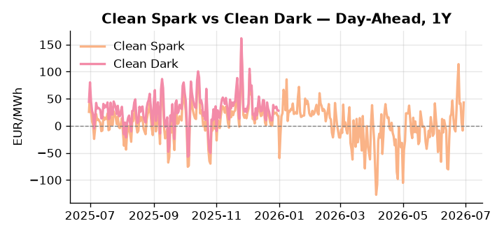
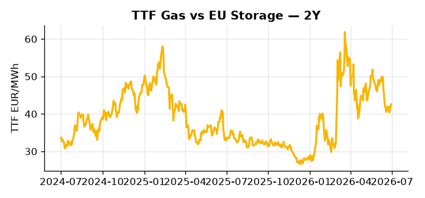

# European Cross-Commodity Risk Pack: Gas + Carbon → Power Curve Implications

**Daily desk brief — 2026-06-30**  
_Author: Sumer Sener · sumerberksener@gmail.com_  
_Generated by `scripts/generate_brief.py`. AI narrative + news themes via Anthropic Claude._

> **Data-freshness caveat:** Clean Dark (last 2025-12-31, 181d old); Coal (last 2025-12-26, 186d old). Numbers below should be read with this in mind.

## 1 · Executive summary

**TL;DR — Clean Spark at 94th-pctile; GB Power at 92nd-pctile; thermal generation massively in-the-money. Hormuz tension and heat-wave load surge underpin power rally.**

Clean Spark at the 94th percentile (43.04 EUR/MWh) is the dominant signal: renewables collapsed to the 28th percentile with a 40% daily drop, forcing thermal generation deep into the money and locking GB Power at the 92nd percentile (128.38 EUR/MWh, +13.58% on the month) as heat-wave peak load sustains the scarcity premium. TTF sits at the 52nd percentile (42.56 EUR/MWh), leaving limited headroom to absorb an upside shock, while Ireland's EU ETS presidency in H2 2026 keeps EUA cost pass-through in play as free-allocation cuts and MSR intake adjustments remain unresolved — a slow-motion policy overhang on the carbon floor. With coal data 186 days stale and the clean dark spread similarly aged, the 7th-percentile coal read is indicative not bankable, and any refresh that reprices the thermal stack would directly re-anchor Cal+1 curve positioning. France nuclear cooling-water stress and the EU ETS reform vote outcome sit on the near-term watchlist as secondary amplifiers to the already-extended thermal dispatch regime. With Iran blocking the Hormuz maritime security mission elevating LNG shipping risk, gas tightness AND EUA policy overhang AND clean spark massively in-the-money pull front-curve risk wider, keeping the Cal+1 regime anchored to thermal generation premium until renewable supply or Hormuz resolution compresses the spread.

_Generated by **claude-sonnet-4-6** via Anthropic API (two-pass extract→narrate). Prompts/responses logged to `ai/logs/`._
_Next-5d temperature anomaly — DE -0.1°C / FR +2.1°C vs 5-yr seasonal normal (Open-Meteo)._

## 2 · Monitor metrics

**Primary (cross-commodity headline tiles)**

| Metric | As of | Latest | Unit | 1d Δ | 1w Δ | 5y pctile | Headline |
|---|---|---:|---|---:|---:|---:|---|
| TTF Gas | 2026-06-29 | 42.56 | EUR/MWh | +4.37% | -0.94% | 52 | Within typical range |
| EU Storage | — | — | % full | — | — | — | (no data) |
| EUA Carbon | 2026-06-29 | 33.11 | EUR/tCO2 | +0.09% | -0.65% | 38 | Within typical range |
| DE Power | 2026-06-29 | 140.35 | EUR/MWh | +65.12% | -12.38% | 76 | Within typical range |
| GB Power | 2026-06-30 | 128.38 | EUR/MWh | +0.06% | -22.87% | 92 | 92th-percentile of 5-yr range — historically high |
| Renewables | 2026-06-29 | 32.44 | % of load | -40.12% | +6.35% | 28 | Within typical range |
| Clean Spark | 2026-06-29 | 43.04 | EUR/MWh | +51.77 | -16.45 | 94 | 94th-percentile of 5-yr range — historically high |
| Clean Dark | 2025-12-31 (STALE) | 27.95 | EUR/MWh | -0.56 | +11.63 | 49 | Within typical range |

**Fundamentals inputs** _(feed derived metrics; not separately traded)_

| Metric | As of | Latest | Unit | 1d Δ | 1w Δ | 5y pctile | Headline |
|---|---|---:|---|---:|---:|---:|---|
| Coal | 2025-12-26 (STALE) | 96.00 | USD/t | -0.57% | +0.08% | 7 | 7th-percentile of 5-yr range — historically low |

_Spreads → abs EUR/MWh deltas; others → pct. Weekly Δ uses 5d trailing means. Full history in `data/<metric>.csv`._

## 3 · Gas + LNG arb

**TTF front-month** prints at 42.56 EUR/MWh — _Within typical range_.
**TTF − JKM (LNG arb)** at -4.85 EUR/MWh (JKM 15.82 USD/MMBtu) — JKM richer than TTF — Asia pulls cargoes, marginal European tightening risk.

## 4 · Carbon (EU ETS)

**EUA December** prints at 33.11 EUR/tCO2 — _Within typical range_. A euro of EUA adds ~0.37 EUR/MWh to gas-fired and ~0.85 EUR/MWh to coal-fired generation cost; strength compresses the dark spread faster than the spark.

**EU vs UK ETS** — Cobblestone's emissions desk trades EUA and UKA. Post-Brexit auction reform narrowed the UKA discount to EUA from £20+/t to single-digit £/t; CBAM phase-in pulls UK compliance demand toward parity. EUA−UKA basis remains a tradable cross-market signal.

**Supply / policy signal** — _Ireland leads EU ETS reform negotiations H2 2026; outcome determines scheme tightness (free allocation cuts, MSR intake) and EUA floor/ceiling price support._  
Side: `policy` · Polarity: `neutral` · Source: Politico EU Energy

Reform outcome directly sets EUA cost pass-through into power merit order and thermal generation competitiveness; weakening bearish-power, tightening bullish-power via carbon cost uplift.

_Surfaced from today's news flow by the AI extract pass (`ai/prompts/extract_v1.md` → `carbon_policy_signal`)._

## 5 · Power — Day-Ahead & curve

**DE day-ahead baseload** at 140.35 EUR/MWh — _Within typical range_.
**GB day-ahead baseload** at 128.38 EUR/MWh — _92th-percentile of 5-yr range — historically high_.
**DE − GB spread** at +11.98 EUR/MWh (DE premium) — drives interconnector flow direction.
**Cross-border net flows (Power Transportation):** DE↔FR -62.6 GWh (FR export); GB↔FR -65.7 GWh (FR export); NL↔DE +75.0 GWh (NL export).

**Clean spark spread** at +43.04 EUR/MWh — _94th-percentile of 5-yr range — historically high_. Bridge from gas + carbon fundamentals to gas-fired economics; sustained positive spark = TTF moves transmit directly into the power curve.

**Curve shape:** DA → W+1 → M+1 → Q+1 → Cal+1 → Cal+2 = 140 / 107 / 107 / 107 / 107 / 107 EUR/MWh — **Backwardation** (DA −Cal+1 spread +33 EUR/MWh). Forwards are seasonality projections — see Methodology.

{width=49%} {width=49%}

**This week ahead**

- **Tue** 08:00 UTC — AGSI+ daily storage print: First read on the week's gas injection / withdrawal pace; sets the tone for TTF curve shape.
- **Wed** 09:00 UTC — EEX EUA primary auction (Mon–Thu daily; Wed is largest volume): Supply-side EUA signal; auction clearing relative to spot reads as ETS demand strength.
- **Wed** — ENTSO-E DE_LU + GB next-week wind/solar forecast refresh: Sets the residual-load curve a week out; outsized prints move power Cal+1 directionally.
- **Mon** — France heat-wave peak load — DA auction: Extreme cooling demand bullish intraday power and EUA thermal dispatch uplift. _(news-extracted)_

**Scenarios (24-72h horizon)**

| | Summary | TTF | DE Power |
|---|---|---:|---:|
| **Base** | Renewable supply stays tight; thermal remains extended; Hormuz status quo. Power stable at elevated levels. | ±1-2% | ±1-3% |
| **Upside** | Iran escalates Hormuz blockade or maritime incident; LNG shipping cost spikes; TTF supply tightens. Heat-wave persistence. Power spiking. | +8-12% | +15-20% |
| **Downside** | Renewable wind/solar forecast improves; heat wave breaks; Hormuz tensions ease. Thermal premium compresses sharply. | -6-10% | -12-18% |

_Illustrative, not forecasts. Magnitudes sized off historical sensitivity; AI-generated from today's extract pass._

## 6 · Today's themes

**Weather watch (next 7d)**
- **Storm · FR · Tue 30 – Thu 02 Jul** — peak gust 49 m/s (~176 km/h) on Thu 02 Jul. Strong wind boost to French generation; FR may export to neighbours. DA print likely below seasonal norm; watch FR-GB IFA flow toward GB.
- **Storm · DE · Wed 01 – Mon 06 Jul** — peak gust 54 m/s (~193 km/h) on Fri 03 Jul. Wind generation likely surges Day 1, then risk of turbine cut-off if gusts exceed 25 m/s. Bearish DA early, sharp reversal possible. Watch DE-FR flow swings.

**Watchlist (1–4 weeks)**
- EU ETS reform vote/decision (Ireland presidency H2 2026) — cardinal for EUA floor and power merit order.
- Germany methane rules delay formal EU vote or withdrawal — monitors regulatory unwind risk on gas supply costs.

_Risk framing — built within a discipline of clear limits and continuous monitoring; observations here are framed as risk inputs, not directional calls. Positioning decisions remain with the desk._
_Methodology + sources: **README §Methodology**. Numbers auditable via the snapshot JSONs. Rule-based / informational — not investment advice._