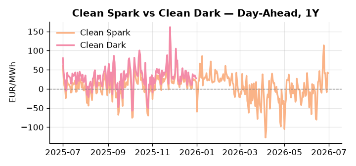
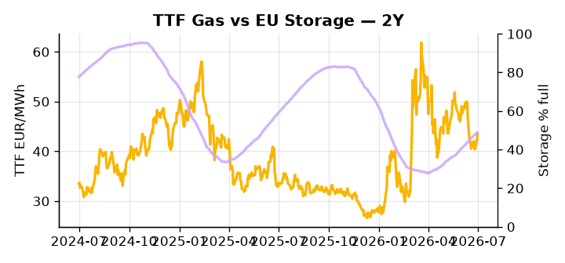

# European Cross-Commodity Risk Pack: Gas + Carbon → Power Curve Implications

**Daily desk brief — 2026-07-01**  
_Author: Sumer Sener · sumerberksener@gmail.com_  
_Generated by `scripts/generate_brief.py`. AI narrative + news themes via Anthropic Claude._

> **Data-freshness caveat:** Clean Dark (last 2025-12-31, 182d old); Coal (last 2025-12-26, 187d old). Numbers below should be read with this in mind.

## 1 · Executive summary

**TL;DR — GB Power at 95th-percentile amid tight renewables (24th-pctile) and storage 14.7pp below seasonal; geopolitical friction (Iran rejects Hormuz plan, Ukraine strikes Russian refineries) adds tail risk to LNG/gas curve.**

GB Power is dominating the session at 137.29 EUR/MWh (95th-percentile), driven by a renewable drought sitting at the 24th-percentile of load coverage and EU storage running 14.7 percentage points below its five-year seasonal average at 48.86% full, leaving the thermal call extended well into summer. TTF holds at 43.44 EUR/MWh (54th-percentile), with geopolitical friction adding a visible supply-risk premium as Iran rejects the Hormuz security plan and Ukrainian drone strikes continue to degrade Russian refinery capacity. EUA is anchored at 33.16 EUR/t (38th-percentile, flat year-to-date) with the Irish EU presidency now steering ETS reform negotiations whose outcome on cap stringency over summer 2026 introduces a slow-motion policy variable for fossil-generation marginal cost, keeping carbon neither a clear headroom signal nor a firm floor. With coal and clean dark data 182–187 days stale, the dark spread is indicative not bankable, so the regime read relies on clean spark at the 93rd-percentile alongside the GB and DE power levels. Gas tightness in storage AND EUA mid-range policy uncertainty AND clean spark deep in-the-money keep the front-curve in a structurally elevated regime, with Hormuz tail-risk the dominant geopolitical driver widening front-curve risk should LNG shipping costs reassert.

_Generated by **claude-sonnet-4-6** via Anthropic API (two-pass extract→narrate). Prompts/responses logged to `ai/logs/`._
_Next-5d temperature anomaly — DE +0.0°C / GB +4.3°C vs 5-yr seasonal normal (Open-Meteo)._

## 2 · Monitor metrics

**Primary (cross-commodity headline tiles)**

| Metric | As of | Latest | Unit | 1d Δ | 1w Δ | 5y pctile | Headline |
|---|---|---:|---|---:|---:|---:|---|
| TTF Gas | 2026-06-30 | 43.44 | EUR/MWh | +2.07% | -0.02% | 54 | Within typical range |
| EU Storage | 2026-06-29 | 48.86 | % full | +0.49% | +2.86% | 23 | 14.7 pp below the 5-yr seasonal average |
| EUA Carbon | 2026-06-30 | 33.16 | EUR/tCO2 | +0.15% | -0.66% | 38 | Within typical range |
| DE Power | 2026-06-29 | 140.28 | EUR/MWh | +65.02% | -12.39% | 76 | Within typical range |
| GB Power | 2026-07-01 | 137.29 | EUR/MWh | +7.80% | -21.65% | 95 | 95th-percentile of 5-yr range — historically high |
| Renewables | 2026-06-30 | 30.20 | % of load | -6.91% | +4.45% | 24 | Within typical range |
| Clean Spark | 2026-06-30 | 41.18 | EUR/MWh | -1.78 | -25.57 | 93 | 93th-percentile of 5-yr range — historically high |
| Clean Dark | 2025-12-31 (STALE) | 27.95 | EUR/MWh | -0.56 | +11.63 | 49 | Within typical range |

**Fundamentals inputs** _(feed derived metrics; not separately traded)_

| Metric | As of | Latest | Unit | 1d Δ | 1w Δ | 5y pctile | Headline |
|---|---|---:|---|---:|---:|---:|---|
| Coal | 2025-12-26 (STALE) | 96.00 | USD/t | -0.57% | +0.08% | 7 | 7th-percentile of 5-yr range — historically low |

_Spreads → abs EUR/MWh deltas; others → pct. Weekly Δ uses 5d trailing means. Full history in `data/<metric>.csv`._

## 3 · Gas + LNG arb

**TTF front-month** prints at 43.44 EUR/MWh — _Within typical range_.
**EU storage** at 48.9% full (-14.7 pp vs 5-yr seasonal avg) — _14.7 pp below the 5-yr seasonal average_.
**TTF − JKM (LNG arb)** at -4.50 EUR/MWh (JKM 16.05 USD/MMBtu) — JKM richer than TTF — Asia pulls cargoes, marginal European tightening risk.

## 4 · Carbon (EU ETS)

**EUA December** prints at 33.16 EUR/tCO2 — _Within typical range_. A euro of EUA adds ~0.37 EUR/MWh to gas-fired and ~0.85 EUR/MWh to coal-fired generation cost; strength compresses the dark spread faster than the spark.

**EU vs UK ETS** — Cobblestone's emissions desk trades EUA and UKA. Post-Brexit auction reform narrowed the UKA discount to EUA from £20+/t to single-digit £/t; CBAM phase-in pulls UK compliance demand toward parity. EUA−UKA basis remains a tradable cross-market signal.

**Supply / policy signal** — _Ireland tackles EU ETS reform amid competing country demands; outcome on cap stringency and compliance cost over summer 2026._  
Side: `policy` · Polarity: `neutral` · Source: Politico EU Energy

EUA trajectory depends on whether member states weaken or defend the cap. Outcome flags fossil-generation marginal cost, industrial fuel-switch economics, and power-curve shape into 2027.

_Surfaced from today's news flow by the AI extract pass (`ai/prompts/extract_v1.md` → `carbon_policy_signal`)._

## 5 · Power — Day-Ahead & curve

**DE day-ahead baseload** at 140.28 EUR/MWh — _Within typical range_.
**GB day-ahead baseload** at 137.29 EUR/MWh — _95th-percentile of 5-yr range — historically high_.
**DE − GB spread** at +2.99 EUR/MWh (DE premium) — drives interconnector flow direction.
**Cross-border net flows (Power Transportation):** DE↔FR -52.5 GWh (FR export); GB↔FR -70.5 GWh (FR export); NL↔DE +55.0 GWh (NL export).

**Clean spark spread** at +41.18 EUR/MWh — _93th-percentile of 5-yr range — historically high_. Bridge from gas + carbon fundamentals to gas-fired economics; sustained positive spark = TTF moves transmit directly into the power curve.

**Curve shape:** DA → W+1 → M+1 → Q+1 → Cal+1 → Cal+2 = 140 / 107 / 107 / 107 / 107 / 107 EUR/MWh — **Backwardation** (DA −Cal+1 spread +33 EUR/MWh). Forwards are seasonality projections — see Methodology.

{width=49%} {width=49%}

**This week ahead**

- **Wed** 09:00 UTC — EEX EUA primary auction (Mon–Thu daily; Wed is largest volume): Supply-side EUA signal; auction clearing relative to spot reads as ETS demand strength.
- **Wed** — ENTSO-E DE_LU + GB next-week wind/solar forecast refresh: Sets the residual-load curve a week out; outsized prints move power Cal+1 directionally.
- **Fri** 14:30 UTC — EIA weekly natural gas storage report: US storage trajectory anchors LNG export pricing into NW Europe — direct TTF transmission.
- **Mon** — Irish EU presidency ETS negotiations begin: Sets tone for H2 2026 carbon policy; outcome flags whether EUA stringency increases or weakens. _(news-extracted)_

**Scenarios (1w horizon)**

| | Summary | TTF | DE Power |
|---|---|---:|---:|
| **Base** | Renewables recover modestly; storage injection continues at seasonal pace; GB power moderates into 80–90th-pctile range. | ±1–3% | ±2–4% |
| **Upside** | Hormuz escalation or LNG shipping disruption; Iran tensions spike shipping costs, TTF supply-risk premium reasserts sharply. | +8–12% | +5–8% |
| **Downside** | French heat wave subsides, renewables recover, GB surplus rebuilds; storage injection accelerates; thermal call unwinds. | −5–8% | −8–12% |

_Illustrative, not forecasts. Magnitudes sized off historical sensitivity; AI-generated from today's extract pass._

## 6 · Today's themes

**Weather watch (next 7d)**
- **Heat dome · GB · Wed 01 – Tue 07 Jul** — peak +6.4°C vs normal. Modest bullish GB power on cooling demand; less heating-demand downside than continental peers (UK AC penetration is lower).
- **Storm · GB · Wed 01 – Mon 06 Jul** — peak gust 44 m/s (~157 km/h) on Sat 04 Jul. GB wind capacity is large — DA likely soft. Cut-off risk if gusts exceed safety thresholds; opposite tail (sudden tightening) possible.

**Watchlist (1–4 weeks)**
- Irish presidency ETS reform negotiations (summer 2026); outcome flags EUA cap/price.
- French government stability and nuclear/demand policy post-heat wave (days).

_Risk framing — built within a discipline of clear limits and continuous monitoring; observations here are framed as risk inputs, not directional calls. Positioning decisions remain with the desk._
_Methodology + sources: **README §Methodology**. Numbers auditable via the snapshot JSONs. Rule-based / informational — not investment advice._