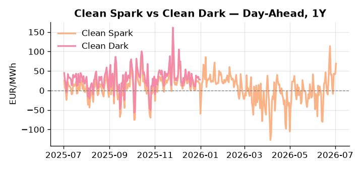
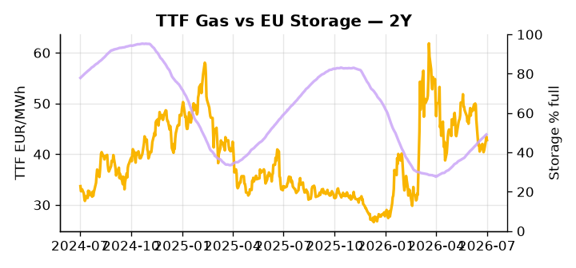

# European Cross-Commodity Risk Pack: Gas + Carbon → Power Curve Implications

**Daily desk brief — 2026-07-02**  
_Author: Sumer Sener · sumerberksener@gmail.com_  
_Generated by `scripts/generate_brief.py`. AI narrative + news themes via Anthropic Claude._

> **Data-freshness caveat:** Clean Dark (last 2025-12-31, 183d old); Coal (last 2025-12-26, 188d old). Numbers below should be read with this in mind.

## 1 · Executive summary

**TL;DR — Clean Spark at 98th percentile (68.88 EUR/MWh) amid low renewables (21st pctile) and tight storage (14.7 pp below seasonal); geopolitical risks to LNG/crude via Hormuz and Russia fuel crisis cloud H2 outlook.**

Clean Spark at the 98th percentile (68.88 EUR/MWh) is the dominant signal: thermal dispatch is firmly in-the-money and the fuel-switch is extended, driven by renewables anchored at the 21st percentile (28.89% of load, down 30.71% month-on-month) and EU storage running 14.7 percentage points below seasonal at just 49.1% full. DE Power front-month at 166.6 EUR/MWh (83rd percentile, +18.77% on the day) reinforces the thermal call, though with coal data 188 days old and the clean-dark spread 183 days stale, the dark spread is indicative not bankable. EUA policy headroom is itself compressed: the Ireland EU presidency opens a six-month window on ETS design, CBAM, and green-spending acceleration ahead of the French election, a potential front-loading of industrial carbon costs into H2 2026 power pricing that could raise merit-order thresholds and reshape Cal+1 spreads. Geopolitical risk remains an active overlay, with Iran's rejection of Macron's Hormuz maritime mission and the Nord Stream indictment both elevating LNG disruption probability and sustaining an EU energy-security premium into H2. Gas tightness at historically elevated spark levels AND EUA policy risk skewed toward accelerated pass-through AND clean-dark spreads too stale to anchor dark-side confidence mean that, with Hormuz tail-risk reasserting, front-curve risk stays wide and the Cal+1 regime tilts toward sustained thermal dispatch unless storage refill accelerates materially.

_Generated by **claude-sonnet-4-6** via Anthropic API (two-pass extract→narrate). Prompts/responses logged to `ai/logs/`._
_Next-5d temperature anomaly — DE -0.6°C / FR +3.7°C vs 5-yr seasonal normal (Open-Meteo)._

## 2 · Monitor metrics

**Primary (cross-commodity headline tiles)**

| Metric | As of | Latest | Unit | 1d Δ | 1w Δ | 5y pctile | Headline |
|---|---|---:|---|---:|---:|---:|---|
| TTF Gas | 2026-07-01 | 42.78 | EUR/MWh | -1.53% | +1.33% | 52 | Within typical range |
| EU Storage | 2026-06-30 | 49.10 | % full | +0.47% | +2.90% | 23 | 14.7 pp below the 5-yr seasonal average |
| EUA Carbon | 2026-07-01 | 33.05 | EUR/tCO2 | -0.33% | -0.87% | 37 | Within typical range |
| DE Power | 2026-07-02 | 166.60 | EUR/MWh | +18.77% | -13.40% | 83 | Within typical range |
| GB Power | 2026-07-02 | 70.92 | EUR/MWh | -43.37% | -24.45% | 17 | Within typical range |
| Renewables | 2026-07-01 | 28.89 | % of load | -4.32% | -5.92% | 21 | Within typical range |
| Clean Spark | 2026-07-02 | 68.88 | EUR/MWh | +26.32 | -18.61 | 98 | 98th-percentile of 5-yr range — historically high |
| Clean Dark | 2025-12-31 (STALE) | 27.95 | EUR/MWh | -0.56 | +11.63 | 48 | Within typical range |

**Fundamentals inputs** _(feed derived metrics; not separately traded)_

| Metric | As of | Latest | Unit | 1d Δ | 1w Δ | 5y pctile | Headline |
|---|---|---:|---|---:|---:|---:|---|
| Coal | 2025-12-26 (STALE) | 96.00 | USD/t | -0.57% | +0.08% | 7 | 7th-percentile of 5-yr range — historically low |

_Spreads → abs EUR/MWh deltas; others → pct. Weekly Δ uses 5d trailing means. Full history in `data/<metric>.csv`._

## 3 · Gas + LNG arb

**TTF front-month** prints at 42.78 EUR/MWh — _Within typical range_.
**EU storage** at 49.1% full (-14.7 pp vs 5-yr seasonal avg) — _14.7 pp below the 5-yr seasonal average_.
**TTF − JKM (LNG arb)** at -5.13 EUR/MWh (JKM 16.02 USD/MMBtu) — JKM richer than TTF — Asia pulls cargoes, marginal European tightening risk.

## 4 · Carbon (EU ETS)

**EUA December** prints at 33.05 EUR/tCO2 — _Within typical range_. A euro of EUA adds ~0.37 EUR/MWh to gas-fired and ~0.85 EUR/MWh to coal-fired generation cost; strength compresses the dark spread faster than the spark.

**EU vs UK ETS** — Cobblestone's emissions desk trades EUA and UKA. Post-Brexit auction reform narrowed the UKA discount to EUA from £20+/t to single-digit £/t; CBAM phase-in pulls UK compliance demand toward parity. EUA−UKA basis remains a tradable cross-market signal.

**Supply / policy signal** — _Ireland EU presidency opens six-month policy window for ETS design, carbon border rules (CBAM), and green spending acceleration before French election; risk of expedited industrial carbon pass-through and subsidy shifts H2 2026._  
Side: `policy` · Polarity: `neutral` · Source: Politico EU Energy

Accelerated ETS or CBAM phase-in could front-load industrial carbon costs into H2 2026 power pricing, raising merit-order thresholds for coal and gas dispatch and reshaping Cal+1 spreads.

_Surfaced from today's news flow by the AI extract pass (`ai/prompts/extract_v1.md` → `carbon_policy_signal`)._

## 5 · Power — Day-Ahead & curve

**DE day-ahead baseload** at 166.60 EUR/MWh — _Within typical range_.
**GB day-ahead baseload** at 70.92 EUR/MWh — _Within typical range_.
**DE − GB spread** at +95.68 EUR/MWh (DE premium) — drives interconnector flow direction.
**Cross-border net flows (Power Transportation):** DE↔FR -60.0 GWh (FR export); GB↔FR -81.0 GWh (FR export); NL↔DE +65.4 GWh (NL export).

**Clean spark spread** at +68.88 EUR/MWh — _98th-percentile of 5-yr range — historically high_. Bridge from gas + carbon fundamentals to gas-fired economics; sustained positive spark = TTF moves transmit directly into the power curve.

**Curve shape:** DA → W+1 → M+1 → Q+1 → Cal+1 → Cal+2 = 167 / 116 / 116 / 116 / 116 / 116 EUR/MWh — **Backwardation** (DA −Cal+1 spread +50 EUR/MWh). Forwards are seasonality projections — see Methodology.

{width=49%} {width=49%}

**This week ahead**

- **Fri** 14:30 UTC — EIA weekly natural gas storage report: US storage trajectory anchors LNG export pricing into NW Europe — direct TTF transmission.
- **Thu** 14:30 UTC — US EIA weekly crude inventories: Crude — and via crack spreads, refined-products — feed back into LNG arb economics.
- **Fri** — ENTSO-E weekly day-ahead volumes / system-balance summary: Reads the European generation mix in last 7d — confirms or breaks the Cal+1 thesis.
- **Mon** — EU Storage weekly update: Track refill momentum; 14.7 pp deficit vs seasonal will drive TTF curve shape and autumn power forward risk. _(news-extracted)_

**Scenarios (1w horizon)**

| | Summary | TTF | DE Power |
|---|---|---:|---:|
| **Base** | Renewables stay weak; storage refill steady; geopolitical premium persists but no acute disruption. TTF anchors 40–44 EUR/MWh; DE Power 150–170 EUR/MWh. | -2 to +3% | -5 to +8% |
| **Upside** | Hormuz escalation or Iranian naval incident disrupts LNG flows; TTF premium widens. Coupled with weak renewables and refill lag, thermal push extends. | +10 to +15% | +8 to +12% |
| **Downside** | Renewables rebound (high wind/solar forecast); storage refill accelerates; geopolitical tensions pause. Thermal call eases; TTF and power spot recede. | -8 to -12% | -10 to -15% |

_Illustrative, not forecasts. Magnitudes sized off historical sensitivity; AI-generated from today's extract pass._

## 6 · Today's themes

**Weather watch (next 7d)**
- **Storm · DE · Thu 02 – Wed 08 Jul** — peak gust 70 m/s (~253 km/h) on Fri 03 Jul. Wind generation likely surges Day 1, then risk of turbine cut-off if gusts exceed 25 m/s. Bearish DA early, sharp reversal possible. Watch DE-FR flow swings.
- **Storm · FR · Thu 02 – Wed 08 Jul** — peak gust 48 m/s (~171 km/h) on Tue 07 Jul. Strong wind boost to French generation; FR may export to neighbours. DA print likely below seasonal norm; watch FR-GB IFA flow toward GB.

**Watchlist (1–4 weeks)**
- Ireland EU presidency agenda announcements (climate/energy regulation, ETS design, carbon border rules).
- Iran Strait of Hormuz naval escalation; impact on LNG routing and TTF-HH spreads.

_Risk framing — built within a discipline of clear limits and continuous monitoring; observations here are framed as risk inputs, not directional calls. Positioning decisions remain with the desk._
_Methodology + sources: **README §Methodology**. Numbers auditable via the snapshot JSONs. Rule-based / informational — not investment advice._