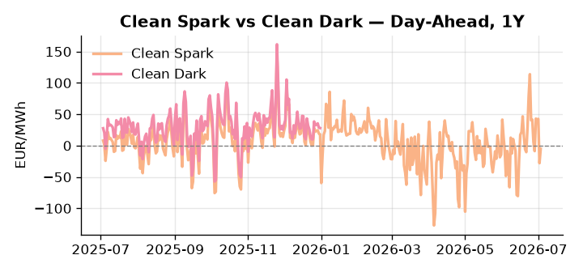
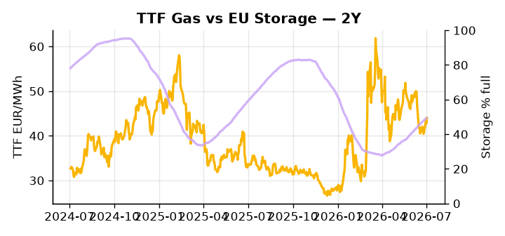

# European Cross-Commodity Risk Pack: Gas + Carbon → Power Curve Implications

**Daily desk brief — 2026-07-03**  
_Author: Sumer Sener · sumerberksener@gmail.com_  
_Generated by `scripts/generate_brief.py`. AI narrative + news themes via Anthropic Claude._

> **Data-freshness caveat:** Clean Dark (last 2025-12-31, 184d old); Coal (last 2025-12-26, 189d old). Numbers below should be read with this in mind.

## 1 · Executive summary

**TL;DR — Renewables surge to 88th percentile (63.7% penetration, +120% daily move) suppresses DA power; storage deficit 14.9 pp below seasonal average amplifies H2 tail risk amid Russian LNG sanctions escalation.**

Renewables surged to the 88th percentile (63.7% of load, a +4.1σ daily move), collapsing the merit order and driving clean spark to −5.22 EUR/MWh — gas is firmly out-of-the-money and the thermal call is extinguished across the front curve. EU storage sits at 49.2% (23rd percentile), running 14.9 percentage points below seasonal norms, leaving the refill trajectory into August–September as the dominant H2 risk anchor; with coal data 189 days stale and clean dark 184 days old, the dark spread is indicative not bankable, and the merit-order narrative rests on spark and renewable signals alone. GB Day-Ahead spiked to 126.09 EUR/MWh (+135.87%, +3.2σ) against DE at 95.01 EUR/MWh (+31.36%), a 31.08 EUR/MWh implied premium that points to interconnector stress or severe renewable forecast divergence rather than a settled structural repricing. EUAs sit in mid-range as Brussels moves to exempt green mobility and renewable spending from fiscal rules — a bearish-supply signal that accelerates decarbonisation capex and structurally lowers the EUA marginal cost floor via capacity ramp and sectoral coal exit, compressing the medium-term carbon bid. With Russian LNG sanctions enforceability still undefined on a weeks horizon, gas tightness at the 23rd-percentile storage floor AND EUA supply pressure from fiscal easing AND clean spark deeply negative keep the front-curve regime in renewable-suppressed, out-of-the-money-gas territory — but Russian LNG sanctions enforcement, if announced, would immediately reassert front-curve risk and steepen TTF backwardation before Cal+1 spreads can reprice.

_Generated by **claude-sonnet-4-6** via Anthropic API (two-pass extract→narrate). Prompts/responses logged to `ai/logs/`._
_Next-5d temperature anomaly — DE -1.7°C / GB +4.8°C vs 5-yr seasonal normal (Open-Meteo)._

## 2 · Monitor metrics

**Primary (cross-commodity headline tiles)**

| Metric | As of | Latest | Unit | 1d Δ | 1w Δ | 5y pctile | Headline |
|---|---|---:|---|---:|---:|---:|---|
| TTF Gas | 2026-07-02 | 44.01 | EUR/MWh | +2.89% | +3.83% | 55 | Within typical range |
| EU Storage | 2026-07-01 | 49.22 | % full | +0.31% | +2.87% | 23 | 14.9 pp below the 5-yr seasonal average |
| EUA Carbon | 2026-07-02 | 33.16 | EUR/tCO2 | +0.33% | -1.15% | 38 | Within typical range |
| DE Power | 2026-07-03 | 95.01 | EUR/MWh | +31.36% | -36.55% | 46 | Within typical range |
| GB Power | 2026-07-03 | 126.09 | EUR/MWh | +135.87% | -0.53% | 89 | outsized daily move (+135.87%, 3.2σ) |
| Renewables | 2026-07-02 | 63.69 | % of load | +120.44% | -5.18% | 88 | outsized daily move (+120.44%, 4.1σ) |
| Clean Spark | 2026-07-03 | -5.22 | EUR/MWh | +22.68 | -19.79 | 45 | Within typical range |
| Clean Dark | 2025-12-31 (STALE) | 27.95 | EUR/MWh | -0.56 | +11.63 | 48 | Within typical range |

**Fundamentals inputs** _(feed derived metrics; not separately traded)_

| Metric | As of | Latest | Unit | 1d Δ | 1w Δ | 5y pctile | Headline |
|---|---|---:|---|---:|---:|---:|---|
| Coal | 2025-12-26 (STALE) | 96.00 | USD/t | -0.57% | +0.08% | 7 | 7th-percentile of 5-yr range — historically low |

_Spreads → abs EUR/MWh deltas; others → pct. Weekly Δ uses 5d trailing means. Full history in `data/<metric>.csv`._

## 3 · Gas + LNG arb

**TTF front-month** prints at 44.01 EUR/MWh — _Within typical range_.
**EU storage** at 49.2% full (-14.9 pp vs 5-yr seasonal avg) — _14.9 pp below the 5-yr seasonal average_.
**TTF − JKM (LNG arb)** at -4.21 EUR/MWh (JKM 16.08 USD/MMBtu) — JKM richer than TTF — Asia pulls cargoes, marginal European tightening risk.

## 4 · Carbon (EU ETS)

**EUA December** prints at 33.16 EUR/tCO2 — _Within typical range_. A euro of EUA adds ~0.37 EUR/MWh to gas-fired and ~0.85 EUR/MWh to coal-fired generation cost; strength compresses the dark spread faster than the spark.

**EU vs UK ETS** — Cobblestone's emissions desk trades EUA and UKA. Post-Brexit auction reform narrowed the UKA discount to EUA from £20+/t to single-digit £/t; CBAM phase-in pulls UK compliance demand toward parity. EUA−UKA basis remains a tradable cross-market signal.

**Supply / policy signal** — _Brussels permits green mobility and renewable spending bypass of fiscal rules; war in Iran cited; accelerates decarbonisation capex and EV subsidy deployment._  
Side: `supply` · Polarity: `bearish EUA` · Source: Politico EU Energy

Fiscal easing on renewables and e-mobility deployment increases power supply elasticity and structural displacement of coal/gas; medium-term EUA marginal cost floor lowers via capacity ramp and sectoral coal exit acceleration.

_Surfaced from today's news flow by the AI extract pass (`ai/prompts/extract_v1.md` → `carbon_policy_signal`)._

## 5 · Power — Day-Ahead & curve

**DE day-ahead baseload** at 95.01 EUR/MWh — _Within typical range_.
**GB day-ahead baseload** at 126.09 EUR/MWh — _outsized daily move (+135.87%, 3.2σ)_.
**DE − GB spread** at -31.08 EUR/MWh (GB premium) — drives interconnector flow direction.
**Cross-border net flows (Power Transportation):** DE↔FR -35.6 GWh (FR export); GB↔FR -41.5 GWh (FR export); NL↔DE -0.9 GWh (DE export).

**Clean spark spread** at -5.22 EUR/MWh — _Within typical range_. Bridge from gas + carbon fundamentals to gas-fired economics; sustained positive spark = TTF moves transmit directly into the power curve.

**Curve shape:** DA → W+1 → M+1 → Q+1 → Cal+1 → Cal+2 = 95 / 104 / 104 / 104 / 104 / 104 EUR/MWh — **Contango** (DA −Cal+1 spread -9 EUR/MWh). Forwards are seasonality projections — see Methodology.

{width=49%} {width=49%}

**This week ahead**

- **Fri** 14:30 UTC — EIA weekly natural gas storage report: US storage trajectory anchors LNG export pricing into NW Europe — direct TTF transmission.
- **Fri** — ENTSO-E weekly day-ahead volumes / system-balance summary: Reads the European generation mix in last 7d — confirms or breaks the Cal+1 thesis.
- **Tue** 08:00 UTC — AGSI+ daily storage print: First read on the week's gas injection / withdrawal pace; sets the tone for TTF curve shape.
- **Fri** — Irish presidency energy agenda launch: May unlock grid resilience, ETS-2 sectoral vote, or carbon pricing reform — affects power curve shape and policy risk premium. _(news-extracted)_

**Scenarios (24-72h horizon)**

| | Summary | TTF | DE Power |
|---|---|---:|---:|
| **Base** | Renewables retreat from 88th pctile, thermal call normalises; storage refill steadies; no sanctions shock announced. | ±1-2% | −15-25% (reversion from +31% spike toward 46th pctile baseline) |
| **Upside** | EU announces Russian LNG sanctions enforcement (weeks timeline); storage inflow slows; TTF backwardation steepens, power demand shock on political/supply uncertainty. | +8-12% | +18-25% |
| **Downside** | Renewables sustain 85+ pctile; heat wave moderates, nuclear restarts; sanctions delayed; storage refill accelerates into Aug. | −5-8% | −20-30% |

_Illustrative, not forecasts. Magnitudes sized off historical sensitivity; AI-generated from today's extract pass._

## 6 · Today's themes

**Weather watch (next 7d)**
- **Storm · DE · Fri 03 – Thu 09 Jul** — peak gust 60 m/s (~216 km/h) on Fri 03 Jul. Wind generation likely surges Day 1, then risk of turbine cut-off if gusts exceed 25 m/s. Bearish DA early, sharp reversal possible. Watch DE-FR flow swings.
- **Storm · GB · Fri 03 – Tue 07 Jul** — peak gust 43 m/s (~156 km/h) on Mon 06 Jul. GB wind capacity is large — DA likely soft. Cut-off risk if gusts exceed safety thresholds; opposite tail (sudden tightening) possible.

**Watchlist (1–4 weeks)**
- EU LNG sanctions implementation timeline and enforcement scope — direct TTF risk.
- Ireland presidency energy/climate agenda prioritisation — may unlock grid reform or carbon pricing votes.

_Risk framing — built within a discipline of clear limits and continuous monitoring; observations here are framed as risk inputs, not directional calls. Positioning decisions remain with the desk._
_Methodology + sources: **README §Methodology**. Numbers auditable via the snapshot JSONs. Rule-based / informational — not investment advice._