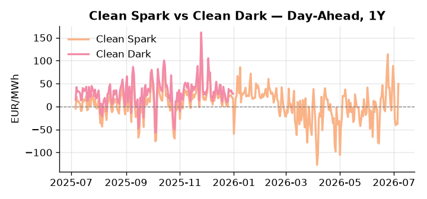
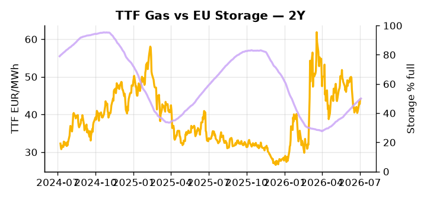

# European Cross-Commodity Risk Pack: Gas + Carbon → Power Curve Implications

**Daily desk brief — 2026-07-06**  
_Author: Sumer Sener · sumerberksener@gmail.com_  
_Generated by `scripts/generate_brief.py`. AI narrative + news themes via Anthropic Claude._

> **Data-freshness caveat:** Clean Dark (last 2025-12-31, 187d old); Coal (last 2025-12-26, 192d old). Numbers below should be read with this in mind.

## 1 · Executive summary

**TL;DR — Renewables at 95th-percentile suppress thermal merit order; heat wave lifts cooling demand; Russian LNG sanctions create tail-risk to gas supply.**

Renewables at the 95th percentile — covering 74.41% of load — are suppressing the thermal merit order even as a heat wave across Belgium and France drives peak cooling demand and reserve-margin stress, with Clean Spark at 49.32 EUR/MWh (95th percentile) confirming gas-to-power economics remain deeply extended despite thermal dispatch being crowded out. EU storage sits at 50.03%, some 15 percentage points below seasonal norms (24th percentile), leaving the refill trajectory as the critical anchor for the H2 power curve and the TTF floor. With coal data 192 days old and Clean Dark 187 days stale, the dark spread of 48th percentile is indicative not bankable, and those figures should not drive coal-switching decisions pending refresh. French political instability during peak heat stress adds a credible upside tail to DA spreads should nuclear maintenance deferrals or grid coordination failures materialise. With Russian LNG sanctions enforcement imminent and global LNG supply tightness unresolved, gas tightness holding the TTF floor AND carbon absent a policy anchor AND Clean Spark in-the-money at the 95th percentile keep the front-curve risk regime firmly extended, and any sanctions enforcement that constrains Russian LNG volumes would pull front-curve risk wider still while the Cal+1 regime remains contingent on whether the storage deficit is closed through the summer injection window.

_Generated by **claude-sonnet-4-6** via Anthropic API (two-pass extract→narrate). Prompts/responses logged to `ai/logs/`._
_Next-5d temperature anomaly — DE -0.9°C / FR +7.9°C vs 5-yr seasonal normal (Open-Meteo)._

## 2 · Monitor metrics

**Primary (cross-commodity headline tiles)**

| Metric | As of | Latest | Unit | 1d Δ | 1w Δ | 5y pctile | Headline |
|---|---|---:|---|---:|---:|---:|---|
| TTF Gas | 2026-07-02 | 44.01 | EUR/MWh | +2.89% | +3.83% | 55 | Within typical range |
| EU Storage | 2026-07-04 | 50.03 | % full | +0.62% | +2.51% | 24 | 15.0 pp below the 5-yr seasonal average |
| EUA Carbon | 2026-07-02 | 33.16 | EUR/tCO2 | +0.33% | -1.15% | 38 | Within typical range |
| DE Power | 2026-07-06 | 149.55 | EUR/MWh | +141.22% | -38.53% | 79 | outsized daily move (+141.22%, 2.9σ) |
| GB Power | 2026-07-06 | 110.45 | EUR/MWh | -1.59% | -15.82% | 71 | Within typical range |
| Renewables | 2026-07-05 | 74.41 | % of load | +6.28% | +46.97% | 95 | 95th-percentile of 5-yr range — historically high |
| Clean Spark | 2026-07-06 | 49.32 | EUR/MWh | +87.55 | -55.04 | 95 | 95th-percentile of 5-yr range — historically high |
| Clean Dark | 2025-12-31 (STALE) | 27.95 | EUR/MWh | -0.56 | +11.63 | 48 | Within typical range |

**Fundamentals inputs** _(feed derived metrics; not separately traded)_

| Metric | As of | Latest | Unit | 1d Δ | 1w Δ | 5y pctile | Headline |
|---|---|---:|---|---:|---:|---:|---|
| Coal | 2025-12-26 (STALE) | 96.00 | USD/t | -0.57% | +0.08% | 7 | 7th-percentile of 5-yr range — historically low |

_Spreads → abs EUR/MWh deltas; others → pct. Weekly Δ uses 5d trailing means. Full history in `data/<metric>.csv`._

## 3 · Gas + LNG arb

**TTF front-month** prints at 44.01 EUR/MWh — _Within typical range_.
**EU storage** at 50.0% full (-15.0 pp vs 5-yr seasonal avg) — _15.0 pp below the 5-yr seasonal average_.
**TTF − JKM (LNG arb)** at -4.02 EUR/MWh (JKM 16.08 USD/MMBtu) — JKM richer than TTF — Asia pulls cargoes, marginal European tightening risk.

## 4 · Carbon (EU ETS)

**EUA December** prints at 33.16 EUR/tCO2 — _Within typical range_. A euro of EUA adds ~0.37 EUR/MWh to gas-fired and ~0.85 EUR/MWh to coal-fired generation cost; strength compresses the dark spread faster than the spark.

**EU vs UK ETS** — Cobblestone's emissions desk trades EUA and UKA. Post-Brexit auction reform narrowed the UKA discount to EUA from £20+/t to single-digit £/t; CBAM phase-in pulls UK compliance demand toward parity. EUA−UKA basis remains a tradable cross-market signal.

**Supply / policy signal** — _CBAM full operational phase live since 1 Jan 2026 — importers paying for embedded emissions_  
Side: `policy` · Polarity: `bullish EUA` · Source: EU Regulation 2023/956 (CBAM)

Domestic carbon-cost burden gradually levelled with imports; supports EUA demand floor as carbon leakage protection tightens through 2034.

_No ETS-relevant news surfaced today — falling back to `data/policy_facts.py` (hand-maintained structural fact pack). Fact pack last reviewed 2026-05-08 (59d ago)._

## 5 · Power — Day-Ahead & curve

**DE day-ahead baseload** at 149.55 EUR/MWh — _outsized daily move (+141.22%, 2.9σ)_.
**GB day-ahead baseload** at 110.45 EUR/MWh — _Within typical range_.
**DE − GB spread** at +39.10 EUR/MWh (DE premium) — drives interconnector flow direction.
**Cross-border net flows (Power Transportation):** DE↔FR -49.2 GWh (FR export); GB↔FR -87.8 GWh (FR export); NL↔DE -51.9 GWh (DE export).

**Clean spark spread** at +49.32 EUR/MWh — _95th-percentile of 5-yr range — historically high_. Bridge from gas + carbon fundamentals to gas-fired economics; sustained positive spark = TTF moves transmit directly into the power curve.

**Curve shape:** DA → W+1 → M+1 → Q+1 → Cal+1 → Cal+2 = 150 / 109 / 109 / 109 / 109 / 109 EUR/MWh — **Backwardation** (DA −Cal+1 spread +41 EUR/MWh). Forwards are seasonality projections — see Methodology.

{width=49%} {width=49%}

**This week ahead**

- **Tue** 08:00 UTC — AGSI+ daily storage print: First read on the week's gas injection / withdrawal pace; sets the tone for TTF curve shape.
- **Wed** 09:00 UTC — EEX EUA primary auction (Mon–Thu daily; Wed is largest volume): Supply-side EUA signal; auction clearing relative to spot reads as ETS demand strength.
- **Wed** — ENTSO-E DE_LU + GB next-week wind/solar forecast refresh: Sets the residual-load curve a week out; outsized prints move power Cal+1 directionally.
- **TBD** — French no-confidence vote (heat-wave crisis): Political outcome affects nuclear maintenance deferral and grid coordination under peak cooling demand. Upside risk to DA power spreads. _(news-extracted)_
- **TBD** — EU LNG sanctions deadline (Russian vessel servicing): Shipyard services curtailment would tighten global LNG, lift TTF, and cascade into EU power via fuel cost. Enforcement credibility test. _(news-extracted)_

**Scenarios (24-72h horizon)**

| | Summary | TTF | DE Power |
|---|---|---:|---:|
| **Base** | Renewables-driven thermal suppression persists; heat-wave demand lifts DA; storage refill steady. | ±1-3% | tracks |
| **Upside** | French nuclear outage or grid coordination failure under heat stress; LNG sanctions enforced tightly. | +8-15% | +15-25% |
| **Downside** | Heat wave moderates; renewables output remains high; Russian LNG sanctions waived or delayed. | -5-10% | -10-15% |

_Illustrative, not forecasts. Magnitudes sized off historical sensitivity; AI-generated from today's extract pass._

## 6 · Today's themes

**Weather watch (next 7d)**
- **Heat dome · FR · Mon 06 – Sun 12 Jul** — peak +9.2°C vs normal. Bullish FR power on AC load and possible nuclear river-cooling derating. Watch FR-nuclear availability prints if heat persists.
- **Storm · DE · Mon 06 – Sun 12 Jul** — peak gust 55 m/s (~199 km/h) on Tue 07 Jul. Wind generation likely surges Day 1, then risk of turbine cut-off if gusts exceed 25 m/s. Bearish DA early, sharp reversal possible. Watch DE-FR flow swings.

**Watchlist (1–4 weeks)**
- French no-confidence vote outcome and impact on nuclear/grid coordination.
- EU LNG sanctions implementation and Russian vessel servicing deadline.

_Risk framing — built within a discipline of clear limits and continuous monitoring; observations here are framed as risk inputs, not directional calls. Positioning decisions remain with the desk._
_Methodology + sources: **README §Methodology**. Numbers auditable via the snapshot JSONs. Rule-based / informational — not investment advice._