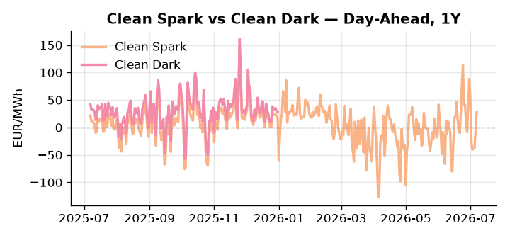
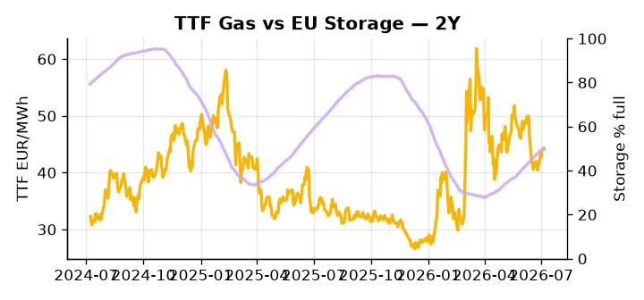

# European Cross-Commodity Risk Pack: Gas + Carbon → Power Curve Implications

**Daily desk brief — 2026-07-07**  
_Author: Sumer Sener · sumerberksener@gmail.com_  
_Generated by `scripts/generate_brief.py`. AI narrative + news themes via Anthropic Claude._

> **Data-freshness caveat:** Clean Dark (last 2025-12-31, 188d old); Coal (last 2025-12-26, 193d old). Numbers below should be read with this in mind.

## 1 · Executive summary

**TL;DR — EU storage 15 pp below seasonal; heat waves drive summer power demand spikes; Russian LNG sanctions delayed, keeping TTF weak.**

EU storage sitting 15 percentage points below the five-year seasonal norm at the 24th percentile rank is the dominant signal this morning, compressing the refill window ahead of Q4 and keeping a winter tail-risk premium live in the Cal+1 curve. Against that tight backdrop, heat waves across France and Belgium are driving summer demand spikes with cooling-water constraints threatening nuclear and thermal availability, sustaining DA volatility in the 70–130 EUR/MWh base range. Russian LNG sanctions delays are extending Novatek fleet uptime, keeping global LNG supply elevated and capping the TTF-to-Asian LNG arbitrage window — a structural softener on front-month gas that partially offsets the storage deficit signal. With coal and clean-dark data 188–193 days stale, dark-spread reads are indicative not bankable, and thermal dispatch economics should be treated with caution. Gas tightness anchored by a storage deficit at the 24th percentile AND carbon policy absent as a near-term catalyst AND clean-dark spreads structurally compressed by a renewables share at the 84th percentile keep the curve regime in a heat-driven volatility band — with the Russian LNG sanctions delay the decisive geopolitical drag on front-curve risk, while the Cal+1 regime holds its winter premium on unresolved refill headroom.

_Generated by **claude-sonnet-4-6** via Anthropic API (two-pass extract→narrate). Prompts/responses logged to `ai/logs/`._
_Next-5d temperature anomaly — DE -0.6°C / FR +8.3°C vs 5-yr seasonal normal (Open-Meteo)._

## 2 · Monitor metrics

**Primary (cross-commodity headline tiles)**

| Metric | As of | Latest | Unit | 1d Δ | 1w Δ | 5y pctile | Headline |
|---|---|---:|---|---:|---:|---:|---|
| TTF Gas | 2026-07-06 | 44.13 | EUR/MWh | +0.26% | +5.33% | 55 | Within typical range |
| EU Storage | 2026-07-05 | 50.36 | % full | +0.66% | +2.45% | 24 | 15.0 pp below the 5-yr seasonal average |
| EUA Carbon | 2026-07-06 | 33.84 | EUR/tCO2 | +2.05% | -0.52% | 45 | Within typical range |
| DE Power | 2026-07-07 | 129.03 | EUR/MWh | +31.27% | -35.20% | 72 | Within typical range |
| GB Power | 2026-07-07 | 120.69 | EUR/MWh | +46.26% | -0.55% | 82 | Within typical range |
| Renewables | 2026-07-06 | 60.82 | % of load | -18.26% | +78.42% | 84 | Within typical range |
| Clean Spark | 2026-07-07 | 28.31 | EUR/MWh | +30.74 | -47.67 | 87 | outsized daily move (-1269.14%, 3.4σ) |
| Clean Dark | 2025-12-31 (STALE) | 27.95 | EUR/MWh | -0.56 | +11.63 | 48 | Within typical range |

**Fundamentals inputs** _(feed derived metrics; not separately traded)_

| Metric | As of | Latest | Unit | 1d Δ | 1w Δ | 5y pctile | Headline |
|---|---|---:|---|---:|---:|---:|---|
| Coal | 2025-12-26 (STALE) | 96.00 | USD/t | -0.57% | +0.08% | 7 | 7th-percentile of 5-yr range — historically low |

_Spreads → abs EUR/MWh deltas; others → pct. Weekly Δ uses 5d trailing means. Full history in `data/<metric>.csv`._

## 3 · Gas + LNG arb

**TTF front-month** prints at 44.13 EUR/MWh — _Within typical range_.
**EU storage** at 50.4% full (-15.0 pp vs 5-yr seasonal avg) — _15.0 pp below the 5-yr seasonal average_.
**TTF − JKM (LNG arb)** at -3.79 EUR/MWh (JKM 16.07 USD/MMBtu) — JKM richer than TTF — Asia pulls cargoes, marginal European tightening risk.

## 4 · Carbon (EU ETS)

**EUA December** prints at 33.84 EUR/tCO2 — _Within typical range_. A euro of EUA adds ~0.37 EUR/MWh to gas-fired and ~0.85 EUR/MWh to coal-fired generation cost; strength compresses the dark spread faster than the spark.

**EU vs UK ETS** — Cobblestone's emissions desk trades EUA and UKA. Post-Brexit auction reform narrowed the UKA discount to EUA from £20+/t to single-digit £/t; CBAM phase-in pulls UK compliance demand toward parity. EUA−UKA basis remains a tradable cross-market signal.

**Supply / policy signal** — _CBAM full operational phase live since 1 Jan 2026 — importers paying for embedded emissions_  
Side: `policy` · Polarity: `bullish EUA` · Source: EU Regulation 2023/956 (CBAM)

Domestic carbon-cost burden gradually levelled with imports; supports EUA demand floor as carbon leakage protection tightens through 2034.

_No ETS-relevant news surfaced today — falling back to `data/policy_facts.py` (hand-maintained structural fact pack). Fact pack last reviewed 2026-05-08 (60d ago)._

## 5 · Power — Day-Ahead & curve

**DE day-ahead baseload** at 129.03 EUR/MWh — _Within typical range_.
**GB day-ahead baseload** at 120.69 EUR/MWh — _Within typical range_.
**DE − GB spread** at +8.34 EUR/MWh (DE premium) — drives interconnector flow direction.
**Cross-border net flows (Power Transportation):** DE↔FR -56.9 GWh (FR export); GB↔FR -82.8 GWh (FR export); NL↔DE -10.9 GWh (DE export).

**Clean spark spread** at +28.31 EUR/MWh — _outsized daily move (-1269.14%, 3.4σ)_. Bridge from gas + carbon fundamentals to gas-fired economics; sustained positive spark = TTF moves transmit directly into the power curve.

**Curve shape:** DA → W+1 → M+1 → Q+1 → Cal+1 → Cal+2 = 129 / 108 / 108 / 108 / 108 / 108 EUR/MWh — **Backwardation** (DA −Cal+1 spread +21 EUR/MWh). Forwards are seasonality projections — see Methodology.

{width=49%} {width=49%}

**This week ahead**

- **Tue** 08:00 UTC — AGSI+ daily storage print: First read on the week's gas injection / withdrawal pace; sets the tone for TTF curve shape.
- **Wed** 09:00 UTC — EEX EUA primary auction (Mon–Thu daily; Wed is largest volume): Supply-side EUA signal; auction clearing relative to spot reads as ETS demand strength.
- **Wed** — ENTSO-E DE_LU + GB next-week wind/solar forecast refresh: Sets the residual-load curve a week out; outsized prints move power Cal+1 directionally.

**Scenarios (1w horizon)**

| | Summary | TTF | DE Power |
|---|---|---:|---:|
| **Base** | Steady storage deficit; renewables volatility; TTF tracks seasonal demand; power DA 70–130 EUR/MWh range. | ±2-3% | ±5-8% |
| **Upside** | Heat-wave demand spike + cooling-water constraint on thermal; renewable windfall drop forces higher-cost coal/gas dispatch. | +5-10% | +15-25% |
| **Downside** | Renewable surge + mild weekend; demand softens; fuel-switch margin tightens coal out of merit; storage refill pace quickens. | -3-7% | -8-15% |

_Illustrative, not forecasts. Magnitudes sized off historical sensitivity; AI-generated from today's extract pass._

## 6 · Today's themes

**Weather watch (next 7d)**
- **Heat dome · FR · Tue 07 – Mon 13 Jul** — peak +9.1°C vs normal. Bullish FR power on AC load and possible nuclear river-cooling derating. Watch FR-nuclear availability prints if heat persists.
- **Storm · DE · Tue 07 – Mon 13 Jul** — peak gust 56 m/s (~202 km/h) on Tue 07 Jul. Wind generation likely surges Day 1, then risk of turbine cut-off if gusts exceed 25 m/s. Bearish DA early, sharp reversal possible. Watch DE-FR flow swings.

**Watchlist (1–4 weeks)**
- EU sanctions on Russian LNG fleet implementation date and scope — impact on global LNG supply and TTF.
- French and Belgian heat-wave recovery/demand normalisation — summer load forecasts for DA/Cal+1.

_Risk framing — built within a discipline of clear limits and continuous monitoring; observations here are framed as risk inputs, not directional calls. Positioning decisions remain with the desk._
_Methodology + sources: **README §Methodology**. Numbers auditable via the snapshot JSONs. Rule-based / informational — not investment advice._