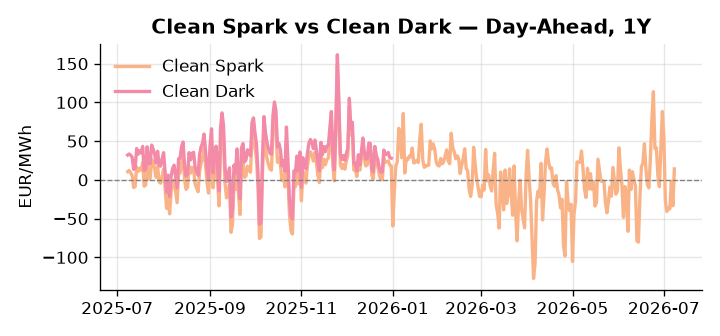
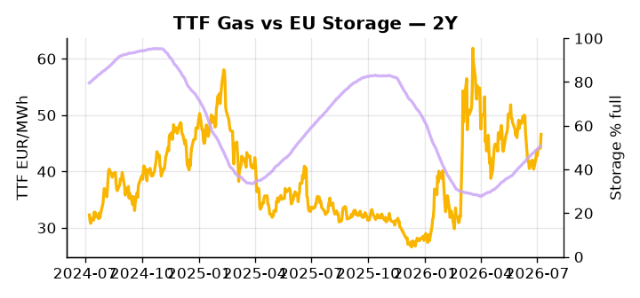

# European Cross-Commodity Risk Pack: Gas + Carbon → Power Curve Implications

**Daily desk brief — 2026-07-08**  
_Author: Sumer Sener · sumerberksener@gmail.com_  
_Generated by `scripts/generate_brief.py`. AI narrative + news themes via Anthropic Claude._

> **Data-freshness caveat:** Clean Dark (last 2025-12-31, 189d old); Coal (last 2025-12-26, 194d old). Numbers below should be read with this in mind.

## 1 · Executive summary

**TL;DR — Renewables at 97th percentile suppress thermal merit order; storage 15pp below seasonal average; Iran sanctions and Russian refinery strikes tighten crude, underpinning thermal generation cost via fuel-switch arbitrage.**

Renewables are running at the 97th percentile — 83.52% of load — collapsing the thermal call and compressing power merit-order headroom to near-zero, while storage sitting 15 percentage points below its five-year seasonal average at 50.63% full keeps summer refill pressure live and extends support into the autumn curve. Iran sanctions and strikes on the Omsk refinery are tightening crude, with crude-TTF fuel-switch arbitrage anchoring gas costs and lifting the marginal cost of any thermal generation that does clear. The imminent EU sanctions deadline on Russian LNG shipyard servicing adds a further supply-side variable to TTF arb dynamics, with enforcement capable of curtailing Gazprom LNG maintenance availability. With coal data 194 days old and clean dark spreads 189 days stale, the fuel-switch and dark-spread picture is indicative not bankable, and current front-month thermal economics cannot be confirmed with precision. Gas tightness via Iran and Omsk crude coupling AND carbon-neutral signal AND clean spreads unverifiable keep the curve in a compressed thermal-margin regime on the front-month, where a wind cliff remains the sole credible trigger for a sharp merit-order reset, while the storage deficit anchors Cal+1 support — with Iran sanctions tail-risk the dominant geopolitical driver widening front-curve risk should renewable cover slip.

_Generated by **claude-sonnet-4-6** via Anthropic API (two-pass extract→narrate). Prompts/responses logged to `ai/logs/`._
_Next-5d temperature anomaly — DE -0.1°C / FR +8.4°C vs 5-yr seasonal normal (Open-Meteo)._

## 2 · Monitor metrics

**Primary (cross-commodity headline tiles)**

| Metric | As of | Latest | Unit | 1d Δ | 1w Δ | 5y pctile | Headline |
|---|---|---:|---|---:|---:|---:|---|
| TTF Gas | 2026-07-07 | 46.58 | EUR/MWh | +5.54% | +6.92% | 60 | Within typical range |
| EU Storage | 2026-07-06 | 50.63 | % full | +0.44% | +2.52% | 24 | 15.0 pp below the 5-yr seasonal average |
| EUA Carbon | 2026-07-07 | 33.63 | EUR/tCO2 | -0.62% | +0.25% | 43 | Within typical range |
| DE Power | 2026-07-08 | 119.71 | EUR/MWh | +65.78% | -31.87% | 67 | Within typical range |
| GB Power | 2026-07-08 | 124.62 | EUR/MWh | +7.21% | -11.29% | 86 | Within typical range |
| Renewables | 2026-07-07 | 83.52 | % of load | +37.32% | +78.76% | 97 | 97th-percentile of 5-yr range — historically high |
| Clean Spark | 2026-07-08 | 14.18 | EUR/MWh | +47.50 | -42.53 | 71 | Within typical range |
| Clean Dark | 2025-12-31 (STALE) | 27.95 | EUR/MWh | -0.56 | +11.63 | 48 | Within typical range |

**Fundamentals inputs** _(feed derived metrics; not separately traded)_

| Metric | As of | Latest | Unit | 1d Δ | 1w Δ | 5y pctile | Headline |
|---|---|---:|---|---:|---:|---:|---|
| Coal | 2025-12-26 (STALE) | 96.00 | USD/t | -0.57% | +0.08% | 7 | 7th-percentile of 5-yr range — historically low |

_Spreads → abs EUR/MWh deltas; others → pct. Weekly Δ uses 5d trailing means. Full history in `data/<metric>.csv`._

## 3 · Gas + LNG arb

**TTF front-month** prints at 46.58 EUR/MWh — _Within typical range_.
**EU storage** at 50.6% full (-15.0 pp vs 5-yr seasonal avg) — _15.0 pp below the 5-yr seasonal average_.
**TTF − JKM (LNG arb)** at -1.66 EUR/MWh (JKM 16.17 USD/MMBtu) — JKM richer than TTF — Asia pulls cargoes, marginal European tightening risk.

## 4 · Carbon (EU ETS)

**EUA December** prints at 33.63 EUR/tCO2 — _Within typical range_. A euro of EUA adds ~0.37 EUR/MWh to gas-fired and ~0.85 EUR/MWh to coal-fired generation cost; strength compresses the dark spread faster than the spark.

**EU vs UK ETS** — Cobblestone's emissions desk trades EUA and UKA. Post-Brexit auction reform narrowed the UKA discount to EUA from £20+/t to single-digit £/t; CBAM phase-in pulls UK compliance demand toward parity. EUA−UKA basis remains a tradable cross-market signal.

**Supply / policy signal** — _CBAM full operational phase live since 1 Jan 2026 — importers paying for embedded emissions_  
Side: `policy` · Polarity: `bullish EUA` · Source: EU Regulation 2023/956 (CBAM)

Domestic carbon-cost burden gradually levelled with imports; supports EUA demand floor as carbon leakage protection tightens through 2034.

_No ETS-relevant news surfaced today — falling back to `data/policy_facts.py` (hand-maintained structural fact pack). Fact pack last reviewed 2026-05-08 (61d ago)._

## 5 · Power — Day-Ahead & curve

**DE day-ahead baseload** at 119.71 EUR/MWh — _Within typical range_.
**GB day-ahead baseload** at 124.62 EUR/MWh — _Within typical range_.
**DE − GB spread** at -4.91 EUR/MWh (GB premium) — drives interconnector flow direction.
**Cross-border net flows (Power Transportation):** DE↔FR -26.8 GWh (FR export); GB↔FR -90.0 GWh (FR export); NL↔DE -46.3 GWh (DE export).

**Clean spark spread** at +14.18 EUR/MWh — _Within typical range_. Bridge from gas + carbon fundamentals to gas-fired economics; sustained positive spark = TTF moves transmit directly into the power curve.

**Curve shape:** DA → W+1 → M+1 → Q+1 → Cal+1 → Cal+2 = 120 / 107 / 107 / 107 / 107 / 107 EUR/MWh — **Backwardation** (DA −Cal+1 spread +13 EUR/MWh). Forwards are seasonality projections — see Methodology.

{width=49%} {width=49%}

**This week ahead**

- **Wed** 09:00 UTC — EEX EUA primary auction (Mon–Thu daily; Wed is largest volume): Supply-side EUA signal; auction clearing relative to spot reads as ETS demand strength.
- **Wed** — ENTSO-E DE_LU + GB next-week wind/solar forecast refresh: Sets the residual-load curve a week out; outsized prints move power Cal+1 directionally.
- **Fri** 14:30 UTC — EIA weekly natural gas storage report: US storage trajectory anchors LNG export pricing into NW Europe — direct TTF transmission.
- **TBD** — EU sanctions on Russian LNG shipyard servicing: Imminent enforcement date; maintenance halt curtails Gazprom LNG availability and affects TTF arb dynamics. _(news-extracted)_

**Scenarios (24-72h horizon)**

| | Summary | TTF | DE Power |
|---|---|---:|---:|
| **Base** | Renewables remain elevated (80%+ of load); modest thermal margin; TTF tracks storage refill pace; power stable. | ±2-3% | ±3-5% |
| **Upside** | Wind cliff (renewables drop to 40th percentile); thermal dispatch surges; crude tightness via Iran sanctions amplifies fuel-switch premium. | +8-12% | +12-18% |
| **Downside** | Renewables sustain 90%+; storage refill accelerates; EU LNG sanctions eased; TTF arb relief lowers gas; thermal margin extends. | -6-10% | -8-12% |

_Illustrative, not forecasts. Magnitudes sized off historical sensitivity; AI-generated from today's extract pass._

## 6 · Today's themes

**Weather watch (next 7d)**
- **Heat dome · FR · Wed 08 – Tue 14 Jul** — peak +9.7°C vs normal. Bullish FR power on AC load and possible nuclear river-cooling derating. Watch FR-nuclear availability prints if heat persists.
- **Storm · DE · Wed 08 – Fri 10 Jul** — peak gust 46 m/s (~167 km/h) on Wed 08 Jul. Wind generation likely surges Day 1, then risk of turbine cut-off if gusts exceed 25 m/s. Bearish DA early, sharp reversal possible. Watch DE-FR flow swings.

**Watchlist (1–4 weeks)**
- EU sanctions implementation on Russian LNG servicing—watch for enforcement date and shipyard closure.
- UK–EU agricultural and trade deal negotiations under new UK PM—monitor any energy trade impacts.

_Risk framing — built within a discipline of clear limits and continuous monitoring; observations here are framed as risk inputs, not directional calls. Positioning decisions remain with the desk._
_Methodology + sources: **README §Methodology**. Numbers auditable via the snapshot JSONs. Rule-based / informational — not investment advice._