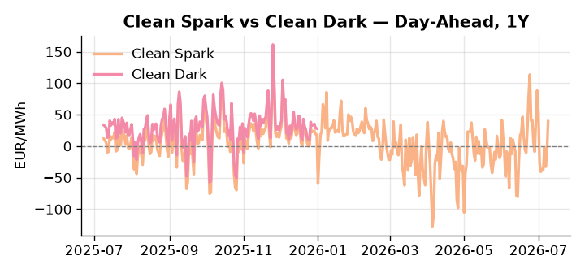
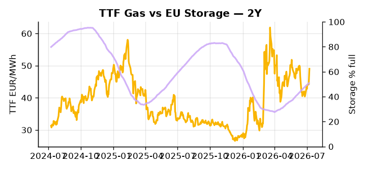

# European Cross-Commodity Risk Pack: Gas + Carbon → Power Curve Implications

**Daily desk brief — 2026-07-09**  
_Author: Sumer Sener · sumerberksener@gmail.com_  
_Generated by `scripts/generate_brief.py`. AI narrative + news themes via Anthropic Claude._

> **Data-freshness caveat:** Clean Dark (last 2025-12-31, 190d old); Coal (last 2025-12-26, 195d old). Numbers below should be read with this in mind.

## 1 · Executive summary

**TL;DR — Renewables at 92nd-percentile suppress thermal merit order; Clean Spark at 92nd-percentile and GB Power at 91st-percentile signal tight supply. Geopolitical crude/LNG tightness (Russia refinery strikes, Iran sanctions, Middle East escalation) underpins TTF upside.**

Renewables running at the 92nd-percentile of load (68.87% generation share) are crushing the thermal merit order, with Clean Spark at its own 92nd-percentile (39.62 EUR/MWh) and GB Power at the 91st-percentile (127.75 EUR/MWh) confirming that what little thermal capacity clears is doing so at a steep premium. TTF is anchored at 49.02 EUR/MWh (65th-percentile, +5.25% on the session) as geopolitical crude tightness — Russia refinery strikes and Iran sanctions removing roughly 2 million barrels per day of crude equivalent — removes the LNG switching incentive and keeps gas bid. EUA sentiment faces a slow-motion policy headwind as Italy pushes to weaken EU green rules within the €2 trillion budget framework, a bearish-EUA signal that, if it gains traction, suppresses the carbon price floor and flattens the merit-order transition timeline. Storage sitting 15.1 percentage points below seasonal norm at the 25th-percentile (50.88% full) means the summer refill window is already under stress, hardening the H2 power curve and narrowing headroom for any demand shock. With Hormuz tail-risk reasserting, gas tightness at 65th-percentile and carbon policy in compression keep the front-curve risk extended, while clean-spark in-the-money at the 92nd-percentile and coal data 195 days old — making the 7th-percentile dark-spread headline indicative not bankable — together sustain a fuel-switch-constrained Cal+1 regime skewed to the upside.

_Generated by **claude-sonnet-4-6** via Anthropic API (two-pass extract→narrate). Prompts/responses logged to `ai/logs/`._
_Next-5d temperature anomaly — DE +1.3°C / FR +8.6°C / GB +5.7°C vs 5-yr seasonal normal (Open-Meteo)._

## 2 · Monitor metrics

**Primary (cross-commodity headline tiles)**

| Metric | As of | Latest | Unit | 1d Δ | 1w Δ | 5y pctile | Headline |
|---|---|---:|---|---:|---:|---:|---|
| TTF Gas | 2026-07-08 | 49.02 | EUR/MWh | +5.25% | +8.87% | 65 | Within typical range |
| EU Storage | 2026-07-07 | 50.88 | % full | +0.41% | +2.59% | 25 | 15.1 pp below the 5-yr seasonal average |
| EUA Carbon | 2026-07-08 | 33.44 | EUR/tCO2 | -0.56% | +0.49% | 41 | Within typical range |
| DE Power | 2026-07-09 | 149.97 | EUR/MWh | +51.89% | -9.70% | 79 | Within typical range |
| GB Power | 2026-07-09 | 127.75 | EUR/MWh | -6.88% | +16.49% | 91 | 91th-percentile of 5-yr range — historically high |
| Renewables | 2026-07-08 | 68.87 | % of load | -17.55% | +48.52% | 92 | 92th-percentile of 5-yr range — historically high |
| Clean Spark | 2026-07-09 | 39.62 | EUR/MWh | +51.23 | -16.32 | 92 | 92th-percentile of 5-yr range — historically high |
| Clean Dark | 2025-12-31 (STALE) | 27.95 | EUR/MWh | -0.56 | +11.63 | 48 | Within typical range |

**Fundamentals inputs** _(feed derived metrics; not separately traded)_

| Metric | As of | Latest | Unit | 1d Δ | 1w Δ | 5y pctile | Headline |
|---|---|---:|---|---:|---:|---:|---|
| Coal | 2025-12-26 (STALE) | 96.00 | USD/t | -0.57% | +0.08% | 7 | 7th-percentile of 5-yr range — historically low |

_Spreads → abs EUR/MWh deltas; others → pct. Weekly Δ uses 5d trailing means. Full history in `data/<metric>.csv`._

## 3 · Gas + LNG arb

**TTF front-month** prints at 49.02 EUR/MWh — _Within typical range_.
**EU storage** at 50.9% full (-15.1 pp vs 5-yr seasonal avg) — _15.1 pp below the 5-yr seasonal average_.
**TTF − JKM (LNG arb)** at -0.38 EUR/MWh (JKM 16.51 USD/MMBtu) — JKM richer than TTF — Asia pulls cargoes, marginal European tightening risk.

## 4 · Carbon (EU ETS)

**EUA December** prints at 33.44 EUR/tCO2 — _Within typical range_. A euro of EUA adds ~0.37 EUR/MWh to gas-fired and ~0.85 EUR/MWh to coal-fired generation cost; strength compresses the dark spread faster than the spark.

**EU vs UK ETS** — Cobblestone's emissions desk trades EUA and UKA. Post-Brexit auction reform narrowed the UKA discount to EUA from £20+/t to single-digit £/t; CBAM phase-in pulls UK compliance demand toward parity. EUA−UKA basis remains a tradable cross-market signal.

**Supply / policy signal** — _Italy pushes to weaken EU green rules in €2 trillion budget framework; enforcement dilution extends fossil-fuel infrastructure lifetime and reduces clean-energy investment incentives._  
Side: `policy` · Polarity: `bearish EUA` · Source: Politico EU Energy

Weakened climate enforcement delays coal/gas phase-out, suppresses carbon price floor, and flattens merit-order transition to gas/renewables. Downside EUA price discovery if sectoral decarbonization targets erode.

_Surfaced from today's news flow by the AI extract pass (`ai/prompts/extract_v1.md` → `carbon_policy_signal`)._

## 5 · Power — Day-Ahead & curve

**DE day-ahead baseload** at 149.97 EUR/MWh — _Within typical range_.
**GB day-ahead baseload** at 127.75 EUR/MWh — _91th-percentile of 5-yr range — historically high_.
**DE − GB spread** at +22.22 EUR/MWh (DE premium) — drives interconnector flow direction.
**Cross-border net flows (Power Transportation):** DE↔FR -39.1 GWh (FR export); GB↔FR -93.4 GWh (FR export); NL↔DE -55.9 GWh (DE export).

**Clean spark spread** at +39.62 EUR/MWh — _92th-percentile of 5-yr range — historically high_. Bridge from gas + carbon fundamentals to gas-fired economics; sustained positive spark = TTF moves transmit directly into the power curve.

**Curve shape:** DA → W+1 → M+1 → Q+1 → Cal+1 → Cal+2 = 150 / 111 / 111 / 111 / 111 / 111 EUR/MWh — **Backwardation** (DA −Cal+1 spread +39 EUR/MWh). Forwards are seasonality projections — see Methodology.

{width=49%} {width=49%}

**This week ahead**

- **Fri** 14:30 UTC — EIA weekly natural gas storage report: US storage trajectory anchors LNG export pricing into NW Europe — direct TTF transmission.
- **Thu** 14:30 UTC — US EIA weekly crude inventories: Crude — and via crack spreads, refined-products — feed back into LNG arb economics.
- **Fri** — ENTSO-E weekly day-ahead volumes / system-balance summary: Reads the European generation mix in last 7d — confirms or breaks the Cal+1 thesis.

**Scenarios (1w horizon)**

| | Summary | TTF | DE Power |
|---|---|---:|---:|
| **Base** | Renewables stay elevated, storage refills slowly; TTF stable near 49, DE power drifts 145–155 EUR/MWh. | ±1-3% | ±2-4% |
| **Upside** | Hormuz escalation or Russian LNG sanctions tightened; Brent +8-12%, TTF bid via LNG displacement and crude-gas arb compression. | +5-12% | +8-15% |
| **Downside** | Russian LNG servicing loophole widens; Iranian crude re-enters via third-party cargoes; spot LNG floods EU, TTF slides on oversupply and storage refill relief. | -8-15% | -12-20% |

_Illustrative, not forecasts. Magnitudes sized off historical sensitivity; AI-generated from today's extract pass._

## 6 · Today's themes

**Weather watch (next 7d)**
- **Heat dome · FR · Thu 09 – Wed 15 Jul** — peak +9.3°C vs normal. Bullish FR power on AC load and possible nuclear river-cooling derating. Watch FR-nuclear availability prints if heat persists.
- **Heat dome · GB · Thu 09 – Mon 13 Jul** — peak +9.3°C vs normal. Modest bullish GB power on cooling demand; less heating-demand downside than continental peers (UK AC penetration is lower).

**Watchlist (1–4 weeks)**
- EU sanctions on Russian LNG fleet servicing—implementation date and scope (direct TTF impact).
- NATO fuel pipeline upgrade cost agreement—could unlock alternative to Russian/spot gas (months out).

_Risk framing — built within a discipline of clear limits and continuous monitoring; observations here are framed as risk inputs, not directional calls. Positioning decisions remain with the desk._
_Methodology + sources: **README §Methodology**. Numbers auditable via the snapshot JSONs. Rule-based / informational — not investment advice._