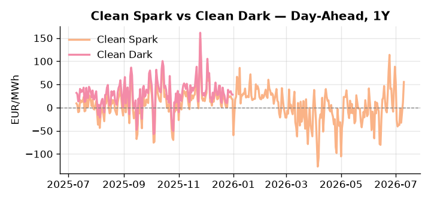
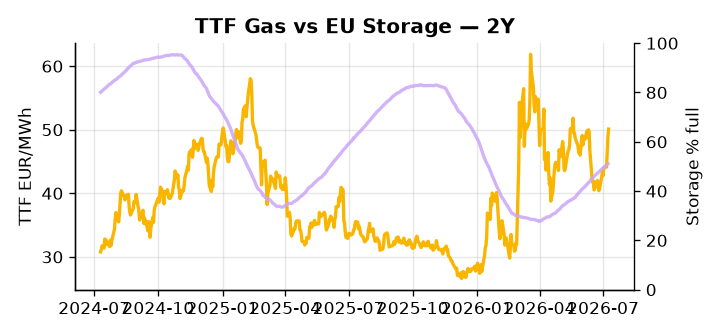

# European Cross-Commodity Risk Pack: Gas + Carbon → Power Curve Implications

**Daily desk brief — 2026-07-10**  
_Author: Sumer Sener · sumerberksener@gmail.com_  
_Generated by `scripts/generate_brief.py`. AI narrative + news themes via Anthropic Claude._

> **Data-freshness caveat:** Clean Dark (last 2025-12-31, 191d old); Coal (last 2025-12-26, 196d old). Numbers below should be read with this in mind.

## 1 · Executive summary

**TL;DR — GB Power at 97th-percentile; Clean Spark 96th-pctile; storage 15pp below seasonal average; Iran sanctions and green-rule rollback risk tighten thermal merit order amid weak renewables backdrop.**

GB Power at the 97th percentile and Clean Spark at the 96th percentile confirm gas is structurally in-the-money, with storage sitting at 51.1% — 15 percentage points below its five-year seasonal average — forcing sustained thermal reliance as refill pace slows into the critical August–September window. Renewables have shed 32.5% on the day, leaving thermal baseload exposed while GB commands 141.96 EUR/MWh against a DE front-month at 167.73 EUR/MWh (83rd percentile, up 35% day-on-day), reflecting interconnector scarcity rather than structural convergence. EUA remains flat in mid-range but carries explicit downside: Italy is leading a push to weaken EU green rules in a €2 trillion budget package while CBAM enforcement delay is under active lobbying, a slow-motion erosion of the carbon floor that the extraction flags as bearish-EUA into Cal+1 and beyond. With coal data 196 days old and Clean Dark 191 days stale, the 48th-percentile dark spread reading is indicative not bankable, and the 7th-percentile coal price at 96 USD/t reinforces that no dispatch reversion is credible even at current power levels. With Iran sanctions reasserting MENA LNG scarcity and pulling TTF higher, gas tightness AND carbon policy headwinds AND Clean Spark deep in-the-money keep the front-curve risk regime extended, while the Iran-driven supply squeeze on global LNG arbitrage is the dominant variable compressing any Cal+1 relief.

_Generated by **claude-sonnet-4-6** via Anthropic API (two-pass extract→narrate). Prompts/responses logged to `ai/logs/`._
_Next-5d temperature anomaly — DE +1.5°C / GB +4.7°C vs 5-yr seasonal normal (Open-Meteo)._

## 2 · Monitor metrics

**Primary (cross-commodity headline tiles)**

| Metric | As of | Latest | Unit | 1d Δ | 1w Δ | 5y pctile | Headline |
|---|---|---:|---|---:|---:|---:|---|
| TTF Gas | 2026-07-09 | 50.10 | EUR/MWh | +2.20% | +11.37% | 67 | Within typical range |
| EU Storage | 2026-07-08 | 51.10 | % full | +0.33% | +2.68% | 25 | 15.2 pp below the 5-yr seasonal average |
| EUA Carbon | 2026-07-09 | 33.23 | EUR/tCO2 | -0.63% | +0.87% | 39 | Within typical range |
| DE Power | 2026-07-10 | 167.73 | EUR/MWh | +35.33% | +36.99% | 83 | Within typical range |
| GB Power | 2026-07-10 | 141.96 | EUR/MWh | +1.84% | +28.74% | 97 | 97th-percentile of 5-yr range — historically high |
| Renewables | 2026-07-09 | 46.50 | % of load | -32.48% | +20.03% | 60 | Within typical range |
| Clean Spark | 2026-07-10 | 55.30 | EUR/MWh | +43.79 | +21.80 | 96 | 96th-percentile of 5-yr range — historically high |
| Clean Dark | 2025-12-31 (STALE) | 27.95 | EUR/MWh | -0.56 | +11.63 | 48 | Within typical range |

**Fundamentals inputs** _(feed derived metrics; not separately traded)_

| Metric | As of | Latest | Unit | 1d Δ | 1w Δ | 5y pctile | Headline |
|---|---|---:|---|---:|---:|---:|---|
| Coal | 2025-12-26 (STALE) | 96.00 | USD/t | -0.57% | +0.08% | 7 | 7th-percentile of 5-yr range — historically low |

_Spreads → abs EUR/MWh deltas; others → pct. Weekly Δ uses 5d trailing means. Full history in `data/<metric>.csv`._

## 3 · Gas + LNG arb

**TTF front-month** prints at 50.10 EUR/MWh — _Within typical range_.
**EU storage** at 51.1% full (-15.2 pp vs 5-yr seasonal avg) — _15.2 pp below the 5-yr seasonal average_.
**TTF − JKM (LNG arb)** at +0.59 EUR/MWh (JKM 16.58 USD/MMBtu) — TTF richer than JKM — LNG cargoes favour Europe.

## 4 · Carbon (EU ETS)

**EUA December** prints at 33.23 EUR/tCO2 — _Within typical range_. A euro of EUA adds ~0.37 EUR/MWh to gas-fired and ~0.85 EUR/MWh to coal-fired generation cost; strength compresses the dark spread faster than the spark.

**EU vs UK ETS** — Cobblestone's emissions desk trades EUA and UKA. Post-Brexit auction reform narrowed the UKA discount to EUA from £20+/t to single-digit £/t; CBAM phase-in pulls UK compliance demand toward parity. EUA−UKA basis remains a tradable cross-market signal.

**Supply / policy signal** — _Italy leads push to weaken EU green rules in €2 trillion budget; US oil lobbying for climate-rule dilution and CBAM enforcement delay._  
Side: `policy` · Polarity: `bearish EUA` · Source: Politico EU Energy

Weakening decarbonization targets and CBAM enforcement delay remove carbon floor; slower renewable capex extends thermal baseload demand but reduces long-term carbon scarcity value. EUA downside risk into Cal+1 and beyond.

_Surfaced from today's news flow by the AI extract pass (`ai/prompts/extract_v1.md` → `carbon_policy_signal`)._

## 5 · Power — Day-Ahead & curve

**DE day-ahead baseload** at 167.73 EUR/MWh — _Within typical range_.
**GB day-ahead baseload** at 141.96 EUR/MWh — _97th-percentile of 5-yr range — historically high_.
**DE − GB spread** at +25.77 EUR/MWh (DE premium) — drives interconnector flow direction.
**Cross-border net flows (Power Transportation):** DE↔FR -49.7 GWh (FR export); GB↔FR -92.2 GWh (FR export); NL↔DE +7.8 GWh (NL export).

**Clean spark spread** at +55.30 EUR/MWh — _96th-percentile of 5-yr range — historically high_. Bridge from gas + carbon fundamentals to gas-fired economics; sustained positive spark = TTF moves transmit directly into the power curve.

**Curve shape:** DA → W+1 → M+1 → Q+1 → Cal+1 → Cal+2 = 168 / 115 / 115 / 115 / 115 / 115 EUR/MWh — **Backwardation** (DA −Cal+1 spread +53 EUR/MWh). Forwards are seasonality projections — see Methodology.

{width=49%} {width=49%}

**This week ahead**

- **Fri** 14:30 UTC — EIA weekly natural gas storage report: US storage trajectory anchors LNG export pricing into NW Europe — direct TTF transmission.
- **Fri** — ENTSO-E weekly day-ahead volumes / system-balance summary: Reads the European generation mix in last 7d — confirms or breaks the Cal+1 thesis.
- **Tue** 08:00 UTC — AGSI+ daily storage print: First read on the week's gas injection / withdrawal pace; sets the tone for TTF curve shape.
- **Fri** — EU green-rules decision (Sweden standoff): Italy-led push to weaken decarbonization targets; outcome sets EUA floor and renewable capex trajectory for H2. _(news-extracted)_

**Scenarios (24-72h horizon)**

| | Summary | TTF | DE Power |
|---|---|---:|---:|
| **Base** | Storage refill neutral; renewables recover to 50–55% of load; geopolitical priced in; GB power settles 80–90 EUR/MWh, DE 150–160. | +1–3% | −5 to +5% |
| **Upside** | Iran sanctions tighten MENA LNG supply; EU green-rules weakening stalls renewable capex; storage refill misses 1–2pp; cold snap drives Aug demand. TTF +8–12%, GB +15–20%, DE +10–15%. | +8–12% | +10–15% |
| **Downside** | EU green-rules strengthened; renewables surge (wind recovery to 70%+ of load); storage refill accelerates; Russia LNG fleet repairs ease global LNG spot. TTF −5–7%, GB −10–15%, DE −8–12%. | −5–7% | −8–12% |

_Illustrative, not forecasts. Magnitudes sized off historical sensitivity; AI-generated from today's extract pass._

## 6 · Today's themes

**Weather watch (next 7d)**
- **Heat dome · GB · Fri 10 – Sun 12 Jul** — peak +7.4°C vs normal. Modest bullish GB power on cooling demand; less heating-demand downside than continental peers (UK AC penetration is lower).
- **Storm · DE · Fri 10 – Tue 14 Jul** — peak gust 37 m/s (~132 km/h) on Fri 10 Jul. Wind generation likely surges Day 1, then risk of turbine cut-off if gusts exceed 25 m/s. Bearish DA early, sharp reversal possible. Watch DE-FR flow swings.

**Watchlist (1–4 weeks)**
- EU green rules decision next week (Sweden/Italy standoff); monitor EUA and renewable subsidy signals.
- Iran sanctions impact on global crude and LNG arbitrage into NW Europe TTF.

_Risk framing — built within a discipline of clear limits and continuous monitoring; observations here are framed as risk inputs, not directional calls. Positioning decisions remain with the desk._
_Methodology + sources: **README §Methodology**. Numbers auditable via the snapshot JSONs. Rule-based / informational — not investment advice._