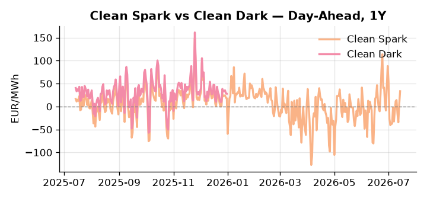
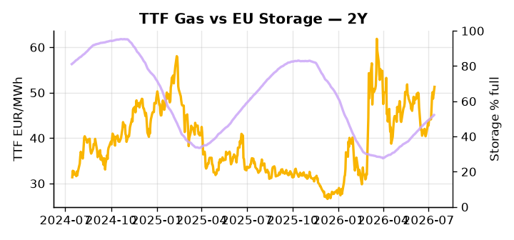

# European Cross-Commodity Risk Pack: Gas + Carbon → Power Curve Implications

**Daily desk brief — 2026-07-14**  
_Author: Sumer Sener · sumerberksener@gmail.com_  
_Generated by `scripts/generate_brief.py`. AI narrative + news themes via Anthropic Claude._

> **Data-freshness caveat:** Clean Dark (last 2025-12-31, 195d old); Coal (last 2025-12-26, 200d old). Numbers below should be read with this in mind.

## 1 · Executive summary

**TL;DR — GB Power at 94th-percentile amid France nuclear heat shutdowns and geopolitical LNG tail-risk; EU storage 15.3pp below seasonal drives summer gas tightness.**

GB Power at the 94th percentile (136.5 EUR/MWh) leads the session as France nuclear heat shutdowns force peak-gas dispatch while EU storage sits 15.3 percentage points below seasonal norms at 52.21% (26th percentile), anchoring the summer-into-autumn gas risk premium with limited headroom for refill acceleration. LNG tail-risk remains live: the proposed Hormuz 20% toll and Iran sanctions enforcement could compress the TTF arbitrage window and extend front-month tightness, with Wednesday's EU sanctions deadline and oil price cap outcome adding a discrete fuel-switch pressure point. EUA sits in mid-range as Italy and Sweden contest the weakening of green criteria in the €2 trillion EU budget, a bearish-policy signal that defers renewable capacity buildout and reduces supply-side pressure on the scarcity premium, keeping carbon directionally anchored but not constructive. With coal and clean dark spreads 195–200 days stale, the dark spread is indicative not bankable, and clean dark reads should not be used for intraday positioning. Gas tightness at 26th-percentile storage AND EUA mid-range with bearish policy headwinds AND compressed clean spreads keep the Cal+1 regime extended rather than breakout, but with Hormuz tail-risk reasserting, front-curve risk widens materially on any further French nuclear or LNG supply deterioration.

_Generated by **claude-sonnet-4-6** via Anthropic API (two-pass extract→narrate). Prompts/responses logged to `ai/logs/`._
_Next-5d temperature anomaly — DE -0.5°C / FR +4.4°C vs 5-yr seasonal normal (Open-Meteo)._

## 2 · Monitor metrics

**Primary (cross-commodity headline tiles)**

| Metric | As of | Latest | Unit | 1d Δ | 1w Δ | 5y pctile | Headline |
|---|---|---:|---|---:|---:|---:|---|
| TTF Gas | 2026-07-13 | 51.28 | EUR/MWh | +5.38% | +13.23% | 68 | Within typical range |
| EU Storage | 2026-07-12 | 52.21 | % full | +0.60% | +2.49% | 26 | 15.3 pp below the 5-yr seasonal average |
| EUA Carbon | 2026-07-13 | 33.62 | EUR/tCO2 | +0.75% | +0.58% | 43 | Within typical range |
| DE Power | 2026-07-14 | 148.37 | EUR/MWh | +24.71% | +22.58% | 79 | Within typical range |
| GB Power | 2026-07-14 | 136.50 | EUR/MWh | +6.72% | +5.49% | 94 | 94th-percentile of 5-yr range — historically high |
| Renewables | 2026-07-13 | 47.20 | % of load | -26.13% | -28.74% | 61 | Within typical range |
| Clean Spark | 2026-07-14 | 33.45 | EUR/MWh | +29.40 | +17.90 | 90 | Within typical range |
| Clean Dark | 2025-12-31 (STALE) | 27.95 | EUR/MWh | -0.56 | +11.63 | 48 | Within typical range |

**Fundamentals inputs** _(feed derived metrics; not separately traded)_

| Metric | As of | Latest | Unit | 1d Δ | 1w Δ | 5y pctile | Headline |
|---|---|---:|---|---:|---:|---:|---|
| Coal | 2025-12-26 (STALE) | 96.00 | USD/t | -0.57% | +0.08% | 7 | 7th-percentile of 5-yr range — historically low |

_Spreads → abs EUR/MWh deltas; others → pct. Weekly Δ uses 5d trailing means. Full history in `data/<metric>.csv`._

## 3 · Gas + LNG arb

**TTF front-month** prints at 51.28 EUR/MWh — _Within typical range_.
**EU storage** at 52.2% full (-15.3 pp vs 5-yr seasonal avg) — _15.3 pp below the 5-yr seasonal average_.
**TTF − JKM (LNG arb)** at +1.82 EUR/MWh (JKM 16.53 USD/MMBtu) — TTF richer than JKM — LNG cargoes favour Europe.

## 4 · Carbon (EU ETS)

**EUA December** prints at 33.62 EUR/tCO2 — _Within typical range_. A euro of EUA adds ~0.37 EUR/MWh to gas-fired and ~0.85 EUR/MWh to coal-fired generation cost; strength compresses the dark spread faster than the spark.

**EU vs UK ETS** — Cobblestone's emissions desk trades EUA and UKA. Post-Brexit auction reform narrowed the UKA discount to EUA from £20+/t to single-digit £/t; CBAM phase-in pulls UK compliance demand toward parity. EUA−UKA basis remains a tradable cross-market signal.

**Supply / policy signal** — _Italy, Sweden contest EU green rules weakening in €2 trillion budget; policy uncertainty on renewable investment pace._  
Side: `policy` · Polarity: `bearish EUA` · Source: Politico EU Energy

Weakened green criteria defer renewable capacity, reducing supply-side pressure on EUA scarcity premium and deferring decarbonisation trajectory.

_Surfaced from today's news flow by the AI extract pass (`ai/prompts/extract_v1.md` → `carbon_policy_signal`)._

## 5 · Power — Day-Ahead & curve

**DE day-ahead baseload** at 148.37 EUR/MWh — _Within typical range_.
**GB day-ahead baseload** at 136.50 EUR/MWh — _94th-percentile of 5-yr range — historically high_.
**DE − GB spread** at +11.87 EUR/MWh (DE premium) — drives interconnector flow direction.
**Cross-border net flows (Power Transportation):** DE↔FR -50.2 GWh (FR export); GB↔FR -64.4 GWh (FR export); NL↔DE +61.2 GWh (NL export).

**Clean spark spread** at +33.45 EUR/MWh — _Within typical range_. Bridge from gas + carbon fundamentals to gas-fired economics; sustained positive spark = TTF moves transmit directly into the power curve.

**Curve shape:** DA → W+1 → M+1 → Q+1 → Cal+1 → Cal+2 = 148 / 115 / 115 / 115 / 115 / 115 EUR/MWh — **Backwardation** (DA −Cal+1 spread +34 EUR/MWh). Forwards are seasonality projections — see Methodology.

{width=49%} {width=49%}

**This week ahead**

- **Tue** 08:00 UTC — AGSI+ daily storage print: First read on the week's gas injection / withdrawal pace; sets the tone for TTF curve shape.
- **Wed** 09:00 UTC — EEX EUA primary auction (Mon–Thu daily; Wed is largest volume): Supply-side EUA signal; auction clearing relative to spot reads as ETS demand strength.
- **Wed** — ENTSO-E DE_LU + GB next-week wind/solar forecast refresh: Sets the residual-load curve a week out; outsized prints move power Cal+1 directionally.
- **Wed** — EU sanctions package deadline; oil price cap at risk: Cap failure lifts Urals crude, fuel-switch pressure on TTF; Russian export redirect eastward tightens EU gas. _(news-extracted)_
- **Thu** — France heat-wave peak; nuclear contingency review: Outages reduce baseload supply; emergency gas dispatch into summer Cal+1 tightens DA-month spreads. _(news-extracted)_

**Scenarios (24-72h horizon)**

| | Summary | TTF | DE Power |
|---|---|---:|---:|
| **Base** | France heat persists, nuclear constraints tighten summer gas. Storage refill flat. TTF tracks 50-52 EUR/MWh. | +2-5% | +3-8% |
| **Upside** | Iran sanctions enforced; Hormuz toll triggers LNG curtailment. Arb closure lifts TTF. France outages extend into Friday. | +10-18% | +15-22% |
| **Downside** | Heat wave breaks; French nuclear ramp-up resumes. Storage refill accelerates. LNG arbitrage widens, TTF softens. | -8-12% | -10-16% |

_Illustrative, not forecasts. Magnitudes sized off historical sensitivity; AI-generated from today's extract pass._

## 6 · Today's themes

**Weather watch (next 7d)**
- **Heat dome · FR · Tue 14 – Thu 16 Jul** — peak +8.1°C vs normal. Bullish FR power on AC load and possible nuclear river-cooling derating. Watch FR-nuclear availability prints if heat persists.
- **Storm · FR · Tue 14 – Mon 20 Jul** — peak gust 50 m/s (~181 km/h) on Thu 16 Jul. Strong wind boost to French generation; FR may export to neighbours. DA print likely below seasonal norm; watch FR-GB IFA flow toward GB.

**Watchlist (1–4 weeks)**
- EU sanctions package locked by Wednesday; oil price cap enforcement signal.
- France nuclear availability update as heat wave persists; contingency demand on gas.

_Risk framing — built within a discipline of clear limits and continuous monitoring; observations here are framed as risk inputs, not directional calls. Positioning decisions remain with the desk._
_Methodology + sources: **README §Methodology**. Numbers auditable via the snapshot JSONs. Rule-based / informational — not investment advice._