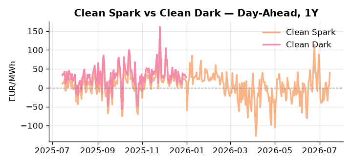
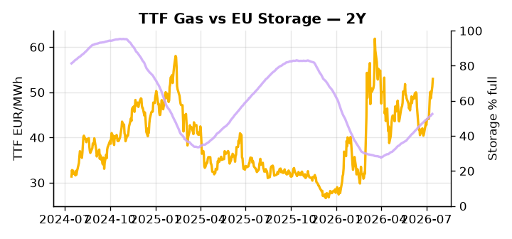

# European Cross-Commodity Risk Pack: Gas + Carbon → Power Curve Implications

**Daily desk brief — 2026-07-15**  
_Author: Sumer Sener · sumerberksener@gmail.com_  
_Generated by `scripts/generate_brief.py`. AI narrative + news themes via Anthropic Claude._

> **Data-freshness caveat:** Clean Dark (last 2025-12-31, 196d old); Coal (last 2025-12-26, 201d old). Numbers below should be read with this in mind.

## 1 · Executive summary

**TL;DR — GB Power at 95th-percentile amid France nuclear outages and Hormuz geopolitical risk; Clean Spark 92nd-percentile signals thermal dispatch premium despite coal historically weak.**

GB Power is printing at the 95th percentile, driven by France nuclear outages as heat-driven cooling-water scarcity forces substitute gas and coal generation into the merit order, while TTF holds at 52.96 EUR/MWh (70th percentile) with unresolved Iran–US tensions over the Strait of Hormuz keeping an LNG supply-risk premium embedded in front-month gas. EU storage at 52.52% — 15.3 percentage points below seasonal norms and at the 26th percentile of the five-year range — leaves the H2 curve without a comfortable floor, compressing any downside headroom in Cal+1. The Clean Spark at 39.97 EUR/MWh (92nd percentile) confirms a deep fuel-switch regime heavily anchored in gas dispatch, though with coal data 201 days old the dark spread is indicative not bankable and the clean-dark differential should be treated as directional context only. With Hormuz tail-risk unresolved, gas tightness pulling TTF to the 70th percentile and the Clean Spark extended to the 92nd percentile keep the front-curve risk regime firmly in gas-led thermal dispatch, and any Hormuz escalation that cuts LNG flows would push that front-curve risk sharply wider before Cal+1 can re-anchor.

_Generated by **claude-sonnet-4-6** via Anthropic API (two-pass extract→narrate). Prompts/responses logged to `ai/logs/`._
_Next-5d temperature anomaly — DE +0.3°C / GB +1.7°C vs 5-yr seasonal normal (Open-Meteo)._

## 2 · Monitor metrics

**Primary (cross-commodity headline tiles)**

| Metric | As of | Latest | Unit | 1d Δ | 1w Δ | 5y pctile | Headline |
|---|---|---:|---|---:|---:|---:|---|
| TTF Gas | 2026-07-14 | 52.96 | EUR/MWh | +3.28% | +14.06% | 70 | Within typical range |
| EU Storage | 2026-07-13 | 52.52 | % full | +0.46% | +2.52% | 26 | 15.3 pp below the 5-yr seasonal average |
| EUA Carbon | 2026-07-14 | 33.84 | EUR/tCO2 | +0.65% | +0.39% | 45 | Within typical range |
| DE Power | 2026-07-15 | 158.34 | EUR/MWh | +27.99% | +10.13% | 81 | Within typical range |
| GB Power | 2026-07-15 | 138.55 | EUR/MWh | +1.97% | -0.06% | 95 | 95th-percentile of 5-yr range — historically high |
| Renewables | 2026-07-14 | 49.60 | % of load | +5.08% | -22.80% | 66 | Within typical range |
| Clean Spark | 2026-07-15 | 39.97 | EUR/MWh | +34.63 | +4.59 | 92 | 92th-percentile of 5-yr range — historically high |
| Clean Dark | 2025-12-31 (STALE) | 27.95 | EUR/MWh | -0.56 | +11.63 | 48 | Within typical range |

**Fundamentals inputs** _(feed derived metrics; not separately traded)_

| Metric | As of | Latest | Unit | 1d Δ | 1w Δ | 5y pctile | Headline |
|---|---|---:|---|---:|---:|---:|---|
| Coal | 2025-12-26 (STALE) | 96.00 | USD/t | -0.57% | +0.08% | 7 | 7th-percentile of 5-yr range — historically low |

_Spreads → abs EUR/MWh deltas; others → pct. Weekly Δ uses 5d trailing means. Full history in `data/<metric>.csv`._

## 3 · Gas + LNG arb

**TTF front-month** prints at 52.96 EUR/MWh — _Within typical range_.
**EU storage** at 52.5% full (-15.3 pp vs 5-yr seasonal avg) — _15.3 pp below the 5-yr seasonal average_.
**TTF − JKM (LNG arb)** at +3.04 EUR/MWh (JKM 16.66 USD/MMBtu) — TTF richer than JKM — LNG cargoes favour Europe.

## 4 · Carbon (EU ETS)

**EUA December** prints at 33.84 EUR/tCO2 — _Within typical range_. A euro of EUA adds ~0.37 EUR/MWh to gas-fired and ~0.85 EUR/MWh to coal-fired generation cost; strength compresses the dark spread faster than the spark.

**EU vs UK ETS** — Cobblestone's emissions desk trades EUA and UKA. Post-Brexit auction reform narrowed the UKA discount to EUA from £20+/t to single-digit £/t; CBAM phase-in pulls UK compliance demand toward parity. EUA−UKA basis remains a tradable cross-market signal.

**Supply / policy signal** — _CBAM full operational phase live since 1 Jan 2026 — importers paying for embedded emissions_  
Side: `policy` · Polarity: `bullish EUA` · Source: EU Regulation 2023/956 (CBAM)

Domestic carbon-cost burden gradually levelled with imports; supports EUA demand floor as carbon leakage protection tightens through 2034.

_No ETS-relevant news surfaced today — falling back to `data/policy_facts.py` (hand-maintained structural fact pack). Fact pack last reviewed 2026-05-08 (68d ago)._

## 5 · Power — Day-Ahead & curve

**DE day-ahead baseload** at 158.34 EUR/MWh — _Within typical range_.
**GB day-ahead baseload** at 138.55 EUR/MWh — _95th-percentile of 5-yr range — historically high_.
**DE − GB spread** at +19.79 EUR/MWh (DE premium) — drives interconnector flow direction.
**Cross-border net flows (Power Transportation):** DE↔FR -59.0 GWh (FR export); GB↔FR -56.7 GWh (FR export); NL↔DE +68.9 GWh (NL export).

**Clean spark spread** at +39.97 EUR/MWh — _92th-percentile of 5-yr range — historically high_. Bridge from gas + carbon fundamentals to gas-fired economics; sustained positive spark = TTF moves transmit directly into the power curve.

**Curve shape:** DA → W+1 → M+1 → Q+1 → Cal+1 → Cal+2 = 158 / 117 / 117 / 117 / 117 / 117 EUR/MWh — **Backwardation** (DA −Cal+1 spread +41 EUR/MWh). Forwards are seasonality projections — see Methodology.

{width=49%} {width=49%}

**This week ahead**

- **Wed** 09:00 UTC — EEX EUA primary auction (Mon–Thu daily; Wed is largest volume): Supply-side EUA signal; auction clearing relative to spot reads as ETS demand strength.
- **Wed** — ENTSO-E DE_LU + GB next-week wind/solar forecast refresh: Sets the residual-load curve a week out; outsized prints move power Cal+1 directionally.
- **Fri** 14:30 UTC — EIA weekly natural gas storage report: US storage trajectory anchors LNG export pricing into NW Europe — direct TTF transmission.
- **Wed** — EU Russia oil sanctions package finalisation: Price-cap outcomes ripple into Brent floor, gasoil input costs, and power plant fuel-switching economics. _(news-extracted)_
- **Thu** — EU green rules vote (Sweden, Italy positions): Outcome affects EUA carbon-intensive power incentives and merit-order dispatch signals; may shift DA thermal premium. _(news-extracted)_

**Scenarios (24-72h | 1w horizon)**

| | Summary | TTF | DE Power |
|---|---|---:|---:|
| **Base** | France nuclear staggered restart, Hormuz tensions contained diplomatically; TTF steady, power follows thermal merit order. | ±1–3% | ±2–4% |
| **Upside** | Strait of Hormuz blockade or military escalation cuts LNG exports; France nuclear recovery delayed by cooling constraints. | +5–10% | +8–15% |
| **Downside** | Diplomatic de-escalation at Hormuz; France nuclear restarts faster; mild weather reduces cooling demand and power burn. | −4–7% | −6–10% |

_Illustrative, not forecasts. Magnitudes sized off historical sensitivity; AI-generated from today's extract pass._

## 6 · Today's themes

**Weather watch (next 7d)**
- **Storm · GB · Wed 15 – Tue 21 Jul** — peak gust 41 m/s (~148 km/h) on Wed 15 Jul. GB wind capacity is large — DA likely soft. Cut-off risk if gusts exceed safety thresholds; opposite tail (sudden tightening) possible.
- **Storm · DE · Sat 18 – Tue 21 Jul** — peak gust 48 m/s (~172 km/h) on Sat 18 Jul. Wind generation likely surges Day 1, then risk of turbine cut-off if gusts exceed 25 m/s. Bearish DA early, sharp reversal possible. Watch DE-FR flow swings.

**Watchlist (1–4 weeks)**
- EU green rules vote (Sweden, Italy positions clashing); outcome affects EUA carbon-intensive power incentives.
- Strait of Hormuz military/diplomatic escalation; monitor LNG shipping delays and premium risk.

_Risk framing — built within a discipline of clear limits and continuous monitoring; observations here are framed as risk inputs, not directional calls. Positioning decisions remain with the desk._
_Methodology + sources: **README §Methodology**. Numbers auditable via the snapshot JSONs. Rule-based / informational — not investment advice._