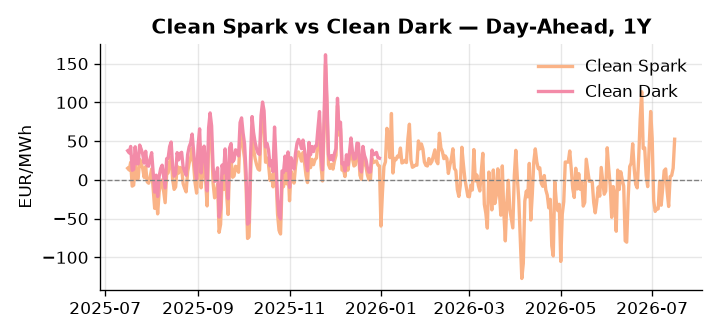
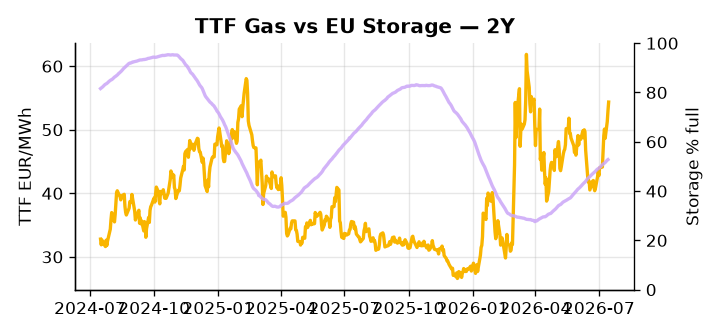

# European Cross-Commodity Risk Pack: Gas + Carbon → Power Curve Implications

**Daily desk brief — 2026-07-16**  
_Author: Sumer Sener · sumerberksener@gmail.com_  
_Generated by `scripts/generate_brief.py`. AI narrative + news themes via Anthropic Claude._

> **Data-freshness caveat:** Clean Dark (last 2025-12-31, 197d old); Coal (last 2025-12-26, 202d old). Numbers below should be read with this in mind.

## 1 · Executive summary

**TL;DR — GB Power at 97th-percentile amid French nuclear outages and Hormuz disruption; Clean Spark 95th-percentile signals extended thermal dispatch; storage 15 pp below seasonal risks H2 refill.**

GB Power at the 97th percentile (142.45 EUR/MWh) is the dominant signal this morning, driven by GW-scale French nuclear heat shutdowns forcing gas and power displacement and widening the GB-DE spread to extreme levels. TTF is extended 2.2σ above its 50-day trend at 54.35 EUR/MWh, with Hormuz disruption unresolved and the Russia diesel export halt compressing global LNG arbitrage and tightening the scarcity premium further. EU storage sitting 15 percentage points below seasonal at 52.77% full amplifies the thermal baseload call, and Clean Spark at the 95th percentile confirms the coal-to-gas merit-order flip is sustained — though with coal data 202 days old and clean dark 197 days stale, the dark spread is indicative not bankable and the fuel-switch merit-order assumption should be read with that caveat. The EU-Russia oil sanctions vote deadline on Friday carries a Brent upside tail that, if triggered, would cement fuel-switch advantage and feed directly into TTF arb tightness. With Hormuz tail-risk keeping LNG supply constrained, gas tightness at the 2.2σ extension AND clean spark in-the-money at the 95th percentile AND storage headroom compressed 15 pp below seasonal pull front-curve risk materially wider, leaving the Cal+1 regime anchored to a sustained high-thermal-dispatch posture.

_Generated by **claude-sonnet-4-6** via Anthropic API (two-pass extract→narrate). Prompts/responses logged to `ai/logs/`._
_Next-5d temperature anomaly — DE -0.1°C / FR +1.9°C vs 5-yr seasonal normal (Open-Meteo)._

## 2 · Monitor metrics

**Primary (cross-commodity headline tiles)**

| Metric | As of | Latest | Unit | 1d Δ | 1w Δ | 5y pctile | Headline |
|---|---|---:|---|---:|---:|---:|---|
| TTF Gas | 2026-07-15 | 54.35 | EUR/MWh | +2.63% | +13.61% | 71 | extended 2.2σ above the 50d trend |
| EU Storage | 2026-07-14 | 52.77 | % full | +0.40% | +2.59% | 26 | 15.3 pp below the 5-yr seasonal average |
| EUA Carbon | 2026-07-15 | 33.73 | EUR/tCO2 | -0.33% | +0.40% | 44 | Within typical range |
| DE Power | 2026-07-16 | 173.58 | EUR/MWh | +27.45% | +22.13% | 84 | Within typical range |
| GB Power | 2026-07-16 | 142.45 | EUR/MWh | +1.48% | -6.33% | 97 | 97th-percentile of 5-yr range — historically high |
| Renewables | 2026-07-15 | 44.01 | % of load | -11.26% | -14.97% | 54 | Within typical range |
| Clean Spark | 2026-07-16 | 52.46 | EUR/MWh | +37.39 | +15.24 | 95 | 95th-percentile of 5-yr range — historically high |
| Clean Dark | 2025-12-31 (STALE) | 27.95 | EUR/MWh | -0.56 | +11.63 | 48 | Within typical range |

**Fundamentals inputs** _(feed derived metrics; not separately traded)_

| Metric | As of | Latest | Unit | 1d Δ | 1w Δ | 5y pctile | Headline |
|---|---|---:|---|---:|---:|---:|---|
| Coal | 2025-12-26 (STALE) | 96.00 | USD/t | -0.57% | +0.08% | 7 | 7th-percentile of 5-yr range — historically low |

_Spreads → abs EUR/MWh deltas; others → pct. Weekly Δ uses 5d trailing means. Full history in `data/<metric>.csv`._

## 3 · Gas + LNG arb

**TTF front-month** prints at 54.35 EUR/MWh — _extended 2.2σ above the 50d trend_.
**EU storage** at 52.8% full (-15.3 pp vs 5-yr seasonal avg) — _15.3 pp below the 5-yr seasonal average_.
**TTF − JKM (LNG arb)** at +4.15 EUR/MWh (JKM 16.81 USD/MMBtu) — TTF richer than JKM — LNG cargoes favour Europe.

## 4 · Carbon (EU ETS)

**EUA December** prints at 33.73 EUR/tCO2 — _Within typical range_. A euro of EUA adds ~0.37 EUR/MWh to gas-fired and ~0.85 EUR/MWh to coal-fired generation cost; strength compresses the dark spread faster than the spark.

**EU vs UK ETS** — Cobblestone's emissions desk trades EUA and UKA. Post-Brexit auction reform narrowed the UKA discount to EUA from £20+/t to single-digit £/t; CBAM phase-in pulls UK compliance demand toward parity. EUA−UKA basis remains a tradable cross-market signal.

**Supply / policy signal** — _CBAM full operational phase live since 1 Jan 2026 — importers paying for embedded emissions_  
Side: `policy` · Polarity: `bullish EUA` · Source: EU Regulation 2023/956 (CBAM)

Domestic carbon-cost burden gradually levelled with imports; supports EUA demand floor as carbon leakage protection tightens through 2034.

_No ETS-relevant news surfaced today — falling back to `data/policy_facts.py` (hand-maintained structural fact pack). Fact pack last reviewed 2026-05-08 (69d ago)._

## 5 · Power — Day-Ahead & curve

**DE day-ahead baseload** at 173.58 EUR/MWh — _Within typical range_.
**GB day-ahead baseload** at 142.45 EUR/MWh — _97th-percentile of 5-yr range — historically high_.
**DE − GB spread** at +31.13 EUR/MWh (DE premium) — drives interconnector flow direction.
**Cross-border net flows (Power Transportation):** DE↔FR -45.4 GWh (FR export); GB↔FR -45.3 GWh (FR export); NL↔DE +73.7 GWh (NL export).

**Clean spark spread** at +52.46 EUR/MWh — _95th-percentile of 5-yr range — historically high_. Bridge from gas + carbon fundamentals to gas-fired economics; sustained positive spark = TTF moves transmit directly into the power curve.

**Curve shape:** DA → W+1 → M+1 → Q+1 → Cal+1 → Cal+2 = 174 / 120 / 120 / 120 / 120 / 120 EUR/MWh — **Backwardation** (DA −Cal+1 spread +54 EUR/MWh). Forwards are seasonality projections — see Methodology.

{width=49%} {width=49%}

**This week ahead**

- **Fri** 14:30 UTC — EIA weekly natural gas storage report: US storage trajectory anchors LNG export pricing into NW Europe — direct TTF transmission.
- **Thu** 14:30 UTC — US EIA weekly crude inventories: Crude — and via crack spreads, refined-products — feed back into LNG arb economics.
- **Fri** — ENTSO-E weekly day-ahead volumes / system-balance summary: Reads the European generation mix in last 7d — confirms or breaks the Cal+1 thesis.
- **Fri** — EU Russia oil sanctions vote deadline (late July): Price cap ratchet delay decision; Brent volatility flows to fuel-switch economics and TTF risk premium. _(news-extracted)_

**Scenarios (24-72h horizon)**

| | Summary | TTF | DE Power |
|---|---|---:|---:|
| **Base** | Heat-strained French nuclear persists; TTF holds extended 2.2σ; GB premium stable at 95th-percentile; storage refill modest. | +1-3% | tracks |
| **Upside** | France reactor restart delayed; Hormuz escalates further; EU sanctions vote triggers Brent spike >5 USD/bbl; fuel switch to gas accelerates. | +8-12% | +5-8% |
| **Downside** | France restores 2–3 GW nuclear by end-week; Hormuz stabilizes; record US LNG eases arb; renewable share rebounds; thermal call softens. | −4-6% | −3-5% |

_Illustrative, not forecasts. Magnitudes sized off historical sensitivity; AI-generated from today's extract pass._

## 6 · Today's themes

**Weather watch (next 7d)**
- **Heat dome · FR · Thu 16 – Fri 17 Jul** — peak +6.1°C vs normal. Bullish FR power on AC load and possible nuclear river-cooling derating. Watch FR-nuclear availability prints if heat persists.
- **Storm · FR · Thu 16 – Wed 22 Jul** — peak gust 47 m/s (~168 km/h) on Wed 22 Jul. Strong wind boost to French generation; FR may export to neighbours. DA print likely below seasonal norm; watch FR-GB IFA flow toward GB.

**Watchlist (1–4 weeks)**
- EU Russia sanctions vote deadline end-July; oil price cap ratchet risk.
- France nuclear reactor restart timeline; heat wave persistence in southern Europe.

_Risk framing — built within a discipline of clear limits and continuous monitoring; observations here are framed as risk inputs, not directional calls. Positioning decisions remain with the desk._
_Methodology + sources: **README §Methodology**. Numbers auditable via the snapshot JSONs. Rule-based / informational — not investment advice._